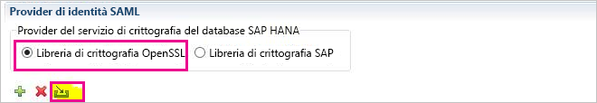
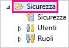
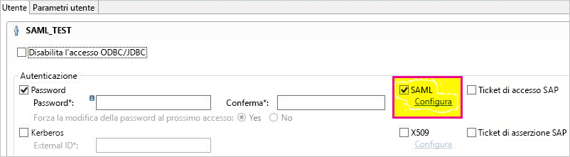
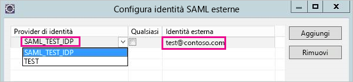
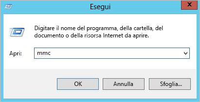
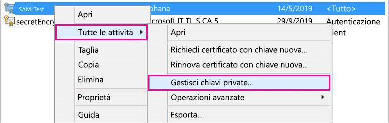
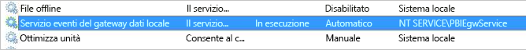
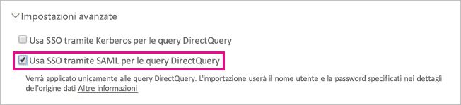

# <a name="use-security-assertion-markup-language-saml-for-single-sign-on-sso-from-power-bi-to-on-premises-data-sources"></a>Usare SAML (Security Assertion Markup Language) per abilitare Single Sign-On (SSO) da Power BI alle origini dati locali

Usare [SAML (Security Assertion Markup Language)](https://www.onelogin.com/pages/saml) per abilitare la connettività Single Sign-On. L'abilitazione di SSO rende più semplice per i report e i dashboard di Power BI aggiornare i dati delle origini locali.

## <a name="supported-data-sources"></a>Origini dati supportate

Attualmente sono supportate le origini dati SAP HANA con SAML. Per altre informazioni sull'impostazione e la configurazione di Single Sign-On per SAP HANA tramite SAML, vedere l'argomento [SAML SSO for BI Platform to HANA](https://wiki.scn.sap.com/wiki/display/SAPHANA/SAML+SSO+for+BI+Platform+to+HANA) (SSO SAML per la piattaforma BI per HANA) nella documentazione di SAP HANA.

Sono supportate ulteriori origini dati con [Kerberos](service-gateway-sso-kerberos.md).

Si noti che per HANA è **vivamente** consigliato abilitare la crittografia prima di stabilire una connessione SSO SAML. In altre parole, è consigliabile configurare il server HANA in modo che accetti connessioni crittografate e configurare anche il gateway in modo che usi la crittografia durante la comunicazione con il server HANA. Per impostazione predefinita, il driver ODBC per HANA **non** è in grado di crittografare le asserzioni SAML e se la crittografia non è attivata, l'asserzione SAML firmata viene inviata dal gateway al server HANA "in chiaro" ed è vulnerabile all'intercettazione e al riutilizzo da parte di terze parti.

## <a name="configuring-the-gateway-and-data-source"></a>Configurazione del gateway e dell'origine dati

Per usare SAML, è necessario stabilire una relazione di trust tra il server o i server HANA per i quali si vuole abilitare l'accesso SSO e il gateway, che funge da provider di identità (IdP) SAML in questo scenario. Esistono vari modi per stabilire questa relazione, ad esempio l'importazione del certificato x509 del provider di identità del gateway nell'archivio attendibilità del server o dei server HANA o la firma del certificato x509 del gateway da parte di un'autorità di certificazione (CA) radice attendibile per il server o i server HANA. In questa Guida viene descritto il secondo approccio, ma è possibile usarne un altro, se risulta più pratico.

Si noti anche che questa Guida usa OpenSSL come provider del servizio di crittografia del server HANA. SAP consiglia di usare la libreria di crittografia SAP (nota anche come CommonCryptoLib o sapcrypto) invece di OpenSSL per completare la procedura di configurazione in cui si stabilisce la relazione di trust. Per altre informazioni, fare riferimento alla documentazione SAP ufficiale.

I passaggi seguenti descrivono come stabilire una relazione di trust tra un server HANA e il provider di identità del gateway usando la firma del certificato x509 del provider di identità del gateway attraverso un'autorità di certificazione radice attendibile per il server HANA.

1. Creare il certificato x509 e la chiave privata dell'autorità di certificazione radice. Per creare il certificato x509 e la chiave privata dell'autorità di certificazione radice nel formato con estensione pem:

   ```
   openssl req -new -x509 -newkey rsa:2048 -days 3650 -sha256 -keyout CA_Key.pem -out CA_Cert.pem -extensions v3_ca
   ```
  Verificare che il certificato dell'autorità di certificazione radice sia protetto correttamente: se ottenuto da terze parti, potrebbe essere usato per ottenere l'accesso non autorizzato al server HANA. 

  Aggiungere il certificato (ad esempio CA_Cert.pem) all'archivio attendibilità del server HANA in modo che quest'ultimo consideri attendibili tutti i certificati firmati dall'autorità di certificazione radice appena creata. È possibile trovare la posizione dell'archivio attendibilità del server HANA esaminando l'impostazione di configurazione **ssltruststore**. Se è stata seguita la documentazione SAP sulla configurazione di OpenSSL, è possibile che il server HANA consideri già attendibile un'autorità di certificazione radice che è possibile riutilizzare. Per i dettagli, vedere la procedura di [configurazione di Open SSL tra SAP HANA Studio e SAP HANA Server](https://archive.sap.com/documents/docs/DOC-39571). Se si vuole abilitare SSO SAML per più server HANA, assicurarsi che ogni server consideri attendibile questa autorità di certificazione radice.

1. Creare il certificato x509 del provider di identità del gateway. Ad esempio, per creare una richiesta di firma del certificato (IdP_Req.pem) e una chiave privata (IdP_Key.pem) valide per un anno, eseguire il comando seguente:

   ```
   openssl req -newkey rsa:2048 -days 365 -sha256 -keyout IdP_Key.pem -out IdP_Req.pem -nodes
   ```

   Firmare la richiesta di firma del certificato usando l'autorità di certificazione che il server o i server HANA considerano attendibile in base alla configurazione definita. Ad esempio, per firmare IdP_Req.pem usando CA_Cert.pem e CA_Key.pem (certificato e chiave dell'autorità di certificazione radice), eseguire il comando seguente:

   ```
   openssl x509 -req -days 365 -in IdP_Req.pem -sha256 -extensions usr_cert -CA CA_Cert.pem -CAkey CA_Key.pem -CAcreateserial -out IdP_Cert.pem
   ```

Il certificato IdP risultante sarà valido per un anno (vedere l'opzione -days). Importare ora il certificato del provider di identità in HANA Studio per creare un nuovo provider di identità SAML.

1. In SAP HANA Studio fare clic con il pulsante destro del mouse sul server SAP HANA, quindi passare a **Security** (Sicurezza)  > **Open Security Console** (Apri console sicurezza)  > **SAML Identity Provider** (Provider identità SAML)  > **OpenSSL Cryptographic Library** (Libreria di crittografia OpenSSL).

    

1. Selezionare **Import** (Importa), passare al file IdP_Cert.pem e importarlo.

1. In SAP HANA Studio selezionare la cartella **Security** (Sicurezza).

    

1. Espandere **Users** (Utenti) quindi selezionare l'utente a cui si vuole eseguire il mapping dell'utente di Power BI.

1. Selezionare **SAML**, quindi **Configure** (Configura).

    

1. Selezionare il provider di identità creato nel passaggio 2. Come **identità esterna**, immettere l'UPN dell'utente Power BI, in genere l'indirizzo di posta elettronica con cui l'utente accede a Power BI, quindi selezionare **Aggiungi**. Si noti che se il gateway è stato configurato per l'uso dell'opzione di configurazione *ADUserNameReplacementProperty*, è necessario immettere il valore che sostituirà il nome UPN originale dell'utente Power BI. Se ad esempio si imposta *ADUserNameReplacementProperty* su **SAMAccountName**, è necessario immettere il nome **SAMAccountName** dell'utente.

    

Dopo aver configurato il certificato e l'identità del gateway, convertire il certificato in formato PFX e configurare il computer gateway per l'uso del certificato.

1. Convertire il certificato in formato PFX eseguendo il comando seguente. Si noti che questo comando imposta "root" come password del file pfx.

    ```
    openssl pkcs12 -export -out samltest.pfx -in IdP_Cert.pem -inkey IdP_Key.pem -passin pass:root -passout pass:root
    ```

1. Copiare il file pfx nel computer gateway:

    1. Fare doppio clic su samltest.pfx, quindi selezionare **Local Machine** (Computer locale)  > **Next** (Avanti).

    1. Immettere la password e quindi selezionare **Next** (Avanti).

    1. Selezionare **Place all certificates in the following store** (Inserire tutti i certificati nell'archivio seguente), quindi **Browse** (Sfoglia)  > **Personal** (Personale)  > **OK**.

    1. Selezionare **Next** (Avanti), quindi **Finish** (Fine).

    

1. Concedere all'account di servizio gateway l'accesso alla chiave privata del certificato:

    1. Nel computer gateway eseguire Microsoft Management Console (MMC).

        

    1. In **File** selezionare **Add/Remove Snap-in** (Aggiungi/Rimuovi snap-in).

        

    1. Selezionare **Certificates** (Certificati)  > **Add** (Aggiungi), quindi **Computer account** (Account computer)  > **Next** (Avanti).

    1. Selezionare **Local Computer** (Computer locale)  > **Finish** (Fine)  > **OK**.

    1. Espandere **Certificates** (Certificati)  > **Personal** (Personale)  > **Certificates** (Certificati) e individuare il certificato.

    1. Fare clic con il pulsante destro del mouse sul certificato e passare a **All Tasks** (Tutte le attività)  > **Manage Private Keys** (Gestisci chiavi private).

        

    1. Aggiungere l'account di servizio gateway all'elenco. Per impostazione predefinita, l'account è **NT SERVICE\PBIEgwService**. È possibile individuare l'account in cui è in esecuzione il servizio gateway eseguendo **services.msc** e individuando il **servizio gateway dati locale**.

        

Infine, seguire questa procedura per aggiungere l'identificazione personale del certificato alla configurazione del gateway.

1. Eseguire il comando PowerShell per visualizzare l'elenco dei certificati nel computer.

    ```powershell
    Get-ChildItem -path cert:\LocalMachine\My
    ```
1. Copiare l'identificazione personale per il certificato creato.

1. Passare alla directory del gateway il cui percorso predefinito è C:\Programmi\gateway dati locale.

1. Aprire PowerBI.DataMovement.Pipeline.GatewayCore.dll.config e trovare la sezione \*SapHanaSAMLCertThumbprint\*. Incollare l'identificazione personale copiata.

1. Riavviare il servizio gateway.

## <a name="running-a-power-bi-report"></a>Esecuzione di un report di Power BI

È ora possibile usare la pagina **Gestisci gateway** in Power BI per configurare l'origine dati e abilitare SSO in **Impostazioni avanzate**. È quindi possibile pubblicare report e set di dati associati all'origine dati.



## <a name="troubleshooting"></a>Risoluzione dei problemi

Dopo aver configurato l'accesso SSO, potrebbe essere visualizzato l'errore seguente nel portale di Power BI: "Le credenziali specificate non possono essere usate per l'origine SapHana." Questo errore indica che la credenziale SAML è stata rifiutata da SAP HANA.

Le tracce di autenticazione sul lato server offrono informazioni dettagliate per la risoluzione dei problemi relativi alle credenziali in SAP HANA. Seguire questi passaggi per configurare la traccia per il server SAP HANA.

1. Nel server di SAP HANA, attivare la traccia di autenticazione eseguendo la query seguente.

    ```
    ALTER SYSTEM ALTER CONFIGURATION ('indexserver.ini', 'SYSTEM') set ('trace', 'authentication') = 'debug' with reconfigure 
    ```

1. Riprodurre il problema che si è riscontrato.

1. In HANA Studio, aprire la console di amministrazione e passare alla scheda **Diagnosis Files** (File di diagnosi).

1. Aprire la traccia indexserver più recente e cercare SAMLAuthenticator.cpp.

    È necessario trovare un messaggio di errore dettagliato che indica la causa principale, come nell'esempio seguente.

    ```
    [3957]{-1}[-1/-1] 2018-09-11 21:40:23.815797 d Authentication   SAMLAuthenticator.cpp(00091) : Element '{urn:oasis:names:tc:SAML:2.0:assertion}Assertion', attribute 'ID': '123123123123123' is not a valid value of the atomic type 'xs:ID'.
    [3957]{-1}[-1/-1] 2018-09-11 21:40:23.815914 i Authentication   SAMLAuthenticator.cpp(00403) : No valid SAML Assertion or SAML Protocol detected
    ```

1. Dopo aver completato la risoluzione dei problemi, disattivare la traccia di autenticazione eseguendo la query seguente.

    ```
    ALTER SYSTEM ALTER CONFIGURATION ('indexserver.ini', 'SYSTEM') UNSET ('trace', 'authentication');
    ```

## <a name="next-steps"></a>Passaggi successivi

Per altre informazioni sul **gateway dati locale** e su **DirectQuery**, vedere le risorse seguenti:

* [Informazioni sul gateway dati locale](/data-integration/gateway/service-gateway-onprem)
* [DirectQuery in Power BI](desktop-directquery-about.md)
* [Data sources supported by DirectQuery](desktop-directquery-data-sources.md) (Origini dati supportate da DirectQuery)
* [DirectQuery e SAP BW](desktop-directquery-sap-bw.md)
* [DirectQuery and SAP HANA](desktop-directquery-sap-hana.md) (DirectQuery e SAP HANA)
