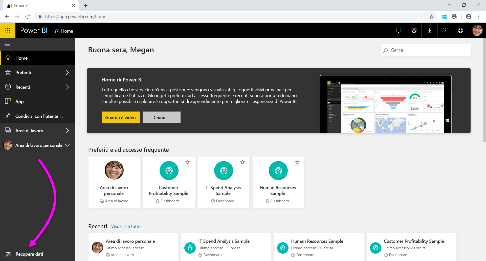
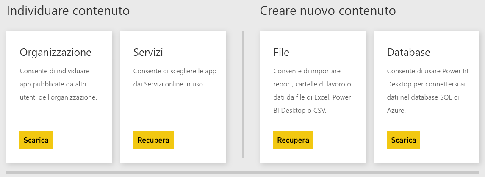

# Origini dati per il servizio Power BI
I dati sono il fulcro di Power BI. Si supponga di esplorare i dati. È possibile farlo creando grafici e dashboard o ponendo domande con **Domande e risposte**. Le visualizzazioni e le risposte che appaiono usano i relativi dati sottostanti contenuti in un set di dati. Ma i set di dati da dove provengono? Provengono da un'origine dati.

In questo articolo verranno esaminati i tipi di origini dati a cui è possibile connettersi dal servizio Power BI. Tenere presente che esistono anche molti altri tipi di origini dati da cui è possibile ottenere i dati. Se si scelgono queste origini dati, può essere necessario eseguire prima query avanzate sui dati o usare le funzionalità di modellazione in Excel o Power BI Desktop. Queste opzioni verranno approfondite più avanti. Per ora verranno esaminati i diversi tipi di origini dati disponibili direttamente dal sito del servizio Power BI.

È possibile ottenere dati da una qualsiasi delle origini dati disponibili in Power BI selezionando **Recupera dati** nell'angolo inferiore sinistro della pagina.

 

Dopo aver selezionato **Recupera dati** è possibile scegliere i dati a cui si vuole accedere

## Individuare contenuto

La sezione **Individuare contenuto** contiene tutti i dati e i report necessari, già pronti per l'utente. In Power BI sono disponibili due tipi di pacchetti di contenuto: Aziendale e Servizi. 

**Aziendale**: Con un account Power BI Pro, gli utenti dell'organizzazione possono creare, condividere e usare pacchetti di contenuto. Per altre informazioni, vedere [Introduzione ai pacchetti di contenuto aziendali](service-organizational-content-pack-introduction.md).

**Servizi**: Sono disponibili decine di servizi con pacchetti di contenuto per Power BI e ne vengono aggiunti continuamente altri. Per la maggior parte dei servizi è necessario avere un account. Per altre informazioni, vedere [Connettersi ai servizi usati con Power BI](service-connect-to-services.md).

## Creare nuovo contenuto

La sezione **Creare nuovo contenuto** contiene opzioni per la creazione e l'importazione del contenuto. In Power BI esistono due modi per creare o importare i propri contenuti: file e database. 

### File

**Excel** ( *.xlsx*, *.xlsm*) - Le cartelle di lavoro in Excel possono includere diversi tipi di dati. Ad esempio, possono includere i dati immessi dall'utente nei fogli di lavoro. Possono anche includere dati su cui sono state eseguite query e che sono stati caricati da origini dati esterne con Power Query. Power Query è disponibile da **Recupera e trasforma** in Excel 2016 o Power Pivot. È possibile importare nei fogli di lavoro i dati di tabelle o modelli di dati. Per altre informazioni, vedere [Ottenere dati dai file per Power BI](service-get-data-from-files.md).

**Power BI Desktop** (*PBIX*): è possibile usare Power BI Desktop per eseguire query e caricare dati da origini dati esterne e per creare report. È anche possibile estendere il modello di dati con misure e relazioni o importare il file di Power BI Desktop nel sito di Power BI. Power BI Desktop è ideale per gli utenti più avanzati. In genere questi utenti hanno maggiore dimestichezza con l'uso delle proprie origini dati, con l'esecuzione di query e trasformazioni dei dati e con i concetti di modellazione dei dati. Per altre informazioni, vedere [Connettersi ai dati in Power BI Desktop](desktop-connect-to-data.md).

**Con valori delimitati da virgole** (*CSV*): i file sono semplici file di testo con righe di dati. Ogni riga può contenere uno o più valori separati da una virgola. Ad esempio, un file *CSV* contenente dati relativi a nomi e indirizzi può avere molte righe. Ogni riga può avere valori per nome, cognome, indirizzo, città, stato e così via. Non è possibile importare dati in un file *CSV*, ma molte applicazioni, ad esempio Excel, sono in grado di salvare i dati di una tabella semplice come file *CSV*.

Per altri tipi di file, ad esempio le tabelle XML (*XML*) o i file di testo (*TXT*), è possibile usare **Recupera e trasforma** per eseguire query sui dati, trasformarli e caricarli prima in un file di Excel o Power BI Desktop, che quindi potrà essere importato in Power BI.

Anche il percorso in cui si archiviano i file ha una grande importanza. OneDrive for Business offre il massimo di flessibilità e integrazione con Power BI. I file si possono tenere nell'unità locale, ma se è necessario aggiornarli, si devono eseguire alcuni passaggi aggiuntivi. Per altre informazioni, vedere i collegamenti agli articoli riportati di seguito.

### Database

**Database nel Cloud**: dal servizio Power BI è possibile connettersi in tempo reale a:

* Database SQL di Azure
* Azure SQL Data Warehouse
* Spark in Azure HDInsight

Le connessioni da Power BI a questi database sono dinamiche. Si supponga di connettersi a un database SQL di Azure e di iniziare a esplorarne i dati creando report in Power BI. Ogni volta che si sezionano i dati o si aggiunge un altro campo a una visualizzazione, Power BI esegue una query direttamente sul database. Per altre informazioni, vedere [Azure e Power BI](service-azure-and-power-bi.md).

**Database locali**: dal servizio Power BI è possibile connettersi direttamente ai database modello tabulari di SQL Server Analysis Services. A tale scopo, è necessario un gateway Power BI Enterprise. In caso di dubbi sulla connessione al database modello tabulare dell'organizzazione, contattare l'amministratore o il reparto IT. Per altre informazioni, vedere [Dati dinamici di SQL Server Analysis Services in Power BI](sql-server-analysis-services-tabular-data.md).

Per altri tipi di database all'interno dell'organizzazione, è necessario usare Power BI Desktop o Excel per connettersi, eseguire query e caricare i dati in un modello di dati. È quindi possibile importare il file in Power BI, dove esiste un set di dati. Se si configura un aggiornamento pianificato, Power BI userà le informazioni di connessione contenute nel file per connettersi direttamente all'origine dati e verificare la disponibilità di aggiornamenti. Power BI carica quindi gli aggiornamenti nel set di dati. Per altre informazioni, vedere [Connettersi ai dati in Power BI Desktop](desktop-connect-to-data.md).

## Dati provenienti da un'origine diversa
Esistono centinaia di origini dati diverse che si possono usare con Power BI. Indipendentemente dall'origine da cui si ottengono, i dati devono essere in un formato che può essere usato dal servizio Power BI. Con quei dati il servizio Power BI è in grado di creare report e dashboard, rispondere alle domande con **Domande e risposte** e così via.

Alcune origini dati contengono già dati formattati per il servizio Power BI. Queste origini sono simili ai pacchetti di contenuto offerti da provider di servizi come Google Analytics e Twilio. Anche i database modello tabulari di SQL Server Analysis Services sono già pronti per l'uso. È anche possibile connettersi in tempo reale ai database nel cloud, ad esempio al database SQL di Azure e Spark in HDInsight.

In altri casi, potrebbe essere necessario eseguire una query e caricare i dati desiderati in un file. Si supponga ad esempio di avere dati logistici nella propria organizzazione. I dati vengono archiviati in un database del data warehouse in un server. Nel servizio Power BI non è possibile connettersi a tale database e iniziare l'esplorazione dei dati, a meno che non sia un database modello tabulare, ma è possibile usare Power BI Desktop o Excel per eseguire query e caricare i dati logistici in un modello di dati da salvare poi in un file. È quindi possibile importare il file in Power BI dove esiste un set di dati.

Una probabile obiezione potrebbe essere che i dati logistici nel database cambiano continuamente e il set di dati di Power BI deve essere aggiornato. Quando si importano i dati nel set di dati, si importano anche le informazioni di connessione dal file di Excel o Power BI Desktop.

Si supponga di configurare un aggiornamento pianificato o di eseguire un aggiornamento manuale del set di dati. Power BI usa le informazioni di connessione del set di dati, oltre a un paio di altre impostazioni, per connettersi direttamente al database. Verifica quindi se sono presenti aggiornamenti e li carica nel set di dati. Sarà probabilmente necessario un gateway di Power BI per proteggere e trasferire i dati tra il server locale e Power BI. Completato il trasferimento, eventuali visualizzazioni nei report e dashboard vengono automaticamente aggiornate.

Anche se non è possibile connettersi direttamente all'origine dati dal servizio Power BI, si possono comunque ottenere i dati in Power BI. Si tratta solo di eseguire qualche passaggio in più e forse di chiedere un piccolo aiuto al reparto IT. Vedere [Origini dati in Power BI Desktop](desktop-data-sources.md) per altre informazioni.

## Altri dettagli
Si noterà che i termini set di dati e origine dati vengono usati spesso in Power BI. Vengono usati spesso come sinonimi, ma in realtà sono due cose diverse anche se correlate.

Si crea automaticamente un **set di dati** in Power BI quando si usa **Recupera dati**. **Recupera dati** consente di connettersi e importare i dati di un pacchetto di contenuto o un file oppure di connettersi a un'origine dati in tempo reale. Un set di dati contiene informazioni sull'origine dati e sulle credenziali dell'origine dati. In molti casi include anche un subset di dati copiati dall'origine dati. Quando si creano visualizzazioni in report e dashboard spesso si usano i dati del set di dati.

Un'**origine dati** è l'elemento da cui provengono i dati presenti in un set di dati. Ad esempio, i dati possono provenire da:

* Un servizio online come Google Analytics o QuickBooks
* Un database nel cloud come il database SQL di Azure
* Un database o file in un computer locale o un server dell'organizzazione

## Aggiornamento dei dati
Forse l'utente salva i file nella propria unità locale o un'unità che si trova in un'altra parte dell'organizzazione. Può essere necessario un gateway di Power BI in modo che sia possibile aggiornare il set di dati in Power BI. Il computer in cui è archiviato il file deve essere acceso durante l'aggiornamento. È possibile importare nuovamente il file o usare Pubblica da Excel o Power BI Desktop, ma tali opzioni non sono processi automatizzati.

Se si salvano i file in OneDrive for Business o nei siti del team di SharePoint, è possibile connettersi ai file o importare i file in Power BI. Quindi, il set di dati, i report e il dashboard saranno sempre aggiornati. Poiché sia OneDrive for Business che Power BI risiedono nel cloud, Power BI può connettersi direttamente al file salvato circa una volta ogni ora per verificare la presenza di aggiornamenti. Il set di dati e le eventuali visualizzazioni si aggiornano automaticamente se sono presenti aggiornamenti.

I pacchetti di contenuto dai servizi vengono aggiornati automaticamente. Nella maggior parte dei casi vengono aggiornati una volta al giorno. È possibile eseguire l'aggiornamento manualmente, ma la presenza o meno di dati aggiornati dipenderà dal provider di servizi. Gli aggiornamenti dei pacchetti di contenuto degli utenti dell'organizzazione dipenderanno dalle origini dati usate. Dipenderanno inoltre dal modo in cui la persona che ha creato il pacchetto di contenuto ha configurato l'aggiornamento.

Database SQL di Azure, Azure SQL Data Warehouse e Spark in Azure HDInsight sono origini dati nel cloud. Anche il servizio Power BI risiede nel cloud quindi Power BI può connettersi a queste origini dati in tempo reale usando **DirectQuery**. Le informazioni disponibili in Power BI sono sempre sincronizzate e non è necessario configurare un aggiornamento pianificato.

Quando ci si connette a SQL Server Analysis Services da Power BI, la connessione è dinamica proprio come quella a un database di Azure nel cloud. La differenza è che il database si trova in un server dell'organizzazione. Questo tipo di connessione richiede un gateway di Power BI configurato dal reparto IT.

L'aggiornamento dei dati è un aspetto estremamente importante di Power BI ed è troppo complesso per essere illustrato qui in modo esaustivo. Per un'analisi più approfondita, vedere [Aggiornamento dei dati in Power BI](refresh-data.md).

## Considerazioni e limitazioni
Per tutte le origini dati usate nel servizio Power BI, tenere presenti le limitazioni seguenti. Esistono altre limitazioni applicabili a funzionalità specifiche, ma l'elenco seguente è valido per il servizio Power BI completo:

* **Limite delle dimensioni del set di dati**: è previsto un limite di 1 GB per i set di dati archiviati nelle capacità condivise del servizio Power BI. Se sono necessari set di impostazioni di dimensioni maggiori, è possibile usare [Power BI Premium](service-premium-what-is.md).

* **Valori distinti in una colonna**: quando si memorizzano nella cache i dati in un set di dati di Power BI (operazione talvolta definita modalità di importazione), è previsto un limite di 1.999.999.997 per il numero di valori distinti che possono essere archiviati in una colonna.

* **Limite di righe** : quando si usa **DirectQuery**, Power BI impone un limite ai risultati della query inviati all'origine dati sottostante. Se la query inviata all'origine dati restituisce più di 1 milione di righe, viene visualizzato un errore e la query ha esito negativo. I dati sottostanti possono comunque contenere più di 1 milione righe. Poiché la maggior parte dei report aggrega i dati in set di risultati di dimensioni più piccole, è improbabile che si incorra in questo limite.

* **Limite di colonne**: il numero massimo di colonne consentite in un set di dati, in tutte le tabelle nel set di dati, è 16.000. Questo limite si applica al servizio Power BI e ai set di dati usati in Power BI Desktop. Power BI tiene traccia del numero di colonne e tabelle nel set di dati, quindi il numero massimo di colonne è 16.000 meno una per ogni tabella del set di dati.

