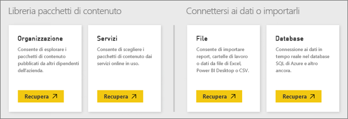
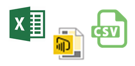
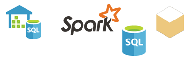

# Origini dati per il servizio Power BI
I dati sono il fulcro di Power BI. Ogni volta che si esplorano dati, si creano grafici e dashboard o si pongono domande con Domande e risposte, i dati sottostanti di tutte le visualizzazioni e le risposte ottenute derivano da un set di dati. Ma i set di dati da dove provengono? Da un'origine dati, ovviamente.

In questo articolo verranno esaminati i diversi tipi di origini dati a cui è possibile connettersi dal servizio Power BI. Tenere presente che esistono anche molti altri tipi di origini dati da cui è possibile ottenere i dati. Per queste origini potrebbe tuttavia essere necessario usare prima Power BI Desktop o le funzionalità avanzate di query e modellazione dei dati di Excel. Questi aspetti verranno approfonditi più avanti. Per ora esaminiamo i diversi tipi di origini dati a cui è possibile connettersi dal sito del servizio Power BI.

In Power BI è possibile ottenere dati da una qualsiasi di queste origini dati facendo clic su **Area di lavoro personale** > **Recupera dati**.

## File

**Excel** (con estensione xlsx, xlxm): Excel è unico nel senso che una cartella di lavoro può includere sia dati immessi manualmente nei fogli di lavoro sia dati caricati da origini dati esterne tramite Power Query (Recupera e trasforma in Excel 2016) o Power Pivot. È possibile importare dati presenti nelle tabelle nei fogli di lavoro (i dati *devono* trovarsi in una tabella) o importare i dati che vengono caricati in un modello di dati. Per altre informazioni, vedere [Ottenere dati da file di Excel](service-get-data-from-files.md).

**Power BI Desktop** (con estensione pbix): è possibile usare Power BI Desktop per eseguire query e caricare dati da origini dati esterne, estendere il modello di dati con misure e relazioni e creare report. È possibile importare i file di Power BI Desktop nel sito Power BI. Power BI Desktop è ideale per gli utenti più avanzati che hanno una buona conoscenza delle origini dati che usano, delle query sui dati e della trasformazione dei dati, nonché dei concetti di modellazione dei dati. Per altre informazioni, vedere [Connettersi ai dati in Power BI Desktop](desktop-connect-to-data.md).

**Con valori delimitati da virgole** (con estensione csv): sono semplici file di testo con righe di dati. Ogni riga può contenere uno o più valori separati da una virgola. Ad esempio, un file con estensione csv contenente dati come nomi e indirizzi può avere un certo numero di righe con valori per nome, cognome, indirizzo, città, stato e così via. Non è possibile importare dati in un file con estensione csv, ma molte applicazioni, ad esempio Excel, possono salvare i dati di tabella semplice come file csv.

Per altri tipi di file come le tabelle XML (con estensione xml) o i file di testo (con estensione txt), è possibile usare prima di tutto Recupera e trasforma per eseguire query sui dati, trasformarli e caricarli in un file di Excel o Power BI Desktop, che quindi potrà essere importato in Power BI.

Anche il percorso in cui si archiviano i file ha una grande importanza. OneDrive for Business offre il massimo di flessibilità e integrazione con Power BI. È possibile mantenere i file nell'unità locale, ma se occorre aggiornare i dati saranno necessari alcuni passaggi aggiuntivi. Negli articoli correlati vengono forniti maggiori dettagli.

## Pacchetti di contenuto

I pacchetti di contenuto contengono tutti i dati e i report necessari, già pronti per l'utente. In Power BI sono disponibili due tipi di pacchetti di contenuto: quelli dei servizi, ad esempio Google Analytics, Marketo o Salesforce e quelli creati e condivisi da altri utenti dell'organizzazione.

**Servizi**: sono disponibili decine di servizi con pacchetti di contenuto per Power BI e ne vengono aggiunti continuamente altri. Per la maggior parte dei servizi è necessario avere un account. Per altre informazioni, vedere [Connettersi ai servizi](service-connect-to-services.md).

**Contenuti aziendali**: con un account Power BI Pro, gli utenti all'interno dell'organizzazione possono creare, condividere e usare pacchetti di contenuto. Per altre informazioni, vedere [Pacchetti di contenuto aziendali](service-organizational-content-pack-introduction.md).

## Database

**Database nel cloud**: dal servizio Power BI è possibile connettersi in tempo reale al database SQL di Azure, ad Azure SQL Data Warehouse, a Spark in Azure HDInsight e a SQL Server Analysis Services tramite DirectQuery. Le connessioni da Power BI a questi database sono dinamiche, vale a dire che quando ci si connette, ad esempio, a un database SQL di Azure e si inizia a esplorarne i dati creando report in Power BI, oppure ogni volta che si suddividono i dati o si aggiunge un altro campo a una visualizzazione, viene eseguita una query direttamente nel database. Per altre informazioni, vedere [Azure e Power BI](service-azure-and-power-bi.md).

**Database locali**: dal servizio Power BI è possibile connettersi direttamente ai database modello tabulari di SQL Server Analysis Services. È necessario avere Power BI Enterprise Gateway. In caso di dubbi sulla connessione al database modello tabulare dell'organizzazione, contattare l'amministratore o il reparto IT. Per altre informazioni, vedere [Dati tabulari di SQL Server Analysis Services in Power BI](sql-server-analysis-services-tabular-data.md).

Per altri tipi di database all'interno dell'organizzazione, è necessario innanzitutto usare Power BI Desktop o Excel per connettersi, eseguire query e caricare i dati in un modello di dati. È quindi possibile importare il file in Power BI, dove viene creato un set di dati. Se si configura l'aggiornamento pianificato, Power BI userà le informazioni di connessione contenute nel file insieme alle impostazioni di aggiornamento configurate per connettersi direttamente all'origine dati e verificare la disponibilità di aggiornamenti. Gli aggiornamenti vengono quindi caricati nel set di dati in Power BI. Per altre informazioni, vedere [Connettersi ai dati in Power BI Desktop](desktop-connect-to-data.md).

## Dati provenienti da un'origine diversa
Esistono letteralmente centinaia di origini dati diverse che si possono usare con Power BI. Indipendentemente dalla loro provenienza, i dati devono avere un formato che il servizio Power BI può usare per creare report e dashboard, rispondere a domande con Domande e risposte, e così via.

Alcune origini dati dispongono già di dati in un formato pronto per il servizio Power BI, ad esempio i pacchetti di contenuto dei provider di servizi come Google Analytics e Twilio. Anche i database modello tabulari di SQL Server Analysis Services sono già pronti. Ed è possibile connettersi in tempo reale ai database nel cloud, ad esempio al database SQL di Azure e Spark in HDInsight.

In altri casi, potrebbe essere necessario eseguire una query e caricare i dati desiderati in un file. Si supponga ad esempio di avere dati logistici in un database del data warehouse in un server dell'organizzazione. Nel servizio Power BI non è possibile connettersi direttamente a tale database e iniziare l'esplorazione dei dati, a meno che non sia un database modello tabulare. È possibile, tuttavia, usare Power BI Desktop o Excel per eseguire query e caricare i dati logistici in un modello di dati da salvare poi in un file. È quindi possibile importare il file in Power BI, dove viene creato un set di dati.

Una probabile obiezione potrebbe essere che i dati logistici nel database cambiano continuamente. Come è possibile assicurarsi che il set di dati in Power Bi venga aggiornato? Le informazioni di connessione del file di Power BI Desktop o di Excel vengono importate nel set di dati insieme ai dati. Se si configura l'aggiornamento pianificato o si esegue un aggiornamento manuale nel set di dati, Power BI userà le informazioni di connessione del set di dati, oltre ad altre impostazioni, per connettersi direttamente al database, verificare la disponibilità di aggiornamenti e caricarli nel set di dati. Sarà probabilmente necessario un Power BI Gateway per proteggere e trasferire i dati tra il server locale e Power BI. Le visualizzazioni in report e dashboard vengono aggiornate automaticamente.

Il fatto che non sia possibile connettersi direttamente all'origine dati dal servizio Power BI non significa che non si possa disporre di quei dati in Power BI. Si tratta solo di eseguire qualche passaggio in più e forse di chiedere un piccolo aiuto al reparto IT. Vedere [Origini dati in Power BI Desktop](desktop-data-sources.md) per altre informazioni.

## Altri dettagli
Si noterà che i termini set di dati e origine dati vengono usati spesso in Power BI. Sono usati di frequente come sinonimi, ma in realtà sono due cose diverse anche se correlate.

Un ***set di dati*** viene creato automaticamente in Power BI quando si usa Recupera dati per connettersi e importare i dati da un pacchetto di contenuto o a un file oppure per connettersi a un'origine dati dinamica. Un set di dati contiene informazioni sull'origine dati, le credenziali dell'origine dati e, in molti casi, un subset di dati copiati dall'origine dati. Nella maggior parte dei casi, quando si creano visualizzazioni in report e dashboard, si stanno usando i dati del set di dati.

Un'***origine dati*** è l'elemento da cui provengono effettivamente i dati presenti in un set di dati. Ad esempio, un servizio online come Google Analytics o QuickBooks, un database nel cloud come il database SQL di Azure oppure un database o un file in un server o un computer locale dell'organizzazione.

### Aggiornamento dei dati
Se si salvano i file sul disco locale o su un'unità in un punto qualsiasi all'interno dell'organizzazione, per aggiornare il set di dati in Power BI potrebbe essere necessario un Power BI Gateway. E il computer in cui è salvato il file deve essere acceso durante l'aggiornamento. È inoltre possibile importare nuovamente il file o usare Pubblica da Excel o Power BI Desktop, ma non si tratta di processi automatizzati.

Se si salvano i file in OneDrive for Business o nei siti del team di SharePoint e quindi si esegue la connessione o si importano i file in Power BI, il set di dati, i report e il dashboard saranno sempre aggiornati. Poiché sia OneDrive for Business che Power BI risiedono nel cloud, Power BI può connettersi direttamente al file salvato circa una volta ogni ora per verificare la presenza di aggiornamenti. Se li trova, il set di dati e le eventuali visualizzazioni vengono aggiornati automaticamente.

I pacchetti di contenuto dai servizi vengono aggiornati automaticamente. Nella maggior parte dei casi, una volta al giorno. È possibile eseguire l'aggiornamento manualmente, ma la presenza o meno di dati aggiornati dipenderà dal provider di servizi. L'aggiornamento dei pacchetti di contenuto di altri utenti dell'organizzazione dipenderà dalle origini dati usate e dalle impostazioni di aggiornamento configurate da chi ha creato il pacchetto di contenuto.

Database SQL di Azure, Azure SQL Data Warehouse e Spark in Azure HDInsight sono caratterizzati dal fatto di essere origini dati nel cloud. Poiché anche il servizio Power BI risiede nel cloud, Power BI può connettersi a queste origini dati in modo dinamico, tramite DirectQuery. Le informazioni disponibili in Power BI sono sempre sincronizzate e non è necessario configurare l'aggiornamento.

Nel caso di SQL Server Analysis Services, invece, la connessione da Power BI è una connessione dinamica come per un database di Azure nel cloud, ma il database si trova in un server all'interno dell'organizzazione. Questo tipo di connessione richiede un Power BI Gateway, che viene in genere configurato dal reparto IT.

L'aggiornamento dei dati è un aspetto estremamente importante di Power BI ed è troppo complesso per essere illustrato qui in modo esaustivo. Per un'analisi più approfondita, vedere [Aggiornamento dei dati in Power BI](refresh-data.md).

## Considerazioni e limitazioni
Per tutte le origini dati usate nel servizio Power BI, si applicano le considerazioni e le limitazioni seguenti. Esistono altre limitazioni applicabili a funzionalità specifiche, ma l'elenco seguente si applica al servizio Power BI in generale:

* **Limite dimensioni del set di dati**: è previsto un limite di 1 GB per ogni set di dati nel servizio Power BI.
* **Limite di righe**: il numero massimo di righe nel set di dati (quando non si usa DirectQuery) è 2 miliardi, con tre di queste righe riservate (risultante in un massimo di 1.999.999.997 righe utilizzabili); il numero massimo di righe quando si usa DirectQuery è 1 milione di righe.
* **Limite di colonne**: il numero massimo di colonne consentite in un set di dati, in tutte le tabelle nel set di dati, è 16.000. Questa limitazione si applica al servizio Power BI e ai set di dati usati in Power BI Desktop. Power BI usa una colonna dei numeri di riga interna per tabella inclusa nel set di dati, cioè il numero massimo di colonne è 16.000 meno una per ogni tabella usata nel set di dati.

