# Esercitazione: Introduzione al servizio Power BI
Questa esercitazione è un'introduzione ad alcune delle funzionalità del *servizio Power BI* e descrive come connettersi ai dati, creare un report e un dashboard e porre domande sui dati. È possibile eseguire molte altre operazioni nel servizio Power BI e questa esercitazione è da intendersi come una semplice introduzione. Per comprendere come si posiziona il servizio Power BI rispetto alle altre offerte Power BI, è consigliabile leggere [Che cos'è Power BI](fundamentals/power-bi-overview.md).

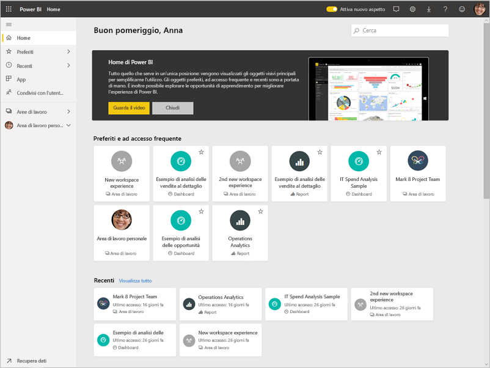

In questa esercitazione si completa la procedura seguente:

> [!div class="checklist"]
> * Accedere all'account online di Power BI o iscriversi se non si ha ancora un account.
> * Aprire il servizio Power BI.
> * Ottenere alcuni dati e aprirli in visualizzazione report.
> * Usare tali dati per creare visualizzazioni e salvarli come report.
> * Creare un dashboard aggiungendo i riquadri dai report.
> * Aggiungere altre visualizzazioni al dashboard usando lo strumento di linguaggio naturale Domande e risposte.
> * Ridimensionare, ridisporre e interagire con i riquadri nel dashboard.
> * Pulire le risorse eliminando il set di dati, il report e il dashboard.

> [!TIP]
> Se si preferisce un corso di formazione gratuito per l'autoapprendimento, [iscriversi al corso Analyzing and Visualizing Data su EdX](https://aka.ms/edxpbi) (Analisi e visualizzazione dei dati).

## Iscriversi al servizio Power BI
Se non si ha un account Power BI, [iscriversi per ottenere una versione di prova gratuita](https://app.powerbi.com/signupredirect?pbi_source=web) prima di iniziare.

Dopo aver creato un account, immettere *app.powerbi.com* nel browser per aprire il servizio Power BI. 

## Passaggio 1: Recuperare i dati

Quando si vuole creare un report di Power BI, spesso si inizia in Power BI Desktop. In questo caso si inizierà da zero, creando un report nel servizio Power BI.

In questa esercitazione si ottengono i dati da un file CSV. Per iniziare, [Scaricare il file CSV di esempio Financial](https://go.microsoft.com/fwlink/?LinkID=521962).

1. [Accedere a Power BI](https://www.powerbi.com/). Non si ha un account? Nessun problema: è possibile iscriversi a una versione di prova gratuita.
2. Power BI viene aperto nel browser. Selezionare **Recupera dati** nella parte inferiore del riquadro di spostamento.

    Verrà aperta la pagina **Recupera dati**.   

3. Nella sezione **Creare nuovo contenuto** selezionare **File**. 
   
   
4.  Selezionare **File locale**.
   
    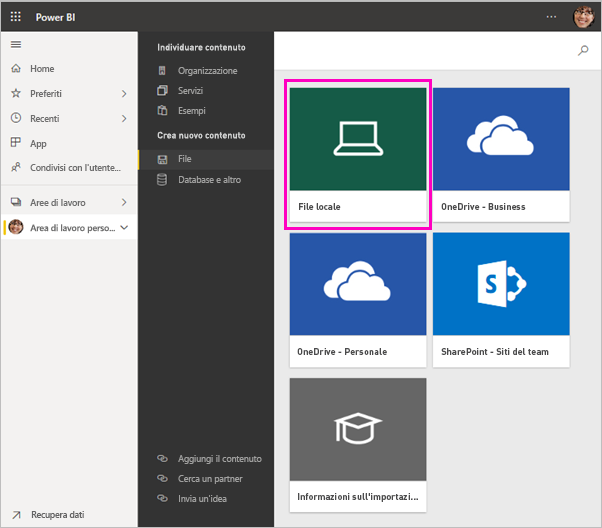

5. Selezionare il file nel computer e scegliere **Apri**.

5. Per questa esercitazione si seleziona **Importa** per aggiungere il file di Excel come set di dati, da usare successivamente per creare report e dashboard. Se si seleziona **Carica**, l'intera cartella di lavoro di Excel verrà caricata in Power BI, da cui potrà essere aperta e modificata in Excel Online.
   
   
6. Quando il set di dati è pronto, selezionare **Set di dati** e quindi selezionare **Crea report** accanto al set di dati dell'**esempio Financial** per aprire l'editor di report. 

    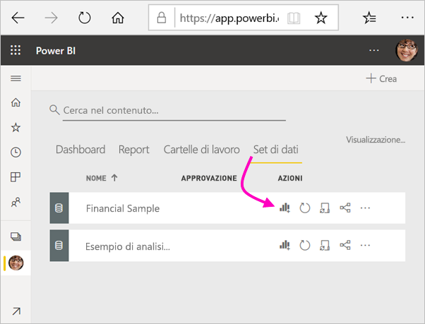

    L'area di disegno report è vuota. A destra sono visualizzati i riquadri **Filtri**, **Visualizzazioni** e **Campi**.

    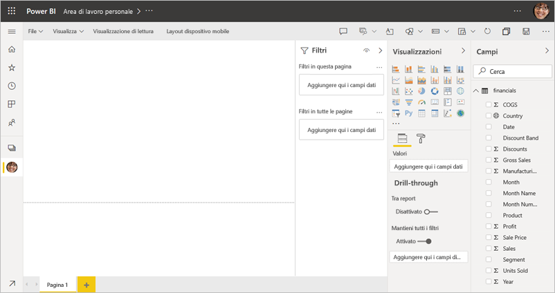

7. Si noti l'opzione **Visualizzazione di lettura** nel riquadro di spostamento superiore. Se questa opzione è visualizzata, significa che si sta usando la visualizzazione di modifica. Per acquisire familiarità con l'editor di report, è possibile [visualizzare la presentazione](create-reports/service-the-report-editor-take-a-tour.md).

    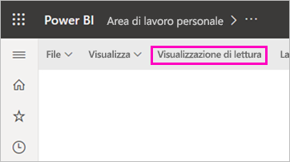

    Nella visualizzazione di modifica è possibile creare e modificare i report, perché l'utente è il *proprietario* del report. Vale a dire che ne è l'*autore*. Quando si condivide un report con i colleghi, questi ultimi possono interagire con il report esclusivamente nella visualizzazione di lettura, perché sono *consumer*. Altre informazioni sulla [Visualizzazione di lettura e sulla Visualizzazione di modifica](consumer/end-user-reading-view.md).

## Passaggio 2: Creare un grafico in un report
Ora che si è connessi ai dati, è possibile iniziare l'esplorazione.  Se si trovano elementi interessanti, si può creare un dashboard per monitorarli e visualizzarne le variazioni nel tempo. Ecco come funziona.
    
1. Nell'editor di report si inizia nel riquadro **Campi** sul lato destro della pagina per creare una visualizzazione. Selezionare le caselle di controllo **Gross Sales** e **Date**.
   
   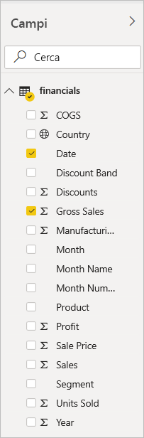

    Power BI analizza i dati e crea una visualizzazione. Se prima si è selezionato **Date**, viene visualizzata una tabella. Se prima si è selezionato **Gross Sales** viene visualizzato un istogramma. 

2. Cambiare la modalità di visualizzazione dei dati. È possibile visualizzare i dati sotto forma di grafico a linee. Selezionare l'icona del grafico a linee dal riquadro **Visualizzazioni**.
   
   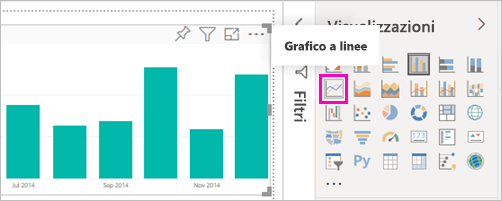

3. Il grafico sembra interessante, quindi lo si *aggiungerà* a un dashboard. Passare il puntatore del mouse sulla visualizzazione, quindi selezionare l'icona Aggiungi. Quando si aggiunge una visualizzazione, verrà archiviata nel dashboard e aggiornata automaticamente in modo che sia possibile tenere traccia dell'ultimo valore in modo immediato.
   
   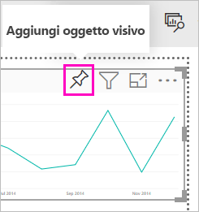

4. Dato che il report è nuovo, è necessario salvarlo prima di poter aggiungere una visualizzazione a un dashboard. Assegnare un nome al report, ad esempio *Sales over time* e quindi selezionare **Salva**. 

5. Selezionare **Nuovo dashboard** e assegnargli il nome *Financial sample for tutorial*. 
   
   
   
6. Selezionare **Aggiungi**.
   
    Un messaggio di operazione completata (nell'angolo superiore destro) informa l'utente che la visualizzazione è stata aggiunta come riquadro al dashboard.
   
    

7. Selezionare **Vai al dashboard** per visualizzare il nuovo dashboard con il grafico a linee aggiunto sotto forma di riquadro. 
   
   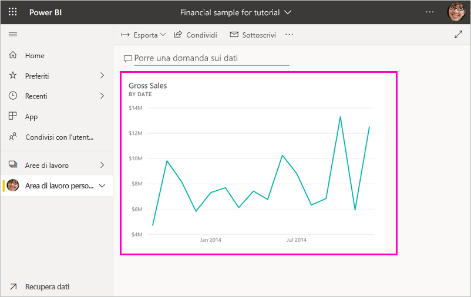
   
8. Selezionare il nuovo riquadro nel dashboard per tornare al report. Power BI reindirizzerà l'utente al report nella visualizzazione di lettura. 

1. Per tornare alla visualizzazione di modifica, selezionare **Altre opzioni** (...) nel riquadro di spostamento superiore > **Modifica**. Una volta tornati nella visualizzazione di modifica, è possibile continuare a esplorare e ad aggiungere i riquadri.

    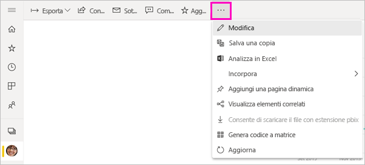

## Passaggio 3: Esplorare i dati con Domande e risposte

Per l'esplorazione rapida dei dati, provare a formulare una domanda nella casella Domande e risposte. Domande e risposte crea query in linguaggio naturale sui dati. In un dashboard, la casella Domande e risposte è nella parte superiore (**Porre una domanda sui dati**). In un report si trova nel riquadro di spostamento superiore (**Porre una domanda**).

1. Per tornare al dashboard, selezionare **Area di lavoro personale** nella barra nera di **Power BI**.

    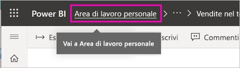

1. Nella scheda **Dashboard** selezionare il dashboard.

    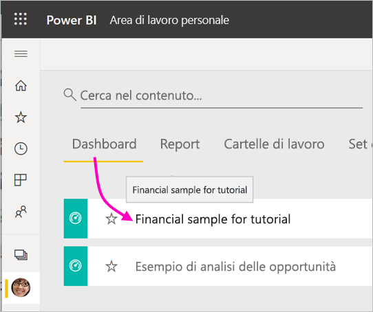

1. Selezionare **Porre una domanda sui dati**. Domande e risposte offre automaticamente vari suggerimenti.

    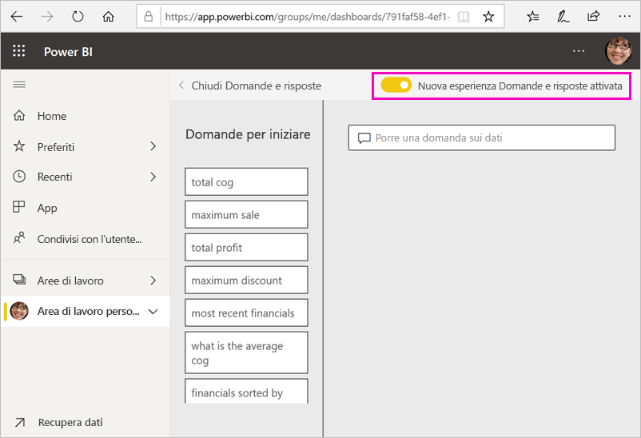

    > [!NOTE]
    > Se non vengono visualizzati i suggerimenti, attivare **Nuova esperienza Domande e risposte**.

2. Alcuni suggerimenti restituiscono un singolo valore. Selezionare, ad esempio, **maximum sale**.

    Domande e risposte cerca una risposta e la presenta sotto forma di visualizzazione *scheda*.

    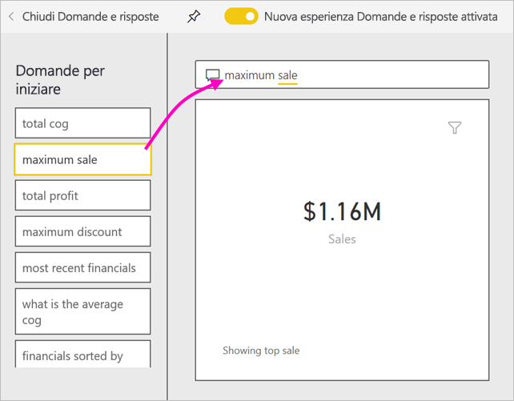

3. Selezionare l'icona Aggiungi  per mostrare questa visualizzazione nel dashboard Financial sample for tutorial.

1. Scorrere l'elenco **Domande per iniziare** e selezionare **average cog for each month**. 

    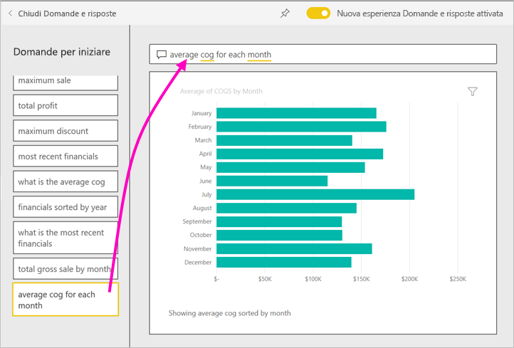

1. Aggiungere anche l'istogramma al dashboard **Financial sample for tutorial**.

1. Posizionare il cursore dopo *by month* nella casella Domande e risposte e digitare *as line*. Selezionare **linea (Tipo di visualizzazione)** . 

    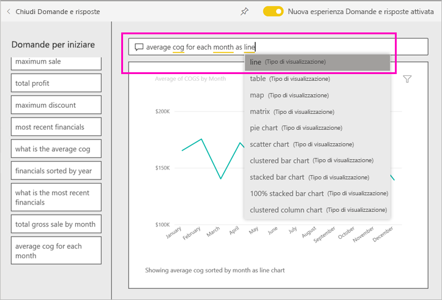

4. Selezionare **Chiudi Domande e risposte** per tornare al dashboard dove sono visibili i nuovi riquadri creati. 

   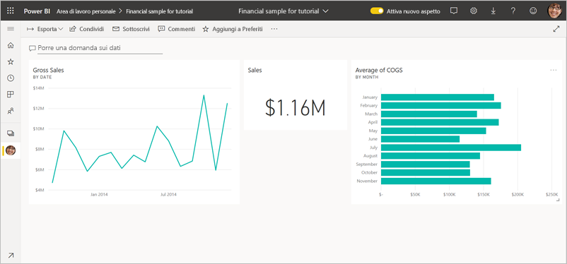

   Si noterà che anche se il grafico è stato modificato in un grafico a linee, il riquadro è rimasto un istogramma, perché questa era l'impostazione al momento dell'aggiunta. 

## Passaggio 4: Riposizionare i riquadri

Il dashboard è largo. È possibile ridisporre i riquadri per sfruttare al meglio lo spazio del dashboard.

1. Trascinare l'angolo inferiore destro del riquadro del grafico a linee *Gross Sales* verso l'alto, fino a quando non si blocca alla stessa altezza del riquadro Sales, quindi rilasciare.

    

    Ora i due riquadri hanno la stessa altezza.

    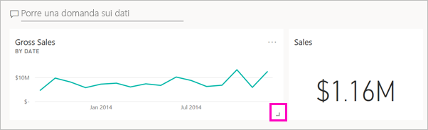

1. Trascinare il riquadro dell'istogramma *Average of COGS* fino a posizionarlo sotto il grafico a linee *Gross Sales*.

    L'aspetto è migliore.

    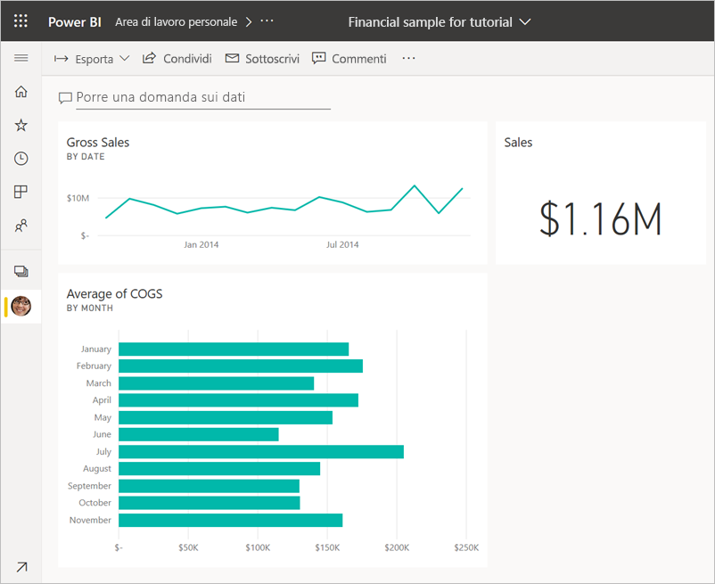

## Passaggio 5: Interagire con i riquadri

Di seguito viene descritta un'ultima interazione da osservare, prima di iniziare a creare dashboard e report personalizzati. La selezione dei diversi riquadri fornisce risultati diversi. 

1. Selezionare prima di tutto il riquadro del grafico a linee *Gross Sales* aggiunto dal report. 

    Power BI apre il report nella visualizzazione di lettura. 

2. Selezionare il pulsante Indietro del browser. 

1. Selezionare ora il riquadro dell'istogramma *Average of COGS* creato in Domande e risposte. 

    Power BI non apre il report. Viene invece aperto Domande e risposte, perché il grafico è stato creato in tale strumento.

## Pulire le risorse
Dopo aver completo l'esercitazione, è possibile eliminare il set di dati, il report e il dashboard. 

1. Nel riquadro di spostamento verificare che sia attiva l'**Area di lavoro personale**.
2. Selezionare la scheda **Set di dati** e individuare il set di dati che è stato importato per questa esercitazione.  
3. Selezionare **Altre opzioni** (...) > **Elimina**.

    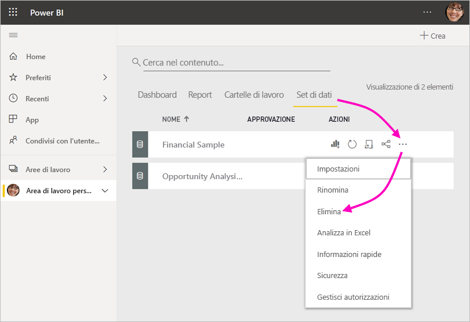

    Quando si elimina il set di dati, viene visualizzato l'avviso **Verranno eliminati anche tutti i riquadri dei report e dei dashboard che contengono dati da questo set di dati**.

4. Selezionare **Elimina**.

## Passaggi successivi

È possibile migliorare ulteriormente i dashboard aggiungendo altri riquadri di visualizzazione e [rinominando, ridimensionando, collegando e riposizionando i riquadri](create-reports/service-dashboard-edit-tile.md).
