# Esercitazione: Introduzione al servizio Power BI (app.powerbi.com)
Questa esercitazione illustra come iniziare a usare il ***servizio Power BI***. Per comprendere come si posiziona il servizio Power BI rispetto alle altre offerte Power BI, è prima di tutto consigliabile leggere [Che cos'è Power BI](power-bi-overview.md).

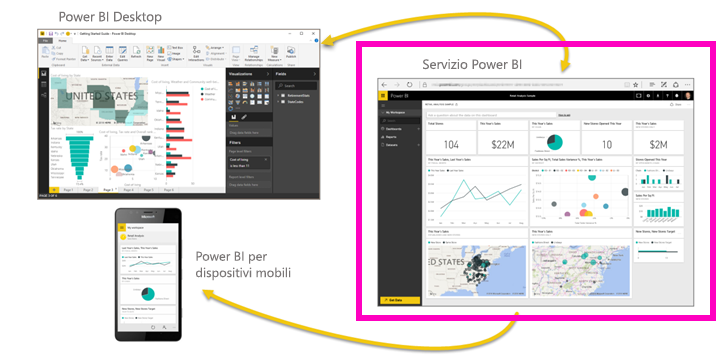

In questa esercitazione viene completata la procedura seguente:

> [!div class="checklist"]
> * Trovare altri contenuti introduttivi per il servizio Power BI
> * Accedere all'account Power BI online o iscriversi se non si ha ancora un account
> * Aprire il servizio Power BI
> * Ottenere alcuni dati e aprirli in visualizzazione report
> * Usare tali dati per creare visualizzazioni e salvarle in un report
> * Creare un dashboard aggiungendo i riquadri dai report
> * Aggiungere un'altra visualizzazione al dashboard usando lo strumento di linguaggio naturale Domande e risposte
> * Pulire le risorse eliminando il set di dati, il report e il dashboard

## Iscriversi al servizio Power BI
Se non si è ancora iscritti a Power BI, [iscriversi per ottenere una versione di prova gratuita](https://app.powerbi.com/signupredirect?pbi_source=web) prima di iniziare.

Se si ha già un account, accedere al servizio Power BI aprendo un browser e digitando app.powerbi.com. 

Per informazioni su Power BI Desktop, vedere [Introduzione a Power BI Desktop](desktop-getting-started.md). Per informazioni su Power BI per dispositivi mobili, vedere [App Power BI per dispositivi mobili](consumer/mobile/mobile-apps-for-mobile-devices.md).

> [!TIP]
> Se si preferisce un corso di formazione gratuito per l'autoapprendimento, [iscriversi al corso Analyzing and Visualizing Data su EdX](http://aka.ms/edxpbi) (Analisi e visualizzazione dei dati).

Visitare la nostra [playlist su YouTube](https://www.youtube.com/playlist?list=PL1N57mwBHtN0JFoKSR0n-tBkUJHeMP2cP). Un buon video da cui iniziare è Introduzione al servizio Power BI:
> 
> <iframe width="560" height="315" src="https://www.youtube.com/embed/B2vd4MQrz4M" frameborder="0" allowfullscreen></iframe>
> 

## Che cos'è il servizio Power BI?
Il servizio Microsoft Power BI è talvolta denominato Power BI online o app.powerbi.com. Power BI consente di rimanere aggiornati sulle informazioni a cui si è interessati.  Nel servizio Power BI i ***dashboard*** aiutano a tenere sotto controllo l'andamento dell'attività.  I dashboard mostrano ***riquadri*** su cui è possibile fare clic per aprire i ***report*** e ottenere informazioni ancora più dettagliate.  È possibile connettersi a più ***set di dati*** per visualizzare tutti i dati rilevanti insieme in un'unica posizione. Per saperne di più sui componenti essenziali di Power BI,  vedere [Power BI - Concetti di base](consumer/end-user-basic-concepts.md).

Se sono presenti dati importanti in file Excel o CSV, è possibile creare un dashboard di Power BI per rimanere sempre aggiornati e condividere informazioni dettagliate con altre persone.  Coloro che hanno una sottoscrizione a un'applicazione SaaS come Salesforce  si avvantaggeranno connettendosi a Salesforce per creare automaticamente un dashboard in base a tali dati o [dare un'occhiata a tutte le altre applicazioni SaaS](service-get-data.md) a cui è possibile connettersi. Se si fa parte di un'organizzazione, verificare la disponibilità di eventuali [app](service-create-distribute-apps.md) pubblicate automaticamente.

Altre informazioni su tutti gli altri modi per [recuperare dati per Power BI](service-get-data.md).

## Passaggio 1: Recupera dati
Di seguito è riportato un esempio di recupero di dati da un file CSV. Per seguire questa esercitazione, [scaricare questo file CSV di esempio](http://go.microsoft.com/fwlink/?LinkID=521962).

1. [Accedere a Power BI](http://www.powerbi.com/). Non si ha un account? Nessun problema: è possibile iscriversi a una versione di prova gratuita.
2. Power BI viene aperto nel browser. Selezionare **Recupera dati** nella parte inferiore del riquadro di spostamento sinistro.
   
   
3. Selezionare **File**. 
   
   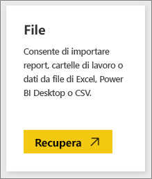
4. Selezionare il file nel computer e scegliere **Apri**. Se il file è stato salvato in OneDrive for Business, selezionare l'opzione corrispondente. Se il file è stato salvato in locale, selezionare **File locale**. 
   
   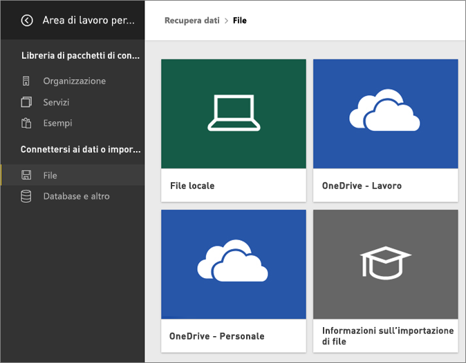
5. Per questa esercitazione verrà selezionato **Importa** per aggiungere il file di Excel come set di dati da usare successivamente per creare report e dashboard. Se si seleziona **Carica**, l'intera cartella di lavoro di Excel verrà caricata in Power BI, da cui potrà essere aperta e modificata in Excel Online.
   
   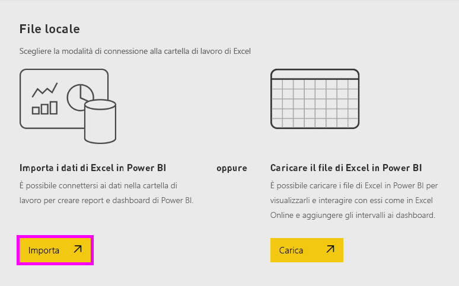
6. Quando il set di dati è pronto, selezionare **Visualizza set di dati** per aprirlo nell'editor di report. 

    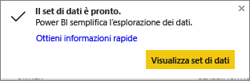

    Poiché non sono state ancora create visualizzazioni, l'area di disegno del report sarà vuota.

    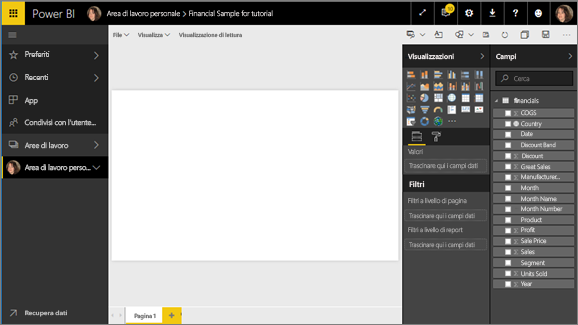

6. Osservare la barra dei menu superiore e notare l'opzione per la **Visualizzazione di lettura**. Dal momento che è disponibile l'opzione per la Visualizzazione di lettura, significa che la modalità corrente è la **Visualizzazione di modifica**. 

    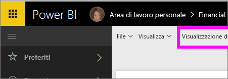

    Nella Visualizzazione di modifica è possibile creare e modificare i report, perché l'utente è il *proprietario* del report, ovvero un *autore*. Quando si condivide un report con i colleghi, questi ultimi potranno interagire con il report esclusivamente nella Visualizzazione di lettura, perché sono *consumer*. Altre informazioni sulla [Visualizzazione di lettura e sulla Visualizzazione di modifica](consumer/end-user-reading-view.md).
    
    Per acquisire familiarità con l'editor di report, è possibile [visualizzare la presentazione](service-the-report-editor-take-a-tour.md)
   > 
 

## Passaggio 2: Iniziare a esplorare il set di dati
Ora che si è connessi ai dati, è possibile iniziare l'esplorazione.  Se si trovano elementi interessanti, si può creare un dashboard per monitorarli e visualizzarne le variazioni nel tempo. Ecco come funziona.
    
1. Nell'editor di report verrà usato il riquadro **Campi** sul lato destro della pagina per creare una visualizzazione.  Selezionare la casella di controllo accanto a **Gross Sales** e **Date**.
   
   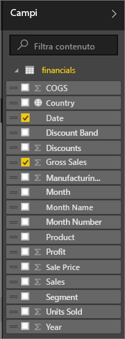

2. Power BI analizza i dati e crea una visualizzazione.  Se prima si è selezionato **Date** verrà visualizzata una tabella.  Se prima si è selezionato **Gross Sales** verrà visualizzato un grafico. Cambiare la modalità di visualizzazione dei dati. È possibile visualizzare i dati sotto forma di grafico a linee. Nel riquadro **Visualizzazioni** selezionare l'icona del grafico a linee, nota anche come modello.
   
   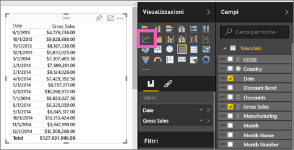

3. Il grafico sembra interessante, quindi lo si *aggiungerà* a un dashboard. Passare il puntatore del mouse sulla visualizzazione, quindi selezionare l'icona **Aggiungi**.  Quando si aggiunge una visualizzazione, verrà archiviata nel dashboard e aggiornata automaticamente in modo che sia possibile tenere traccia dell'ultimo valore in modo immediato.
   
   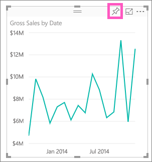

4. Dato che il report è nuovo, è necessario salvarlo prima di poter aggiungere una visualizzazione a un dashboard. Assegnare un nome al report, ad esempio *Sales over time* e selezionare **Salva e continua**. 
   
   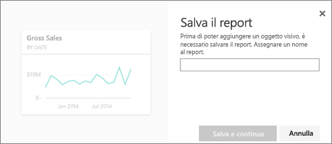
   
5. Aggiungere il grafico a linee al nuovo dashboard e assegnargli il nome "Financial sample for tutorial". 
   
   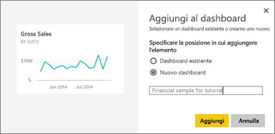
   
1. Selezionare **Aggiungi**.
   
    Un messaggio di operazione completata (nell'angolo superiore destro) informa l'utente che la visualizzazione è stata aggiunta, come riquadro, al dashboard.
   
    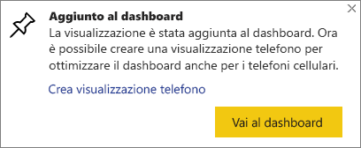

6. Selezionare **Vai al dashboard** per visualizzare il grafico a linee aggiunto, sotto forma di riquadro, al nuovo dashboard appena creato. Migliorare il dashboard aggiungendo altri riquadri di visualizzazione e [rinominando, ridimensionando, collegando e riposizionando i riquadri](service-dashboard-edit-tile.md).
   
   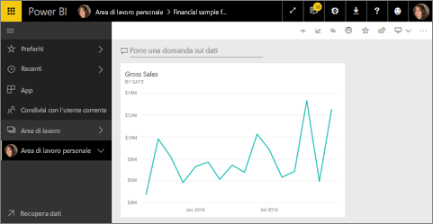
   
   Selezionare il nuovo riquadro nel dashboard per tornare al report in qualsiasi momento. Power BI reindirizzerà l'utente all'editor di report in Visualizzazione di lettura. Per tornare alla Visualizzazione di modifica, selezionare **Modifica report** nella barra dei menu superiore. Nella Visualizzazione di modifica è possibile continuare a esplorare e ad aggiungere riquadri. 

## Passaggio 3:  Continuare l'esplorazione con Domande e risposte (query in linguaggio naturale)
1. Per l'esplorazione rapida dei dati, provare a formulare una domanda nella finestra Domande e risposte. La casella delle domande di Domande e risposte si trova nella parte superiore del dashboard (**Porre una domanda sui dati**) e nella barra dei menu superiore del report (**Poni una domanda**). Ad esempio, provare a digitare "quale segmento ha generato il massimo profitto".
   
   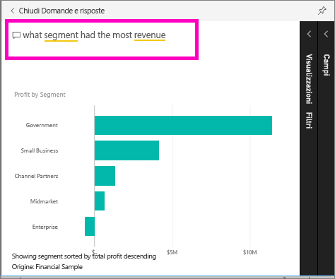

2. Domande e risposte cerca una risposta e la presenta sotto forma di visualizzazione. Selezionare l'icona Aggiungi  per mostrare anche questa visualizzazione nel dashboard.
3. Aggiungere la visualizzazione al dashboard "Financial Sample for tutorial".
   
    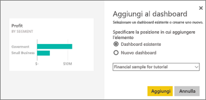

4. Tornare al dashboard dove verrà visualizzato il nuovo riquadro.

   

## Pulire le risorse
Dopo aver completo l'esercitazione, è possibile eliminare il set di dati, il report e il dashboard. 

1. Selezionare **Area di lavoro** dal riquadro di spostamento a sinistra.
2. Selezionare la scheda **Set di dati** e individuare il set di dati che è stato importato per questa esercitazione.  
3. Selezionare i puntini di sospensione (...) > **Elimina**.

    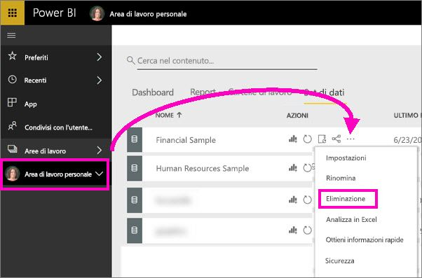

    L'eliminazione del set di dati eliminerà anche il report e il dashboard. 

## Passaggi successivi
Per approfondire ulteriormente l'argomento,  consultare gli articoli seguenti.

> [!div class="nextstepaction"]
> [Connettersi ai servizi online usati](service-connect-to-services.md)

