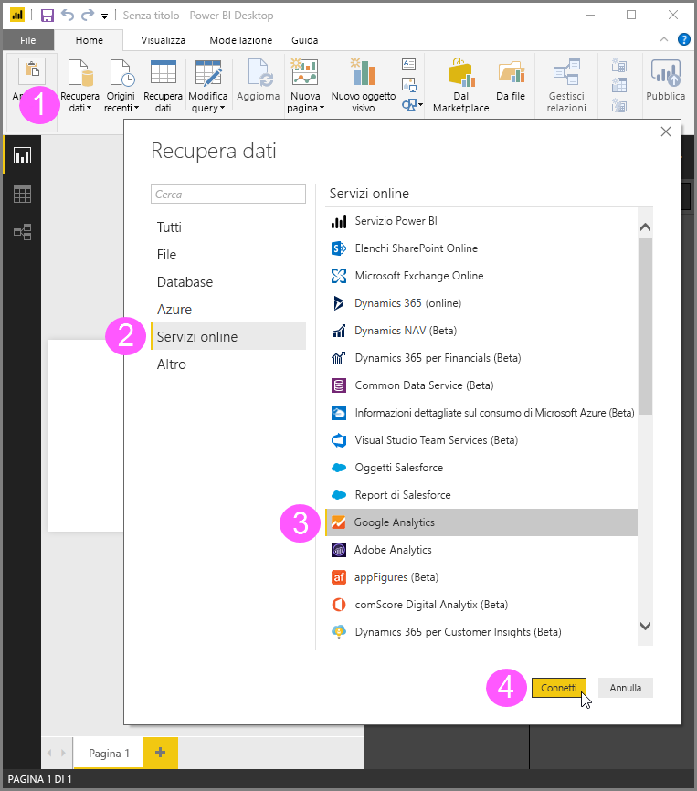
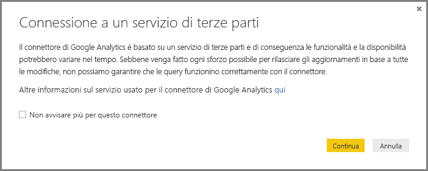
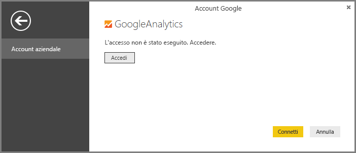
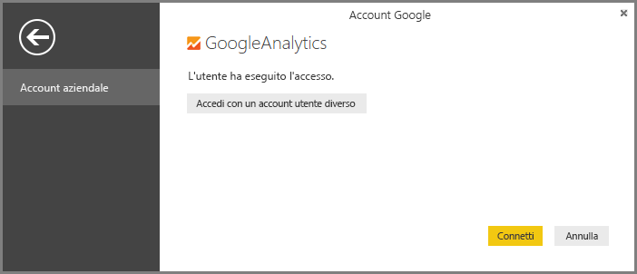
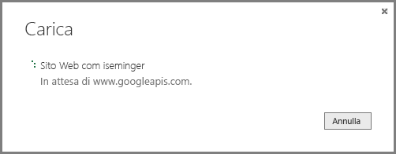

# Connettore di Google Analytics per Power BI Desktop
> [!NOTE]
> Il pacchetto di contenuto e il connettore di Google Analytics in Power BI Desktop si basano sull'API Core Reporting di Google Analytics. Le funzionalità e la disponibilità possono quindi variare nel tempo.
> 
> 

È possibile connettersi ai dati di Google Analytics usando il connettore di **Google Analytics**. Per eseguire la connessione, seguire questa procedura:

1. In **Power BI Desktop** selezionare **Recupera dati** nella scheda **Home** della barra multifunzione.
2. Nella finestra **Recupera dati** selezionare **Altro** nelle categorie nel riquadro a sinistra.
3. Selezionare **Google Analytics** dalle selezioni nel riquadro a destra.
4. Nella parte inferiore della finestra selezionare **Connetti**.  
   

Viene visualizzata una finestra di dialogo che spiega che il connettore è un servizio di terze parti, avvisa che le funzionalità e la disponibilità possono variare nel tempo e fornisce altri chiarimenti.  

Quando si seleziona **Continua**, viene chiesto di accedere a Google Analytics.  

Dopo avere immesso le credenziali, viene chiesto di fornire l'accesso offline a Power BI. In questo modo **Power BI Desktop** viene usato per accedere ai dati di Google Analytics.  

Dopo avere accettato, **Power BI Desktop** mostra che è stato eseguito l'accesso.  

Selezionare **Connetti**. I dati di Google Analytics vengono connessi a **Power BI Desktop** e caricati.  

## Modifiche all'API
Anche se abbiamo tentato di rilasciare aggiornamenti in funzione di tutte le modifiche apportate, è possibile che le modifiche all'API incidano sui risultati delle query generate. In alcuni casi, alcune query potrebbero non essere più supportate. A causa di questa dipendenza non è possibile garantire i risultati delle query quando si usa questo connettore.

Maggiori dettagli sulle modifiche all'API di Google Analytics sono disponibili nel relativo [changelog](https://developers.google.com/analytics/devguides/changelog).

