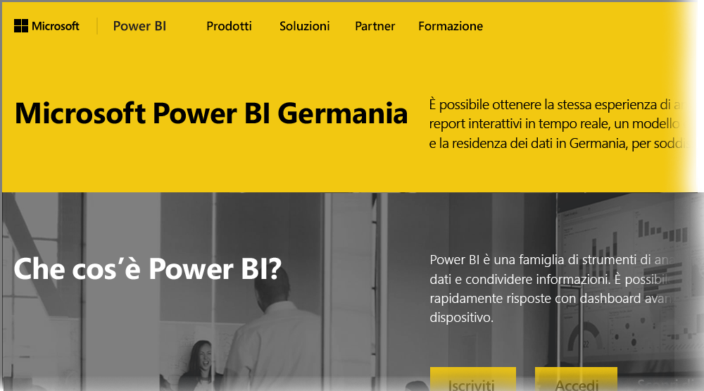

# Domande frequenti per Power BI per i clienti di Cloud Germania
È disponibile una versione del **servizio Power BI** per i clienti dell'Unione Europea/Associazione europea di libero scambio (UE/AELE), nota anche come Microsoft Cloud Deutschland (MCD). La versione del **servizio Power BI** descritta in questo articolo è progettata specificamente per i clienti UE/AELE ed è separata e diversa dalla versione commerciale del **servizio Power BI** o dei servizi Power BI forniti ai clienti del governo.

Le seguenti domande e risposte forniscono informazioni importanti per il servizio Power BI Pro in Microsoft Cloud Deutschland (MCD), ovvero il cloud del servizio Power BI specificamente progettato per i clienti UE/AELE.

1. **Che cos'è il servizio Power BI per Cloud Germania?**
   
   Il servizio Power BI per i clienti UE/AELE, noto anche come Microsoft Cloud Deutschland (MCD), è un cloud conforme alle norme UE/AELE con il servizio Power BI fornito dai data center tedeschi. Tutti i dati dei clienti nel servizio Power BI per il cloud UE/AELE vengono archiviati inattivi in Germania e T-Systems funge da amministratore fiduciario indipendente dei dati in Germania e con accesso fisico e logico ai dati disciplinato dalle leggi tedesche. Il servizio Power BI per il cloud UE/AELE richiede un account distinto e separato rispetto alla versione commerciale del servizio Power BI. Altre informazioni su Microsoft Cloud Deutschland sono disponibili [qui](https://www.microsoft.com/trustcenter/cloudservices/nationalcloud).
2. **Dove è possibile trovare i prezzi e le informazioni di iscrizione per Power BI per Cloud Germania?**
   
   È possibile trovare molte informazioni nella [home page di Power BI per Cloud Germania](https://powerbi.microsoft.com/power-bi-germany/), incluse le informazioni sui prezzi. In tale pagina è anche possibile trovare un collegamento per iscriversi alla versione di valutazione di 30 giorni del **servizio Power BI Pro** con 25 licenze utente. Come parte dell'iscrizione alla versione di valutazione, è possibile acquistare o aggiungere altre licenze in base alle esigenze. Sono disponibili anche prezzi per Enterprise Agreement (EA), enti governativi e non profit. Per altre informazioni, contattare il rappresentante clienti Microsoft.
3. **Ho un tenant Cloud Germania come parte degli abbonamenti Azure Germania e/o Office 365 Germania. È possibile usare il tenant esistente per iscriversi a Power BI Germania?**
   
   Sì. Come parte del processo di iscrizione, sarà possibile scegliere di eseguire l'accesso con un account di amministratore tenant Cloud Germania esistente e aggiungere le licenze del servizio Power BI Pro al tenant esistente nel Cloud Germania. Si noti che i tenant Cloud Germania e gli account utente sono diversi dal servizio Power BI per Cloud Germania.
4. **Esiste un servizio gratuito nel servizio Power BI per Cloud Germania?**
   
   No. Non sono disponibili versioni gratuite della licenza nel servizio Power BI per Cloud Germania. Tuttavia, si consiglia di effettuare l'iscrizione all'[offerta gratuita di Power BI nel cloud pubblico](https://powerbi.microsoft.com/get-started/), se questa soddisfa le esigenze aziendali.
5. **È possibile usare Power BI Desktop, Power BI per dispositivi mobili, Gateway dati locale e Publisher per Excel con il servizio Power BI per Cloud Germania?**
   
   Sì. I prodotti client Power BI sono stati aggiornati in modo da funzionare senza problemi con il servizio Power BI per Cloud Germania. Effettuare l'accesso con il servizio Power BI per l'account Cloud Germania per iniziare a usare gli stessi prodotti client con il servizio Power BI per Cloud Germania. È possibile scaricare la versione più recente dei prodotti client da questi percorsi:
   
   * [Power BI Desktop](https://powerbi.microsoft.com/desktop/)
   * [Power BI per dispositivi mobili](https://powerbi.microsoft.com/mobile/)
   * [Gateway dati locale](https://powerbi.microsoft.com/gateway/)
   * [Power BI Publisher per Excel](https://powerbi.microsoft.com/excel-dashboard-publisher/)
6. **Esistono limitazioni di funzionalità del servizio Power BI per Cloud Germania?**
   
   Le seguenti funzionalità di servizio non sono attualmente disponibili nel servizio Power BI per Cloud Germania:
   
   * Pubblica sul Web
   * Mappe di ArcGIS di Esri
   * Power BI Embedded (licenze ISV a consumo separate, verranno offerte da [Microsoft Azure Germania](https://azure.microsoft.com/overview/clouds/germany/) in futuro)
7. **Dove è possibile trovare le informazioni specifiche sulla configurazione del servizio Power BI per Cloud Germania per l'integrazione e l'uso in applicazioni personali?**
   
   Gli [esempi di incorporamento SaaS per gli sviluppatori](https://github.com/Microsoft/PowerBI-Developer-Samples) sono stati aggiornati con l'aggiunta di informazioni specifiche sulla configurazione di Cloud Germania e di altri cloud di Power BI. Per gli endpoint di configurazione specifici, esaminare gli esempi contenuti nella cartella **Configurazioni cloud**. La tabella seguente elenca i vari endpoint di configurazione per il servizio Power BI per Cloud Germania (e il Cloud pubblico per il riferimento incrociato).

| **Nome e/o utilizzo dell'endpoint** | **URL del servizio Power BI per Cloud Germania** | **URL equivalente nel Cloud pubblico (per il riferimento incrociato)** |
| --- | --- | --- |
| Home Page, iscrizione e accesso |[https://powerbi.microsoft.com/power-bi-germany/](https://powerbi.microsoft.com/power-bi-germany/) |[https://powerbi.microsoft.com/](https://powerbi.microsoft.com/) |
| Accesso diretto al servizio Power BI |[https://app.powerbi.de/?noSignUpCheck=1](https://app.powerbi.de/?noSignUpCheck=1) |[https://app.powerbi.com/?noSignUpCheck=1](https://app.powerbi.com/?noSignUpCheck=1) |
| API del servizio |[https://api.powerbi.de/](https://api.powerbi.de/) |[https://api.powerbi.com/](https://api.powerbi.com/) |
| Portale Office per la gestione delle licenze utente, l'integrità del servizio e le richieste di supporto da parte degli amministratori |[https://portal.office.de/](https://portal.office.de/) |[https://portal.office.com/](https://portal.office.com/) |
| URI dell'autorità AAD |[https://login.microsoftonline.de/common/oauth2/authorize/](https://login.microsoftonline.de/common/oauth2/authorize/) |[https://login.microsoftonline.com/common/oauth2/authorize/](https://login.microsoftonline.com/common/oauth2/authorize/) |
| URI della risorsa del servizio Power BI |[https://analysis.cloudapi.de/powerbi/api](https://analysis.cloudapi.de/powerbi/api) |[https://analysis.windows.net/powerbi/api](https://analysis.windows.net/powerbi/api) |
| Libreria oggetti visivi personalizzati |[https://app.powerbi.de/visuals/](https://app.powerbi.de/visuals/) |[https://app.powerbi.com/visuals/](https://app.powerbi.com/visuals/) |
| Registra un'applicazione per Power BI (per Embedded) |[https://app.powerbi.de/apps](https://app.powerbi.de/apps) |[https://app.powerbi.com/apps](https://app.powerbi.com/apps) |
| Portale di Azure (per Embedded) |[https://portal.microsoftazure.de/](https://portal.microsoftazure.de/) |[https://portal.azure.com/](https://portal.azure.com/) |
| Community |[https://community.powerbi.com/](https://community.powerbi.com/) |[https://community.powerbi.com/](https://community.powerbi.com/) |

### Passaggi successivi
Power BI offre infinite possibilità. Per altre informazioni e per la formazione, tra cui un articolo che illustra come effettuare l'iscrizione al servizio, vedere le risorse seguenti:

* [Apprendimento guidato per Power BI](guided-learning/gettingstarted.yml?tutorial-step=1)
* [Introduzione al servizio Power BI](service-get-started.md)
* [Introduzione a Power BI Desktop](desktop-getting-started.md)

