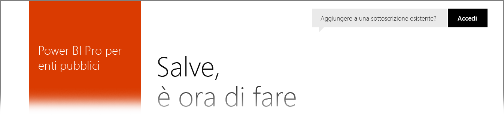

# Power BI per i clienti del Governo degli Stati Uniti
Il **servizio Power BI** ha una versione disponibile per i clienti del Governo degli Stati Uniti come parte delle sottoscrizioni al **piano Office 365 US Government Community**. La versione del **servizio Power BI** descritta in questo articolo è progettata specificamente per i clienti del Governo degli Stati Uniti ed è separato e diverso dalla versione commerciale del **servizio Power BI**.

Le sezioni seguenti descrivono le *funzionalità* disponibili per la versione del **servizio Power BI** per il Governo degli Stati Uniti, illustrano alcune delle *limitazioni*, contengono le **domande frequenti** e le risposte (compresa la modalità di iscrizione) e forniscono i collegamenti ad altre informazioni.

## Funzionalità di Power BI per il Governo degli Stati Uniti
È importante notare che **Power BI per il Governo degli Stati Uniti** è disponibile solo come **licenza Pro** e non come licenza gratuita. Alcune funzionalità del servizio Power BI sono disponibili nella versione **Power BI per il Governo degli Stati Uniti**.

Le funzionalità seguenti sono disponibili in **Power BI per il Governo degli Stati Uniti**, dal momento che sono previste nella licenza **Pro**:

* Creare e visualizzare dashboard e report
* [Limiti per la capacità dei dati](service-admin-manage-your-data-storage-in-power-bi.md)
* [Aggiornamento pianificato dei dati](refresh-data.md)
* Dashboard del team aggiornabili
* Gruppi di Active Directory per la condivisione e la gestione del controllo di accesso
* [Importare dati](service-get-data.md) e report da file di Excel, CSV e di Power BI Desktop
* Gateway di gestione dati
* Tutti i dati sono crittografati in Azure SQL e nell'archiviazione BLOB per Power BI
* Connettersi ai servizi con i [pacchetti di contenuto](service-connect-to-services.md)

## Connettività tra il servizio cloud di Azure globale e il servizio per enti pubblici 

Azure è distribuito tra più cloud. Per impostazione predefinita, ai tenant è consentito aprire regole del firewall per un'istanza specifica del cloud, ma la rete tra cloud è diversa e richiede l'apertura di regole del firewall specifiche per la comunicazione tra servizi. I clienti di Power BI che devono accedere a istanze di SQL esistenti nel cloud pubblico devono aprire regole del firewall specifiche in SQL nello spazio di indirizzi IP del cloud Azure per enti pubblici per i data center seguenti:

* USGov Iowa
* USGov Virginia
* USGov Texas
* USGov Arizona

Nel cloud pubblico gli spazi IP sono disponibili. Per il cloud per enti pubblici, fare riferimento alla [documentazione del servizio Azure per enti pubblici](https://www.microsoft.com/download/details.aspx?id=57063) che è possibile scaricare per le informazioni più recenti.

## Limitazioni di Power BI per il Governo degli Stati Uniti
Alcune delle funzionalità disponibili nella versione commerciale del **servizio Power BI** *non* sono disponibili nel **servizio Power BI** per i clienti del Governo degli Stati Uniti. Il team di Power BI è attivamente impegnato a rendere disponibili queste funzionalità ai clienti del Governo degli Stati Uniti e ad aggiornare questo articolo di conseguenza.

* **Incorpora in SharePoint Online** - Non è possibile incorporare il contenuto in SharePoint Online usando la web part di Power BI. Tuttavia, l'incorporamento sicuro non funziona usando la web part [*Incorpora*](https://docs.microsoft.com/power-bi/service-embed-secure). È necessario aggiungere *app.powerbigov.us* all'elenco delle eccezioni, che è possibile ottenere seguendo le istruzioni riportate nell'articolo [Allow or restrict the ability to embed content on SharePoint pages](https://support.office.com/article/allow-or-restrict-the-ability-to-embed-content-on-sharepoint-pages-e7baf83f-09d0-4bd1-9058-4aa483ee137b) (Consentire o limitare la possibilità di incorporare contenuto nelle pagine di SharePoint).
* **Power BI per il Governo degli Stati Uniti** è disponibile solo come licenza **Pro**. Tutti i riferimenti alle licenze gratuite di Power BI in un portale di amministrazione (o come utenti) vengono eseguiti in un cloud del servizio Power BI a pagamento.
* **Controllo**: a partire da giugno 2018 il controllo non è disponibile tramite il portale del Centro sicurezza e conformità di Office 365.
* **Contenuto di Power BI in Cortana** - I risultati di Power BI non verranno visualizzati nei risultati della ricerca di Cortana, inclusi i risultati per il contenuto di Power BI (dashboard, report e app) e i risultati che mostrano le pagine dei report ottimizzate per Cortana per parole chiave specifiche.
* **Condivisione con utenti esterni**: la condivisione è consentita all'interno di un tenant di Power BI e da giugno 2018 è consentita anche con utenti al di fuori del tenant di Power BI. Vedere [Distribuire il contenuto di Power BI agli utenti guest esterni usando Azure AD B2B](service-admin-azure-ad-b2b.md).
* **Metriche di utilizzo per dashboard e report**: le metriche di utilizzo non sono disponibili per i report e i dashboard. Per ottenere informazioni sull'uso del contenuto nell'organizzazione, i clienti possono usare i dati dei log di controllo.
* **Flussi di dati**: i flussi di dati non sono disponibili.

Se agli account sono assegnate licenze gratuite di **Power BI**, questi vengono eseguiti in una versione a pagamento del servizio **Power BI** e non sono incluse nell'offerta di **Power BI per il Governo degli Stati Uniti**. Con gli account delle licenze gratuite è possibile riscontrare i problemi seguenti:

* Non è possibile eseguire l'autenticazione di gateway, dispositivo mobile e desktop
* Non è possibile accedere alle origini dati commerciali di Azure
* I file PBIX devono essere caricati manualmente dal commerciale
* Le app Power BI per dispositivi mobili non sono disponibili

Per risolvere i problemi, contattare il proprio rappresentante.

## Domande frequenti per la versione del servizio Power BI per il Governo degli Stati Uniti
Le seguenti domande (e risposte) hanno l'obiettivo di aiutare a ottenere rapidamente le informazioni necessarie sul servizio.

**Domanda**: come si esegue la migrazione dei dati commerciali di **Power BI** al **servizio Power BI** per il Governo degli Stati Uniti?

**Risposta**: l'amministratore deve creare una nuova istanza di **Power BI** in una sottoscrizione separata, specifica del Governo degli Stati Uniti. Sarà quindi possibile replicare i dati commerciali nel **servizio Power BI** per il Governo degli Stati Uniti, rimuovere la licenza commerciale e associare il dominio esistente al nuovo servizio specifico del Governo degli Stati Uniti.

**Domanda**: perché non è possibile connettersi a un pacchetto di contenuto specifico?

**Risposta**: è necessario verificare che la sottoscrizione sia abilitata prima di connettersi a tale pacchetto di contenuto.

**Domanda**: come si inizia per ottenere **Power BI** per un'organizzazione del Per iniziare

**Risposta**: la registrazione (spesso chiamata *onboarding*) potrebbe differire in base alla licenza e alla sottoscrizione esistenti. Per altre informazioni, vedere l'articolo [Iscrizione a Power BI per il Governo degli Stati Uniti](service-govus-signup.md).

**Domanda**: l'URL per la connessione a **Power BI** per il Governo degli Stati Uniti è diverso dall'URL della versione commerciale di **Power BI**? Esiste un URL diverso per i clienti di GCC High?

**Risposta**: sì, gli URL sono diversi. La tabella seguente illustra ciascun URL:

| URL versione commerciale | URL versione Governo degli Stati Uniti | URL del Governo degli Stati Uniti per GCC High |
| --- | --- | --- |
| https://app.powerbi.com/ |[https://app.powerbigov.us](https://app.powerbigov.us) | [https://app.high.powerbigov.us](https://app.high.powerbigov.us) |

**Domanda**: il provisioning del mio account viene eseguito in più di un cloud sovrano. Quando uso **Power BI Desktop**, come posso selezionare il cloud a cui connettermi?

**Risposta**: a partire dalla versione di **Power BI Desktop** di luglio 2018, è possibile scegliere il cloud da usare al momento dell'accesso a **Power BI Desktop**.

## Passaggi successivi
Power BI offre infinite possibilità. Per altre informazioni e per la formazione, tra cui un articolo che illustra come effettuare l'iscrizione al servizio, vedere le risorse seguenti:

* [Iscrizione a Power BI per il Governo degli Stati Uniti](service-govus-signup.md)
* <a href="https://channel9.msdn.com/Blogs/Azure/Cognitive-Services-HDInsight-and-Power-BI-on-Azure-Government">Demo di Power BI per il Governo degli Stati Uniti</a>
* [Apprendimento guidato per Power BI](guided-learning/index.md)
* [Introduzione al servizio Power BI](service-get-started.md)
* [Che cos'è Power BI Desktop?](desktop-what-is-desktop.md)

