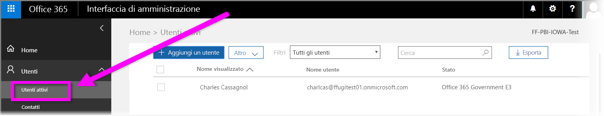

# Registrare l'organizzazione governativa statunitense al servizio Power BI
Il **servizio Power BI** ha una versione disponibile per i clienti del Governo degli Stati Uniti come parte delle sottoscrizioni al **piano Office 365 US Government Community**. La versione del **servizio Power BI** descritta in questo articolo è progettata specificamente per i clienti del Governo degli Stati Uniti ed è separato e diverso dalla versione a pagamento del **servizio Power BI**.

Per altre informazioni sul **servizio Power BI** per il Governo degli Stati Uniti, incluse le funzionalità e limitazioni specifiche, consultare [Power BI per i clienti del Governo degli Stati Uniti - Panoramica](service-govus-overview.md).

> [!NOTE]
> Questo articolo è rivolto agli amministratori che hanno l'autorità di iscrivere la propria organizzazione governativa statunitense a Power BI. Se si è un utente finale, rivolgersi all'amministratore per chiedere come ottenere una sottoscrizione a Power BI per il Governo degli Stati Uniti.
> 
> 

## Selezionare il processo di iscrizione adatto alla propria organizzazione governativa statunitense
L'organizzazione governativa statunitense potrebbe non essere ancora registrata a **Office Government Cloud** o potrebbe essere già presente una sottoscrizione. Le sezioni seguenti illustrano in dettaglio i passaggi per l'iscrizione basati sulla posizione corrente con Office Government Cloud e Power BI e differiscono in base alla sottoscrizione esistente.

Dopo aver effettuato l'iscrizione a Power BI per il Governo degli Stati Uniti, alcune funzionalità potrebbero non funzionare finché le vendite o il rappresentante del supporto non avrà completato il processo di onboarding. Per scoprire queste funzionalità, vedere [Power BI per i clienti del Governo degli Stati Uniti - Panoramica](service-govus-overview.md). Per completare il processo di onboarding per abilitare queste funzionalità, contattare il rappresentante di vendita o del supporto.

### Organizzazioni governative statunitensi che sono nuovi clienti di Office Cloud
Se l'organizzazione è un nuovo cliente di **Office Government Cloud**, seguire questi passaggi:

> [!NOTE]
> La procedura deve essere effettuata dall'amministratore del portale.
>

1. Passare a [https://products.office.com/en-us/government/office-365-web-services-for-government](https://products.office.com/en-us/government/office-365-web-services-for-government).

>[!NOTE]
>Se non si vuole effettuare l'iscrizione a Office Government Cloud al momento, contattare il rappresentante di vendita.
>

2. Selezionare Office G3 e completare il modulo per una versione di valutazione di Office
3. Quando si è clienti di Office Cloud continuare con la procedura riportata di seguito per "Clienti di Office Government Cloud esistenti"

### Clienti di Office Government Cloud esistenti
Se l'organizzazione è un cliente esistente di **Office Government Cloud**, ma non si ha una sottoscrizione a **Power BI** (gratuita o di altro tipo), seguire questi passaggi:

> [!NOTE]
> La procedura deve essere effettuata dall'amministratore del portale.
> 
> 

1. Accedere all'account Office Government Cloud esistente e passare al portale di amministrazione
2. Selezionare **Fatturazione**.
3. Selezionare **Acquista servizio**.
4. Selezionare l'opzione Power BI Pro Government e scegliere tra **Prova** e **Acquista ora**
5. Completare l'ordine
6. Assegnare gli utenti all'account.
   
   
7. Accedere al **servizio Power BI** per i clienti US Government all'indirizzo [https://app.powerbigov.us](https://app.powerbigov.us)

## Altre informazioni sull'iscrizione
Di seguito sono riportate informazioni aggiuntive per l'iscrizione a **Power BI per il Governo degli Stati Uniti** in diversi casi di migrazione delle licenze.

### Onboarding diretto del cliente dalla versione di valutazione di Power BI alla versione Pro
* Fare clic su Fatturazione > Acquista servizio > PowerBI Pro Gov e selezionare Acquista, non Versione di valutazione
* Compilare le informazioni necessarie e ottenere le licenze
* Rimuovere la versione di valutazione di Power BI Pro o rimuovere le licenze precedenti e assegnare le nuove agli utenti
* Accedere a [https://app.powerbigov.us](https://app.powerbigov.us)

### Onboarding del cliente dalla versione di valutazione di Power BI alla versione Pro del rivenditore
Passare a **Fatturazione > Abbonamenti** e fare clic sulla sottoscrizione **Power BI Pro per enti pubblici**. Si vedrà:

* Disponibile
* Assegnato
* Collegamenti Assegna a utenti
* Se la versione di valutazione è ancora assegnata:
  * Fare clic su **Assegnato** sotto la sottoscrizione di valutazione e rimuovere gli utenti che si vogliono aggiungere alla versione a pagamento.
  * Passare alla sottoscrizione a pagamento e assegnare tali utenti.

### Istruzioni per l'aggiunta all'elenco elementi consentiti
Il team di progettazione di Power BI usa un processo di *aggiunta all'elenco elementi consentiti* per spostare i clienti dall'ambiente di cloud a pagamento al più sicuro ambiente di cloud governativo. In questo modo le funzionalità disponibili nel cloud del Governo degli Stati Uniti verranno eseguite nel modo previsto. Tutti i clienti US Government nuovi o esistenti che acquistano servizi **Power BI** US Government per la prima volta *devono* avviare il processo di aggiunta all'elenco elementi consentiti. Il processo deve essere eseguito prima dell'installazione o della migrazione ai servizi **Power BI** US Government. 

Per aggiungere il tenant nell'*elenco degli elementi consentiti* per il cloud US Government, contattare il team degli account Microsoft per assistenza con l'inserimento nell'elenco degli elementi consentiti. Si noti che questa richiesta può essere effettuata solo dagli amministratori. Il processo di *aggiunta all'elenco elementi consentiti* richiede circa tre settimane, durante le quali il team tecnico apporta le modifiche necessarie per consentire il corretto funzionamento del tenant nel cloud del Governo degli Stati Uniti.

I clienti che eseguono la migrazione da licenze **gratuite** di Power BI a quella di **Power BI per il Governo degli Stati Uniti** (e per definizione la migrazione alle funzionalità associate della licenza **Pro** descritte in precedenza in questo articolo) riscontreranno i problemi descritti nella sezione seguente di questo articolo finché il tenant non verrà *aggiunto all'elenco elementi consentiti* dal team tecnico di Power BI.

### Uso di combinazioni di licenze gratuite e Pro nei tenant per il Governo degli Stati Uniti
Se nel tenant sono presenti sia licenze gratuite che Pro per il Governo degli Stati Uniti, entrambe le licenze rimarranno disponibili, ma ne funzionerà un solo tipo. Se il processo di *aggiunta all'elenco elementi consentiti* del tenant viene completato senza errori, si verifica quanto segue:

* Gli utenti di licenze gratuite non potranno più accedere a Power BI usando **Power BI Desktop** e alcune funzionalità descritte nella sezione seguente non saranno disponibili.
* Tutti i client assegnati alle licenze Pro per il Governo degli Stati Uniti funzioneranno nel modo previsto, inclusi i gateway, Power BI Desktop e le app per dispositivi mobili.

Quando si usa una combinazione di licenze gratuite e Pro in un tenant del Governo degli Stati Uniti e si esegue il processo di *aggiunta all'elenco elementi consentiti*, si può verificare quanto segue:

**Prima dell'*aggiunta all'elenco elementi consentiti***:

* Utenti con licenze gratuite in esecuzione nel cloud a pagamento
* Le licenze Pro per il Governo degli Stati Uniti verranno visualizzate nel portale e l'amministratore potrà assegnare tali licenze agli utenti. Gli utenti di licenze Pro per il Governo degli Stati Uniti non perderanno i dati delle licenze gratuite dopo l'assegnazione di una licenza Pro per il Governo degli Stati Uniti. Gli utenti assegnati potranno accedere alle funzionalità di Power BI Pro per i clienti del Governo degli Stati Uniti, ma le funzionalità incluse nell'elenco seguente non saranno disponibili finché non viene completato il processo di *aggiunta del tenant all'elenco elementi consentiti*:
  
  * Non è possibile eseguire l'autenticazione di gateway, dispositivo mobile e Power BI Desktop
  * Non è possibile accedere alle origini dati a pagamento di Azure
  * I file PBIX devono essere caricati manualmente dal servizio Power BI a pagamento
  * Le app Power BI per dispositivi mobili non sono disponibili

**Dopo l'*aggiunta all'elenco elementi consentiti***:

* Gli utenti con licenze gratuite potranno continuare a usare il servizio Power BI a pagamento, ma l'autenticazione non verrà più eseguita come previsto.
* Gli utenti con licenze Pro in esecuzione nel cloud del Governo degli Stati Uniti possono usare il servizio **Power BI per i clienti del Governo degli Stati Uniti** come previsto.

Per identificare gli utenti del tenant che usano la licenza gratuita di Power BI, gli amministratori possono eseguire il report sulle licenze, dopo il quale gli utenti delle licenze gratuite verranno indicato come **Power BI Standard**.

## Passaggi successivi
Power BI offre infinite possibilità. Per altre informazioni e per la formazione, tra cui un articolo che illustra come effettuare l'iscrizione al servizio, vedere le risorse seguenti:

* [Panoramica di Power BI per il Governo degli Stati Uniti](service-govus-overview.md)
* [Apprendimento guidato per Power BI](guided-learning/gettingstarted.yml?tutorial-step=1)
* [Introduzione al servizio Power BI](service-get-started.md)
* [Introduzione a Power BI Desktop](desktop-getting-started.md)

