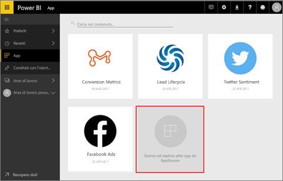
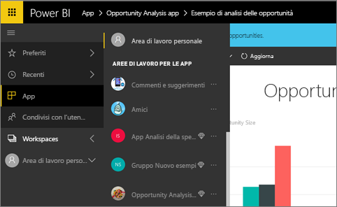
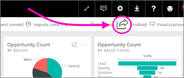
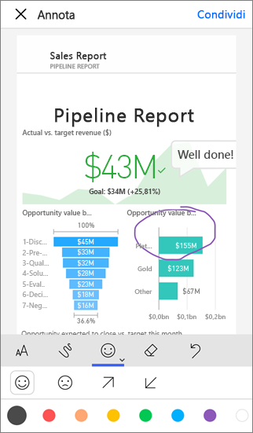

# Come funziona la collaborazione e la condivisione in Power BI?

Vengono creati dashboard e report. È possibile collaborare su di essi con i colleghi. È anche possibile consentire ad altri utenti di accedervi. Ma qual è il modo migliore di distribuire report e dashboard?

In questo articolo verranno confrontate le opzioni disponibili per la collaborazione e la condivisione in Power BI: 

* Collaborazione con i colleghi allo scopo di creare report e dashboard significativi nelle *aree di lavoro per le app*.
* Creazione di *app* contenenti i dashboard e i report completati e pubblicazione delle app in un gruppo più ampio o nell'intera organizzazione.
* Condivisione di dashboard o report con alcune persone dal servizio o dalle app Power BI per dispositivi mobili.
* Pubblicazione sul Web, per consentire a tutti di visualizzarli e interagirvi.
* Stampa. 

Indipendentemente dall'opzione scelta, per condividere un dashboard è necessaria una licenza di [Power BI Pro](service-free-vs-pro.md). In caso contrario, il contenuto deve avere una [capacità Premium](service-premium.md). I requisiti relativi alla licenza per i colleghi che visualizzano i dashboard dipendono dall'opzione scelta. Le sezioni seguenti illustrano i dettagli. 

*App nel servizio Power BI*

## Collaborare con i colleghi alla creazione di un'app
Si supponga di voler collaborare con i colleghi per pubblicare le informazioni dettagliate di Power BI nell'organizzazione. Il modo migliore per eseguire questa operazione consiste nel creare un'*app*. Un'app è una raccolta di dashboard e report compilati per offrire metriche chiave per l'organizzazione. 

Per creare un'app, è necessaria un'*area di lavoro per le app*, i cui membri sono i propri colleghi. Si pensi a un'area di lavoro per le app come a un'area di gestione temporanea in cui è possibile collaborare insieme ai colleghi alla creazione di dashboard e report di Power BI. Tutti i membri dell'area di lavoro per le app possono creare report in Power BI Desktop e pubblicarli nell'area di lavoro e necessitano di licenze Power BI Pro.

**Se si vuole solo condividere un dashboard completato con i colleghi, non aggiungerli all'area di lavoro per le app.** [Creare il dashboard in un'area di lavoro per le app](service-create-distribute-apps.md) e pubblicare l'app semplicemente. 

## Pubblicare l'app a un vasto pubblico
Si supponga di voler distribuire il dashboard a un pubblico più vasto. Dopo aver collaborato con i colleghi alla creazione di un'*area di lavoro per le app* e aver creato e definito in dettaglio dashboard, report e set di dati nell'area di lavoro, è ora possibile selezionare i dashboard e i report desiderati e pubblicarli come app, ai membri di un gruppo di sicurezza o di una lista di distribuzione oppure all'intera organizzazione. 

Le app possono essere facilmente individuate e installate nel servizio Power BI ([https://powerbi.com](https://powerbi.com)). È possibile inviare agli utenti aziendali un collegamento diretto all'app o dire loro di cercarla in AppSource. Se l'amministratore di Power BI concede le autorizzazioni, è possibile installare un'app automaticamente nell'account Power BI dei colleghi. Altre informazioni sulla [pubblicazione delle app](service-create-distribute-apps.md#publish-your-app). 

Dopo l'installazione di un'app è possibile visualizzarla nel browser o su un dispositivo mobile.

Per visualizzare l'app gli utenti devono disporre di una licenza Power BI Pro; in alternativa, l'app deve essere archiviata in una capacità di Power BI Premium. Per informazioni dettagliate, leggere [What is Power BI Premium?](service-premium.md) (Che cos'è Power BI Premium?).

## Condividere dashboard e report
Si supponga di aver completato un dashboard e un report nell'area di lavoro personale o in un'area di lavoro per le app e che si voglia consentirne l'accesso ad altre persone. Uno dei modi per farlo consiste nel *condividerlo*. 

Per condividere il contenuto è necessario che sia l'utente che le persone con cui questi lo condivide abbiano una licenza Power BI Pro. In caso contrario, il contenuto deve avere una [capacità Premium](service-premium.md). Quando si condivide un dashboard o un report, gli altri possono visualizzarlo e interagire con esso, ma non possono modificarlo. Essi vedranno gli stessi dati che l'utente vede nei dashboard e nei report, a meno che non sia stata applicata la sicurezza a livello di riga al set di dati sottostante. I colleghi con cui si condivide il dashboard possono condividerlo con i loro colleghi, se vengono autorizzati a tale scopo. 

È possibile condividere anche con utenti esterni all'organizzazione, che possono anche visualizzare il dashboard e interagire con esso, ma non condividerlo. 

Altre informazioni sulla [condivisione di dashboard e report](service-share-dashboards.md) dal servizio Power BI. È anche possibile aggiungere un filtro a un collegamento e [condividere una vista filtrata del report](service-share-reports.md).

## Annotare e condividere dalle app Power BI per dispositivi mobili
Nelle app Power BI per dispositivi mobili per i dispositivi iOS e Android, è possibile aggiungere annotazioni a un riquadro, un report o un oggetto visivo e quindi condividerlo con chiunque via posta elettronica. 

Si condivide uno snapshot del riquadro, del report o dell'oggetto visivo e i destinatari lo vedono esattamente com'era quando è stato inviato il messaggio di posta elettronica. Il messaggio di posta elettronica contiene anche un collegamento al dashboard o al report. Se i destinatari hanno una licenza Power BI Pro o il contenuto ha una [capacità Premium](service-premium.md) e si è già condiviso l'oggetto, allora potranno aprirlo. È possibile inviare snapshot dei riquadri a chiunque, non solo ai colleghi nello stesso dominio di posta elettronica.

Altre informazioni su come [aggiungere annotazioni e condividere riquadri, report e oggetti visivi](mobile-annotate-and-share-a-tile-from-the-mobile-apps.md) dalle app per dispositivi mobili iOS e Android.

È anche possibile [condividere uno snapshot di un riquadro](mobile-share-tile-windows-10-phone-app.md) dall'app Power BI per i dispositivi Windows 10.

## Pubblicare sul Web
È possibile pubblicare report di Power BI ovunque in Internet incorporando visualizzazioni interattive in post di blog, siti Web, social media e altre comunicazioni online, su qualsiasi dispositivo. Chiunque su Internet può visualizzare i report e non si ha alcun controllo su chi può visualizzare ciò che è stato pubblicato. Non è necessaria una licenza di Power BI. La funzionalità di pubblicazione sul Web è disponibile solo per i report che è possibile modificare. Non è possibile pubblicare report sul Web se sono stati condivisi da altri utenti o se sono inclusi in un'app. Altre informazioni sulla [pubblicazione sul Web](service-publish-to-web.md).

## Stampare o salvare in formato PDF o altri file statici
È possibile stampare o salvare in formato PDF o un altro formato di file statici un dashboard intero, un riquadro del dashboard, una pagina del report o una visualizzazione dal servizio Power BI. I report possono essere stampati solo una pagina alla volta, ovvero non è possibile stampare l'intero report in una sola volta. Altre informazioni su [stampa o salvataggio come file statico](service-print.md).

## Passaggi successivi
* Per inviare suggerimenti, passare al [sito della community di Power BI](https://community.powerbi.com/).
* [Condividere i dashboard con i colleghi e con altri utenti](service-share-dashboards.md)
* [Creare e pubblicare un'app in Power BI](service-create-distribute-apps.md)
* Altre domande? [Provare la community di Power BI](http://community.powerbi.com/).

