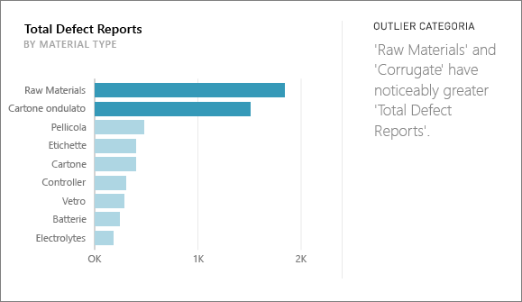
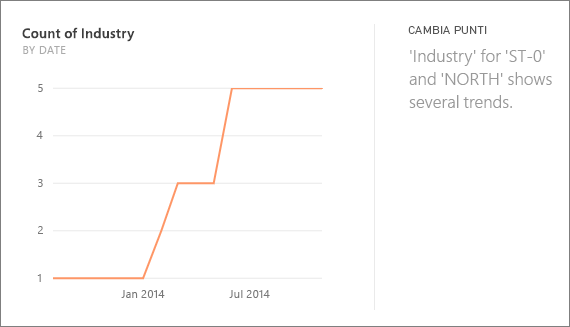
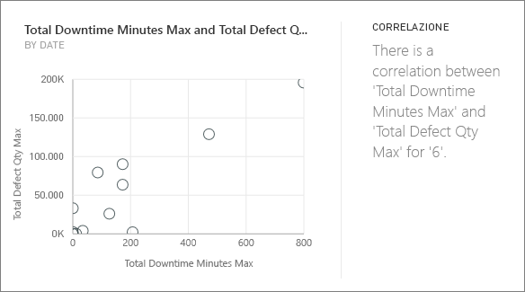
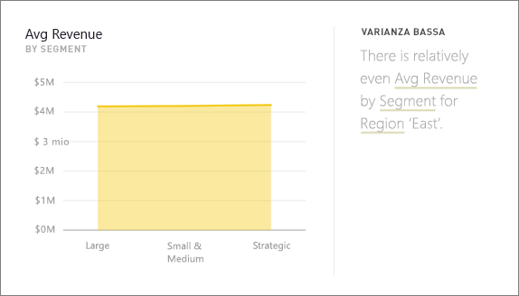
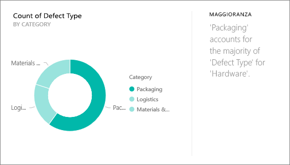
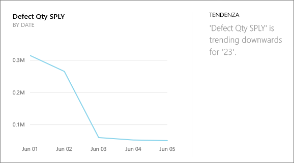
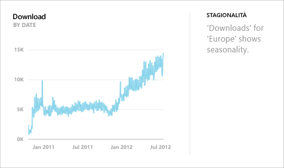
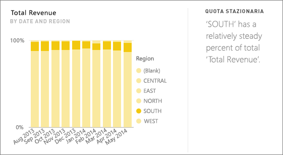
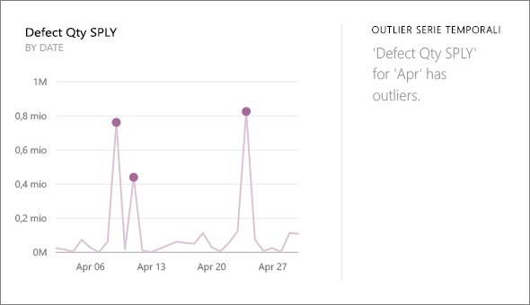

# Tipi di informazioni rapide supportate da Power BI
## Funzionamento delle informazioni rapide
Power BI cerca rapidamente diversi subset del set di dati durante l'applicazione di una serie di algoritmi complessi per individuare informazioni potenzialmente interessanti. Power BI analizza il maggior numero possibile di set di dati in un periodo di tempo stabilito.

È possibile eseguire Informazioni rapide rispetto a un set di dati o riquadro (Informazioni dettagliate correlate).   

## Tipi di informazioni rapide reperibili
Questi sono alcuni degli algoritmi utilizzati:

## Category outlier (dall'alto al basso)
Evidenzia i casi in cui, per una misura nel modello, uno o due membri di una dimensione prevedono valori molto più grandi di altri membri della dimensione.  

## Punti di modifica in una serie temporale
Evidenzia quando vi sono modifiche significative nelle tendenze in una serie temporale di dati.

## Correlazione
Consente di rilevare i casi in cui più misure mostrano una correlazione tra loro quando vengono tracciate in una dimensione del set di dati.

## Varianza bassa
Consente di rilevare i casi in cui i punti dati non sono distanti dalla media.

## Maggioranza (fattori principali)
Consente di trovare casi in cui la maggior parte di un valore totale può essere attribuita a un fattore singolo quando ripartito da un'altra dimensione.  

## Tendenze generali nella serie temporale
Rileva le tendenze verso l'alto o verso il basso nei dati della serie temporale.

## Stagionalità nella serie temporale
Trova modelli periodici nei dati della serie temporale, ad esempio stagionalità settimanale, mensile o annuale.

## Condivisione stabile
Evidenzia i casi in cui è presente una correlazione padre-figlio tra la condivisione di un valore figlio in relazione al valore complessivo dell'elemento padre in una variabile continua.

## Outlier della serie temporale
Per i dati in una serie temporale, viene rilevato quando sono presenti date o orari specifichi con valori sostanzialmente diversi da quella di altri valori di data/ora.

## Passaggi successivi
[Informazioni rapide di Power BI](service-insights.md)

Se è disponibile un set di dati, [ottimizzarlo per Informazioni rapide](service-insights-optimize.md).

Altre domande? [Provare la community di Power BI](http://community.powerbi.com/)

