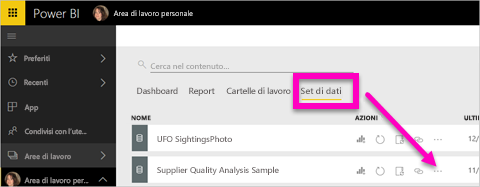
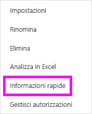
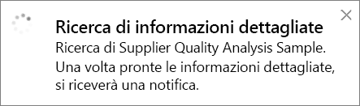
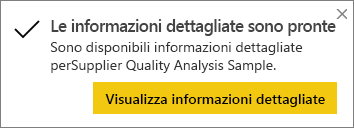
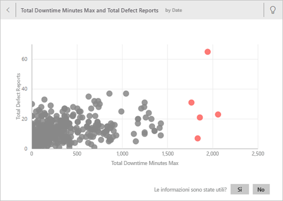
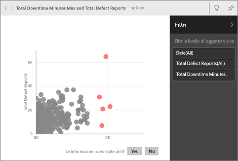
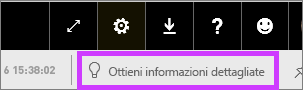
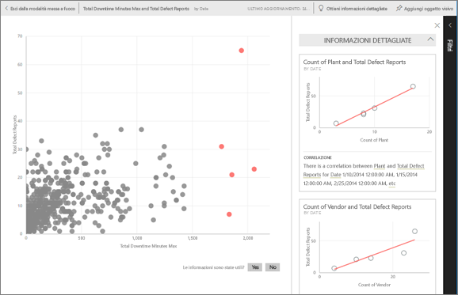
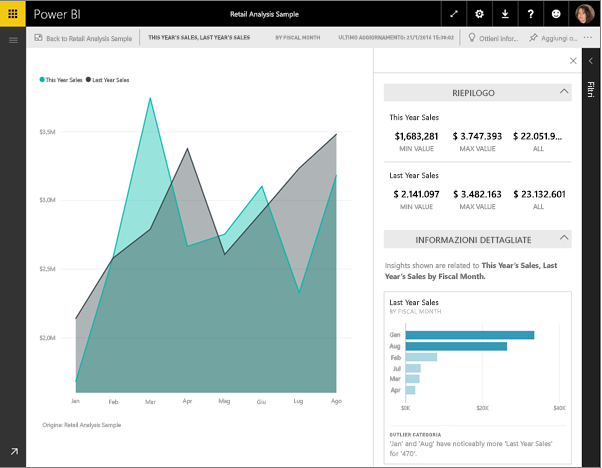

# Informazioni rapide con Power BI
Si ha un nuovo set di dati e non si sa da dove iniziare?  È necessario creare velocemente un dashboard?  Si vuole cercare rapidamente gli approfondimenti persi?

Eseguire Informazioni rapide per generare visualizzazioni interattive interessanti basate sui dati. Informazioni rapide può essere eseguito in un intero set di dati (Informazioni rapide) o in un riquadro del dashboard specifico (Informazioni rapide con ambito). È anche possibile eseguire Informazioni rapide per un'informazione dettagliata.

> **NOTA**: Informazioni rapide non funziona con DirectQuery, ma solo con i dati caricati in Power BI.
> 
> 

La funzionalità Quick Insights si basa su un [set di algoritmi analitici avanzati](service-insight-types.md) sviluppati in collaborazione con Microsoft Research per consentire a più utenti di trovare informazioni dettagliate nei loro dati in modi nuovi e intuitivi.

## Eseguire Informazioni rapide in un set di dati
Il video seguente illustra come eseguire Informazioni rapide su un set di dati, aprire un'informazione in modalità messa a fuoco, aggiungere una di queste informazioni rapide come riquadro nel dashboard e ottenere informazioni rapide per un oggetto visivo.

<iframe width="560" height="315" src="https://www.youtube.com/embed/et_MLSL2sA8" frameborder="0" allowfullscreen></iframe>

Passare ora all'azione. Esplorare Informazioni rapide usando l'[esempio di analisi della qualità dei fornitori](sample-supplier-quality.md).

1. Nella scheda **Set di dati** fare clic sui puntini di sospensione (...) e scegliere **Ottieni informazioni dettagliate**.
   
    
   
    
2. Power BI usa [vari algoritmi](service-insight-types.md) per cercare le tendenze nel set di dati.
   
    
3. Entro pochi secondi, le informazioni sono pronte.  Selezionare **Visualizza approfondimenti** per visualizzare le visualizzazioni.
   
    
   
   > **NOTA**: alcuni set di dati non possono generare informazioni rapide perché i dati non sono statisticamente significativi.  Per altre informazioni, vedere [Ottimizzare i dati per Informazioni rapide](service-insights-optimize.md).
   > 
   > 
4. Le visualizzazioni appaiono in un apposito canvas di **Informazioni rapide** con un massimo di 32 schede separate di informazioni. Ogni scheda contiene un grafico o un grafico con una breve descrizione.
   
    

## Interagire con le schede di Informazioni rapide
  

1. Passare il puntatore del mouse su una scheda e selezionare l'icona a forma di puntina per aggiungere la visualizzazione a un dashboard.
2. Passare il mouse su una scheda e selezionare l'icona della modalità messa a fuoco per visualizzare la scheda a schermo intero.
   
    
3. In questa modalità è possibile:
   
   * [Filtrare](service-interact-with-a-report-in-reading-view.md) le visualizzazioni.  Per visualizzare i filtri, nell'angolo in alto a destra selezionare la freccia per espandere il riquadro Filtri.
     
        
   * Per aggiungere la scheda delle informazioni dettagliate a un dashboard, selezionare l'icona di aggiunta  o **Aggiungi oggetto visivo**.
   * Eseguire Informazioni rapide nella scheda stessa. Questa modalità d'uso è nota anche come **Informazioni rapide con ambito**. Nell'angolo superiore destro selezionare l'icona a forma di lampadina  oppure **Ottieni informazioni dettagliate**.
     
       
     
     L'informazione rapida viene visualizzata a sinistra, mentre le nuove schede, basate esclusivamente sui dati presenti in quell'informazione, vengono visualizzate a destra.
     
       
4. Per tornare all'area di disegno originale di Informazioni rapide, nell'angolo superiore sinistro selezionare **Esci dalla modalità messa a fuoco**.

## Eseguire Informazioni rapide in un riquadro del dashboard
Invece di cercare informazioni dettagliate in un intero set di dati, è possibile limitare la ricerca ai dati usati per creare un singolo riquadro del dashboard. Questa modalità d'uso è nota anche come **Informazioni rapide con ambito**.

1. Aprire un dashboard.
2. Selezionare un riquadro e [aprire il riquadro nella modalità messa a fuoco](service-focus-mode.md).
3. Nell'angolo in alto a destra selezionare **Ottieni informazioni dettagliate**.
   
    
4. Power BI visualizza le schede di informazioni dettagliate sul lato destro del riquadro.
   
    
5. Se un approfondimento attira l'interesse, selezionare la scheda di informazioni dettagliate per un approfondimento. L'informazione rapida selezionata viene visualizzata a sinistra, mentre le nuove schede di informazioni, basate esclusivamente sui dati presenti in quell'informazione rapida, vengono visualizzate a destra.
6. Continuare l'approfondimento dei dati e quando si trova un'informazione rapida interessante, aggiungere il relativo oggetto visivo al dashboard selezionando **Aggiungi oggetto visivo** nell'angolo superiore destro. È anche possibile inviare un commento per informare il proprietario del set di dati se una particolare informazione rapida è stata utile o meno.
   
    

## Passaggi successivi
Se è disponibile un set di dati, [ottimizzarlo per Informazioni rapide](service-insights-optimize.md).

Altre informazioni sui [tipi di informazioni rapide disponibili](service-insight-types.md)

Altre domande? [Provare la community di Power BI](http://community.powerbi.com/)

