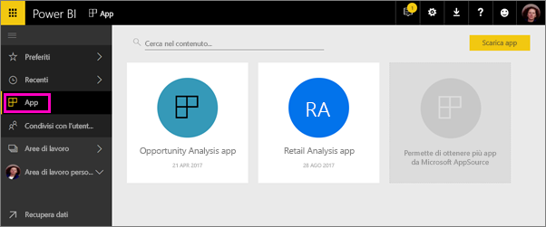
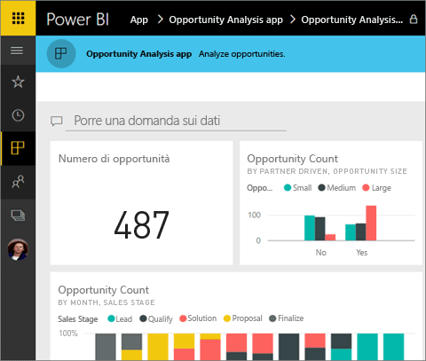
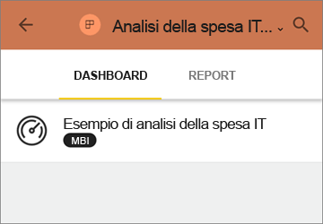
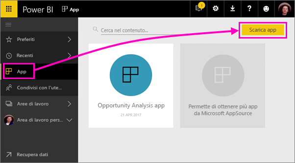
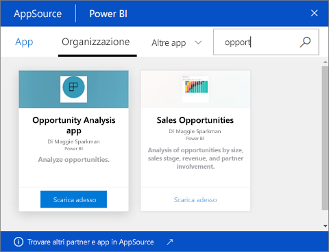
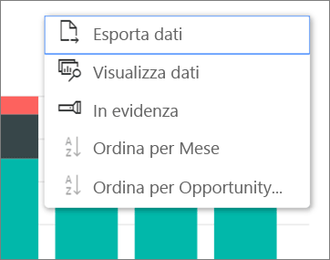

# Installare e usare le app con dashboard e report in Power BI
In Power BI le *app* riuniscono dashboard e report correlati, tutti in un'unica posizione. Gli utenti dell'organizzazione possono creare e distribuire le app con informazioni aziendali essenziali. Anche i [servizi esterni](service-connect-to-services.md) che probabilmente sono già in uso, ad esempio Google Analytics e Microsoft Dynamics CRM, offrono app di Power BI. 

Le app possono essere facilmente individuate e installate nel servizio Power BI ([https://powerbi.com](https://powerbi.com)) e nel dispositivo mobile. Dopo l'installazione di un'app non è necessario ricordare i nomi di molti dashboard diversi, perché sono tutti riuniti nell'app, nel browser o nel dispositivo mobile.

Ogni volta che l'autore dell'app rilascia aggiornamenti, le modifiche vengono visualizzate automaticamente nelle app. L'autore controlla anche la frequenza con cui è pianificato l'aggiornamento dei dati, dunque non è necessario preoccuparsi di stare al passo. 

Se si prevede di creare un'app, Vedere [Creare e pubblicare app in Power BI](service-create-distribute-apps.md) per altre informazioni.

## Ottenere una nuova app
È possibile ottenere le app in diversi modi. L'autore dell'app può installare l'app automaticamente nell'account Power BI o inviare il collegamento diretto a un'app, oppure è possibile cercarla in AppSource, in cui sono visualizzate tutte le app a cui è possibile accedere. In Power BI nel dispositivo mobile è possibile installarla solo da un collegamento diretto, non da AppSource. Se l'autore dell'app installa automaticamente l'app, verrà visualizzata nell'elenco delle app.

### Installare un'app da un collegamento diretto
Il modo più semplice per installare una nuova app consiste nell'ottenere un collegamento diretto dall'autore dell'app. Power BI crea un collegamento di installazione, che l'autore può inviare all'utente.

**Nel computer** 

Quando si fa clic sul collegamento contenuto nel messaggio di posta elettronica, viene aperto il servizio Power BI ([https://powerbi.com](https://powerbi.com)) in un browser. Confermare che si vuole installare l'app; verrà aperta la pagina di destinazione dell'app.

**Nel dispositivo mobile iOS o Android** 

Quando si fa clic sul collegamento nel messaggio di posta elettronica nel dispositivo mobile, l'app viene installata automaticamente e viene visualizzato l'elenco del contenuto dell'app. 

### Ottenere l'app da Microsoft AppSource
È anche possibile trovare e installare le app a cui si ha accesso da Microsoft AppSource. 

1. Selezionare **App**  > **Scarica app**. 
   
     
2. In AppSource in **La mia organizzazione**, è possibile eseguire una ricerca per limitare il numero di risultati e trovare l'app si sta cercando.
   
     
3. Selezionare **Scarica adesso** per aggiungerla alla pagina App. 

## Interagire con i dashboard e i report nell'app
È ora possibile esplorare i dati nei dashboard e nei report nell'app. È possibile accedere a tutte le interazioni standard di Power BI, ad esempio i filtri, l'evidenziazione, l'ordinamento e il drill-down. Vedere [Interagire con i report in Power BI](service-interact-with-a-report-in-reading-view.md). 

Non è possibile salvare le modifiche apportate, ma è sempre possibile [esportare i dati in Excel ](power-bi-visualization-export-data.md) da una tabella o da altri oggetti visivi in un report.

## Passaggi successivi
* [Creare e pubblicare app in Power BI](service-create-distribute-apps.md)
* [App Power BI per dispositivi esterni](service-connect-to-services.md)
* Domande? [Provare a rivolgersi alla community di Power BI](http://community.powerbi.com/)

