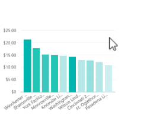
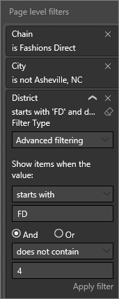
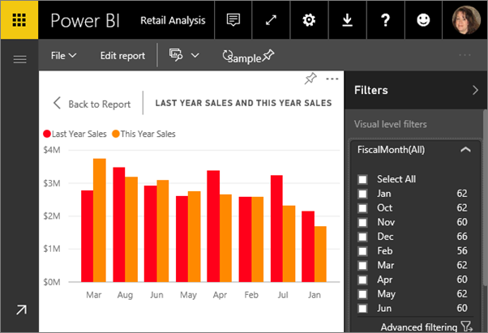
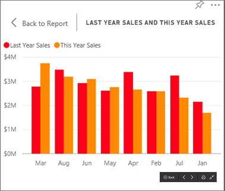
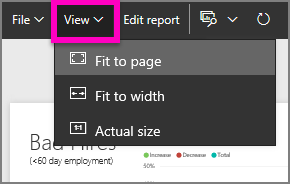

# Interagire con un report nella Visualizzazione di lettura in Power BI
## Visualizzazione di lettura
Visualizzazione lettura non è una modalità interattiva come [Visualizzazione di modifica](service-interact-with-a-report-in-editing-view.md), ma offre comunque numerose opzioni per l'esplorazione dei dati. Questo si rivela molto utile quando si visualizzano i report [condivisi](service-share-dashboards.md), che possono essere aperti solo in Visualizzazione lettura.

Visualizzazione di lettura è un modo sicuro e divertente per analizzare i dati. In Visualizzazione di lettura è possibile evidenziare e filtrare gli oggetti visivi di una pagina in modo correlato.  È sufficiente evidenziare o selezionare un valore in un oggetto visivo per verificarne immediatamente l'impatto sugli altri oggetti. Usare il riquadro Filtro per aggiungere e modificare i filtri in una pagina del report e modificare il modo in cui vengono ordinati i valori in una visualizzazione. Eventuali evidenziazioni e filtri applicati non salvati con il report.

## Evidenziare le visualizzazioni correlate in una pagina
Le visualizzazioni in una singola pagina del report sono tutte "connesse" tra loro.  Questo significa che se si selezionano uno o più valori in una visualizzazione, le altre visualizzazioni che usano lo stesso valore verranno modificate in base a tale selezione.

> [!NOTE]
> Per selezionare più elementi di una visualizzazione, tenere premuto CTRL.
> 
> 

## Passare con il mouse sugli oggetti visivi per visualizzarne i dettagli

## Ordinare i dati in una visualizzazione
Selezionare i puntini di sospensione (...) per aprire **Ordina per**. Selezionare la freccia verso il basso per scegliere il campo da usare per l'ordinamento oppure selezionare l'icona AZ per passare dall'ordinamento crescente a quello decrescente e viceversa. 

 

## Interagire con i filtri
Se l'autore del report ha aggiunto filtri a una pagina di un report, è possibile interagirvi nella Visualizzazione di lettura. Le modifiche apportate non verranno salvate con il report.

1. Selezionare l'icona del filtro nell'angolo in alto a destra.
   
     
2. Verranno visualizzati tutti i filtri applicati all'oggetto visivo selezionato (Filtri a livello di oggetto visivo), in tutta la pagina del report (Filtri a livello di pagina) e nell'intero report (Filtri a livello di report).
   
   
3. Passare con il mouse su un filtro ed espanderlo selezionando la freccia verso il basso.
   
   
4. Modificare i filtri e verificarne l'impatto sugli oggetti visivi.  
   
   * In questo esempio è presente un filtro a livello di pagina per **Chain**. Cambiarlo in **Fashions Direct** invece di **Lindseys** rimuovendo il segno di spunta dall'uno e aggiungendolo all'altro.
     
     
   * Oppure rimuovere completamente il filtro applicato a **Chain** selezionando l'icona della gomma  o selezionando entrambi i negozi della catena.
   * Selezionare il filtro a livello di pagina **District** e passare a **Filtro avanzato**. Filtrare in modo da mostrare solo le zone che iniziano per **FD** e non contengono il numero 4.
     
     

Per altre informazioni, vedere [Aggiungere un filtro a un report](power-bi-report-add-filter.md) e [Informazioni su filtri ed evidenziazione nei report](power-bi-reports-filters-and-highlighting.md).

## Eseguire lo zoom avanti su singoli oggetti visivi
Passare il puntatore del mouse sull'oggetto visivo e selezionare l'icona **Modalità messa a fuoco** . Quando si espande in Modalità messa a fuoco, la visualizzazione riempie tutta l'area di disegno del report, come illustrato di seguito.

Per aprire la stessa visualizzazione senza che barre dei menu, riquadro dei filtri e altri riquadri vengano rimossi, selezionare l'icona **Schermo intero** dalla barra dei menu in alto .

Per altre informazioni, vedere [Modalità messa a fuoco per i report](service-focus-mode.md) e [Modalità schermo intero per i report](service-fullscreen-mode.md)

## Regolare le dimensioni dello schermo
I report vengono visualizzati su dispositivi diversi, le cui dimensioni e proporzioni possono variare.  Il rendering predefinito potrebbe quindi non corrispondere a quello che si intende visualizzare sul dispositivo.  Per modificare, selezionare **Visualizzazione** e scegliere:

* Adatta alla pagina: ridimensiona il contenuto adattandolo alla pagina
* Adatta in larghezza: ridimensiona il contenuto in base alla larghezza della pagina
* Dimensioni effettive: visualizza il contenuto a schermo intero  

  Nella Visualizzazione di lettura l'opzione di visualizzazione selezionata è temporanea e non viene salvata alla chiusura del report.

  Per altre informazioni, vedere [Esercitazione: Modificare le impostazioni di visualizzazione in un report](power-bi-change-report-display-settings.md).

## Passaggi successivi
[Report in Power BI](service-reports.md)

[Aprire la Visualizzazione di modifica](service-reading-view-and-editing-view.md)

Altre domande? [Provare la community di Power BI](http://community.powerbi.com/)

