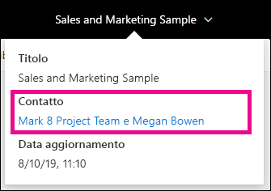
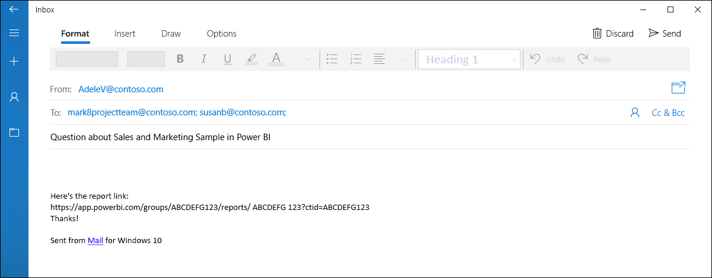
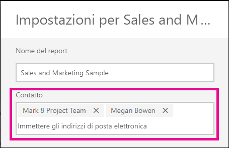
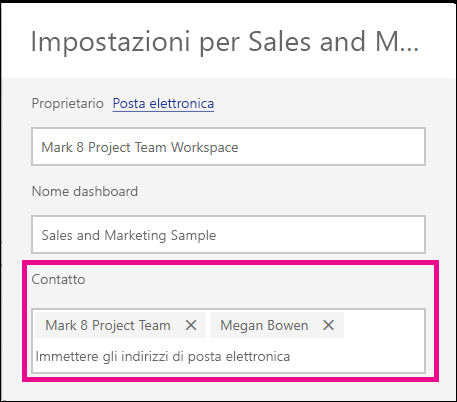

# Impostare le informazioni sul contatto per report e dashboard nel servizio Power BI
Questo articolo illustra come impostare le informazioni sul contatto per un dashboard o un report nel servizio Power BI.

> [!NOTE]
> È possibile impostare le informazioni sul contatto per gli elementi di un'area di lavoro classica o nuova. Non è possibile impostare le informazioni sul contatto per gli elementi dell'area di lavoro personale. La scheda informazioni viene visualizzata quando si visualizza un report o un dashboard nel [nuovo aspetto](service-new-look.md).

È possibile aggiungere più utenti o gruppi al contatto per un elemento. Possono essere:
* Una persona
* Un gruppo di Office 365
* Un gruppo di sicurezza abilitato alla posta elettronica
* Una lista di distribuzione

Per impostazione predefinita, la persona che crea un nuovo report o dashboard è il contatto. Se si imposta un valore, viene eseguito l'override del valore predefinito. Naturalmente, è possibile rimuovere tutte le persone o i gruppi dall'elenco contatti. Quando si esegue questa operazione, per le aree di lavoro classiche verrà visualizzato il gruppo di Office 365 per l'area di lavoro. Per le aree di lavoro nuove, verrà usato l'[elenco contatti dell'area di lavoro](service-create-the-new-workspaces.md#workspace-contact-list). Se l'elenco contatti dell'area di lavoro non è impostato, vengono visualizzati gli amministratori dell'area di lavoro.

Le informazioni sul contatto vengono visualizzate agli utenti che visualizzano l'elemento. 

 

Quando si fa clic sull'elenco contatti, viene creato un messaggio di posta elettronica che consente di inviare domande o richiedere assistenza. 

 
 
Le informazioni dell'elenco contatti vengono usate anche in altre posizioni. Ad esempio, l'elenco viene visualizzato in alcuni scenari di errore nella finestra di dialogo dell'errore. I messaggi di posta elettronica automatici correlati all'elemento, ad esempio le richieste di accesso, vengono inviati all'elenco contatti. 

> [!NOTE]
> Quando si pubblica un'app, le informazioni sul contatto impostate per i singoli elementi vengono impostate sulla persona che ha pubblicato o aggiornato l'app. È possibile impostare l'URL di supporto dell'app in modo che gli utenti dell'app ottengano l'assistenza necessaria.

## Impostare le informazioni sul contatto per un report
1. Nell'area di lavoro selezionare la scheda **Report**.
2. Individuare il report desiderato e selezionare l'icona **Impostazioni**.
3. Individuare il campo di input **Contatto** e impostare un valore.

     

## Impostare le informazioni sul contatto per un dashboard
1. Nell'area di lavoro selezionare la scheda **Dashboard**.
2. Individuare il report desiderato e selezionare l'icona **Impostazioni**
3. Individuare il campo di input **Contatto** e impostare un valore.

     

## Limitazioni e considerazioni
* Il contatto viene impostato automaticamente per i nuovi elementi creati nel servizio Power BI. Gli elementi esistenti visualizzano il valore predefinito dell'area di lavoro.
* Sebbene sia possibile impostare qualsiasi utente o gruppo nell'elenco contatti, l'autorizzazione per l'elemento non verrà concessa automaticamente. Usare la condivisione o concedere agli utenti l'accesso all'area di lavoro tramite un ruolo. 
* L'elenco contatti a livello di elemento non viene inserito nelle app quando vengono pubblicate. La nuova esperienza di navigazione per le app offre un URL di supporto che viene configurato per gestire i feedback da un numero elevato di utenti di app.

## Passaggi successivi

Altre domande? [Provare la community di Power BI](https://community.powerbi.com/)
