# Machine Learning automatizzato in Power BI (anteprima)

Automatizzato machine learning (AutoML) per flussi di dati consente agli analisti aziendali di eseguire il training, convalida e richiamare i modelli di Machine Learning direttamente in Power BI. Include una semplice esperienza per la creazione di un nuovo modello di Machine Learning in cui gli analisti possono utilizzare i flussi di dati per specificare i dati di input per il training del modello. Servizio automaticamente estrae le funzionalità più rilevanti, è possibile selezionare un algoritmo appropriato e ottimizza e convalida del modello di Machine Learning. Dopo che viene eseguito il training di un modello, Power BI genera automaticamente un report che include i risultati della convalida che spiega le prestazioni e i risultati agli analisti. Il modello può quindi essere richiamato su tutti i dati nuovi o aggiornati entro il flusso di dati.

Automatizzati di machine learning è disponibile per flussi di dati che sono ospitati in solo le capacità di Power BI Premium e incorporata. In questa versione di anteprima AutoML consente di eseguire il training di modelli di machine learning per i modelli di stima binaria, classificazione e regressione.

## Utilizzo di AutoML

[Power BI dataflows](service-dataflows-overview.md) offrono la preparazione dei dati Self-Service per i big data. AutoML consente di sfruttare l'attività di preparazione dei dati per la creazione di modelli di machine learning, direttamente da Power BI.

AutoML in Power BI consente agli analisti di dati di utilizzare flussi di dati per compilare modelli di machine learning con un'esperienza semplificata, usando semplicemente le competenze di Power BI. La maggior parte di data science dietro la creazione dei modelli di Machine Learning viene automatizzato con Power BI, con i confini garantisce che il modello di prodotto sia di buona qualità e la visibilità per fornire approfondimenti completa il processo usato per creare il modello di Machine Learning.

AutoML supporta la creazione di **stima binaria**, **classificazione**, e **regressione** modelli per flussi di dati. Questi sono i tipi di modelli di supervisione di machine learning, il che significa ascolta i risultati noti di osservazioni precedenti per prevedere i risultati di altre osservazioni. Il set di dati di input per il training di un modello AutoML è un set di record che sono **etichettato** con i risultati noti.

AutoML in Power BI si integra [automatizzati di Machine Learning](https://docs.microsoft.com/azure/machine-learning/service/concept-automated-ml) dalle [servizio di Azure Machine Learning](https://docs.microsoft.com/azure/machine-learning/service/overview-what-is-azure-ml) per creare i modelli di Machine Learning. Tuttavia, non occorre una sottoscrizione di Azure usare AutoML in Power BI. Il processo di training e ospitare i modelli di Machine Learning è gestito completamente dal servizio Power BI.

Dopo che viene eseguito il training di un modello di Machine Learning, AutoML genera automaticamente un report di Power BI che descrive le probabili prestazioni del modello di Machine Learning. AutoML evidenzia explainability, evidenziando i fattori di influenza chiave tra gli input che determinano le stime restituite dal modello. Il report include anche le metriche principali per il modello, a seconda del tipo di modello di Machine Learning.

Altre pagine del report generato mostrano il riepilogo statistico del modello e i dettagli di training. Le statistiche summary è di particolare interesse per gli utenti che si desidera visualizzare le misure di analisi scientifica dei dati standard delle prestazioni per il modello. I dettagli di training riepilogano tutte le iterazioni che sono state eseguite per creare il modello, con i parametri di modellazione associati. Vengono inoltre descritti come ogni input è stata usata per creare il modello di Machine Learning.

È quindi possibile applicare il modello di Machine Learning per i dati per l'assegnazione dei punteggi. Quando viene aggiornato il flusso di dati, le stime dal modello di Machine Learning applicate automaticamente ai dati. Power BI include anche una spiegazione individuali per ogni punteggio della stima specifico che genera il modello di Machine Learning.

## Creazione di un modello di machine learning

Questa sezione descrive come creare un modello di apprendimento automatico AutoML. 

### Preparazione dei dati per la creazione di un modello di Machine Learning

Per creare un modello di machine learning in Power BI, è innanzitutto necessario creare un flusso di dati per i dati con le informazioni cronologiche risultato, che viene usate per il training del modello di Machine Learning. Per informazioni dettagliate sulla configurazione del flusso di dati, vedere [di preparazione dei dati self-servizi in Power BI](service-dataflows-overview.md).

Nella versione corrente, Power BI Usa i dati da una singola entità solo per il training del modello di Machine Learning. Pertanto, se i dati cronologici è costituito da più entità, è necessario aggiungere manualmente i dati in una singolo flusso di dati entità. È anche necessario aggiungere le colonne calcolate per le metriche di business che possono essere predittori sicuri per il risultato che si sta tentando di stimare.

AutoML presenta requisiti specifici dei dati per il training di un modello di machine learning. Questi requisiti sono descritti nelle sezioni seguenti, basati sui tipi di modello corrispondente.

### Configurazione di input del modello di Machine Learning

Per creare un modello AutoML, selezionare l'icona di Machine Learning nel **azioni** colonna dell'entità del flusso di dati con i dati cronologici e selezionare **aggiungere un modello di machine learning**.

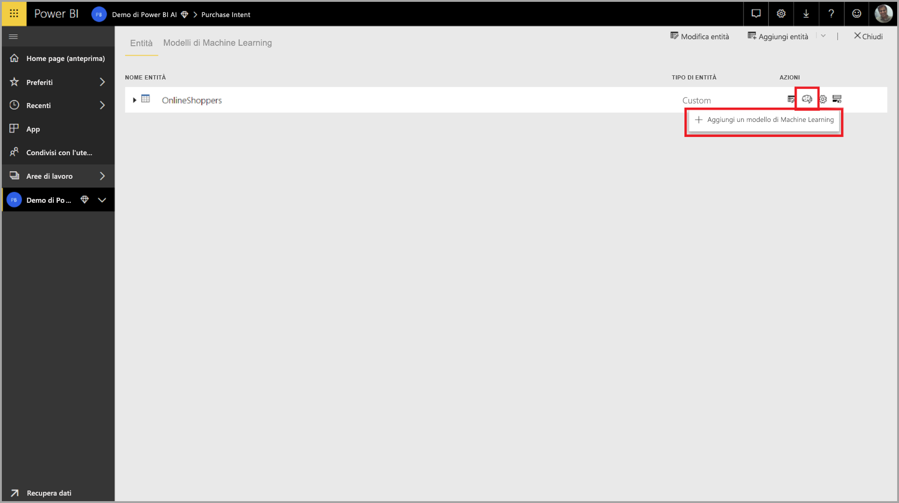

Viene avviata un'esperienza semplificata, costituito da una procedura guidata che semplifica il processo di creazione del modello di Machine Learning. La procedura guidata include la semplice procedura seguente.

1. Selezionare l'entità con i dati cronologici risultato e il campo per cui si desidera una stima
2. Scegliere un tipo di modello in base al tipo di stima che si desidera vedere
3. Selezionare gli input che il modello da utilizzare come segnali predittivi
4. Assegnare un nome del modello e salvare la configurazione

Il campo risultato cronologici identifica l'attributo etichetta per il training del modello di Machine Learning, illustrati nella figura seguente.

Quando si specifica il campo risultato cronologici, AutoML analizza i dati etichetta per identificare i tipi di modelli di Machine Learning che possono essere sottoposto a training per tali dati e viene suggerito il tipo di modello di Machine Learning più probabile che può essere sottoposto a training. 

> [!NOTE]
> Alcuni tipi di modello potrebbero non essere supportati per i dati che è stata selezionata.

AutoML consente inoltre di analizzare tutti i campi dell'entità selezionata per suggerire gli input che possono essere usati per il training del modello di Machine Learning. Questo processo è approssimativo e si basa su analisi statistiche, è consigliabile esaminare gli input utilizzati. Non usare alcun input dipendenti al campo del risultato cronologici (o il campo dell'etichetta) per il training del modello di Machine Learning, dal momento che influirà sulle relative prestazioni.

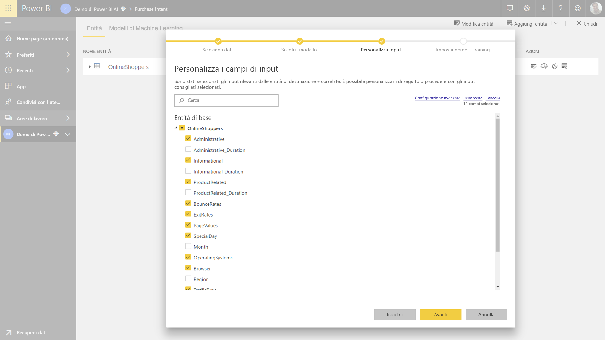

Nel passaggio finale, è possibile assegnare un nome di modello e salvare le impostazioni.

In questa fase, viene chiesto di aggiornare il flusso di dati, che inizia il processo di training per il modello di Machine Learning.

### Training del modello di Machine Learning

Training dei modelli AutoML fa parte dell'aggiornamento del flusso di dati. AutoML innanzitutto prepara i dati per il training.

AutoML suddivide i dati cronologici forniti in un training e set di dati di testing. Il set di dati di test è un set di dati di controllo che viene usato per convalidare le prestazioni del modello dopo il training. Questi vengono rappresentati come **Training e Testing** entità nel flusso di dati. AutoML Usa la convalida incrociata per la convalida del modello.

Successivamente, ogni campo di input viene analizzato e imputation viene applicato, che sostituisce eventuali valori mancanti con valori sostituiti. Un paio di strategie imputation diversi vengono usati da AutoML. Quindi, qualsiasi campionamento necessario e la normalizzazione vengono applicate ai dati.

AutoML applica alcune trasformazioni sono ogni campo di input selezionato basato sul tipo di dati e le relative proprietà statistica. AutoML Usa queste trasformazioni per estrarre le funzionalità per l'uso di training del modello di Machine Learning.

Il processo di training per i modelli AutoML è costituito da un massimo di 50 iterazioni con algoritmi di modellazione diversi e impostazioni degli iperparametri per individuare il modello con prestazioni ottimali. Le prestazioni della ognuno di questi modelli viene valutata per la convalida con il set di dati di test di controllo. Durante questo passaggio, corsi di formazione AutoML crea pipeline diverse per il training e convalida di questi iterazioni. Il processo di valutare le prestazioni dei modelli può richiedere tempo, in qualsiasi punto da alcuni minuti ad un paio d'ore, a seconda delle dimensioni del set di dati e le risorse di capacità dedicata disponibili.

In alcuni casi, il modello finale generato potrebbe usare apprendimento, in cui più modelli vengono usati per offrire migliore prestazioni predittive dell'insieme.

### Explainability modello AutoML

Dopo il training del modello, AutoML analizza la relazione tra le funzionalità di input e l'output del modello. Valuta la grandezza e la direzione di modifica per l'output del modello per set di dati di test dei dati di controllo per ogni funzionalità di input. Questo è noto come il *importanza delle funzionalità*.

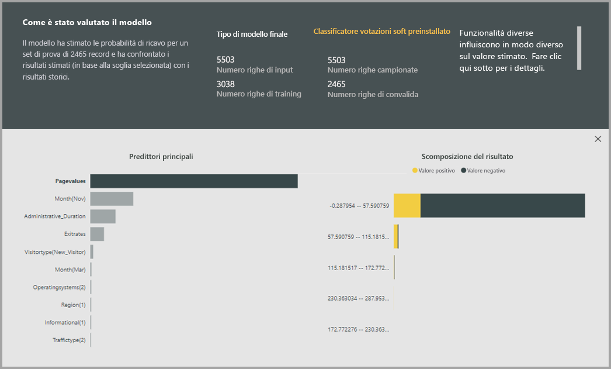

### Report modello AutoML

AutoML genera un report di Power BI che riepiloga le prestazioni del modello durante la convalida, insieme all'importanza delle caratteristiche globali. Il report riepiloga i risultati di applicare il modello di Machine Learning per i dati di test di controllo e confrontando le stime con valori noti risultanti.

È possibile esaminare il report del modello per comprenderne le prestazioni. È inoltre possibile convalidare che i fattori di influenza chiave del modello siano allineate con le informazioni dettagliate aziendali su risultati noti.

I grafici e le misure consente di descrivere le prestazioni del modello del report variano a seconda del tipo di modello. Questi grafici delle prestazioni e le misure sono descritte nelle sezioni seguenti.

Altre pagine nel report potrebbero descrivere misure statistiche sul modello da una prospettiva di analisi scientifica dei dati. Ad esempio, il **stima binaria** report include un grafico a guadagno e la curva ROC per il modello.

I report includono anche un **Training dettagli** pagina che include una descrizione del modo in cui è stato eseguito il training, il modello e include un grafico che descrive le prestazioni del modello su ognuna delle iterazioni viene eseguita.

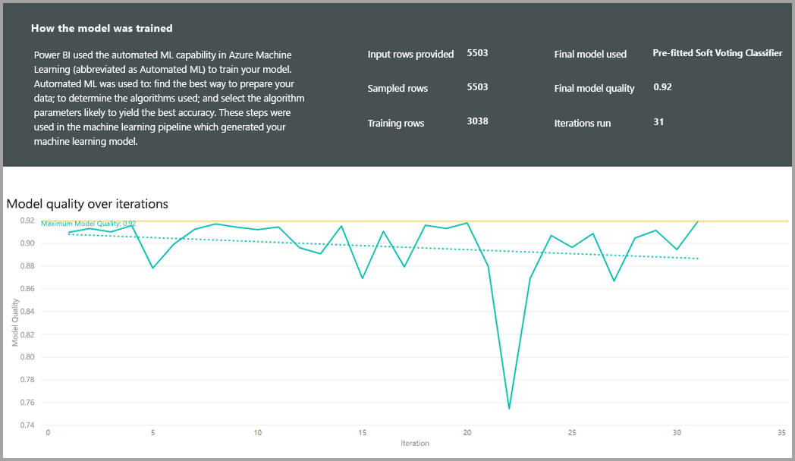

Un'altra sezione in questa pagina descrive come utilizzare il metodo imputation per riempire i valori mancanti per i campi di input, nonché come ogni campo di input è stato trasformato per estrarre le funzionalità utilizzate nel modello. Include anche i parametri utilizzati dal modello finale.

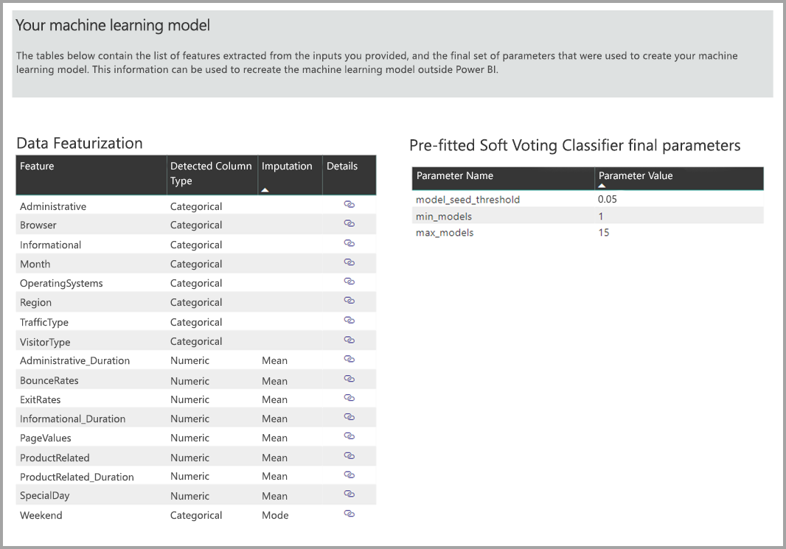

Se il modello generato Usa l'apprendimento dell'insieme, il **Training dettagli** pagina include anche una sezione che descrive il peso di ogni modello che lo costituiscono nell'insieme, nonché i relativi parametri.

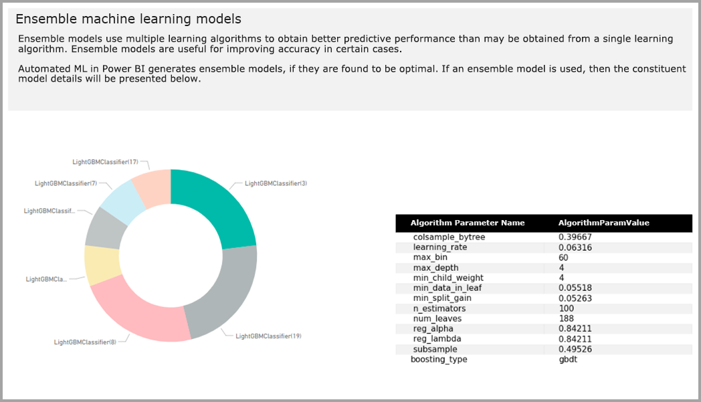

## L'applicazione del modello AutoML

Se si è soddisfatti delle prestazioni del modello di Machine Learning creato, è possibile applicare lo ai dati nuovi o aggiornati quando viene aggiornato il flusso di dati. È possibile farlo nel report di modello, selezionando il **applica** pulsante nell'angolo superiore destro.

Per applicare il modello di Machine Learning, è necessario specificare il nome dell'entità a cui deve essere applicato e un prefisso per le colonne che verranno aggiunti a questa entità per l'output del modello. Il prefisso predefinito per i nomi di colonna è il nome del modello. Il *applica* funzione potrebbe includere ulteriori parametri specifici per il tipo di modello.

L'applicazione del modello di Machine Learning consente di creare una nuova entità di flussi di dati con il suffisso **arricchiti < model_name >** . Ad esempio, se si applica il _PurchaseIntent_ del modello per il _OnlineShoppers_ entità, verrà generato l'output il **OnlineShoppers arricchiti PurchaseIntent**.

Attualmente, l'entità di output non è utilizzabile per visualizzare in anteprima i risultati del modello di Machine Learning nell'editor di Power Query. Le colonne di output mostrano sempre null come risultato. Per visualizzare i risultati, un secondo output entità con il suffisso **arricchiti < model_name > Anteprima** viene creato quando viene applicato il modello.

È necessario aggiornare il flusso di dati, per visualizzare in anteprima i risultati nell'Editor di Query.

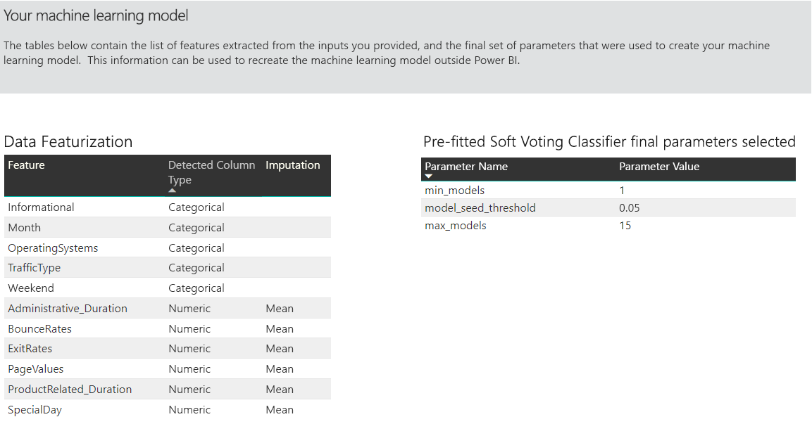

Quando si applica il modello, AutoML sempre mantiene le stime aggiornate quando viene aggiornato il flusso di dati.

AutoML include anche una spiegazione individuali per ogni riga che assegna un punteggio dell'entità di output.

Per usare le informazioni dettagliate e stime dal modello di Machine Learning in un report di Power BI, è possibile connettersi all'entità di output da Power BI Desktop usando le **dataflows** connector.

## Modelli di stima binaria

Modelli di stima binari, più formalmente noti come **modelli di classificazione binaria**, vengono usati per classificare un set di dati in due gruppi. Vengono utilizzati per stimare gli eventi che possono avere un risultato binario, ad esempio se si convertirà un'opportunità di vendita, se un account verrà abbandonato, se una di pagamento nel tempo; indica se una transazione è fraudolente e così via.

Poiché il risultato binario, Power BI si aspetta che l'etichetta per un modello di stima binaria sia un valore booleano, con risultati noti viene etichettato **true** oppure **false**. Ad esempio, in un modello di conversione di opportunità di vendita, le opportunità di vendita che sono state acquisite sono etichettate come true, quelli che sono stati persi sono contrassegnate con false e l'opportunità di vendita open sono etichettate come null.

L'output di un modello di stima binaria è un punteggio di probabilità, che identifica la probabilità che il risultato corrispondente al valore di etichetta true verrà ottenuto.

### Training di un modello di stima binaria

Per creare un modello di stima binaria, l'entità di input contenenti i dati di training deve avere un campo booleano come campo del risultato cronologica per identificare i risultati noti precedenti.

Prerequisiti:

* Un campo booleano deve essere utilizzato come il campo risultato cronologici
* Un minimo di 50 righe di dati cronologici è necessario per ogni classe di risultati

In generale, se i risultati precedenti sono identificati da campi di un tipo di dati diversi, è possibile aggiungere una colonna calcolata per trasformare in un valore booleano usando Power Query.

Il processo di creazione di altri modelli AutoML, descritti nella sezione passaggi per un modello di stima binaria segue lo stesso **configurazione di input del modello ML** sopra.

### Report di modello di stima binario

Il modello di previsioni binarie produce come output una probabilità che un record avranno il risultato definito dal valore booleano etichetta come True. Il report include un filtro dei dati per la soglia di probabilità, che influisce sul modo in cui vengono interpretati i punteggi sopra e sotto la soglia di probabilità.

Il report descrive le prestazioni del modello in termini di *veri positivi*, *falsi positivi*, *veri negativi* e *falsi negativi*. True positivi e veri negativi sono risultati stimati in modo corretto per le due classi nei dati del risultato. Falsi positivi sono risultati che aveva l'etichetta booleano effettivo del valore False, ma sono stati previsto come True. Al contrario, falsi negativi sono i risultati in cui il valore dell'etichetta booleano effettivo è True ma stimati come False.

Misure, ad esempio precisione e richiamo, descrivono l'effetto della soglia di probabilità i risultati stimati. È possibile usare il filtro dei dati soglia di probabilità per selezionare una soglia che ottenga un equo compromesso tra precisione e richiamo.

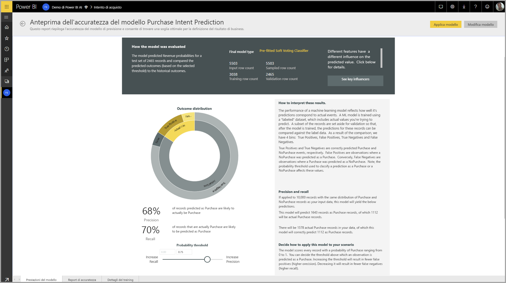

Il **Report accuratezza** pagina del report modello include il *guadagno cumulativo* grafico e il ROC, curva per il modello. Si tratta di misure statistiche delle prestazioni del modello. I report includono le descrizioni dei grafici visualizzati.

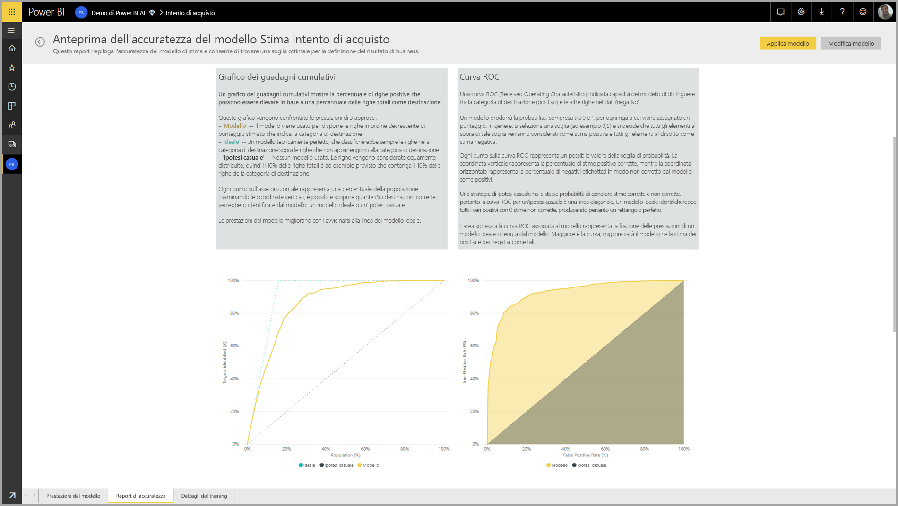

### Applicare un modello di stima binaria

Per applicare un modello di stima binaria, è necessario specificare l'entità con i dati a cui si desidera applicare le stime dal modello di Machine Learning. Altri parametri includono il prefisso di nome di colonna di output e la soglia di probabilità per classificare il risultato stimato.

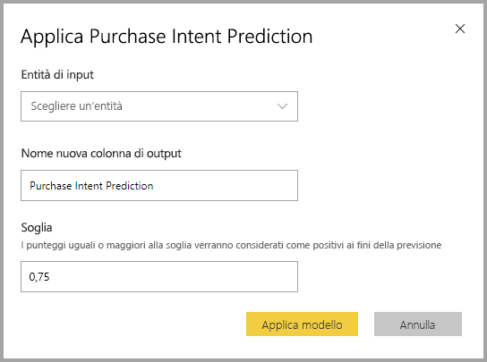

Quando viene applicato un modello di previsione binario, aggiunge tre colonne di output per l'entità arricchiti di output. Questi sono i **PredictionScore**, **PredictionOutcome** e **PredictionExplanation**. I nomi delle colonne nell'entità hanno il prefisso specificato quando viene applicato il modello.

Il **PredictionOutcome** colonna contiene l'etichetta del risultato stimato. I record con le probabilità che superano la soglia stimati come probabili ottenere il risultato e quelle precedenti sono stimati come improbabile ottenere un risultato.

Il **PredictionExplanation** colonna contiene una spiegazione con l'influenza specifica che le funzionalità di input sono stata rilevate nel **PredictionScore**. Si tratta di una raccolta in formato JSON dei pesi delle funzionalità di input per la stima.

## Modelli di classificazione

I modelli di classificazione vengono utilizzati per classificare un set di dati in più gruppi o classi.  Vengono utilizzati per stimare gli eventi che possono avere uno dei più risultati possibili, ad esempio se un cliente è probabilmente una molto elevato, alta, Media o bassa durata valore; indica se il rischio per impostazione predefinita è elevata, con gravità moderata, bassa o molto bassa. E così via.

L'output di un modello di classificazione è un punteggio di probabilità, che identifica la probabilità che un record otterrà i criteri per una determinata classe.

### Training di un modello di classificazione

L'entità di input contenenti i dati di training per un modello di classificazione deve avere una stringa o un campo numerico come il campo risultato cronologici, che identifica gli ultimi risultati noti.

Prerequisiti:

* Un minimo di 50 righe di dati cronologici è necessario per ogni classe di risultati

Il processo di creazione di altri modelli AutoML, descritti nella sezione passaggi per un modello di classificazione segue lo stesso **configurazione di input del modello ML** sopra.

### Report di modello di classificazione

La classificazione di report del modello viene generato applicando il modello di Machine Learning per il controllo di test dei dati e il confronto alla classe stimata per un record con l'effettiva classe noto.

Report modello include un grafico che include la suddivisione dei record classificati correttamente e in modo non corretto per ogni classe noti.

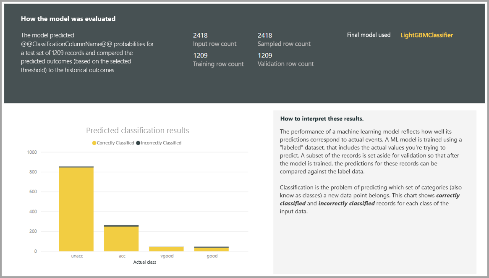

Un ulteriore specifico della classe drill-down consente un'analisi del modo in cui vengono distribuite le stime per una classe nota. Ciò include le altre classi in cui i record di tale classe noto potranno che essere classificato in modo errato.

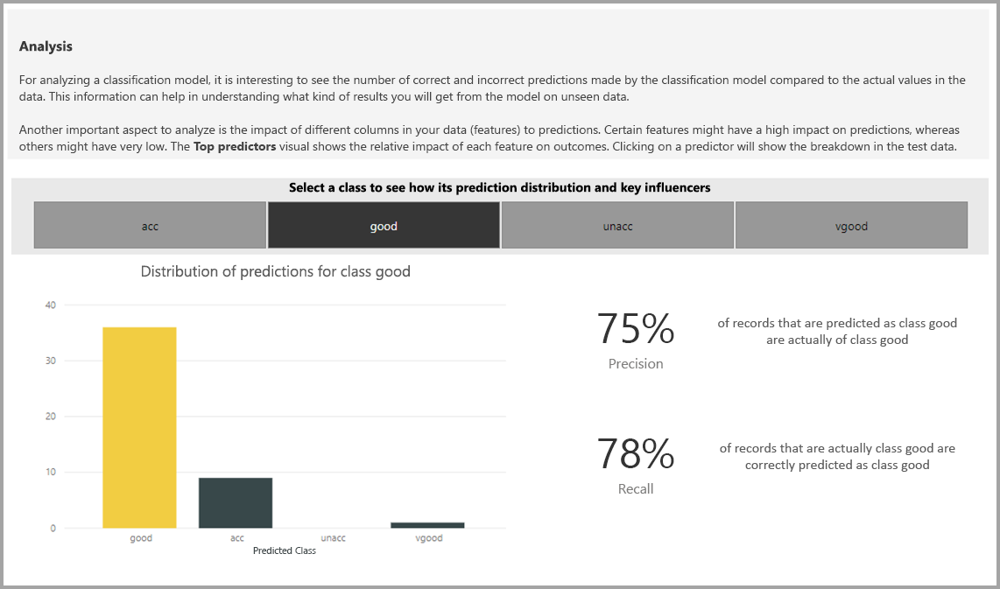

La spiegazione del modello nel report include anche i primi predittori per ogni classe.

Il report di modello di classificazione include anche una pagina di dettagli sulla formazione simile alle pagine per altri tipi di modello, come descritto nella sezione **report modello AutoML** più indietro in questo articolo.

### Applicare un modello di classificazione

Per applicare un modello di Machine Learning di classificazione, è necessario specificare l'entità con i dati di input e il prefisso di nome di colonna di output.

Quando viene applicato un modello di classificazione, vengono aggiunte che tre colonne di output per l'entità arricchiti di output. Questi sono i **PredictionScore**, **PredictionClass** e **PredictionExplanation**. I nomi delle colonne nell'entità hanno il prefisso specificato quando viene applicato il modello.

Il **PredictionClass** colonna contiene la classe stimata più probabile per il record. Il **PredictionScore** colonna contiene l'elenco dei punteggi di probabilità per il record per ogni classe possibili.

Il **PredictionExplanation** colonna contiene una spiegazione con l'influenza specifica che le funzionalità di input sono stata rilevate nel **PredictionScore**. Si tratta di una raccolta in formato JSON dei pesi delle funzionalità di input per la stima.

## Modelli di regressione

I modelli di regressione vengono utilizzati per stimare un valore, ad esempio i ricavi probabilità di essere realizzati da una quantità di vendite, il valore della durata di un account, la quantità di una fattura di clienti che probabilmente continuerà a essere a pagamento, la data in cui può essere effettuata una fattura E così via.

L'output di un modello di regressione è il valore stimato.

### Training di un modello di regressione

L'entità di input contenente i dati di training per un modello di regressione deve avere un campo numerico come il campo risultato cronologici, che identifica i precedenti valori di risultato noto.

Prerequisiti:

* Un minimo di 100 righe di dati cronologici è obbligatorio per un modello di regressione

Il processo di creazione di altri modelli AutoML, descritti nella sezione passaggi per un modello di regressione segue lo stesso **configurazione di input del modello ML** sopra.

### Report del modello di regressione

Come gli altri report modello AutoML, è basato il report di regressione in base ai risultati da applicazione il modello ai dati di test di controllo.

Report modello include un grafico che confronta i valori stimati per il valore effettivo. In questo grafico, la distanza tra la diagonale indica l'errore nella stima.

Il grafico errore residuo Mostra la distribuzione della percentuale di errore medio per diversi valori del set di dati di test di controllo. L'asse orizzontale rappresenta la media del valore effettivo per il gruppo, con le dimensioni della bolla che mostra la frequenza o il conteggio dei valori in tale intervallo. L'asse verticale rappresenta l'errore residuo medio.

Il report di modello di regressione include anche una pagina dei dettagli di Training, ad esempio i report per altri tipi di modello, come descritto nella sezione **report modello AutoML** sopra.

### Applicare un modello di regressione

Per applicare un modello di Machine Learning di regressione, è necessario specificare l'entità con i dati di input e il prefisso di nome di colonna di output.

Quando viene applicato un modello di regressione, due colonne di output viene aggiunto all'entità arricchiti di output. Questi sono i **PredictionValue**, e **PredictionExplanation**. I nomi delle colonne nell'entità hanno il prefisso specificato quando viene applicato il modello.

Il **PredictionValue** colonna contiene il valore stimato per il record in base ai campi di input. Il **PredictionExplanation** colonna contiene una spiegazione con l'influenza specifica che le funzionalità di input sono stata rilevate nel **PredictionValue**. Si tratta di una raccolta in formato JSON dei pesi delle funzionalità input.

## Passaggi successivi

Questo articolo contiene una panoramica dell'apprendimento automatico per flussi di dati nel servizio Power BI. Potrebbero essere utili anche gli articoli seguenti.

* [Esercitazione: Creare un modello di Machine Learning in Power BI (anteprima)](service-tutorial-build-machine-learning-model.md)
* [Esercitazione: Uso di Servizi cognitivi in Power BI](service-tutorial-use-cognitive-services.md)
* [Esercitazione: Richiamare un modello di Machine Learning Studio in Power BI (anteprima)](service-tutorial-invoke-machine-learning-model.md)
* [Servizi cognitivi in Power BI (anteprima)](service-cognitive-services.md)
* [Integrazione di Azure Machine Learning in Power BI (anteprima)](service-machine-learning-integration.md)

Per altre informazioni sui flussi di dati, è possibile leggere questi articoli:
* [Creare e usare flussi di dati in Power BI](service-dataflows-create-use.md)
* [Utilizzo di entità calcolate in Power BI Premium](service-dataflows-computed-entities-premium.md)
* [Uso di flussi di dati con origini dati locali](service-dataflows-on-premises-gateways.md)
* [Risorse per sviluppatori per flussi di dati di Power BI](service-dataflows-developer-resources.md)
* [Integrazione di flussi di dati e Azure Data Lake (anteprima)](service-dataflows-azure-data-lake-integration.md)

