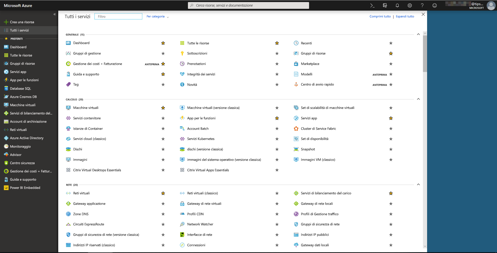
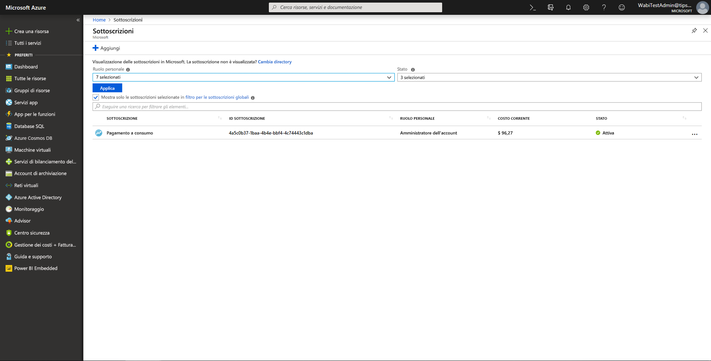
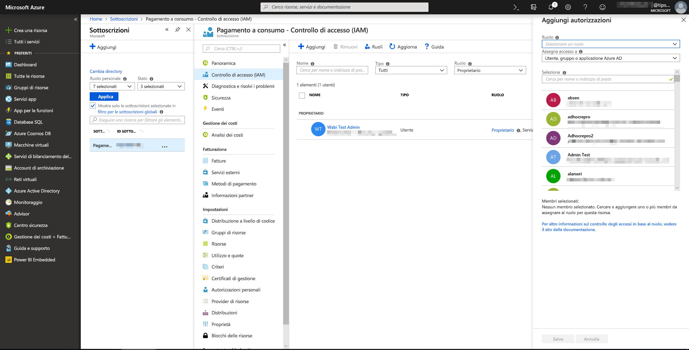
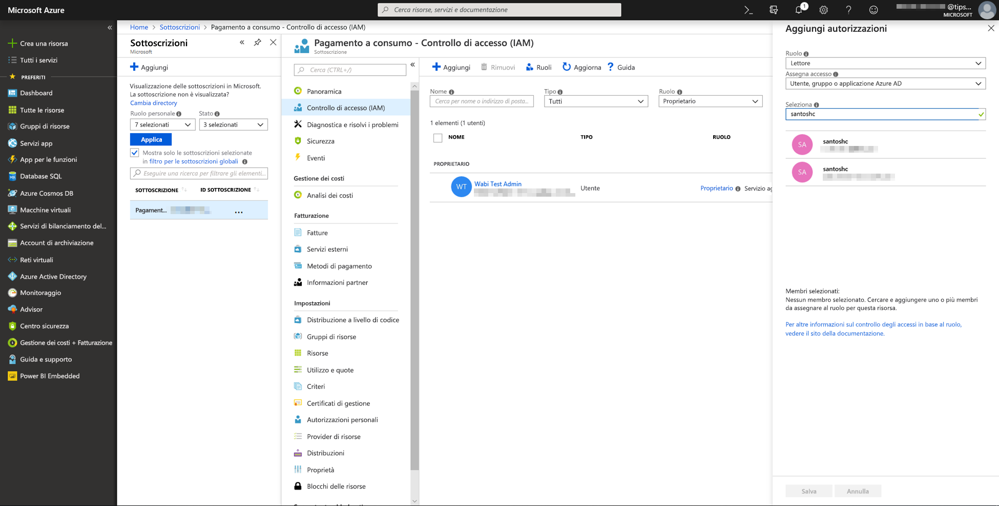
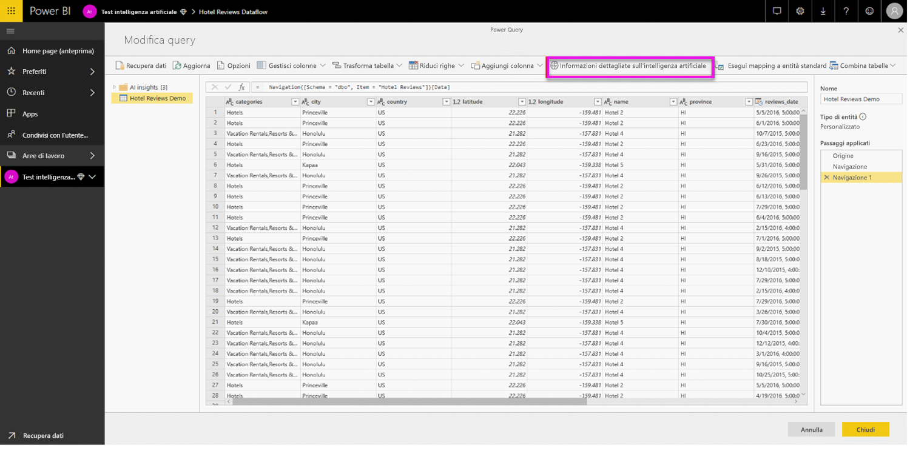
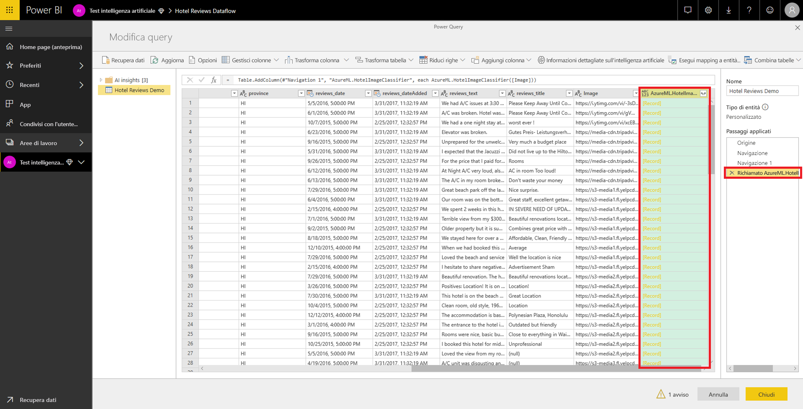
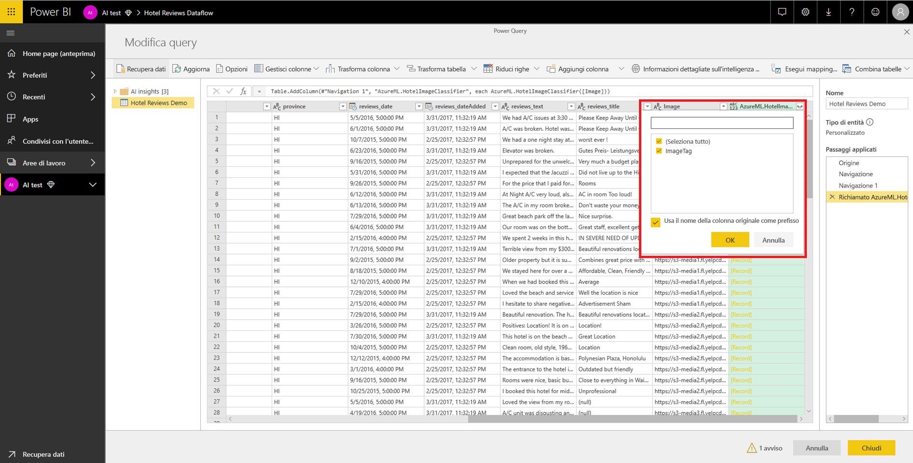

# Integrazione di Azure Machine Learning in Power BI (anteprima)

Numerose organizzazioni usano modelli di **Machine Learning** per ottenere informazioni dettagliate e stime migliori sulle proprie attività aziendali. La possibilità di visualizzare e richiamare informazioni dettagliate da questi modelli in report, dashboard e altri strumenti di analisi facilita la distribuzione di queste informazioni agli utenti aziendali che ne hanno maggiormente bisogno.  Ora con Power BI è facile incorporare le informazioni dettagliate dei modelli ospitati nel servizio Azure Machine Learning, usando semplici movimenti di puntamento e clic.

Per usare questa funzionalità, un data scientist può semplicemente concedere all'analista di Power BI l'accesso al modello di Azure Machine Learning usando il portale di Azure.  Quindi, all'inizio di ogni sessione, Power Query individua tutti i modelli di Azure Machine Learning a cui l'utente ha accesso e li espone come funzioni dinamiche di Power Query.  L'utente può quindi richiamare queste funzioni accedendovi dalla barra multifunzione dell'editor di Power Query o richiamando direttamente la funzione M. Power BI inoltre invia in batch automaticamente le richieste di accesso quando richiama il modello di Azure Machine Learning per un set di righe, al fine di ottenere prestazioni migliori.

Questa funzionalità è attualmente supportata solo per i flussi di dati di Power BI e per Power Query online nel servizio Power BI.

Per altre informazioni sui flussi di dati, vedere [Preparazione dei dati self-service in Power BI](service-dataflows-overview.md).

Per altre informazioni su Azure Machine Learning, vedere:

- Panoramica:  [Informazioni sul servizio Azure Machine Learning](https://docs.microsoft.com/azure/machine-learning/service/overview-what-is-azure-ml)
- Guide di avvio rapido ed esercitazioni per Azure Machine Learning:  [Documentazione di Azure Machine Learning](https://docs.microsoft.com/azure/machine-learning/)

## Concedere a un utente di Power BI l'accesso al modello di Azure Machine Learning

Per accedere a un modello di Azure Machine Learning da Power BI, l'utente deve avere accesso in **lettura** alla sottoscrizione di Azure.  Inoltre:

- Per i modelli di Machine Learning Studio, accesso in **lettura** al servizio Web Machine Learning Studio
- Per i modelli del servizio Machine Learning, accesso in **lettura** all'area di lavoro del servizio Machine Learning

La procedura in questo articolo spiega come concedere a un utente di Power BI l'accesso a un modello ospitato nel servizio Azure Machine Learning, in modo che possa accedere a questo modello come una funzione di Power Query.  Per altre informazioni, vedere [Gestire l'accesso alle risorse di Azure usando il controllo degli accessi in base al ruolo e il portale di Azure](https://docs.microsoft.com/azure/role-based-access-control/role-assignments-portal).

1. Accedere al [portale di Azure](https://portal.azure.com).

2. Passare alla pagina **Sottoscrizioni**. La pagina **Sottoscrizioni** è disponibile nell'elenco **Tutti i servizi** nel menu di spostamento a sinistra del portale di Azure.

    

3. Selezionare la propria sottoscrizione.

    

4. Selezionare **Controllo di accesso (IAM)** e quindi il pulsante **Aggiungi**.

    

5. Selezionare **Lettore** come ruolo. Selezionare l'utente di Power BI a cui si vuole concedere l'accesso al modello di Azure Machine Learning.

    

6. Selezionare **Salva**.

7. Ripetere i passaggi da 3 a 6 per assegnare all'utente il ruolo **Lettore** per l'accesso allo specifico servizio Web di Machine Learning Studio *o* all'area di lavoro del servizio Machine Learning che ospita il modello.

## Individuazione dello schema per i modelli del servizio Machine Learning

I data scientist usano principalmente Python per sviluppare, e persino per distribuire, i modelli di Machine Learning per il servizio Machine Learning.  A differenza di Machine Learning Studio, che consente di automatizzare l'attività di creazione di un file di schema per il modello, nel caso del servizio Machine Learning il data scientist deve generare esplicitamente il file di schema mediante Python.

Questo file di schema deve essere incluso nel

## Richiamare il modello di Azure Machine Learning in Power BI

È possibile richiamare un modello di Azure Machine Learning al quale si ha accesso direttamente dall'editor di Power Query nel flusso di dati. Per accedere ai modelli di Azure Machine Learning, selezionare il pulsante **Modifica** relativo all'entità che si vuole arricchire con le informazioni dettagliate del modello di Azure Machine Learning, come illustrato nell'immagine seguente.

Selezionando il pulsante **Modifica** viene aperto l'editor di Power Query per le entità del flusso di dati.

Selezionare il pulsante **Informazioni dettagliate sull'intelligenza artificiale** sulla barra multifunzione e quindi selezionare la cartella _Azure Machine Learning Models_ (Modelli di Azure Machine Learning) nel menu di spostamento a sinistra. Tutti i modelli di Azure Machine Learning a cui si ha accesso sono elencati qui come funzioni di Power Query. Inoltre, i parametri di input del modello di Azure Machine Learning vengono automaticamente mappati ai parametri della funzione di Power Query corrispondente.

Per richiamare un modello di Azure Machine Learning è possibile specificare una qualsiasi delle colonne dell'entità selezionata come input dall'elenco a discesa. Si può anche specificare un valore di costante da usare come input attivando l'icona della colonna a sinistra della finestra di dialogo di input.

Selezionare **Richiama** per visualizzare l'anteprima dell'output del modello di Azure Machine Learning come nuova colonna nella tabella delle entità. Il richiamo del modello verrà visualizzato anche come passaggio applicato per la query.

Se il modello restituisce più parametri di output, questi vengono raggruppati in un unico record nella colonna di output. È possibile espandere la colonna per produrre singoli parametri di output in colonne separate.

Dopo il salvataggio del flusso di dati, il modello viene richiamato automaticamente ogni volta che il flusso di dati viene aggiornato con le righe nuove o modificate nella tabella delle entità.

## Passaggi successivi

Questo articolo ha fornito una panoramica sull'integrazione di Machine Learning nel servizio Power BI. Potrebbero essere interessanti e utili anche gli articoli seguenti. 

* [Esercitazione: Richiamare un modello di Machine Learning Studio in Power BI (anteprima)](service-tutorial-invoke-machine-learning-model.md)
* [Esercitazione: Uso di Servizi cognitivi in Power BI](service-tutorial-use-cognitive-services.md)
* [Servizi cognitivi in Power BI (anteprima)](service-cognitive-services.md)

Per altre informazioni sui flussi di dati, è possibile leggere questi articoli:
* [Creare e usare flussi di dati in Power BI](service-dataflows-create-use.md)
* [Uso delle entità calcolate in Power BI Premium (anteprima)](service-dataflows-computed-entities-premium.md)
* [Uso di flussi di dati con origini dati locali (anteprima)](service-dataflows-on-premises-gateways.md)
* [Risorse per sviluppatori per i flussi di dati Power BI (anteprima)](service-dataflows-developer-resources.md)
* [Integrazione di flussi di dati e Azure Data Lake (anteprima)](service-dataflows-azure-data-lake-integration.md)

