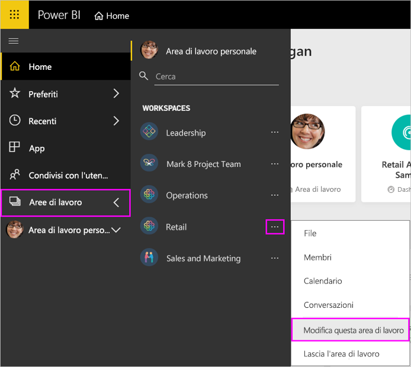
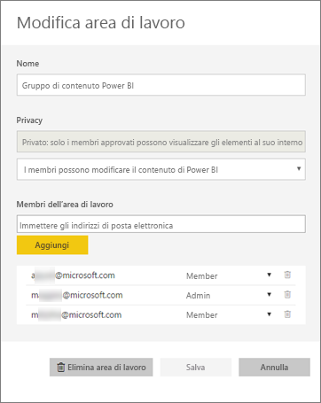
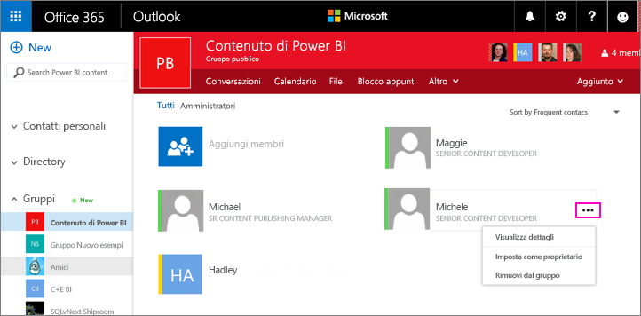
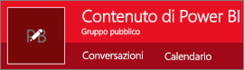
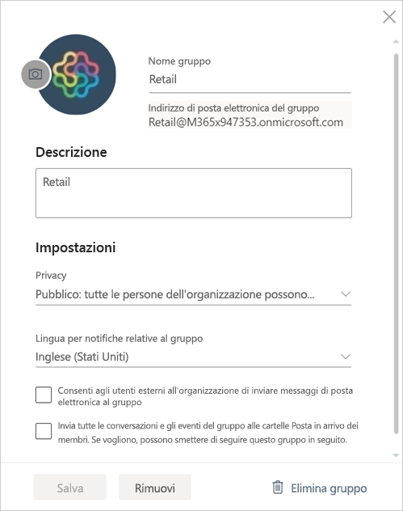

# Gestire l'area di lavoro per le app in Power BI e Office 365
Il creatore o l'amministratore di un'[area di lavoro per le app in Power BI](service-create-distribute-apps.md) o in Office 365 può gestire alcuni aspetti dell'area di lavoro in Power BI, mentre altri devono essere gestiti in Office 365. 

> [!NOTE]
> L'anteprima della nuova esperienza dell'area di lavoro modificherà la relazione tra le aree di lavoro di Power BI e i gruppi di Office 365. Non verrà creato automaticamente un gruppo di Office 365 ogni volta che si crea una delle nuove aree di lavoro. Informazioni sulla [creazione di nuove aree di lavoro (anteprima)](service-create-the-new-workspaces.md)

**In Power BI** è possibile:

* Aggiungere o rimuovere membri dell'area di lavoro per le app, nonché impostare un membro dell'area di lavoro come amministratore.
* Modificare il nome dell'area di lavoro per le app.
* Eliminare l'area di lavoro per le app.

**In Office 365** è possibile:

* Aggiungere o rimuovere i membri del gruppo dell'area di lavoro per le app, nonché impostare un membro come amministratore.
* Modificare il nome, l'immagine, la descrizione e altre impostazioni del gruppo.
* Visualizzare l'indirizzo di posta elettronica del gruppo.
* Eliminare il gruppo.

Per diventare amministratore o membro di un'area di lavoro per le app è necessaria una [licenza Power BI Pro](service-features-license-type.md). Anche gli utenti delle app devono disporre di una licenza Power BI Pro, a meno che l'area di lavoro per le app non sia inclusa in una capacità di Power BI Premium. Per informazioni dettagliate, leggere [What is Power BI Premium?](service-premium-what-is.md) (Che cos'è Power BI Premium?).

## Modificare l'area di lavoro per le app in Power BI
1. Nel servizio Power BI, fare clic sulla freccia accanto ad **Aree di lavoro** > selezionare i puntini di sospensione ( **…** ) accanto al nome dell'area di lavoro per le app > **Modifica area di lavoro**. 
   
   
   
   > [!NOTE]
   > L'opzione **Modifica area di lavoro** viene visualizzata solo se l'utente è un amministratore dell'area di lavoro per le app.
   > 
   > 
2. In questa schermata è possibile rinominare, aggiungere o rimuovere membri o eliminare l'area di lavoro per le app. 
   
   
3. Selezionare **Salva** o **Annulla**.

## Modificare le proprietà dell'area di lavoro per le app di Power BI in Office 365
1. Nel servizio Power BI fare clic sulla freccia accanto ad **Aree di lavoro** > selezionare i puntini di sospensione ( **…** ) accanto al nome dell'area di lavoro per le app > **Membri**. 
   
   
   
   Verrà aperta la visualizzazione del gruppo di Outlook per Office 365 relativa all'area di lavoro per le app.
   
   Potrebbe essere necessario accedere all'account aziendale.
2. Toccare i puntini di sospensione ( **…** ) accanto al nome di un membro per impostarlo come amministratore o eliminarlo dall'area di lavoro per le app. 
   
   

## Aggiungere un'immagine e impostare altre proprietà dell'area di lavoro nel gruppo di Office 365
Quando si distribuisce l'app dall'area di lavoro per le app, l'immagine aggiunta qui diventerà l'immagine dell'app. Vedere la sezione [Aggiungere un'immagine all'app](service-create-workspaces.md#add-an-image-to-your-office-365-app-workspace-optional) dell'articolo [Creare le nuove aree di lavoro](service-create-workspaces.md).

1. Nella visualizzazione dell'area di lavoro per le app in Outlook per Office 365 selezionare l'immagine del gruppo per modificare le proprietà dell'area di lavoro del gruppo.
   
   
2. Qui è possibile modificare il nome, la descrizione e la lingua, aggiungere un'immagine e impostare altre proprietà.
   
   
3. Selezionare **Salva** o **Rimuovi**.

## Passaggi successivi
* [Pubblicare app con dashboard e report in Power BI](service-create-distribute-apps.md)
* Altre domande? [Provare la community di Power BI](http://community.powerbi.com/)

