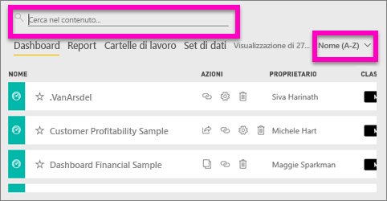
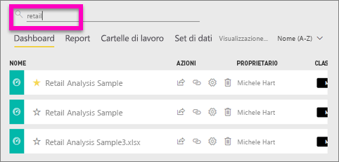
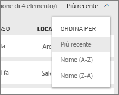
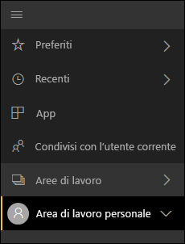
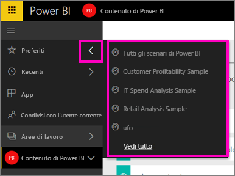

# Spostamento: ricerca e ordinamento del contenuto nel servizio Power BI
Sono disponibili vari modi per spostarsi all'interno del contenuto nel servizio Power BI. Nelle aree di lavoro il contenuto è organizzato in base al tipo: dashboard, report, cartelle di lavoro e set di dati.  Il contenuto è anche organizzato in base all'utilizzo: Preferiti, recenti, app, condivisi con l'utente corrente e in primo piano. Questi percorsi diversi per il contenuto consentono di trovare rapidamente ciò che serve nel servizio Power BI.  

>[!NOTE] 
>Questo articolo si applica al servizio Power BI (app.powerbi.com) e non a Power BI Desktop.

## Spostamento tra le aree di lavoro

Il servizio Power BI separa il contenuto dell'area di lavoro in base al tipo: dashboard, report, cartelle di lavoro e set di dati. Alla selezione di un'area di lavoro, verrà visualizzata questa organizzazione. Nell'esempio seguente, l'area di lavoro delle app è denominata "Sales and marketing app sample" e contiene 2 dashboard, 6 report, 1 cartella di lavoro e 5 set di dati.

________________________________________

## Ricerca e ordinamento nelle aree di lavoro
Un'area di lavoro include quattro schede di contenuto: Dashboard, Report, Cartelle di lavoro e Set di dati.  Ciascuna di queste schede contiene un campo di ricerca e un pulsante di ordinamento.  Quando si inizia a usare il servizio Power BI, potrebbero non risultare utili perché ci saranno solo uno o due elementi per ogni scheda.  Tuttavia, nel corso del tempo si potrebbero avere lunghi elenchi di contenuto.  Usare la ricerca e l'ordinamento per trovare facilmente le informazioni necessarie.

* Immettere un termine di ricerca per trovare una corrispondenza nella schermata corrente
  
   
* Selezionare il pulsante di ordinamento per visualizzare le opzioni per la pagina corrente. Le opzioni sono da ordinare in base al nome o al proprietario.
  
   

## Spostamento con la barra di spostamento sinistra
Il riquadro di spostamento a sinistra classifica i contenuti in modo che sia ancora più semplice trovare le informazioni necessarie, rapidamente.  

Il contenuto creato per uso personale è disponibile nell'**Area di lavoro personale**, il contenuto che si crea e condivide con un gruppo è disponibile in un'**area di lavoro per le app**, il contenuto condiviso con l'utente è disponibile in **Condivisi con l'utente corrente** e il contenuto visualizzato per ultimo è disponibile in **Recenti**.

È anche possibile contrassegnare il contenuto come [preferito](service-dashboard-favorite.md) e [in primo piano](service-dashboard-featured.md). Scegliere un dashboard che si prevede di visualizzare più spesso e impostarlo come dashboard *in primo piano*. Ogni volta che si apre il servizio Power BI, sarà il dashboard che verrà visualizzato per primo. Se si visitano spesso determinati dashboard e app, è possibile impostarli come preferiti in modo che siano sempre disponibili nel riquadro di spostamento a sinistra.

.

## Considerazioni e risoluzione dei problemi
* Per i set di dati, l'opzione **Ordina per** proprietario non è disponibile.

## Passaggi successivi
[Power BI - Concetti di base](service-basic-concepts.md)

Altre domande? [Provare la community di Power BI](http://community.powerbi.com/)