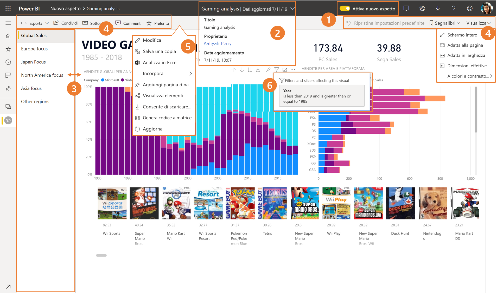
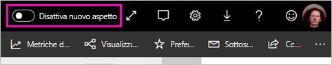
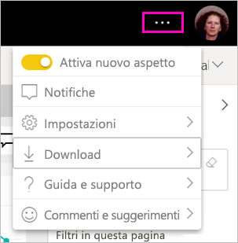
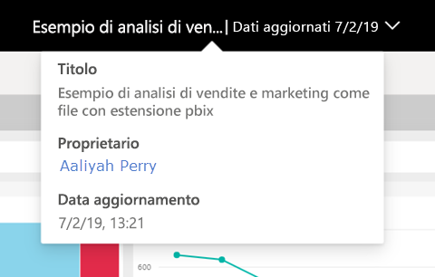
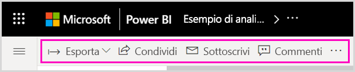
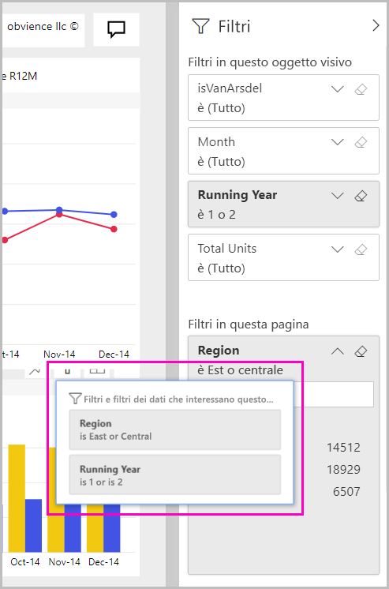

# Nuovo aspetto del servizio Power BI

Il servizio Power BI (app.powerbi.com) ha un nuovo aspetto che rende più semplice la visualizzazione e l'interazione con i report. Il nuovo aspetto, più semplice, si basa sulla familiarità con altri prodotti Microsoft. Nel servizio Power BI il contenuto del report viene messo in evidenza grazie al passaggio a una combinazione di colori più chiara e all'aggiornamento delle icone. 

Per informazioni sul nuovo aspetto di **Power BI Desktop**, vedere [Usare la barra multifunzione aggiornata in Power BI Desktop](create-reports/desktop-ribbon.md).

Ecco una panoramica delle modifiche apportate con il nuovo aspetto. Per informazioni dettagliate, vedere le sezioni numerate:

Per trovare un'azione specifica, vedere [Nuovo aspetto: dove sono le azioni?](service-new-look-where-actions.md)

## Presentazione rapida delle modifiche

Questa animazione illustra le modifiche apportate all'aspetto dei report.

## 1. Acconsentire esplicitamente al nuovo aspetto

Qualsiasi utente del servizio Power BI può acconsentire esplicitamente al nuovo aspetto. È sufficiente scorrere per passare da **Disattiva nuovo aspetto** ad **Attiva nuovo aspetto**.

Se è necessario tornare all'aspetto precedente, è sufficiente scorrere per tornare a **Disattiva nuovo aspetto** . Se questo controllo non è visualizzato, selezionare il menu con i puntini di sospensione nell'angolo in alto a destra.

## 2. Visualizzare i dettagli del report 

È possibile visualizzare rapidamente i dettagli, ad esempio la data dell'ultimo aggiornamento e le informazioni di contatto, direttamente nel banner superiore.  Aprire il menu per visualizzare dettagli aggiuntivi relativi al report. È anche possibile inviare un messaggio di posta elettronica al proprietario del report.

## 3. Elenco verticale delle pagine 
I nomi delle pagine del report sono ora inclusi in un elenco in un riquadro verticale. Sono ben in vista, non passano inosservati e hanno un aspetto che ricorda la navigazione in Word e PowerPoint. È possibile aumentare o ridurre il resto dell'area del report ridimensionando il riquadro verticale.

## 4. Barra delle azioni semplificata 

La barra delle azioni aggiornata nella parte superiore include i comandi più rilevanti, ben in vista per chi usa i report. È più facile esportare, sottoscrivere, collaborare con altri utenti e approfondire le informazioni tramite filtri e segnalibri.

## 5. Dove sono i comandi del report?

Rispetto all'aspetto precedente, non è stata rimossa alcuna funzionalità. È possibile trovare i comandi aggiuntivi, ad esempio per modificare, salvare una copia e così via, espandendo i puntini di sospensione (menu ...) sulla barra delle azioni. È anche possibile accedere alle metriche di utilizzo dall'elenco di contenuti.

### Dove sono le azioni del menu File?

Si è alla ricerca delle azioni del menu **File**? Le azioni che in precedenza si trovavano nel menu **File** sono ora anch'esse disponibili nel menu **Altre opzioni** (...). 

## 6. Nuova esperienza di filtro

Gli aggiornamenti recenti, come la visualizzazione dei filtri applicati e il nuovo riquadro dei filtri, sono disponibili per impostazione predefinita con il nuovo aspetto. Anche se il designer di un report non ha eseguito l'aggiornamento alla nuova esperienza dei filtri, verrà visualizzato il nuovo riquadro dei filtri.

## Nuovo aspetto del dashboard 

Anche i dashboard hanno una barra delle azioni semplificata, proprio come report e app, per offrire un'esperienza coerente pur mantenendo le differenze funzionali. Ecco una presentazione dettagliata delle azioni in un dashboard.
 

## Nessuna cambiamento per la modalità di modifica 

L'esperienza di creazione è rimasta simile a quella della versione Desktop. Le modifiche legate al nuovo aspetto sono valide solo per la visualizzazione di lettura.

## Passaggi successivi

- [Usare la barra multifunzione aggiornata in Power BI Desktop](create-reports/desktop-ribbon.md)
- [Acconsentire esplicitamente al nuovo aspetto per le aree di lavoro](collaborate-share/service-workspaces-new-look.md)
- [Power BI per i consumatori](consumer/end-user-consumer.md)
