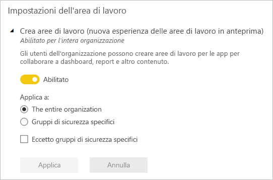

# Organizzare il lavoro in nuove aree di lavoro in Power BI

 *Le aree di lavoro* posizioni per collaborare con colleghi alla creazione di raccolte di dashboard, report e i report impaginati. La nuova esperienza dell'area di lavoro consente di gestire meglio l'accesso al contenuto. Questo articolo descrive le nuove aree di lavoro e le differenze rispetto ai classici aree di lavoro.  Come con le aree di lavoro classici, comunque usarli per creare e distribuire le app. Ottenere informazioni su come [creare una nuova esperienza dell'area di lavoro](service-create-the-new-workspaces.md).

La nuova esperienza dell'area di lavoro ha raggiunto la disponibilità generale (GA) ed è ora l'area di lavoro predefinita. È comunque possibile continuare a creare e usare [aree di lavoro classici](service-create-workspaces.md) basate sui gruppi di Office 365. 

> [!NOTE]
> Per applicare la sicurezza a livello di riga (RLS) per Power BI Pro agli utenti di cercare contenuto in un'area di lavoro, continuare a usare [aree di lavoro classici](service-create-workspaces.md). Selezionare il **i membri possono solo visualizzare il contenuto di Power BI** opzione. In alternativa, pubblicare un'app di Power BI agli utenti oppure utilizzare la condivisione per distribuire il contenuto. Il ruolo di Visualizzatore imminente abilitando questo scenario in futuro in nuove aree di lavoro dell'area di lavoro esperienza.

Con le nuove aree di lavoro, è possibile:

- Assegnare ruoli dell'area di lavoro a gruppi di utenti: gruppi di sicurezza, liste di distribuzione, gruppi di Office 365 e singoli utenti.
- Creare un'area di lavoro in Power BI senza creare un gruppo di Office 365.
- Usare ruoli dell'area di lavoro con maggiore granularità per aumentare la flessibilità di gestione delle autorizzazioni in un'area di lavoro.

Quando si crea una delle nuove aree di lavoro, non si crea un gruppo di Office 365 sottostante associato. Tutta l'amministrazione dell'area di lavoro viene gestita da Power BI e non da Office 365. Nella nuova esperienza dell'area di lavoro, è ora possibile aggiungere un gruppo di Office 365 nell'elenco di accesso dell'area di lavoro per continuare a gestire l'accesso utente ai contenuti tramite gruppi di Office 365.

## Amministrazione di nuove aree di lavoro dell'area di lavoro esperienza
Amministrazione di nuove aree di lavoro dell'area di lavoro esperienza è ora in Power BI, gli amministratori di Power BI scegliere quali utenti in un'organizzazione possono creare aree di lavoro. Possono anche gestire e ripristinare l'area di lavoro. A tale scopo è necessario usare il portale di amministrazione di Power BI o CmdLets di PowerShell. Per le aree di lavoro basati sui gruppi di Office 365 classici, amministrazione continua a verificarsi nel portale di amministrazione di Office 365 e Azure Active Directory.

Nelle **delle impostazioni dell'area di lavoro** nel portale di amministrazione, gli amministratori possono usare le crea aree di lavoro (nuova esperienza di area di lavoro) l'impostazione per consentire tutti gli utenti o a nessuno di un'organizzazione per creare le aree di lavoro di esperienza nuova area di lavoro. Possono anche limitare la creazione ai membri di gruppi di sicurezza specifici.

> [!NOTE]
> Creare le aree di lavoro (nuova esperienza di area di lavoro) configurazione delle impostazioni predefinite per consentire solo gli utenti possono creare gruppi di Office 365 per creare le nuove aree di lavoro in Power BI. Assicurarsi di impostare un valore nel portale di amministrazione di Power BI per garantire agli utenti appropriati possono creare nuova area di lavoro le aree di lavoro di esperienza.

Il [elenco di aree di lavoro è disponibile](service-admin-portal.md#workspaces) nel portale di amministrazione di Power BI. 

## Nuove aree di lavoro affiancate con aree di lavoro classici

Le aree di lavoro nuove, aggiornate e aree di lavoro esistenti classici coesistere side-by-side ed è possibile creare una. La nuova esperienza dell'area di lavoro è il tipo di area di lavoro predefinito. Power BI continua a essere elencato tutti i gruppi di Office 365 l'utente è membro in Power BI per evitare di modificare i flussi di lavoro esistente. Per informazioni su come creare una nuova area di lavoro, leggere [creare nuove aree di lavoro](service-create-the-new-workspaces.md). Per informazioni su come creare un'area di lavoro classico, leggere [creare le aree di lavoro classici](service-create-workspaces.md).

## Ruoli nelle nuove aree di lavoro

Per concedere l'accesso a una nuova area di lavoro, aggiungere singoli utenti o gruppi di utenti a uno dei ruoli dell'area di lavoro: i membri, i collaboratori o amministratori. A tutti i membri in un gruppo di utenti viene assegnato il ruolo definito. Se un utente è in diversi gruppi di utenti, ricevono il massimo livello di autorizzazione fornito dai ruoli che vengono assegnati.

I ruoli consentono di gestire chi può fare cosa in un'area di lavoro per permettere ai team di collaborare. Le nuove aree di lavoro consentono di assegnare ruoli a singoli utenti e gruppi di utenti: gruppi di sicurezza, gruppi di Office 365 e liste di distribuzione. 

Quando si assegnano i ruoli a un gruppo di utenti, i singoli utenti del gruppo possono accedere al contenuto. Se si annidano gruppi di utenti, tutti gli utenti contenuti sono autorizzati. Un utente incluso in più gruppi di utenti con ruoli diversi ottiene il livello più elevato dell'autorizzazione concessa. 

Nelle nuove aree di lavoro sono disponibili tre ruoli: amministratori, membri e collaboratori.

|Capacità   | Amministratore  | Membro  | Collaboratore  | 
|---|---|---|---|
| Aggiornare ed eliminare l'area di lavoro.  | X  |   |   |
| Aggiungere/rimuovere utenti, inclusi altri amministratori.  | X  |   |   |
| Aggiungere membri o altri utenti con autorizzazioni inferiori.  |  X | X  |   |
| Pubblicare e aggiornare un'app. |  X | X  |   |
| Condividere un elemento o condividere un'app. |  X | X  |   |
| Consentire ad altri utenti di ricondividere a loro volta gli elementi. |  X | X  |   |
| Creare, modificare ed eliminare contenuto nell'area di lavoro.  |  X | X  | X  |
| Pubblicare report nell'area di lavoro, eliminare contenuto. |  X | X  | X  |
 
 
## Gestione delle licenze
Tutti gli utenti che vengono aggiunti a un'area di lavoro devono possedere una licenza di Power BI Pro. Nell'area di lavoro tutti gli utenti possono collaborare sui dashboard e i report che si intende pubblicare e rendere disponibili a un pubblico più ampio o all'intera organizzazione. Per distribuire contenuto ad altri utenti all'interno dell'organizzazione, è possibile assegnare loro licenze di Power BI Pro oppure assegnare l'area di lavoro a una capacità Power BI Premium.

> [!NOTE]
> Pubblicazione di report alla nuova esperienza dell'area di lavoro dispone più rigido imposizione licenze regole. Gli utenti che provano a pubblicare da Power BI Desktop o altri client di strumenti senza una licenza Pro visualizzano l'errore "solo gli utenti con licenze di Power BI Pro possono pubblicare questa area di lavoro."

## Quali sono le differenze tra le nuove aree di lavoro e quelle correnti?

Con le nuove aree di lavoro, alcune funzionalità sono state riprogettate. Ecco le modifiche che è possibile prevedere permanenti. 

* Creazione di queste aree di lavoro non verrà creato gruppi di Office 365 come avviene per le aree di lavoro classici. È ora possibile usare un gruppo di Office 365 per consentire agli utenti l'accesso all'area di lavoro mediante l'assegnazione di un ruolo. 
* Nelle aree di lavoro classici, è possibile aggiungere solo singoli utenti per i membri e gli elenchi di amministratore. Nelle nuove aree di lavoro è possibile aggiungere più gruppi di sicurezza di Active Directory, liste di distribuzione o gruppi di Office 365 a questi elenchi per semplificare la gestione degli utenti. 
- È possibile creare pacchetti di contenuto aziendali da un'area di lavoro classico. Non è possibile crearne uno dalle nuove aree di lavoro.
- È possibile usare pacchetti di contenuto aziendali da un'area di lavoro classico. Non è possibile usarne uno dalle nuove aree di lavoro.

## Elenco dei contatto dell'area di lavoro
Il nuovo **elenco contatti** funzionalità consente di specificare gli utenti che ricevono notifiche sui problemi che si verificano nell'area di lavoro. Per impostazione predefinita, qualsiasi utente o gruppo specificato come un'area di lavoro amministrazione è una notifica, ma è possibile personalizzare l'elenco. Gli utenti o gruppi elencati nell'elenco dei contatti verranno visualizzati nell'interfaccia utente (UI) per consentire agli utenti informazioni correlate all'area di lavoro. 

Altre informazioni, vedere la [impostando l'elenco dei contatti dell'area di lavoro](service-create-the-new-workspaces.md#workspace-contact-list).

## OneDrive dell'area di lavoro
La funzionalità di OneDrive dell'area di lavoro consente di configurare un gruppo di Office 365 con archiviazione file di raccolta documenti di SharePoint è disponibile per gli utenti dell'area di lavoro. Il gruppo deve essere creato di fuori di Power BI. 

Power BI non sincronizzare le autorizzazioni di utenti o gruppi che sono configurati per l'area di lavoro di accedere con l'appartenenza al gruppo di Office 365. La procedura consigliata consiste nel gestire l'accesso dell'area di lavoro tramite la stesso gruppo di Office 365 archiviazione file di cui si configura questa impostazione. 

Ottenere informazioni su come [impostata e l'area di lavoro di OneDrive accede](service-create-the-new-workspaces.md#workspace-onedrive).  
   
## Il controllo
Le attività seguenti sono controllate da Power BI per nuove aree di lavoro dell'area di lavoro esperienza.

| Nome descrittivo |   Nome operazione |
|---|---|
| Cartella di Power BI creata | CreateFolder |
| Cartella di Power BI eliminata | DeleteFolder |
| Cartella di Power BI aggiornata | UpdateFolder |
| Accesso alla cartella di Power BI aggiornato| UpdateFolderAccess |

Altre informazioni, vedere [il controllo di Power BI](service-admin-auditing.md#activities-audited-by-power-bi).

## Limitazioni e considerazioni

Limitazioni da tenere presenti:

- le aree di lavoro possono contenere un massimo di 1.000 set di dati o 1.000 report per ogni set di dati. 
- Una persona con una licenza di Power BI Pro può essere un membro di un massimo 1.000 aree di lavoro.
- Power BI publisher per Excel non è supportata.

## Funzionalità delle aree di lavoro che si comportano in modo diverso

Alcune funzionalità delle nuove aree di lavoro si comportano diversamente da quelle delle aree di lavoro correnti. Queste differenze sono intenzionali, in base al feedback abbiamo ricevuto dai clienti e consentire un approccio più flessibile per la collaborazione con le aree di lavoro:

- Applicazione delle licenze: Pubblicazione di report alla nuova esperienza dell'area di lavoro consente di applicare le regole di gestione delle licenze esistenti che richiedono una licenza Power BI Pro per gli utenti collaborano in aree di lavoro o la condivisione del contenuto ad altri utenti nel servizio Power BI. Gli utenti senza una licenza Pro visualizzano l'errore "solo gli utenti con licenze Powre BI Pro possono pubblicare questa area di lavoro."
- Ricondivisione/Non è possibile ricondividere per i membri: funzionalità sostituita dal ruolo Collaboratore
- Aree di lavoro di sola lettura: invece di concedere agli utenti l'accesso di sola lettura a un'area di lavoro, si assegnerà agli utenti il ruolo futuro di Visualizzatore, che consente un accesso di sola lettura simile al contenuto in un'area di lavoro.
- Il pulsante **Lascia l'area di lavoro** non è disponibile.

## Domande frequenti

**Sono disponibili collegamenti al contenuto esistente interessate dalla nuova area di lavoro esperienza a livello generale**

No. I collegamenti agli elementi esistenti nelle aree di lavoro classici non sono interessati dalla nuova esperienza dell'area di lavoro. La disponibilità generale (GA) della nuova esperienza dell'area di lavoro viene modificato l'area di lavoro predefinita è creare, ma non modifica le aree di lavoro esistente. 

**Le aree di lavoro aggiornati alla nuova esperienza con disponibilità generale dell'area di lavoro esistenti**

No. La nuova GA esperienza dell'area di lavoro cambia solo il tipo di area di lavoro predefinito alla nuova esperienza dell'area di lavoro. Classici aree di lavoro esistenti che sono basate sui gruppi di Office 365 rimangono invariati.

**Le aree di lavoro comunque creati automaticamente gruppi di Office 365**

Sì. Poiché sono supportati entrambi i tipi di aree di lavoro affiancate, si continuano a elencare tutti i gruppi di Office 365 l'utente può accedere a nell'elenco di aree di lavoro.

## Passaggi successivi
* [Creare le nuove aree di lavoro in Power BI](service-create-the-new-workspaces.md)
* [Creare le aree di lavoro classici](service-create-workspaces.md)
* [Installare e usare app in Power BI](service-create-distribute-apps.md)
* Domande? [Provare a rivolgersi alla community di Power BI](http://community.powerbi.com/)
