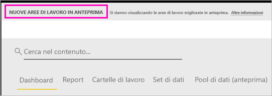

# Organizzare il lavoro nelle nuove aree di lavoro (anteprima) in Power BI

Le aree di lavoro sono spazi per collaborare con i colleghi per creare raccolte di dashboard e report. È possibile quindi riunire queste raccolte in *app* da distribuire all'intera organizzazione o a specifici utenti o gruppi. Power BI ha introdotto una nuova esperienza dell'area di lavoro in anteprima. 

Con le nuove aree di lavoro in anteprima è possibile:

- Assegnare ruoli dell'area di lavoro a gruppi di utenti: gruppi di sicurezza, liste di distribuzione, gruppi di Office 365 e singoli utenti.
- Creare un'area di lavoro in Power BI senza creare un gruppo di Office 365.
- Usare ruoli dell'area di lavoro con maggiore granularità per aumentare la flessibilità di gestione delle autorizzazioni in un'area di lavoro.

Informazioni su come [creare una delle nuove aree di lavoro](service-create-the-new-workspaces.md).
 
Quando si crea una delle nuove aree di lavoro, non si crea un gruppo di Office 365 sottostante associato. Tutta l'amministrazione dell'area di lavoro viene gestita da Power BI e non da Office 365. È comunque possibile aggiungere un gruppo di Office 365 all'area di lavoro per continuare a gestire l'accesso degli utenti al contenuto tramite i gruppi di Office 365. Tuttavia, è anche possibile usare gruppi di sicurezza, liste di distribuzione e aggiungere singoli utenti direttamente in Power BI in modo da gestire con maggiore flessibilità l'accesso all'area di lavoro. Dato che l'amministrazione dell'area di lavoro avviene ora in Power BI, gli amministratori di Power BI decidono chi può creare aree di lavoro in un'organizzazione. In **Impostazioni dell'area di lavoro** nel portale di amministrazione gli amministratori possono consentire a chiunque o a nessun utente nell'organizzazione di creare aree di lavoro. Possono anche limitare la creazione ai membri di gruppi di sicurezza specifici.

Altre informazioni sul [portale di amministrazione di Power BI](service-admin-portal.md).

## Implementare le nuove aree di lavoro

Durante il periodo di anteprima, è possibile creare e usare sia le aree di lavoro nuove che quelle precedenti. Al termine dell'anteprima per le nuove aree di lavoro, quando queste diventeranno disponibili a livello generale, sarà possibile usare le aree di lavoro precedenti ancora per qualche tempo. Non sarà tuttavia possibile crearne di nuove e sarà necessario preparare la migrazione delle aree di lavoro all'infrastruttura delle nuove aree di lavoro. Non c'è di che preoccuparsi, saranno disponibili vari mesi per completare la migrazione.

## Ruoli nelle nuove aree di lavoro

I gruppi di utenti o i singoli utenti vengono aggiunti alle nuove aree di lavoro come membri, collaboratori o amministratori. A tutti i membri in un gruppo di utenti viene assegnato il ruolo definito. Se un utente singolo appartiene a più gruppi di utenti, ottiene il livello di autorizzazione più elevato specificato dal ruolo.  Per una spiegazione dei diversi ruoli disponibili, vedere [Ruoli nelle nuove aree di lavoro](#roles-in-the-new-workspaces) più avanti in questo articolo.

Tutti gli utenti che vengono aggiunti a un'area di lavoro devono possedere una licenza di Power BI Pro. Nell'area di lavoro tutti gli utenti possono collaborare sui dashboard e i report che si intende pubblicare e rendere disponibili a un pubblico più ampio o all'intera organizzazione. Per distribuire contenuto ad altri utenti all'interno dell'organizzazione, è possibile assegnare loro licenze di Power BI Pro oppure assegnare l'area di lavoro a una capacità Power BI Premium.

I ruoli consentono di gestire chi può fare cosa in un'area di lavoro per permettere ai team di collaborare. Le nuove aree di lavoro consentono di assegnare ruoli a singoli utenti e gruppi di utenti: gruppi di sicurezza, gruppi di Office 365 e liste di distribuzione. 

Quando si assegnano i ruoli a un gruppo di utenti, i singoli utenti del gruppo possono accedere al contenuto. Se si annidano gruppi di utenti, tutti gli utenti contenuti sono autorizzati. Un utente incluso in più gruppi di utenti con ruoli diversi ottiene il livello più elevato dell'autorizzazione concessa. 

Nelle nuove aree di lavoro sono disponibili tre ruoli: amministratori, membri e collaboratori.

**Gli amministratori possono:**

- Aggiornare ed eliminare l'area di lavoro. 
- Aggiungere/rimuovere utenti, inclusi altri amministratori.
- Eseguire tutte le operazioni che possono eseguire i membri.

**I membri possono:** 

- Aggiungere membri o altri utenti con autorizzazioni inferiori.
- Pubblicare e aggiornare un'app.
- Condividere un elemento o condividere un'app.
- Consentire ad altri utenti di ricondividere a loro volta gli elementi.
- Eseguire tutte le operazioni che possono eseguire i collaboratori.

**I collaboratori possono:** 

- Creare, modificare ed eliminare contenuto nell'area di lavoro. 
- Pubblicare report nell'area di lavoro, eliminare contenuto.
- Non possono concedere l'accesso al contenuto a nuovi utenti. Non possono condividere nuovo contenuto ma possono condividere con utenti con cui l'area di lavoro, l'elemento o l'app è già condivisa. 
- Non possono modificare i membri del gruppo.
 
È in corso la creazione di flussi di richiesta di accesso nel servizio, affinché gli utenti che non hanno accesso possano richiederlo. I flussi di lavoro di richiesta di accesso sono attualmente disponibili per dashboard, report e app.

## Convertire le aree di lavoro precedenti nelle nuove aree di lavoro

Durante il periodo di anteprima, non è possibile convertire automaticamente le aree di lavoro precedenti in quelle nuove. È tuttavia possibile creare una nuova area di lavoro e pubblicare il contenuto nella nuova posizione. 

Quando le nuove aree di lavoro saranno disponibili a livello generale, sarà possibile scegliere di eseguire automaticamente la migrazione delle aree di lavoro precedenti. A un certo punto, una volta disponibili a livello generale, sarà comunque necessario eseguire la migrazione.

## Domande frequenti sulle app di Power BI

### Quali sono le differenze tra le nuove aree di lavoro e quelle correnti?

Con le nuove aree di lavoro, alcune funzionalità sono state riprogettate. Ecco le modifiche dell'anteprima che verranno mantenute definitivamente. 

* La creazione di aree di lavoro non crea entità corrispondenti in Office 365, come succede con le aree di lavoro correnti. Sarà comunque possibile aggiungere un gruppo di Office 365 all'area di lavoro assegnandogli un ruolo. 
* Nelle aree di lavoro correnti è possibile aggiungere solo singoli utenti agli elenchi di membri e amministratori. Nelle nuove aree di lavoro è possibile aggiungere più gruppi di sicurezza di Active Directory, liste di distribuzione o gruppi di Office 365 a questi elenchi per semplificare la gestione degli utenti. 
- È possibile creare un pacchetto di contenuto aziendale da un'area di lavoro corrente. Non è possibile crearne uno dalle nuove aree di lavoro.
- È possibile usare un pacchetto di contenuto aziendale da un'area di lavoro corrente. Non è possibile usarne uno dalle nuove aree di lavoro.
- Durante il periodo di anteprima, alcune funzionalità non sono ancora abilitate per le nuove aree di lavoro. Per informazioni dettagliate, vedere la sezione successiva [Funzionalità pianificate per le nuove aree di lavoro](service-new-workspaces.md#planned-new-workspace-preview-features).

## Funzionalità pianificate per l'anteprima delle nuove aree di lavoro

Alcune altre funzionalità per l'anteprima delle nuove aree di lavoro sono in fase di sviluppo e non sono ancora pronte:

- Il pulsante **Lascia l'area di lavoro** non è disponibile.
- Le metriche di utilizzo non sono ancora supportate.
- Funzionamento del livello Premium: è possibile creare e assegnare aree di lavoro alla capacità Premium, ma per spostare un'area di lavoro tra capacità è necessario passare alle impostazioni dell'area di lavoro.
- L'incorporamento di Web part SharePoint non è ancora supportato.
- Non è disponibile il pulsante **OneDrive** per i gruppi di Office 365 in Recupera dati/file.

## Funzionalità delle aree di lavoro che si comportano in modo diverso

Alcune funzionalità delle nuove aree di lavoro si comportano diversamente da quelle delle aree di lavoro correnti. Queste differenze sono intenzionali e sono state modificate in base ai commenti e suggerimenti ricevuti dai clienti al fine di consentire un approccio più flessibile alla collaborazione con le aree di lavoro:

- Ricondivisione/Non è possibile ricondividere per i membri: funzionalità sostituita dal ruolo Collaboratore
- Aree di lavoro di sola lettura: invece di concedere agli utenti l'accesso di sola lettura a un'area di lavoro, si assegnerà agli utenti il ruolo futuro di Visualizzatore, che consente un accesso di sola lettura simile al contenuto in un'area di lavoro.

## Problemi noti

Poiché questa è una funzionalità in anteprima, sono previste alcune limitazioni di cui è necessario tenere conto. Di seguito sono riportati i problemi noti. Le correzioni corrispondenti sono in fase di sviluppo:

- Gli utenti o i gruppi di utenti del livello gratuito aggiunti come destinatari delle sottoscrizioni ai messaggi di posta elettronica potrebbero non ricevere i messaggi, anche se dovrebbero. Questo problema si verifica quando una delle nuove esperienze è assegnata a una capacità Premium, ma l'area di lavoro personale dell'utente che crea la sottoscrizione non è assegnata a una capacità Premium. Se l'area di lavoro personale è assegnata a una capacità Premium, gli utenti e i gruppi di utenti del livello gratuito riceveranno i messaggi di posta elettronica.
- Se un'area di lavoro viene spostata da una capacità Premium a una capacità condivisa, in alcuni casi gli utenti e i gruppi di utenti del livello gratuito continueranno a ricevere i messaggi di posta elettronica anche se non dovrebbero. Questo problema si verifica quando l'area di lavoro personale dell'utente che crea la sottoscrizione è assegnata a una capacità Premium.

## Passaggi successivi
* [Creare le nuove aree di lavoro (anteprima) in Power BI](service-create-the-new-workspaces.md)
* [Creare le aree di lavoro correnti](service-create-workspaces.md)
* [Installare e usare app in Power BI](service-create-distribute-apps.md)
* Domande? [Provare a rivolgersi alla community di Power BI](http://community.powerbi.com/)
