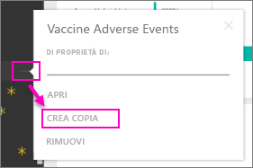

# Pacchetti di contenuto dell'organizzazione: Copiare, aggiornare e ottenere l'accesso

Quando viene pubblicato un pacchetto di contenuto aziendale, tutti i destinatari visualizzano lo stesso dashboard, gli stessi report, le stesse cartelle di lavoro di Excel, gli stessi set di dati e gli stessi dati, a meno che non sia un'origine dati SQL Server Analysis Services (SSAS).  [Solo il creatore può modificare e ripubblicare](service-organizational-content-pack-manage-update-delete.md) il pacchetto di contenuto.  Tuttavia, tutti i destinatari possono salvare una copia del pacchetto di contenuto che può esistere insieme all'originale.

La creazione di pacchetti di contenuto è diversa dalla condivisione di dashboard o dalla collaborazione negli stessi in un gruppo. Per scegliere la soluzione migliore in base alla situazione specifica, leggere [Come si condividono i dashboard e i report e in che modo ci si collabora?](service-how-to-collaborate-distribute-dashboards-reports.md).

> [!NOTE]
> Non è possibile creare o installare pacchetti di contenuto aziendali nell'anteprima delle nuove esperienze delle aree di lavoro. Questo è un buon momento per aggiornare i pacchetti di contenuto per le app, se non è ancora stato fatto. [Altre informazioni sulla nuova esperienza dell'area di lavoro](service-create-the-new-workspaces.md).
>

## Creare una copia di un pacchetto di contenuto aziendale
Creare la propria copia del pacchetto di contenuto, non visibile ad altri utenti.

1. Selezionare i puntini di sospensione (...) accanto al dashboard del pacchetto di contenuto > Crea una copia.

    
2. Selezionare **Salva**.  

A questo punto si ha una copia che è possibile modificare. Nessun altro potrà vedere le modifiche apportate.

> [!NOTE]
> In precedenza, ogni volta che si installava un pacchetto di contenuto o che se ne creava o copiava uno, veniva visualizzato un nuovo set di dati nell'elenco del contenuto dell'area di lavoro. Un aggiornamento recente ha semplificato l'esperienza in modo che venga visualizzato un solo elemento con la nuova icona del set di dati a cui si fa riferimento:
>
> 
>

## Come fare  se il pacchetto di contenuto non è più accessibile
Questo problema può verificarsi per diversi motivi:

* **Modifiche all'appartenenza**:  i pacchetti di contenuto vengono pubblicati per i gruppi di distribuzione di posta elettronica, i gruppi di sicurezza e i [gruppi di Power BI basati su Office 365](https://support.office.com/article/Create-a-group-in-Office-365-7124dc4c-1de9-40d4-b096-e8add19209e9).  Se si viene rimossi dal gruppo, non sarà più possibile accedere al pacchetto di contenuto.
* **Modifiche alla distribuzione:** il creatore del pacchetto di contenuto cambia la distribuzione. Ad esempio, se il pacchetto di contenuto è stato pubblicato in origine per l'intera organizzazione, ma il creatore lo ha ripubblicato per un gruppo di destinatari ristretto, l'utente potrebbe non essere più incluso.
* **Modifiche alle impostazioni di sicurezza:** se il dashboard e i report si connettono a origini dati SSAS locali e vengono apportate modifiche alle impostazioni di sicurezza, le autorizzazioni per il server potrebbero essere revocate.

## Aggiornamento dei pacchetti di contenuto aziendali
Quando si crea il pacchetto di contenuto, le impostazioni di aggiornamento vengono ereditate con il set di dati.  Quando si crea una copia del pacchetto di contenuto, la nuova versione manterrà il collegamento al set di dati originale e la relativa pianificazione dell'aggiornamento.

Vedere [Gestire, aggiornare ed eliminare pacchetti di contenuto aziendali](service-organizational-content-pack-manage-update-delete.md).

## Passaggi successivi
* [Introduzione ai pacchetti di contenuto aziendali](service-organizational-content-pack-introduction.md)
* [Creare un gruppo in Power BI](service-create-distribute-apps.md)
* Altre domande? [Provare la community di Power BI](http://community.powerbi.com/)
