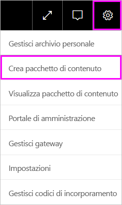
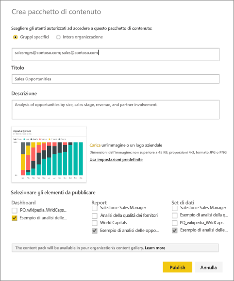
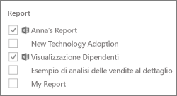
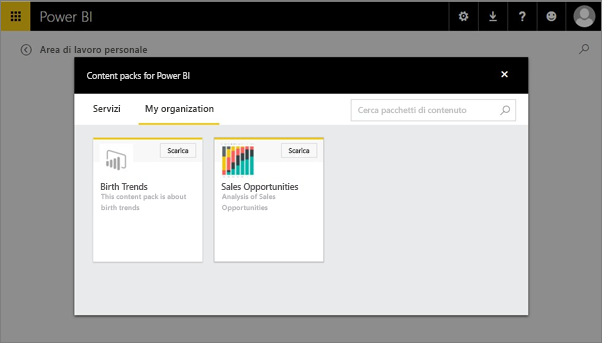

# Creare e pubblicare un pacchetto di contenuto aziendale di Power BI (esercitazione)
> [!NOTE]
> Le nuove *app* costituiscono la soluzione ideale per la distribuzione di contenuto a un vasto pubblico in Power BI. È consigliabile usare le app invece dei pacchetti di contenuto aziendali o delle aree di lavoro di sola lettura. Altre informazioni sulle [app](service-install-use-apps.md).
> 
> 

In questa esercitazione, è possibile creare un pacchetto di contenuto aziendale, concedere l'accesso a un gruppo specifico e pubblicare il pacchetto nella libreria di pacchetti di contenuto dell'organizzazione in Power BI.

La creazione di pacchetti di contenuto è diversa dalla condivisione di dashboard o dalla collaborazione negli stessi in un gruppo. Per scegliere la soluzione migliore in base alla situazione specifica, leggere [Come si condividono i dashboard e i report e in che modo ci si collabora?](service-how-to-collaborate-distribute-dashboards-reports.md).

> [!NOTE]
> Per creare un pacchetto di contenuto aziendale è necessario che l'utente e i colleghi dispongano di un [account di Power BI Pro](https://powerbi.microsoft.com/pricing).
> 
> 

Si immagini di essere il responsabile del rilascio presso Contoso e di dover predisporre tutto quanto necessario per il lancio di un nuovo prodotto.  Si immagini di aver creato un dashboard con report da condividere con gli altri dipendenti che gestiscono il lancio. Si immagini di voler creare pacchetti di dashboard e report come soluzione a uso dei colleghi. 

Per iniziare, nel [servizio Power BI](https://powerbi.com) passare a **Recupera dati > Esempi > Esempio di analisi delle opportunità** > **Connetti** per ottenere una copia personale. 

1. Nel riquadro di spostamento selezionare il dashboard **Esempio di analisi delle opportunità**.
2. Nella barra di spostamento superiore selezionare l'icona dell'ingranaggio  > **Crea pacchetto di contenuto**.    
   
3. Nella finestra **Crea pacchetto di contenuto** inserire le informazioni seguenti.  
   
   Tenere presente che con la libreria di pacchetti di contenuto dell'organizzazione si può arrivare alla pubblicazione di centinaia di pacchetti di contenuto per l'organizzazione o per i gruppo. Dedicare tempo alla scelta di un nome significativo per il pacchetto, all'aggiunta di una descrizione appropriata e alla selezione dei destinatari più adatti.  Usare parole per facilitare l'individuazione del pacchetto di contenuto in una ricerca.
   
   1.  Selezionare **Gruppi specifici** e immettere gli indirizzi di posta elettronica completi di singoli utenti, [gruppi di Office 365](https://support.office.com/article/Create-a-group-in-Office-365-7124dc4c-1de9-40d4-b096-e8add19209e9), gruppi di distribuzione o gruppi di sicurezza, ad esempio:
      
         salesmgrs@contoso.com; sales@contoso.com
      
      Per questa esercitazione provare a usare il proprio indirizzo di posta elettronica o quello del proprio gruppo.
   
   2.  Assegnare al pacchetto di contenuto il nome **Opportunità di vendita**.
   
      > [!TIP]
      > È consigliabile includere il nome del dashboard nel nome del pacchetto di contenuto. In questo modo, i colleghi troveranno il dashboard più facilmente dopo essersi connessi al pacchetto di contenuto.
      > 
      > 
   
   3.  Operazione consigliata: aggiungere una **descrizione**. per consentire ai collaboratori di individuare più facilmente i pacchetti di contenuto di cui hanno bisogno. Oltre a una descrizione, aggiungere parole chiave che i collaboratori possono usare per cercare questo pacchetto di contenuto. Includere le informazioni sul contatto che i collaboratori potranno usare per richiedere chiarimenti o per ricevere assistenza.
   
   4.  **Caricare un'immagine o un logo** per consentire ai membri del gruppo di individuare il pacchetto di contenuto più facilmente. È infatti più rapido cercare un'immagine rispetto al testo. Lo screenshot seguente mostra un'immagine del riquadro dell'istogramma relativo al conteggio totale delle opportunità.
   
   5.  Selezionare il dashboard **Esempio di analisi delle opportunità** per aggiungerlo al pacchetto di contenuto.  Power BI aggiunge automaticamente il report e il set di dati associati. È possibile aggiungerne altri, se si desidera.
   
      > [!NOTE]
      >  Sono elencati solo i dashboard, i report, i set di dati e le cartelle di lavoro modificabili dall'utente. L'elenco non include quindi quelli condivisi con l'utente.
      > 
      > 
   
       
   
   6. Le cartelle di lavoro di Excel, se presenti, sono visualizzate in Report, con un'icona di Excel. Anche queste cartelle di lavoro possono essere aggiunte al pacchetto di contenuto.
   
     
   
      > [!NOTE]
      > Se i membri del gruppo non possono visualizzare la cartella di lavoro di Excel, potrebbe essere necessario [condividere la cartella di lavoro in OneDrive for Business](https://support.office.com/en-us/article/Share-documents-or-folders-in-Office-365-1fe37332-0f9a-4719-970e-d2578da4941c).
      > 
      > 
4. Selezionare **Pubblica** per aggiungere il pacchetto di contenuto alla libreria dei pacchetti di contenuto aziendale del gruppo.  
   
   Al completamento della pubblicazione verrà visualizzato un apposito messaggio che indica la riuscita dell'operazione. 
5. Quando i membri del gruppo passano a **Recupera dati > Azienda**, per individuare il pacchetto, devono toccare nella casella di ricerca e digitare "Opportunità di vendita".
   
    
6. In questo modo potranno vedere il pacchetto di contenuto.  
    
   
   > [!TIP]
   > L'URL visualizzato nel browser è l'indirizzo univoco del pacchetto di contenuto.  Per informare i collaboratori che è disponibile un nuovo pacchetto di contenuto,  incollarne l'URL in un messaggio di posta elettronica.
   > 
   > 
7. I membri dovranno quindi fare clic su **Connetti** per [visualizzare e usare il pacchetto di contenuto](service-organizational-content-pack-copy-refresh-access.md). 

### Passaggi successivi
* [Introduzione ai pacchetti di contenuto aziendali](service-organizational-content-pack-introduction.md)  
* [Gestire, aggiornare ed eliminare pacchetti di contenuto aziendali](service-organizational-content-pack-manage-update-delete.md)  
* [Creare un gruppo in Power BI](service-create-distribute-apps.md)  
* [OneDrive for Business](https://support.office.com/en-us/article/What-is-OneDrive-for-Business-187f90af-056f-47c0-9656-cc0ddca7fdc2)
* Altre domande? [Provare la community di Power BI](http://community.powerbi.com/)

