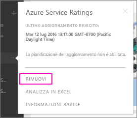

# Rimuovere la connessione a un pacchetto di contenuto aziendale di Power BI
Un collaboratore ha creato un pacchetto di contenuto, che è stato individuato in AppSource e aggiunto all'area di lavoro di Power BI. Ora però non è più necessario.  Come fare a rimuoverlo?

Per rimuovere un pacchetto di contenuto, è necessario rimuovere il set di dati associato.  

* Nel riquadro di spostamento a sinistra selezionare i puntini di sospensione a destra del set di dati e selezionare **Rimuovi \> Sì**.  
  
  

Quando si rimuove il set di dati, vengono rimossi anche tutti i report e i dashboard associati. Tuttavia, rimuovendo la connessione al pacchetto di contenuto, quest'ultimo non viene eliminato da AppSource dell'organizzazione.  È sempre possibile tornare ad AppSource e aggiungere nuovamente il pacchetto di contenuto all'area di lavoro. Solo l'autore di un pacchetto di contenuto può [eliminarlo da AppSource](service-organizational-content-pack-manage-update-delete.md).

## Passaggi successivi
* [Introduzione ai pacchetti di contenuto aziendali](service-organizational-content-pack-introduction.md) 
* [Creare e distribuire un'app in Power BI](service-create-distribute-apps.md) 
* [Concetti di base di Power BI](service-basic-concepts.md)  
* Altre domande? [Provare la community di Power BI](http://community.powerbi.com/)

