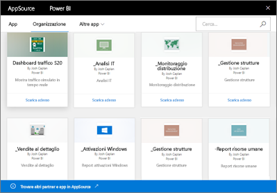

# Introduzione ai pacchetti di contenuto aziendali in Power BI
> [!NOTE]
> Non è possibile creare pacchetti di contenuto aziendali né installarli nelle nuove aree di lavoro. Questo è un buon momento per aggiornare i pacchetti di contenuto per le app, se non è ancora stato fatto. [Altre informazioni sulla nuova esperienza dell'area di lavoro](service-create-the-new-workspaces.md).
> 

I report vengono distribuiti regolarmente tramite posta elettronica al team? Provare invece a creare pacchetti di dashboard, report, cartelle di lavoro di Excel e set di dati e pubblicarli per il team come *pacchetto di contenuto aziendale*. I pacchetti di contenuto sono facili da trovare per il team, perché sono tutti in AppSource. Dal momento che fanno parte di Power BI, sfruttano tutte le sue funzionalità, tra cui l'esplorazione interattiva dei dati, i nuovi elementi visivi, le domande e risposte, l'integrazione con altre origini dati, l'aggiornamento dei dati e molto altro.

La creazione di pacchetti di contenuto è diversa dalla condivisione di dashboard o dalla collaborazione all'interno di questi in un'area di lavoro. Per scegliere la soluzione migliore in base alla situazione specifica, leggere [Come si condividono i dashboard e i report e in che modo ci si collabora?](service-how-to-collaborate-distribute-dashboards-reports.md). 

In AppSource è possibile sfogliare o cercare i pacchetti di contenuto pubblicati per l'intera organizzazione, per i gruppi di distribuzione o sicurezza e per i [gruppi di Office 365 a cui si appartiene](https://support.office.com/article/Create-a-group-in-Office-365-7124dc4c-1de9-40d4-b096-e8add19209e9). Se non si è membri di un gruppo specifico, non saranno visualizzati i pacchetti di contenuto condivisi con tale gruppo. Tutti i membri del gruppo avranno lo stesso accesso in sola lettura ai dati del pacchetto di contenuto, ai report, alle cartelle di lavoro e ai dashboard (a meno che l'origine dati non sia di tipo SQL Server Analysis Services (SSAS), nel qual caso i privilegi verranno ereditati con l'origine dati).

I dashboard, i report e le cartelle di lavoro di Excel sono di sola lettura, ma è possibile copiarli e usarli come punto di partenza per creare una versione personalizzata del pacchetto di contenuto.

> [!NOTE]
> I pacchetti di contenuto aziendali sono disponibili solo se tutti gli utenti sono in possesso di [licenze Power BI Pro](service-features-license-type.md).
> 
> 

## Informazioni su *AppSource*
La pubblicazione di un pacchetto di contenuto aziendale lo aggiunge ad AppSource.  Questo archivio centralizzato semplifica l'esplorazione e la ricerca di dashboard, report e set di dati pubblicati per i membri.  

* Per visualizzare AppSource, selezionare **Recupera dati** > **Organizzazione** > **Recupera**.

## Ciclo di vita di un pacchetto di contenuto aziendale
Qualsiasi utente di Power BI Pro può creare, pubblicare e accedere ai pacchetti di contenuto aziendali. Solo il creatore del pacchetto di contenuto può modificare la cartella di lavoro e il set di dati, pianificare l'aggiornamento ed eliminarlo.

Il ciclo di vita è simile al seguente:

1. In Power BI Pro Mattia crea un pacchetto di contenuto e lo pubblica nel gruppo di distribuzione Marketing. Le impostazioni di aggiornamento vengono ereditate con il set di dati e possono essere modificate solo da Mattia.
   
   > [!NOTE]
   > Se Mattia crea il pacchetto di contenuto dall'interno di un'[area di lavoro di Power BI](service-create-distribute-apps.md) di appartenenza, anche se lascia l'area di lavoro, altri utenti dell'area di lavoro di Power BI possono acquisirne la proprietà.
   > 
   > 
2. Mattia invia un messaggio di posta elettronica al gruppo di distribuzione, per informarlo del nuovo pacchetto di contenuto.
3. In Power BI Pro Giorgia, membro del gruppo di distribuzione Marketing, cerca un pacchetto di contenuto in AppSource e vi si connette. Ora Giorgia ha una copia di sola lettura. Giorgia sa che la copia è di sola lettura perché nel riquadro di spostamento è presente un'icona di condivisione, a sinistra del nome del dashboard e del report. E quando Giorgia seleziona il dashboard, un'icona di lucchetto la informa che sta visualizzando il dashboard di un pacchetto di contenuto. 
4. Si immagini che Giorgia decida di personalizzarlo. Giorgia avrà ora la propria copia del dashboard e dei report. Il suo lavoro non incide sull'origine, sul pacchetto di contenuto originale o su altri membri del gruppo di distribuzione. Ognuno sta ora lavorando alla propria copia del dashboard e del report.
5. Mattia aggiorna il dashboard e, quando questo è pronto, pubblica una nuova versione del pacchetto di contenuto.
   
   * Giulio, un altro membro del gruppo di distribuzione, non ha personalizzato il pacchetto di contenuto originale. Le nuove modifiche vengono applicate automaticamente alla sua versione del pacchetto di contenuto.  
   * Giorgia ha personalizzato il pacchetto di contenuto. Riceve quindi una notifica che indica che è disponibile una nuova versione.  Potrà quindi passare ad AppSource e scaricare il pacchetto di contenuto aggiornato senza perdere la versione personalizzata. Giorgia ora ha due versioni: quella personalizzata e il pacchetto di contenuto aggiornato.
6. Ad esempio Mattia modifica le impostazioni di sicurezza. Giulio e Giorgia non hanno più accesso al contenuto. In alternativa, vengono rimossi dal gruppo di distribuzione Marketing.
   
   * Giulio non ha personalizzato il pacchetto di contenuto originale, quindi il contenuto viene rimosso automaticamente. 
   * Giorgia ha personalizzato il pacchetto di contenuto. Alla successiva apertura del dashboard da parte di Giorgia, tutti i riquadri del pacchetto di contenuto originale sono stati eliminati, ma i riquadri aggiunti da altri report (per i quali dispone ancora di autorizzazioni per l'uso) sono ancora visualizzati. I report e il set di dati associati non sono più disponibili (e non vengono visualizzati nel riquadro di spostamento).
7. In alternativa, Mattia elimina il pacchetto di contenuto.
   
   * Giulio non ha personalizzato il pacchetto di contenuto originale, quindi il contenuto viene rimosso automaticamente. 
   * Giorgia ha personalizzato il pacchetto di contenuto. Alla successiva apertura del dashboard da parte di Giorgia tutti i riquadri del pacchetto di contenuto originale sono stati eliminati, ma i riquadri aggiunti da altri report sono ancora visualizzati. I report e il set di dati associati non sono più disponibili (e non vengono visualizzati nel riquadro di spostamento).

## Sicurezza dei dati
Tutti i membri del gruppo di distribuzione hanno le stesse autorizzazioni per i dati dell'autore del pacchetto di contenuto. L'unica eccezione sono i set di dati tabulari locali di SQL Server Analysis Services (SSAS). Dal momento che i report e i dashboard si connettono direttamente al modello SSAS locale, le credenziali di ogni singolo membro del gruppo di distribuzione vengono usate per determinare i dati a cui ognuno può accedere.

## Passaggi successivi
* [Creare e pubblicare un pacchetto di contenuto aziendale](service-organizational-content-pack-create-and-publish.md)
* [Creare e distribuire un'app in Power BI](service-create-distribute-apps.md) 
* [Concetti di base sulle finestre di progettazione del servizio Power BI](service-basic-concepts.md)
* Altre domande? [Provare la community di Power BI](https://community.powerbi.com/)

