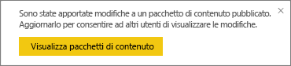
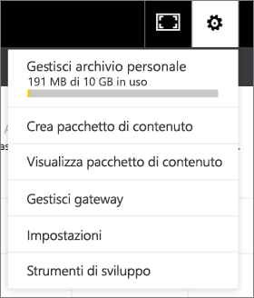

# Gestire, aggiornare ed eliminare pacchetti di contenuto aziendali
> [!NOTE]
> Le nuove *app* costituiscono la soluzione ideale per la distribuzione di contenuto a un vasto pubblico in Power BI. È consigliabile usare le app invece dei pacchetti di contenuto aziendali o delle aree di lavoro di sola lettura. Altre informazioni sulle [app](service-install-use-apps.md).
> 
> 

È possibile creare pacchetti di dashboard, report, cartelle di lavoro di Excel e set di dati e condividerli con i colleghi come [pacchetti di contenuto aziendali](service-organizational-content-pack-introduction.md). I colleghi utilizzarli così come sono o possono creare le proprie copie.

La creazione di pacchetti di contenuto è diversa dalla condivisione di dashboard o dalla collaborazione negli stessi in un gruppo. Per scegliere la soluzione migliore in base alla situazione specifica, leggere [Come si condividono i dashboard e i report e in che modo ci si collabora?](service-how-to-collaborate-distribute-dashboards-reports.md).

L'autore del pacchetto di contenuto può eseguire solo alcune attività organizzative relative al pacchetto di contenuto:

* Ripubblicare.
* Limitare o estendere l'accesso al pacchetto di contenuto.
* Impostare e modificare l'aggiornamento pianificato.
* Eliminare il pacchetto di contenuto.

## Modificare e ripubblicare un pacchetto di contenuto aziendale
Se si modifica il dashboard, il report o la cartella di lavoro di Excel del pacchetto di contenuto originale, Power BI chiederà di ripubblicarlo. Inoltre, l'autore del pacchetto di contenuto può aggiornare tutte le opzioni selezionate nella finestra Crea pacchetto di contenuto durante la creazione del pacchetto originale. 

## Ripubblicare con nuovo contenuto
Quando si apporta e si salva una modifica al dashboard incluso in un pacchetto di contenuto, Power BI ricorda di eseguirne l'aggiornamento per fare in modo che altri utenti possano vedere le modifiche. Ad esempio, se si aggiunge un nuovo riquadro o si modifica semplicemente il nome del dashboard.

1. Selezionare **Visualizza pacchetti di contenuto** nel messaggio.
   
   
2. Oppure selezionare l'icona dell'ingranaggio nell'angolo superiore destro  e selezionare **Visualizza pacchetto di contenuto**.
   
   
   
   Si noti l'icona di avviso .  Indica che il pacchetto di contenuto è stato modificato e non corrisponde più a quello pubblicato.
3. Selezionare **Modifica**.  
4. Apportare le modifiche necessarie nella finestra **Aggiorna pacchetto di contenuto** e selezionare **Aggiorna**. Viene visualizzato un messaggio di **operazione completata**.
   
   * Per i membri del gruppo che non hanno personalizzato il pacchetto di contenuto, l'aggiornamento viene applicato automaticamente.
   * I membri del gruppo che hanno personalizzato il pacchetto di contenuto ricevono una notifica dell'esistenza di una nuova versione.  Potranno quindi passare ad AppSource e scaricare il pacchetto aggiornato senza perdere la propria versione personalizzata.  A questo punto hanno 2 versioni: quella personalizzata e il pacchetto di contenuto aggiornato.  Nella versione personalizzata non saranno più presenti tutti i riquadri dal pacchetto di contenuto originale.  Verrà comunque eseguito il rendering dei riquadri aggiunti da altri report.    

## Aggiornare i destinatari: estendere o limitare l'accesso
Un'altra modifica che possono eseguire gli autori di pacchetti di contenuti è l'estensione o la limitazione dell'accesso ai pacchetti.  Può accadere, ad esempio, di pubblicare un pacchetto di contenuto per un ampio numero di destinatari e che in seguito sia stato deciso di limitarne l'accesso a un gruppo meno numeroso.  

1. Selezionare l'icona dell'ingranaggio  e scegliere **Visualizza pacchetti di contenuto**.
2. Selezionare **Modifica**. 
3. Apportare le modifiche necessarie nella finestra **Aggiorna pacchetto di contenuto** e selezionare **Aggiorna**. Ad esempio, eliminare il gruppo di distribuzione originale nel campo **Gruppi specifici** e sostituirlo con un altro gruppo di distribuzione (che include meno membri).
   
   Viene visualizzato un messaggio di operazione completata.
   
   Per un collaboratore che non fa parte del nuovo alias:
   
   * Per i membri del gruppo che non hanno personalizzato il pacchetto di contenuto, il dashboard e i report associati al pacchetto non sono più disponibili e il pacchetto di contenuto non viene visualizzato nel riquadro di spostamento.
   * Per i membri del gruppo che hanno personalizzato il pacchetto di contenuto, alla successiva apertura del dashboard personalizzato non saranno più presenti tutti i riquadri dal pacchetto di contenuto originale.  Verrà comunque eseguito il rendering dei riquadri aggiunti da altri report. I report e il set di dati del pacchetto di contenuto originale non sono più disponibili e il pacchetto di contenuto non viene visualizzato nel riquadro di spostamento.   

## Aggiornare un pacchetto di contenuto aziendale
L'autore del pacchetto di contenuto può [pianificare l'aggiornamento dei set di dati](refresh-data.md).  Quando si crea e si carica il pacchetto di contenuto, la pianificazione dell'aggiornamento viene caricata insieme ai set di dati. Se viene modificata, è necessario ripubblicare il pacchetto di contenuto (vedere sopra).

## Eliminare un pacchetto di contenuto aziendale da AppSource
Solo l'autore di un pacchetto di contenuto può eliminarlo da AppSource. 

> [!TIP]
> È possibile [eliminare la connessione a un pacchetto di contenuto](service-organizational-content-pack-disconnect.md) di cui non si è l'autore. Il pacchetto di contenuto non verrà eliminato da AppSource.
> 
> 

1. Per eliminare un pacchetto di contenuto da AppSource, passare all'area di lavoro dell'app in cui è stato creato il pacchetto di contenuto, selezionare l'icona a forma di ingranaggio  e scegliere **Visualizza pacchetti di contenuto**.
2. Selezionare **Elimina \> Elimina**. 
   
   * Per i membri del gruppo che non hanno personalizzato il pacchetto di contenuto, il dashboard e i report associati a tale pacchetto di contenuto vengono automaticamente rimossi. Non sono più disponibili e il pacchetto di contenuto non viene visualizzato nel riquadro di spostamento.
   * Per i membri del gruppo che hanno personalizzato il pacchetto di contenuto, alla successiva apertura del dashboard personalizzato non saranno più presenti tutti i riquadri dal pacchetto di contenuto originale.  Verrà comunque eseguito il rendering dei riquadri aggiunti da altri report. I report e il set di dati del pacchetto di contenuto originale non sono più disponibili e il pacchetto di contenuto non viene visualizzato nel riquadro di spostamento.   

## Passaggi successivi
* [Introduzione ai pacchetti di contenuto aziendali](service-organizational-content-pack-introduction.md)
* [Creare e distribuire un'app in Power BI](service-create-distribute-apps.md) 
* Altre domande? [Provare la community di Power BI](http://community.powerbi.com/)

