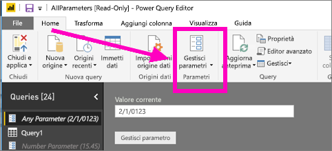

# Modificare le impostazioni dei parametri nel servizio Power BI
Gli autori dei report aggiungono i parametri di query ai report in Power BI Desktop. I parametri consentono di creare porzioni del report in funzione di uno o più *valori* di parametri. Ad esempio, un autore di report può creare un parametro che limita i dati a un singolo paese o regione o un parametro che definisce i formati accettabili di alcuni campi come, ad esempio, date, ore e testo.

## Esaminare e modificare i parametri nel servizio Power BI

Gli autori di report definiscono i parametri in Desktop. Quando si [pubblica il report nel servizio Power BI](desktop-upload-desktop-files.md), le impostazioni e le selezioni dei parametri rimangono associate al report. È possibile rivedere e modificare le impostazioni di alcuni parametri nel servizio Power BI, ovvero dei parametri che definiscono e descrivono valori accettabili ma non dei parametri che limitano i dati disponibili.

1. Nel servizio Power BI selezionare l'icona a forma di ingranaggio  e scegliere **Impostazioni**.

2. Selezionare la scheda per i **set di dati** ed evidenziare un set di dati nell'elenco. 
    
    

3. Espandere **Parametri**.  Se il set di dati selezionato non ha parametri, verrà visualizzato un messaggio con un collegamento per ottenere altre informazioni sui parametri di query. Ma se per il set di dati sono stati definiti dei parametri, espandendo l'intestazione **Parametri** verranno rivelati tali parametri. 

    

    Esaminare le impostazioni dei parametri e apportare le modifiche necessarie. I campi disattivati non sono modificabili. 

## Passaggi successivi
Un modo ad hoc per aggiungere parametri semplici consiste nel [modificare l'URL](service-url-filters.md).