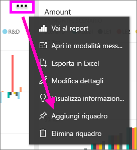
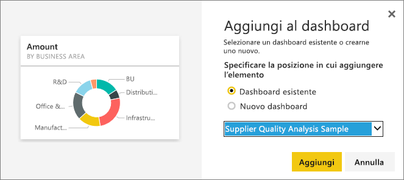
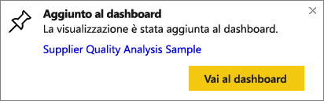

# Aggiungere un riquadro da un dashboard a un altro dashboard
Per aggiungere un nuovo [riquadro del dashboard](service-dashboard-tiles.md), è possibile copiarlo da un altro dashboard. Ognuno di questi riquadri, quando si fa clic su di esso, è un collegamento per tornare al punto in cui è stato creato, ovvero in Domande e risposte o in un report. 

> [!NOTE]
> non è possibile aggiungere riquadri dai dashboard condivisi.

## Aggiungere un riquadro a un altro dashboard
1. [Recuperare i dati](service-get-data.md). Questo esempio usa [Esempio di analisi della spesa IT](sample-it-spend.md).
2. Aprire un [dashboard](service-dashboards.md).
3. Passare il puntatore del mouse sul riquadro da aggiungere, quindi selezionare i puntini di sospensione (...) e scegliere **Aggiungi sezione**.  
   
   
4. Aggiungere il riquadro a un dashboard esistente o a un nuovo dashboard. 
   
   * **Dashboard esistente**: selezionare il nome del dashboard nell'elenco a discesa.
   * **Nuovo dashboard**: digitare il nome del nuovo dashboard.
   
   
5. Selezionare **Aggiungi**.
   Un messaggio di operazione completata, visualizzato nell'angolo in alto a destra, informa l'utente che la visualizzazione è stata aggiunta al dashboard selezionato sotto forma di riquadro.
   
   
6. Selezionare **Vai al dashboard** per visualizzare il riquadro bloccato. In quel punto è possibile [rinominare, ridimensionare, collegare e spostare](service-dashboard-edit-tile.md) la visualizzazione aggiunta.

## Passaggi successivi
[Riquadri in Power BI](service-dashboard-tiles.md)  
[Dashboard in Power BI](service-dashboards.md)  
Altre domande? [Provare la community di Power BI](http://community.powerbi.com/)

