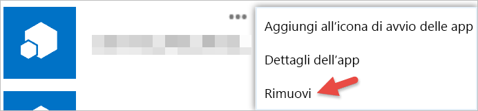

# Introduzione ad app di terze parti

Con Power BI, è possibile usare un'app creata da una società o da un utente diverso da Microsoft. Ad esempio è possibile usare un’app di terze parti che integra i riquadri di Power BI in un'applicazione Web personalizzata. Quando si usa un'app di terze parti, viene richiesto di concedere a tale applicazione determinate autorizzazioni per l'account e le risorse di Power BI. È importante concedere le autorizzazioni solo alle applicazioni conosciute e attendibili. Le autorizzazioni per un'applicazione possono essere revocate in qualsiasi momento. Vedere [Revocare le autorizzazioni di app di terze parti](#revoke).

Di seguito sono indicati i tipi di accesso che un’applicazione può richiedere.

## Autorizzazioni app di Power BI

* **Visualizzare tutti i dashboard**
  
  * Questa autorizzazione fornisce a un'applicazione la possibilità di visualizzare tutti i dashboard a cui è possibile accedere. Sono inclusi i dashboard di cui si è proprietari, quelli ricevuti da altri pacchetti di contenuto e quelli condivisi con l'utente e appartenenti a gruppi di cui l’utente fa parte. L'applicazione non può apportare alcuna modifica al dashboard. Tra le altre cose, questa autorizzazione è utilizzabile da un'applicazione per incorporare il contenuto del dashboard nelle proprie esperienze.

* **Visualizza tutti i report**
  
  * Questa autorizzazione fornisce a un'applicazione la possibilità di visualizzare tutti i report a cui è possibile accedere. Sono inclusi i report di cui si è proprietari, quelli ricevuti da altri pacchetti di contenuto e quelli appartenenti a gruppi di cui l’utente fa parte. Parte della visualizzazione del report indica che l'applicazione può visualizzare anche i dati in essa contenuti. L'applicazione non può apportare alcuna modifica ai report stessi. Tra le altre cose, questa autorizzazione è utilizzabile da un'applicazione per incorporare il contenuto del report nelle proprie esperienze.

* **Visualizza tutti i set di dati**
  
  * Questa autorizzazione fornisce a un'applicazione la possibilità di elencare tutti i set di dati a cui è possibile accedere. Sono inclusi i set di dati di cui si è proprietari, quelli ricevuti da altri pacchetti di contenuto e quelli appartenenti a gruppi di cui l’utente fa parte. Un'applicazione può visualizzare i nomi di tutti i set di dati, nonché la loro struttura, inclusi i nomi di tabella e colonna. Questa autorizzazione concede i diritti di lettura dei dati in un set di dati. L'autorizzazione non consente all'applicazione di aggiungere o apportare modifiche a un set di dati.
* **Lettura e scrittura in tutti i set di dati**
  
  * Questa autorizzazione fornisce a un'applicazione la possibilità di elencare tutti i set di dati a cui è possibile accedere. Sono inclusi i set di dati di cui si è proprietari, quelli ricevuti da altri pacchetti di contenuto e quelli appartenenti a gruppi di cui l’utente fa parte. Un'applicazione può visualizzare i nomi di tutti i set di dati, nonché la loro struttura, inclusi i nomi di tabella e colonna. Questa autorizzazione concede i diritti di lettura e scrittura dei dati in un set di dati. L'applicazione può anche creare nuovi set di dati o apportare modifiche a quelli esistenti. Questa opzione viene utilizzata solitamente da un’applicazione per inviare dati direttamente a Power BI.

* **Visualizza gruppi di utenti**
  
  * Questa autorizzazione fornisce all'applicazione la possibilità di elencare tutti i gruppi a cui si appartiene. È possibile usare questa autorizzazione con alcune delle altre autorizzazioni elencate per visualizzare o aggiornare il contenuto per quel particolare gruppo. L'applicazione non può apportare modifiche al gruppo stesso.

<a name="revoke"/>

## Revocare le autorizzazioni di app di terze parti

È possibile revocare le autorizzazioni per un'app di terze parti visitando il sito Office 365 My Apps.

Di seguito viene illustrato come revocare le autorizzazioni di terze parti nel sito **Office 365 My apps**:

1. Accedere al [sito Office 365 My Apps](https://portal.office.com/myapps).

2. Nella pagina **App personali** trovare l'app di terze parti.

3. Passare il mouse sul riquadro dell'app, fare clic sul pulsante **(...)** e fare clic su **Rimuovi**.

   