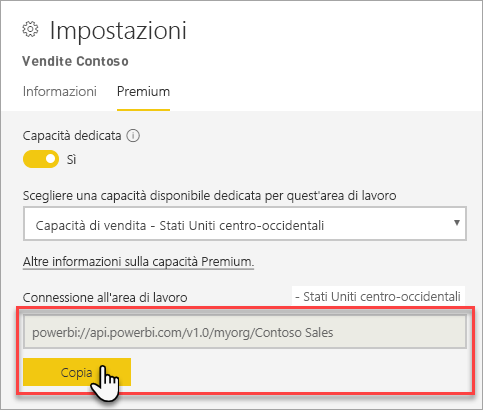
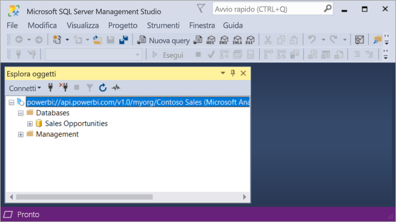

# Connettersi a set di dati con applicazioni client e strumenti (anteprima)

Le aree di lavoro e i set di dati di Power BI Premium supportano le connessioni di *sola lettura* da applicazioni client e strumenti Microsoft e di terze parti. 

> [!NOTE]
> Questo articolo offre un'introduzione alla connettività di sola lettura alle aree di lavoro e ai set di dati di Power BI Premium. L'articolo *non* include informazioni dettagliate su programmazione, strumenti e applicazioni specifici, architettura e gestione delle aree di lavoro e dei set di dati. Gli argomenti descritti richiedono una conoscenza approfondita dell'architettura e dell'amministrazione dei database modello tabulare di Analysis Services.

## Protocollo

Power BI Premium usa il protocollo [XML for Analysis](https://docs.microsoft.com/bi-reference/xmla/xml-for-analysis-xmla-reference) (XMLA) per le comunicazioni tra le applicazioni client e il motore che gestisce aree di lavoro e set di dati. Queste comunicazioni avvengono attraverso elementi comunemente chiamati endpoint XMLA. XMLA è lo stesso protocollo di comunicazione usato dal motore di Microsoft Analysis Services che esegue in background la modellazione semantica, la governance, il ciclo di vita e la gestione dei dati di Power BI. 

La maggior parte delle applicazioni client e degli strumenti non comunicano in modo esplicito con il motore tramite gli endpoint XMLA. Usano invece le librerie client, ad esempio MSOLAP, ADOMD e AMO, come intermediario tra l'applicazione client e il motore che comunica esclusivamente tramite XMLA.

## Strumenti supportati

Questi strumenti supportano l'accesso in sola lettura alle aree di lavoro e ai set di dati di Power BI Premium:

**SQL Server Management Studio (SSMS)** : supporta query DAX, MDX, XMLA e TraceEvent. Richiede la versione 18.0. Disponibile per il download [qui](https://docs.microsoft.com/sql/ssms/download-sql-server-management-studio-ssms). 

**SQL Server Profiler**: fornito con SSMS 18.0 (anteprima), questo strumento offre funzionalità di analisi e debug degli eventi del server. È possibile acquisire e salvare i dati su ogni evento in un file o una tabella da analizzare in un secondo momento. Sebbene sia stato deprecato ufficialmente per SQL Server, Profiler continua a essere incluso in SSMS e supportato per Analysis Services e Power BI Premium. Per altre informazioni, vedere [SQL Server Profiler](https://docs.microsoft.com/sql/tools/sql-server-profiler/sql-server-profiler).

**DAX Studio**: strumento di community open source per l'esecuzione e l'analisi di query DAX in Analysis Services. Richiede la versione 2.8.2 o versione successiva. Per altre informazioni, vedere [daxstudio.org](https://daxstudio.org/).

**Tabelle pivot di Excel**: è richiesta la versione a portata di clic di Office 16.0.11326.10000 o versione successiva.

**Terze parti**: include applicazioni e strumenti di visualizzazione dei dati client che possono connettersi, eseguire query e usare i set di dati in Power BI Premium. La maggior parte degli strumenti richiede le versioni più recenti delle librerie client MSOLAP, ma alcuni possono usare ADOMD.

## Librerie client

Le librerie client sono necessarie per le applicazioni client e gli strumenti per la connessione alle aree di lavoro di Power BI Premium. Le stesse librerie client usate per la connessione ad Analysis Services sono supportate anche in Power BI Premium. Le applicazioni client di Microsoft come Excel, SQL Server Management Studio (SSMS) e SQL Server Data Tools (SSDT) installano tutte e tre le librerie client e le aggiornano con gli aggiornamenti periodici dell'applicazione. In alcuni casi, in particolare con le applicazioni e gli strumenti di terze parti, potrebbe essere necessario installare versioni più recenti delle librerie client. Le librerie client vengono aggiornate ogni mese. Per altre informazioni, vedere [Librerie client per la connessione ad Azure Analysis Services](https://docs.microsoft.com/azure/analysis-services/analysis-services-data-providers).

## Connessione a un'area di lavoro Premium

È possibile connettersi alle aree di lavoro assegnate alle capacità dedicate Premium. Le aree di lavoro assegnate a una capacità dedicata includono una stringa di connessione in formato URL. 

Per ottenere la stringa di connessione dell'area di lavoro, in Power BI in **Impostazioni area di lavoro** nella scheda **Premium** in **Connessione all'area di lavoro** fare clic su **Copia**.

Le connessioni alle aree di lavoro usano il formato URL seguente per un'area di lavoro come avviene per un nome server di Analysis Services:   
`powerbi://api.powerbi.com/v1.0/[tenant name]/[workspace name]` 

Ad esempio, `powerbi://api.powerbi.com/v1.0/contoso.com/Sales Workspace`

### Per connettersi in SSMS

In **Connetti al server** > **Tipo di server** selezionare **Analysis Services**. In **Nome server** immettere l'URL. In **Autenticazione** selezionare **Active Directory - Universale con supporto MFA** e quindi in **Nome utente** immettere l'ID utente dell'organizzazione. 

Dopo aver stabilito la connessione, l'area di lavoro viene visualizzata come server di Analysis Services e i set di dati dell'area di lavoro sono visualizzati come database.  

### Catalogo iniziale

Per alcuni strumenti, ad esempio SQL Server Profiler, può essere necessario specificare un *Catalogo iniziale*. Specificare un set di dati (database) nell'area di lavoro. In **Connetti al server** fare clic su **Opzioni**. Nella finestra di dialogo **Connetti al server** nella scheda **Proprietà connessione** in **Connessione al database** immettere il nome del set di dati.

### Nome dell'area di lavoro duplicato

Quando si stabilisce la connessione a un'area di lavoro con lo stesso nome di un'altra area di lavoro, è possibile che venga visualizzato l'errore seguente: **Non è possibile connettersi a powerbi://api.powerbi.com/v1.0/[nome tenant]/[nome area di lavoro].**

Per risolvere questo errore, oltre al nome dell'area di lavoro, specificare ObjectIDGuid che può essere copiato da objectID dell'area di lavoro nell'URL. Aggiungere objectID alla fine dell'URL di connessione. Ad esempio, `powerbi://api.powerbi.com/v1.0/myorg/Contoso Sales - 9d83d204-82a9-4b36-98f2-a40099093830'

### Nome del set di dati duplicato

Quando ci si connette a un set di dati con lo stesso nome di un altro set di dati nella stessa area di lavoro, aggiungere il GUID del set di dati al nome del set di dati. È possibile ottenere il nome *e* il GUID del set di dati quando si è connessi all'area di lavoro in SSMS. 

### Ritardo della visualizzazione dei set di dati

Quando si stabilisce una connessione a un'area di lavoro, la visualizzazione delle modifiche dei set di dati nuovi, eliminati e rinominati può richiedere fino a 5 minuti. 

### Set di dati non supportati

I set di dati seguenti non sono accessibili tramite gli endpoint XMLA. Questi set di dati *non* verranno visualizzati nell'area di lavoro in SSMS o in altri strumenti: 

- Set di dati con una connessione dinamica ai modelli di Analysis Services. 
- Set di dati con dati push tramite l'API REST.
- Se di dati delle cartelle di lavoro di Excel. 

I set di dati seguenti non sono supportati nel servizio Power BI:   

- Set di dati con una connessione dinamica a un set di dati di Power BI.

### Ruoli e appartenenze a ruoli

Attualmente, i ruoli dei modelli e le appartenenze ai ruoli non sono individuabili né visualizzati tramite gli endpoint XMLA.

## Log di controllo 

Quando le applicazioni client e gli strumenti si connettono a un'area di lavoro, l'accesso tramite gli endpoint XMLA viene registrato nei log di controllo di Power BI per l'operazione **GetWorkspaces**. Per altre informazioni, vedere [Controllo di Power BI](service-admin-auditing.md).

## Vedere anche

[Riferimenti di Analysis Services](https://docs.microsoft.com/bi-reference/#pivot=home&panel=home-all)   
[SQL Server Management Studio](https://docs.microsoft.com/sql/ssms/sql-server-management-studio-ssms)   
[Protocollo tabulare di SQL Server Analysis Services](https://docs.microsoft.com/openspecs/sql_server_protocols/ms-ssas-t/b98ed40e-c27a-4988-ab2d-c9c904fe13cf)   
[DMV (Dynamic Management View)](https://docs.microsoft.com/sql/analysis-services/instances/use-dynamic-management-views-dmvs-to-monitor-analysis-services)   

Altre domande? [Provare a rivolgersi alla community di Power BI](https://community.powerbi.com/)
