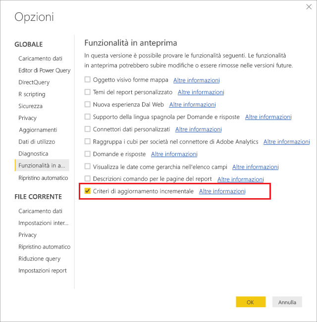
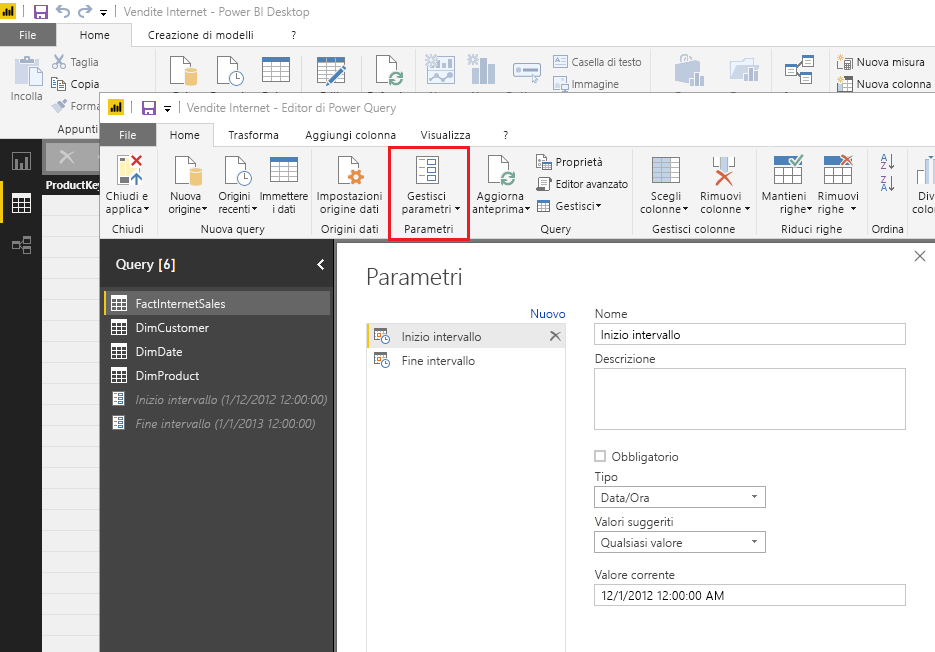
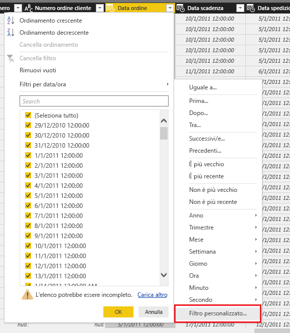
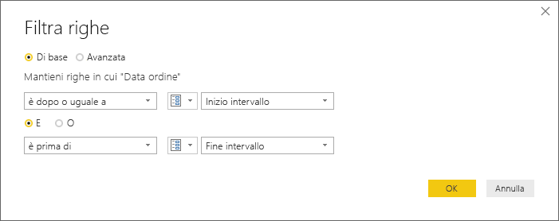
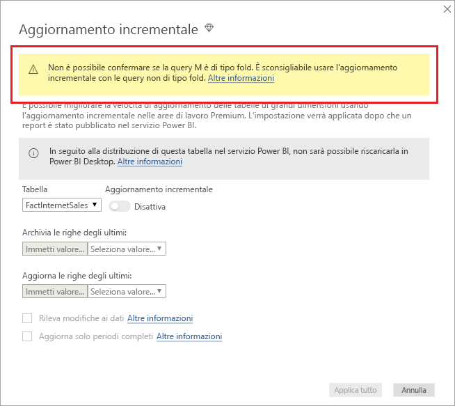
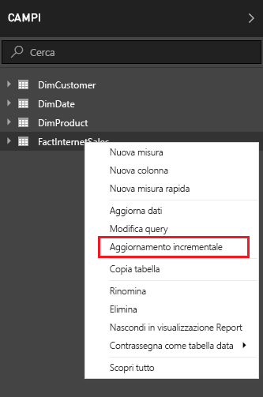
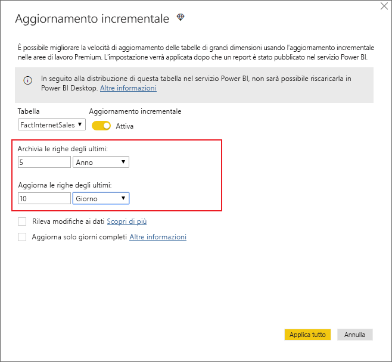
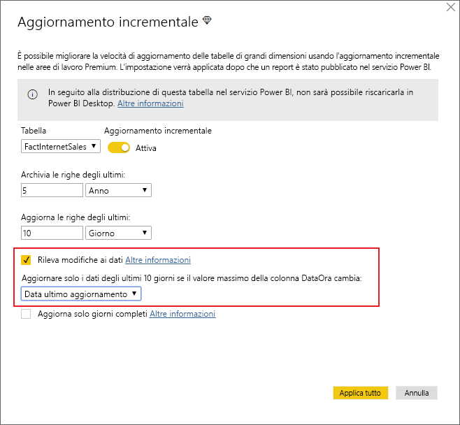
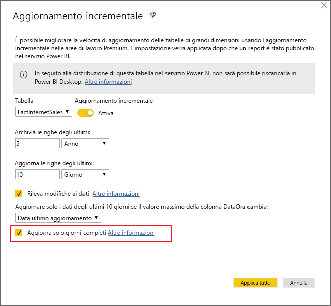
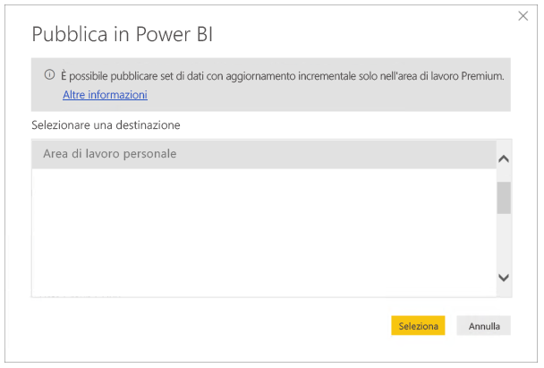

# <a name="incremental-refresh-in-power-bi-premium"></a>Aggiornamento incrementale in Power BI Premium

L'aggiornamento incrementale abilita set di dati molto grandi nel servizio Power BI Premium, con i seguenti vantaggi:

- **Gli aggiornamenti sono più rapidi**: devono essere aggiornati solo i dati che sono stati cambiati. Ad esempio, è sufficiente aggiornare gli ultimi cinque giorni di un set di dati di 10 anni.

- **Gli aggiornamenti sono più affidabili**: non è più necessario mantenere connessioni con esecuzione prolungata a sistemi di origine volatili.

- **Il consumo di risorse risulta ridotto**: l'aggiornamento di una quantità di dati inferiore riduce l'uso complessivo di memoria e di altre risorse.

## <a name="configure-incremental-refresh"></a>Configurare l'aggiornamento incrementale

I criteri di aggiornamento incrementale sono definiti in Power BI Desktop e vengono applicati dopo la pubblicazione nel servizio Power BI.

Per iniziare, abilitare l'aggiornamento incrementale nelle **funzionalità di anteprima**.



### <a name="filter-large-datasets-in-power-bi-desktop"></a>Filtrare grandi set di dati in Power BI Desktop

I set di dati di grandi dimensioni, contenenti anche miliardi di righe, potrebbero non essere gestibili in un modello di Power BI Desktop, perché il file PBIX è limitato dalle risorse di memoria disponibili nel computer desktop. Questi set di dati vengono quindi in genere filtrati al momento dell'importazione. Questo tipo di filtro si applica sia che si usi l'aggiornamento incrementale o meno. Per l'aggiornamento incrementale, il filtro viene applicato tramite parametri data/ora di Power Query.

#### <a name="rangestart-and-rangeend-parameters"></a>Parametri RangeStart e RangeEnd

Per l'aggiornamento incrementale,i set di dati vengono filtrati tramite i parametri data/ora di Power Query **RangeStart** e **RangeEnd**, i cui nomi sono riservati e fanno distinzione tra maiuscole e minuscole. Questi parametri vengono usati per filtrare i dati importati in Power BI Desktop, nonché per partizionare in modo dinamico i dati in intervalli dopo la pubblicazione nel servizio Power BI. I valori dei parametri vengono sostituiti dal servizio per ogni partizione a cui viene applicato il filtro. Dopo essere stati pubblicati, i valori dei parametri vengono automaticamente sottoposti a override dal servizio Power BI. Non è necessario definirli nelle impostazioni del set di dati nel servizio. Dopo essere stati pubblicati, i valori dei parametri vengono automaticamente sottoposti a override dal servizio Power BI. 

Per definire i parametri con valori predefiniti, nell'editor di Power Query selezionare **Gestisci parametri**.



Dopo aver definito i parametri è possibile applicare il filtro, selezionando l'opzione di menu **Filtro personalizzato** per una colonna.



Verificare che vengano filtrate righe in cui il valore della colonna *è dopo o uguale a* **RangeStart** e *prima di* **RangeEnd**.



> [!TIP]
> Il tipo di dati dei parametri deve essere data/ora, ma è possibile convertire i parametri in modo da soddisfare i requisiti dell'origine dati. Ad esempio, la funzione Power Query seguente converte un valore data/ora per renderlo simile a una chiave surrogata di tipo intero con formato *aaaammgg*, comune nei data warehouse. La funzione può essere chiamata dal passaggio di applicazione del filtro.
>
> `(x as datetime) => Date.Year(x)*10000 + Date.Month(x)*100 + Date.Day(x)`

Selezionare **Chiudi e applica** nell'Editor di Power Query. In Power BI Desktop viene reso disponibile un subset del set di dati.

#### <a name="filter-date-column-updates"></a>Filtrare gli aggiornamenti della colonna data

Il filtro sulla colonna data viene usato per partizionare in modo dinamico i dati in intervalli nel servizio Power BI. L'aggiornamento incrementale non è progettato per supportare i casi in cui la colonna data filtrata viene aggiornata nel sistema di origine. Un aggiornamento viene interpretato come un inserimento e un'eliminazione, non come un aggiornamento effettivo. Se l'eliminazione viene eseguita nell'intervallo cronologico e non nell'intervallo incrementale, non verrà rilevata. Ciò può causare errori di aggiornamento dati dovuti a conflitti di partizione-chiave.

#### <a name="query-folding"></a>Riduzione delle query

È importante eseguire la propagazione dei filtri di partizione nel sistema di origine quando vengono inviate query per operazioni di aggiornamento. La propagazione dei filtri implica che l'origine dati supporti la "riduzione delle query". La maggior parte delle origini dati che supportano le query SQL supporta la riduzione delle query. Origini dati quali file flat, BLOB, Web e feed OData, tuttavia, in genere non la supportano. Nei casi in cui il filtro non è supportato dal back-end dell'origine dati, la propagazione non risulta possibile. In questi casi, il motore Mashup compensa e applica il filtro localmente. Questa operazione può richiedere il recupero del set di dati completo dall'origine dati. L'aggiornamento incrementale può pertanto risultare molto lento e il processo può esaurire le risorse nel servizio Power BI o nel gateway dati locale, se usato.

Dal momento che ogni origine dati può avere un livello di supporto della riduzione delle query diverso, è consigliabile eseguire una verifica per assicurarsi che la logica di filtro sia inclusa nelle query di origine. Per semplificare questa operazione, Power BI Desktop tenta di eseguire questa verifica automaticamente. Se non riesce, viene visualizzato un avviso nella finestra di dialogo dell'aggiornamento incrementale al momento della definizione dei criteri di quest'ultimo. Le origini dati basate su SQL, ad esempio SQL, Oracle e Teradata, possono basarsi su questo avviso. Altre origini dati possono essere in grado di effettuare la verifica solo se eseguono la traccia delle query. Se Power BI Desktop non è in grado eseguire la conferma, viene visualizzato l'avviso seguente.

 

### <a name="define-the-refresh-policy"></a>Definire i criteri di aggiornamento

L'aggiornamento incrementale è disponibile nel menu di scelta rapida per le tabelle, salvo per i modelli di connessione dinamica.



#### <a name="incremental-refresh-dialog"></a>Finestra di dialogo Aggiornamento incrementale

Viene visualizzata la finestra di dialogo Aggiornamento incrementale. Usare l'interruttore per abilitare la finestra di dialogo.


> [!NOTE]
> Se l'espressione di Power Query per la tabella non fa riferimento ai parametri con i nomi riservati, l'interruttore è disattivato.

Il testo dell'intestazione illustra quanto segue:

- L'aggiornamento incrementale è supportato solo per le aree di lavoro con capacità Premium. I criteri di aggiornamento sono definiti in Power BI Desktop e vengono applicati dalle operazioni di aggiornamento nel servizio.

- Se si è in grado di scaricare il file PBIX contenente criteri di aggiornamento incrementale dal servizio Power BI, non è possibile aprire tale file in Power BI Desktop. Il supporto di questa funzionalità potrebbe essere disponibile in futuro, ma si tenga presente che questi set di dati possono diventare così grandi che la loro gestione (download e apertura) in un computer desktop tipico può causare problemi.

#### <a name="refresh-ranges"></a>Intervalli di aggiornamento

L'esempio seguente definisce un criterio di aggiornamento per archiviare i dati di cinque anni di calendario completi e i dati dell'anno corrente fino alla data attuale, nonché per aggiornare in modo incrementale 10 giorni di dati. La prima operazione di aggiornamento carica i dati cronologici. Gli aggiornamenti successivi sono incrementali e, se pianificati per l'esecuzione giornaliera, eseguono le operazioni seguenti:

- Aggiungere un nuovo giorno di dati.

- Aggiornare gli ultimi 10 giorni inclusa la data corrente.

- Rimuovere gli anni di calendario con più di cinque anni dalla data corrente. Se ad esempio la data corrente è 1 gennaio 2019, l'anno 2013 viene rimosso.

Il primo aggiornamento nel servizio Power BI può richiedere più tempo perché importa tutti i cinque anni di calendario completi. È probabile che gli aggiornamenti successivi vengano completati in tempi molto più ridotti.



> [!NOTE]
> La definizione di questi intervalli potrebbe essere sufficiente. In tal caso passare direttamente al passaggio relativo alla pubblicazione riportato di seguito. Gli altri elenchi a discesa sono destinati a funzionalità avanzate.

### <a name="advanced-policy-options"></a>Opzioni dei criteri avanzate

#### <a name="detect-data-changes"></a>Rileva modifiche ai dati

L'aggiornamento incrementale di 10 giorni è più efficiente rispetto all'aggiornamento completo di cinque anni. È tuttavia possibile ottenere un'efficienza ancora maggiore. Se si seleziona la casella di controllo **Rileva modifiche ai dati**, è possibile selezionare una colonna di data/ora e usarla per identificare e aggiornare solo i giorni in cui i dati vengono modificati. Questa opzione presuppone l'esistenza di una colonna di questo tipo (usata in genere per operazioni di controllo) nel sistema di origine. **Questa non deve essere la stessa colonna usata per partizionare i dati con i parametri RangeStart/RangeEnd.** Il valore massimo di questa colonna viene valutato per ciascuno dei periodi dell'intervallo incrementale. Se tale valore non è cambiato dall'ultimo aggiornamento, non è necessario aggiornare il periodo. Nell'esempio, questa opzione può ridurre ulteriormente i giorni sottoposti ad aggiornamento incrementale da 10 a circa due.



> [!TIP]
> La struttura corrente richiede che la colonna per il rilevamento delle modifiche ai dati sia persistente e memorizzata nella cache. Può essere utile considerare una delle tecniche seguenti per ridurre la cardinalità e il consumo di memoria.
>
> Mantenere solo il valore massimo della colonna al momento dell'aggiornamento, ad esempio con una funzione di Power Query.
>
> Ridurre la precisione a un livello accettabile in base ai requisiti di frequenza di aggiornamento.
>
> L'abilitazione di query personalizzate per il rilevamento delle modifiche dei dati è prevista in una fase successiva. Questa funzionalità potrebbe consentire di evitare il salvataggio permanente del valore della colonna.

#### <a name="only-refresh-complete-periods"></a>Aggiorna solo periodi completi

Si supponga che l'aggiornamento sia stato pianificato per l'esecuzione ogni mattina alle 4.00. Se durante queste 4 ore appaiono dati nel sistema di origine, è possibile che non si desideri includere tali dati nel set complessivo. Alcune metriche di business, ad esempio i barili al giorno nel settore estrattivo, non hanno alcun significato se sono relativi a giorni parziali.

Un altro esempio è l'aggiornamento dei dati di un sistema finanziario in cui i dati per il mese precedente vengono approvati il giorno 12 del mese. È possibile impostare l'intervallo incrementale su 1 mese e pianificare l'esecuzione dell'aggiornamento il dodicesimo giorno del mese. Con questa opzione selezionata, ad esempio, i dati di gennaio verranno aggiornati il 12 febbraio.



> [!NOTE]
> Le operazioni di aggiornamento nel servizio vengono eseguite in base all'ora UTC. Questa impostazione può determinare la data di validità e influire sui periodi completi. È prevista l'aggiunta della possibilità di sostituire la data di validità per un'operazione di aggiornamento.

## <a name="publish-to-the-service"></a>Pubblicare nel servizio

Dato che l'aggiornamento incrementale è una funzionalità Premium, la finestra di dialogo di pubblicazione consente la selezione di un'area di lavoro solo se è disponibile la capacità Premium.



Ora è possibile aggiornare il modello. Il primo aggiornamento può richiedere più tempo per l'importazione dei dati cronologici. Gli aggiornamenti successivi sono in genere molto più rapidi perché usano l'aggiornamento incrementale.

## <a name="query-timeouts"></a>Timeout della query

L'articolo [Scenari per la risoluzione dei problemi di aggiornamento](https://docs.microsoft.com/power-bi/refresh-troubleshooting-refresh-scenarios) spiega che le operazioni di aggiornamento nel servizio Power BI sono soggette a timeout. Le query possono essere limitate anche dal timeout predefinito dell'origine dati. La maggior parte delle origini relazionali consente l'override dei timeout nell'espressione M. Ad esempio l'espressione seguente usa la [funzione di accesso ai dati di SQL Server](https://msdn.microsoft.com/query-bi/m/sql-database) per impostare il timeout su 2 ore. Ogni periodo definito dagli intervalli dei criteri invia una query osservando l'impostazione di timeout del comando.

```
let
    Source = Sql.Database("myserver.database.windows.net", "AdventureWorks", [CommandTimeout=#duration(0, 2, 0, 0)]),
    dbo_Fact = Source{[Schema="dbo",Item="FactInternetSales"]}[Data],
    #"Filtered Rows" = Table.SelectRows(dbo_Fact, each [OrderDate] >= RangeStart and [OrderDate] < RangeEnd)
in
    #"Filtered Rows"
```
