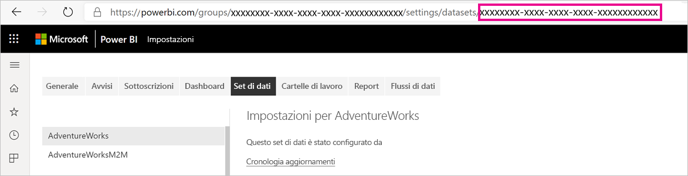
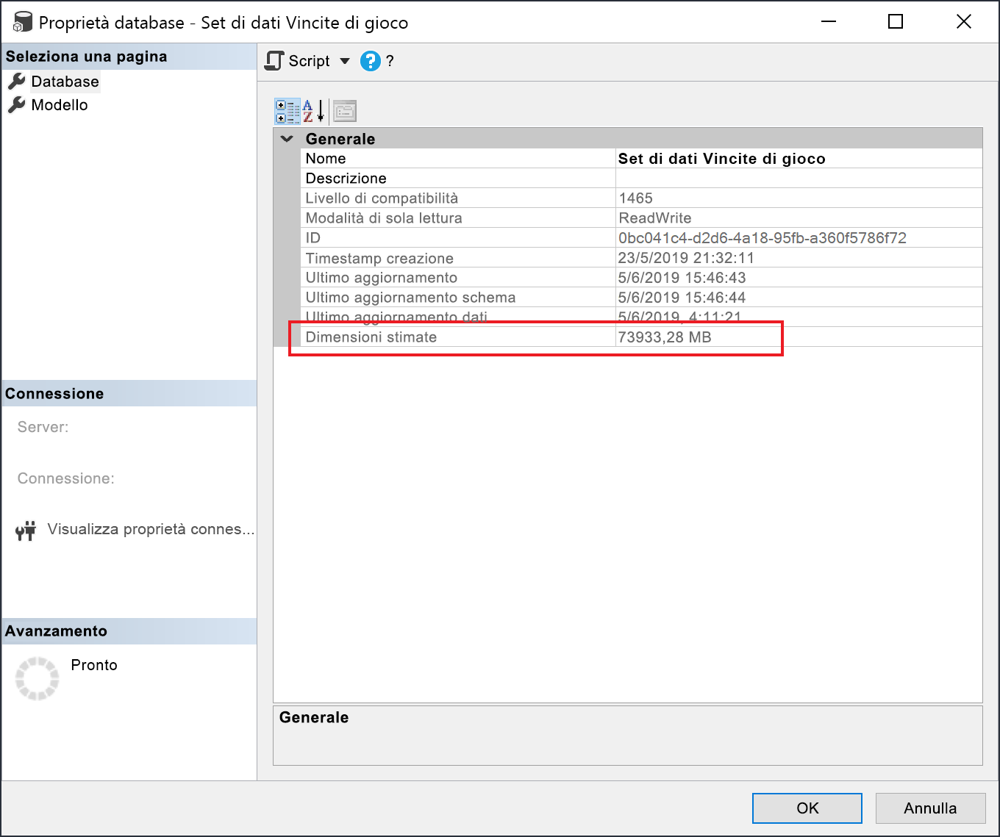

# <a name="large-models-in-power-bi-premium-preview"></a>Modelli di grandi dimensioni in Power BI Premium (anteprima)

I set di dati di Power BI possono archiviare i dati in una cache in memoria altamente compressa per ottimizzare le prestazioni delle query e offrire un'interattività utente rapida in set di dati di grandi dimensioni. La funzionalità dei modelli di grandi dimensioni consente di aumentare le dimensioni dei set di dati di Power BI Premium oltre 10 GB. La dimensione del set di dati è invece limitata dalle dimensioni della capacità di Power BI Premium, un funzionamento simile a quello di Azure Analysis Services in termini di limitazioni delle dimensioni del modello. Per altre informazioni sulle dimensioni della capacità di Power BI Premium, vedere Nodi di capacità. È possibile configurare modelli di grandi dimensioni per tutti gli SKU Premium P ed Embedded A, ma funzionano solo con le [nuove aree di lavoro](service-create-the-new-workspaces.md).

I modelli di grandi dimensioni non influiscono sulle dimensioni di caricamento dei file PBIX, che sono ancora limitate a 10 GB. Al contrario, le dimensioni dei set di dati aumentano oltre 10 GB nel servizio dopo l'aggiornamento. È possibile usare l'aggiornamento incrementale per configurare l'aumento delle dimensioni dei set di dati oltre 10 GB.

## <a name="enable-large-models"></a>Abilitare i modelli di grandi dimensioni

Per creare un set di dati con dimensioni che aumentano oltre 10 GB, seguire questa procedura:

1. Creare un set di dati in Power BI Desktop e configurare un [aggiornamento incrementale](service-premium-incremental-refresh.md).

1. Pubblicare il set di dati nel servizio Power BI Premium.

1. Abilitare il set di dati per i modelli di grandi dimensioni eseguendo i cmdlet di PowerShell riportati di seguito. Tramite questi cmdlet, Power BI archivia il set di dati in File Premium di Azure e non applica il limite di 10 GB.

1. Richiamare un aggiornamento per caricare i dati cronologici in base ai criteri di aggiornamento incrementale. Il primo aggiornamento potrebbe richiedere del tempo per caricare la cronologia. Gli aggiornamenti successivi dovrebbero essere più veloci perché sono incrementali.

### <a name="powershell-cmdlets"></a>Cmdlet di PowerShell

Nella versione corrente dei modelli di grandi dimensioni, abilitare il set di dati per l'archiviazione in File Premium usando i cmdlet di PowerShell. Per eseguire i cmdlet di PowerShell, è necessario avere privilegi di amministratore della capacità e dell'area di lavoro.

1. Trovare l'ID del set di dati (GUID). L'ID è visibile nell'URL delle impostazioni dei set di dati, nella scheda **Set di dati** per l'area di lavoro.

    

1. Da un prompt di amministratore di PowerShell installare il modulo [MicrosoftPowerBIMgmt](/powershell/module/microsoftpowerbimgmt.data/).

    ```powershell
    Install-Module -Name MicrosoftPowerBIMgmt
    ```

1. Eseguire i cmdlet seguenti per accedere e verificare la modalità di archiviazione del set di dati.

    ```powershell
    Login-PowerBIServiceAccount

    (Get-PowerBIDataset -Scope Organization -Id <Dataset ID> -Include actualStorage).ActualStorage
    ```

    La risposta dovrà essere la seguente. La modalità di archiviazione è ABF (file di backup di Analysis Services), che corrisponde all'impostazione predefinita.

    ```
    Id                   StorageMode

    --                   -----------

    <Dataset ID>         Abf
    ```

1. Eseguire i cmdlet seguenti per impostare la modalità di archiviazione su File Premium e verificarla. La conversione in File Premium può richiedere alcuni secondi.

    ```powershell
    Set-PowerBIDataset -Id <Dataset ID> -TargetStorageMode PremiumFiles

    (Get-PowerBIDataset -Scope Organization -Id <Dataset ID> -Include actualStorage).ActualStorage
    ```

    La risposta dovrà essere la seguente. La modalità di archiviazione è ora impostata su File Premium.

    ```
    Id                   StorageMode
    
    --                   -----------
    
    <Dataset ID>         PremiumFiles
    ```

È possibile controllare lo stato delle conversioni dei set di dati da e verso File Premium usando il cmdlet [Get-PowerBIWorkspaceMigrationStatus](/powershell/module/microsoftpowerbimgmt.workspaces/get-powerbiworkspacemigrationstatus).

## <a name="dataset-eviction"></a>Rimozione dei set di dati

Power BI usa la gestione dinamica della memoria per rimuovere i set di dati inattivi dalla memoria. Power BI rimuove i set di dati in modo da poterne caricare altri per rispondere alle query degli utenti. Con la gestione dinamica della memoria, la somma delle dimensioni dei set di dati può essere di gran lunga maggiore rispetto alla capacità di memoria disponibile, ma un singolo set di dati deve rientrare nella memoria. Per altre informazioni sulla gestione dinamica della memoria, vedere [Come funzionano le capacità](service-premium-what-is.md#how-capacities-function).

È necessario considerare l'effetto della rimozione su modelli di grandi dimensioni. Nonostante i tempi di caricamento relativamente veloci dei set di dati, gli utenti potrebbero comunque riscontrare un ritardo notevole se devono aspettare che vengano ricaricati grandi set di dati rimossi. Per questo motivo, nella sua forma attuale, la funzionalità dei modelli di grandi dimensioni è consigliata principalmente per le capacità dedicate ai requisiti aziendali di business intelligence invece che per quelle combinate con i requisiti di BI in modalità self-service. È meno probabile e frequente che le capacità dedicate ai requisiti aziendali di business intelligence attivino la rimozione e la necessità di ricaricare i set di dati. D'altra parte, le capacità per la BI in modalità self-service possono avere molti set di dati di piccole dimensioni che vengono caricati in memoria e scaricati con maggiore frequenza.

## <a name="checking-dataset-size"></a>Verifica delle dimensioni dei set di dati

Dopo aver caricato i dati cronologici, è possibile usare [SSMS](https://docs.microsoft.com/sql/ssms/download-sql-server-management-studio-ssms) tramite l'[endpoint XMLA](service-premium-connect-tools.md) per verificare le dimensioni stimate dei set di dati nella finestra delle proprietà del modello.



È anche possibile verificare le dimensioni dei set di dati eseguendo le query DMV seguenti da SSMS. Per vedere le dimensioni dei set di dati in byte, sommare i valori delle colonne DICTIONARY\_SIZE e USED\_SIZE nell'output.

```sql
SELECT * FROM SYSTEMRESTRICTSCHEMA
($System.DISCOVER_STORAGE_TABLE_COLUMNS,
 [DATABASE_NAME] = '<Dataset Name>') //Sum DICTIONARY_SIZE (bytes)

SELECT * FROM SYSTEMRESTRICTSCHEMA
($System.DISCOVER_STORAGE_TABLE_COLUMN_SEGMENTS,
 [DATABASE_NAME] = '<Dataset Name>') //Sum USED_SIZE (bytes)
```

## <a name="limitations-and-considerations"></a>Limitazioni e considerazioni

Quando si usano modelli di grandi dimensioni, tenere presenti le restrizioni seguenti:

- **Crittografia Bring Your Own Key (BYOK)** : i set di dati abilitati per File Premium non vengono crittografati tramite [BYOK](service-encryption-byok.md).
- **Supporto Multi-Geo**: i set di dati abilitati per File Premium e anche per [Multi-Geo](service-admin-premium-multi-geo.md) genereranno errori di capacità.

- **Download in Power BI Desktop**: se un set di dati viene archiviato in File Premium, il [download come file con estensione pbix](service-export-to-pbix.md) avrà esito negativo.
- **Aree supportate**: I modelli di grandi dimensioni sono supportati in tutte le aree di Azure che supportano l'archiviazione file Premium. Per altre informazioni, vedere [Prodotti disponibili in base all'area](https://azure.microsoft.com/global-infrastructure/services/?products=storage) e consultare la tabella nella sezione seguente.


## <a name="availability-in-regions"></a>Disponibilità nelle aree

I modelli di grandi dimensioni non sono disponibili in tutte le aree in cui è disponibile Power BI. I modelli di grandi dimensioni in Power BI sono disponibili solo nelle aree di Azure che supportano l'[archiviazione file Premium di Azure](https://docs.microsoft.com/azure/storage/files/storage-files-planning#file-share-performance-tiers).

L'elenco seguente indica le aree in cui sono disponibili modelli di grandi dimensioni in Power BI. Le aree non presenti nell'elenco seguente non sono supportate per i modelli di grandi dimensioni:


|Area di Azure  |Abbreviazione dell'area di Azure  |
|---------|---------|
|Australia orientale     | australiaeast        |
|Australia sud-orientale     | australiasoutheast        |
|Stati Uniti centrali     | centralus        |
|Asia orientale     | eastasia        |
|Stati Uniti orientali     | eastus        |
|Stati Uniti orientali 2     | eastus2        |
|Giappone orientale     | japaneast        |
|Giappone occidentale     | japanwest        |
|Corea centrale     | koreacentral        |
|Corea meridionale     | koreasouth        |
|Stati Uniti centro-settentrionali     | northcentralus        |
|Europa settentrionale     | northeurope        |
|Stati Uniti centro-meridionali     | southcentralus        |
|Asia sud-orientale     | southeastasia        |
|Regno Unito meridionale     | uksouth        |
|Regno Unito occidentale     | ukwest        |
|Europa occidentale     | westeurope        |
|Stati Uniti occidentali     | westus        |
|Stati Uniti occidentali 2     | westus2        |


## <a name="next-steps"></a>Passaggi successivi

I collegamenti seguenti offrono informazioni che possono essere utili per l'uso di modelli di grandi dimensioni:

* [Archiviazione file Premium di Azure](https://docs.microsoft.com/azure/storage/files/storage-files-planning#file-share-performance-tiers)
* [Configurare il supporto Multi-Geo per Power BI Premium](service-admin-premium-multi-geo.md)
* [Usare chiavi di crittografia personalizzate per Power BI](service-encryption-byok.md)
* [Come funzionano le capacità](service-premium-what-is.md#how-capacities-function)
* [Aggiornamento incrementale](service-premium-incremental-refresh.md).