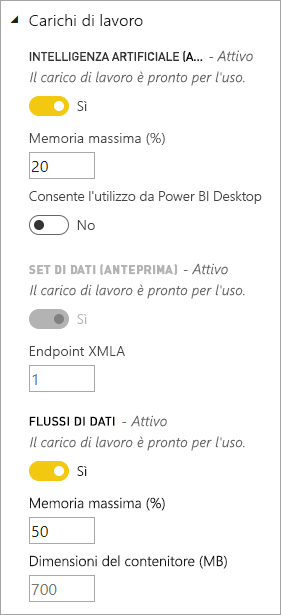
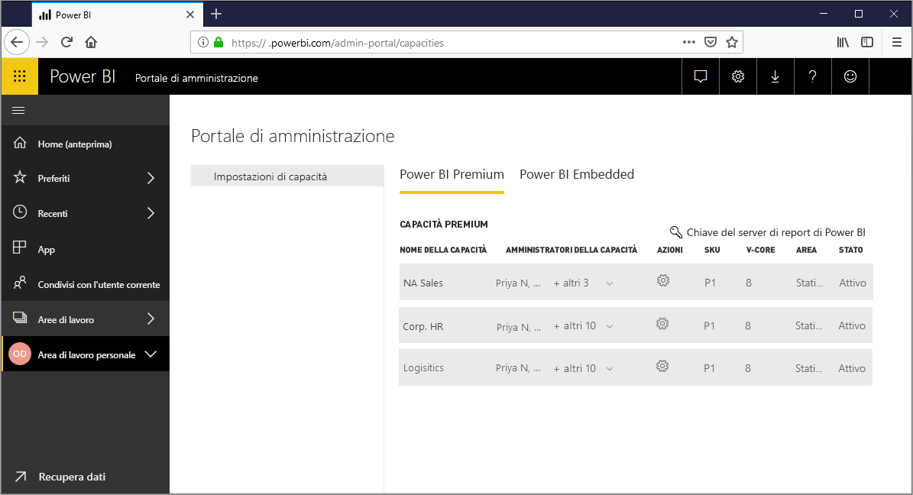
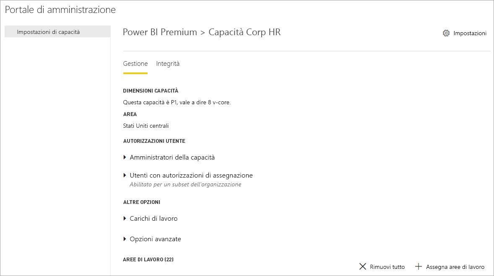
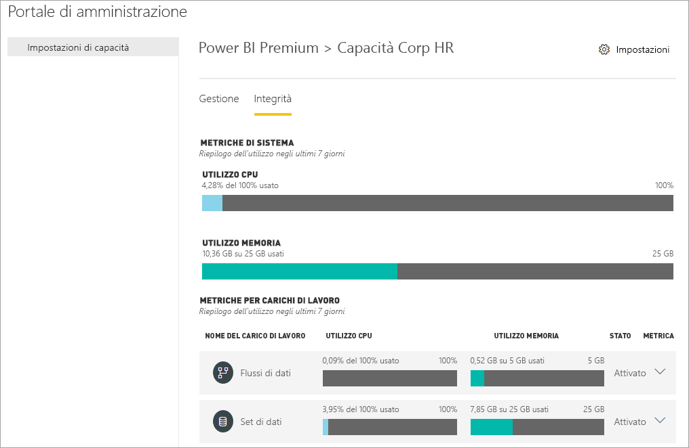
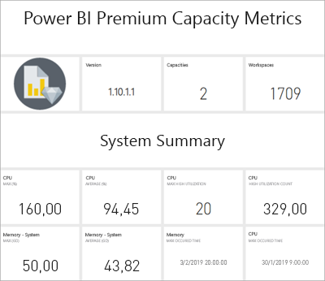
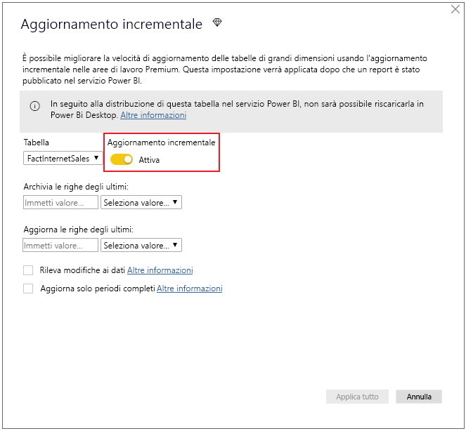
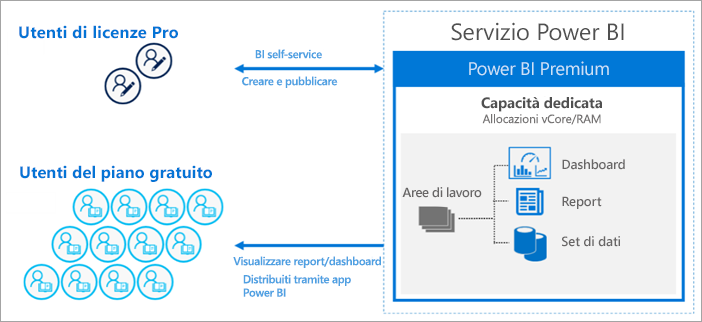
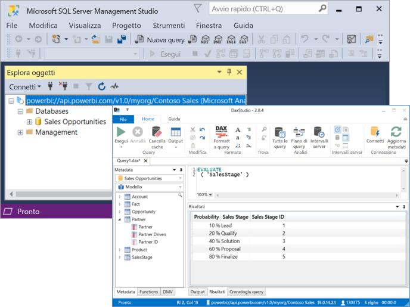

# Che cos'è Power BI Premium?

Power BI Premium offre risorse dedicate e migliorate per eseguire il servizio Power BI per l'organizzazione. ad esempio:

- Maggiore scalabilità e prestazioni migliori
- Flessibilità di licenza dalla capacità
- Unificare Self-Service e BI aziendale
- Estendi Business Intelligence on-premises con Power BI Report Server
- Supporto per la residenza dei dati dall'area (Multi-Geo Capabilities)
- Condividere dati con chiunque senza dover acquistare una licenza per utente

Questo articolo non intende fornire informazioni approfondite su tutte le funzionalità di Power BI Premium: di fatto, tocca semplicemente l'area. Se necessario, vengono forniti collegamenti ad altri articoli con informazioni più dettagliate.

## Sottoscrizioni e licenze

Power BI Premium è disponibile in due famiglie di SKU (SKU Unit) un abbonamento a Office 365 a livello di tenant:

- **EM** SKU (EM1-EM3) per l'incorporamento, che richiedono un impegno annuo, con fatturazione mensile.
- **P** SKU (P1-P3) per le funzionalità di incorporamento ed enterprise, che richiedono un impegno mensile o annuo, con fatturazione mensile e include una licenza per installare il Server di Report di Power BI in locale.

Un approccio alternativo consiste nell'acquistare un **Azure Power BI Embedded** sottoscrizione, che dispone di un singolo **oggetto** solo a scopo di famiglia di SKU (A1-A6) per l'incorporamento e la capacità di test. Tutti gli SKU offrono memorie centrali virtuali per creare le capacità, ma gli SKU EM sono limitati per l'incorporamento di scalabilità più piccoli. EM1, EM2, A1 e A2 SKU con meno di quattro memorie centrali virtuali non vengono eseguiti in un'infrastruttura dedicata.

Anche se l'obiettivo di questo articolo è sugli SKU P, gran parte di ciò che è descritti è importante anche per gli SKU. A differenza di sottoscrizione Premium SKU, SKU di Azure non richiedono alcun impegno temporale e vengono fatturati su base oraria. Sono offrire elasticità completa l'abilitazione di scalabilità di, ridurre, sospendere, riprendere e delete. 

Azure Power BI Embedded è in gran parte esulano dall'ambito di questo articolo, ma viene descritta nel [test di approcci](service-premium-capacity-optimize.md#testing-approaches) sezione dell'articolo le capacità Premium ottimizzazione come un'opzione economica e pratica per testare e valutare i carichi di lavoro. Per altre informazioni sugli SKU di Azure, vedere [documentazione di Azure Power BI Embedded](https://azure.microsoft.com/services/power-bi-embedded/).

### Acquisto

Le sottoscrizioni di Power BI Premium vengono acquistate dagli amministratori nel centro di amministrazione di Microsoft 365. In particolare, solo gli amministratori globali di Office 365 o gli amministratori fatturazione possono acquistare SKU. L'acquisto, il tenant riceve un numero corrispondente di memorie centrali virtuali da assegnare alla capacità disponibili, noti come *limitazione delle richieste di v-core*. Ad esempio, l'acquisto di uno SKU P3 fornisce al tenant 32 memorie centrali. Per altre informazioni, vedere [come acquistare Power BI Premium](service-admin-premium-purchase.md).

## Capacità dedicata

Con Power BI Premium, si ottengono *capacità dedicata*. A differenza di una capacità condivisa in cui i carichi di lavoro eseguiti nelle risorse di calcolo condivise con altri clienti, è una capacità dedicata per l'utilizzo esclusivo da un'organizzazione. Isolata con risorse di calcolo dedicate che offrono prestazioni coerenti e affidabili per il contenuto ospitato. 

Le aree di lavoro si trovano all'interno di capacità. Ogni utente di Power BI dispone di un'area di lavoro persona detta **area di lavoro personale**. È possibile creare nuove aree di lavoro per abilitare la collaborazione e la distribuzione e si parla **aree di lavoro App**. Per impostazione predefinita le aree di lavoro, inclusi le aree di lavoro personale, vengono creati nella capacità condivisa. Quando si dispone di capacità Premium, le aree di lavoro a entrambe le aree di lavoro personale e App possono essere assegnati alla capacità Premium.

### Nodi della capacità

Come descritto nel [abbonamenti e licenze](#subscriptions-and-licensing) sezione, sono disponibili due famiglie di SKU di Power BI Premium: **EM** e **P**. Tutti gli SKU Premium di Power BI sono disponibili come capacità *nodi*, ognuno dei quali rappresenta una quantità di set di risorse costituito da processore, memoria e archiviazione. Oltre alle risorse, ogni SKU ha i limiti operativi per il numero di connessioni DirectQuery e connessione dinamica al secondo e aggiorna il numero di modello parallelo.

L'elaborazione avviene tramite un determinato numero di memorie centrali, suddiviso equamente tra back-end e front-end.

**V-core di back-end** sono responsabili della funzionalità di Power BI core, inclusa elaborazione di query, gestione della cache, che esegue R services, aggiornamento dei modelli, elaborazione in linguaggio naturale (domande e risposte) e il rendering lato server di report e immagini. V-core di back-end vengono assegnate una quantità fissa di memoria che viene usato principalmente a modelli di host, noto anche come attiva set di dati.

**V-core di front-end** sono responsabili per il web service, dashboard e report gestione dei documenti, gestione dei diritti di accesso, pianificazione, API, carica e scarica e a livello generale per tutti gli elementi correlati all'utente esperienze.

Archiviazione è impostata su **100 TB per ogni nodo di capacità**.

Le risorse e i limiti di ogni SKU Premium (e allo stesso modo dimensioni SKU A) sono descritte nella tabella seguente:

| Nodi della capacità | Totale vCore | vCore back-end | RAM (GB) | vCore front-end | Connessione dinamica/DirectQuery (/ sec) | Parallelismo di aggiornamento del modello |
| --- | --- | --- | --- | --- | --- | --- |
| EM1/A1 | 1 | 0,5 | 2.5 | 0,5 | 3.75 | 1 |
| EM2/A2 | 2 | 1 | 5 | 1 | 7.5 | 2 |
| EM3/A3 | 4 | 2 | 10 | 2 | 15 | 3 |
| P1/A4 | 8 | 4 | 25 | 4 | 30 | 6 |
| P2/A5 | 16 | 8 | 50 | 8 | 60 | 12 |
| P3/A6 | 32 | 16 | 100 | 16 | 120 | 24 |
| | | | | | | |

### Capacità dei carichi di lavoro

Capacità dei carichi di lavoro sono servizi resi disponibili agli utenti. Per impostazione predefinita, Premium e le capacità di Azure supportano solo un set di dati del carico di lavoro associato all'esecuzione di query di Power BI. Il carico di lavoro di set di dati non può essere disabilitata. Altri carichi di lavoro può essere abilitate per [(servizi cognitivi) di intelligenza artificiale](https://powerbi.microsoft.com/blog/easy-access-to-ai-in-power-bi-preview/), [Dataflows](service-dataflows-overview.md#dataflow-capabilities-on-power-bi-premium), e [report impaginati](paginated-reports-save-to-power-bi-service.md). Questi carichi di lavoro sono supportati nelle sottoscrizioni Premium solo. 

Ogni carico di lavoro aggiuntivo consente di configurare la memoria massima (come percentuale del totale di memoria disponibile) che può essere utilizzata dal carico di lavoro. I valori predefiniti per la memoria massima sono determinati dallo SKU. È possibile ottimizzare le risorse disponibili della capacità, consentendo solo questi carichi di lavoro aggiuntivi quando vengono utilizzati. Ed è possibile modificare le impostazioni solo dopo aver definito le impostazioni predefinite non rispettano i requisiti di risorse di capacità di memoria. I carichi di lavoro può essere abilitate e configurate per un amministratori della capacità per capacità mediante **le impostazioni di capacità** nel [portale di amministrazione](service-admin-portal.md) o utilizzando il [le API REST di capacità](https://docs.microsoft.com/rest/api/power-bi/capacities).  

Per altre informazioni, vedere [configurare i carichi di lavoro in una capacità Premium](service-admin-premium-workloads.md). 

### Come funzione di capacità

In tutte le volte nel servizio Power BI rende l'uso di risorse capacity durante il non superamento dei limiti imposti per la capacità.

Capacità operazioni classificate come *interattiva* oppure *sfondo*. Le operazioni interattive includono il rendering delle richieste e risposta alle interazioni dell'utente (applicazione di filtri, domande e risposte per query e così via). In generale, l'esecuzione di query di importazione modello la memoria è a elevato utilizzo di risorse, mentre eseguire query sui modelli DirectQuery e connessione dinamica è a elevato utilizzo di CPU. Operazioni in background includono flussi di dati e importano gli aggiornamenti del modello e la memorizzazione nella cache di query dashboard.

È importante comprendere che le operazioni interattive abbiano sempre la priorità su operazioni in background per garantire un'esperienza utente ottimizzata. Se sono presenti risorse insufficienti, operazioni in background vengono aggiunti a una coda per l'elaborazione quando libero risorse. Operazioni in background, ad esempio set di dati viene aggiornata e possono essere arrestato durante l'elaborazione dal servizio Power BI e aggiunto a una coda.

I modelli di importazione devono essere completamente caricati nella memoria in modo che possano essere sottoposti a query o aggiornamento. Il servizio Power BI gestisce la memoria utilizzo usando sofisticati algoritmi per garantire il massimo utilizzo di memoria disponibile e può causare la capacità in eccesso: Mentre è possibile per una capacità di archiviare molti importazione modelli (fino a 100 TB per ogni capacità Premium), durante la loro archiviazione combinato su disco supera la memoria supportata (e memoria aggiuntiva è necessaria per l'esecuzione di query e aggiornamento), quindi non possono tutti essere caricati in memoria in corrispondenza di contemporaneamente.

Importazione modelli sono pertanto caricati e rimosso dalla memoria in base all'utilizzo. Importa un modello viene caricato quando è sottoposto a query (operazione interattiva) e non è ancora in memoria o quando è necessario aggiornare (operazione in background).

La rimozione di un modello dalla memoria è detta *rimozione*. È un'operazione di che Power BI è possibile eseguire rapidamente a seconda delle dimensioni dei modelli. Se la capacità non riscontra qualsiasi utilizzo della memoria, i modelli vengono semplicemente caricati in memoria e rimangono nella coda. Tuttavia, quando memoria disponibile è insufficiente per caricare un modello, il servizio Power BI prima di tutto sarà necessario per liberare memoria. Libera memoria grazie al rilevamento di modelli che sono diventate inattivi effettuando la ricerca di modelli che non sono stati utilizzati negli ultimi tre minuti \[ [1](#endnote-1)\]e quindi nella neutralizzazione di essi. Se non sono presenti modelli inattivi per la rimozione, il servizio Power BI si cerca di rimozione dei modelli caricati per operazioni in background. Ultima risorsa, dopo 30 secondi di tentativi non riusciti \[ [1](#endnote-1)\], consiste nell'eseguire l'operazione interattiva. In questo caso, l'utente del report è una notifica di errore con un suggerimento per riprovare più tardi. In alcuni casi, i modelli possono essere scaricati dalla memoria a causa di operazioni del servizio.

È importante sottolineare che l'eliminazione di set di dati è un comportamento normale e previsto. E mira a ottimizzare l'utilizzo di memoria per il caricamento e scaricamento di modelli cui dimensioni combinate possono superare la memoria disponibile. Si tratta da progettazione e completamente trasparente agli utenti dei report. Percentuali di rimozione elevata non indicano necessariamente che la capacità è rilevavano risorse assegnata. Un problema, tuttavia, diventano possibile, se la velocità di risposta query o aggiornamento carente a causa di percentuali di rimozione elevata.

Gli aggiornamenti dei modelli di importazione sono sempre a uso intensivo della memoria come modelli devono essere caricati in memoria. Memoria aggiuntiva è necessaria per l'elaborazione. Un aggiornamento completo può usare circa il doppio della quantità di memoria necessaria per il modello. In questo modo che il modello è possibile eseguire query anche quando in fase di elaborazione, poiché le query vengono inviate al modello esistente, fino a quando non ha completato l'aggiornamento e i nuovi dati del modello sono disponibili. L'aggiornamento incrementale richiederà meno memoria è stato possibile completare più rapidamente e pertanto consente di ridurre sostanzialmente un utilizzo elevato delle risorse di capacità. Gli aggiornamenti possono anche essere intensivo della CPU per i modelli, specialmente quelli con trasformazioni complesse di Power Query o tabelle/colonne calcolate che sono complesse o sono basati su tabelle di grandi dimensioni.

Gli aggiornamenti, analogamente alle query, è necessario il modello di essere caricate in memoria. Se la memoria è insufficiente, nel servizio Power BI proverà a rimuovere modelli inattivi, e se questo non è possibile (per tutti i modelli sono attivi), il processo di aggiornamento è in coda. Gli aggiornamenti vengono in genere intensivo della CPU, non più importanti rispetto alle query. Per questo motivo, sono previsti limiti di capacità sul numero di aggiornamenti simultanei, impostata su 1,5 volte il numero di v-core di back-end, arrotondato per eccesso. Se sono presenti troppi gli aggiornamenti simultanei, un aggiornamento pianificato verrà accodato. Quando si verificano queste situazioni, richiede più tempo per il completamento dell'aggiornamento. Viene aggiornato su richiesta, ad esempio quelli attivati da una richiesta dell'utente o una chiamata API riproverà a tre volte \[ [1](#endnote-1)\]. Se non esiste ancora, sono disponibili risorse sufficienti, l'aggiornamento avrà quindi esito negativo.

Note sulla sezione:   
\[1\] soggette a modifiche.

### Supporto a livello di area

Quando si crea una nuova capacità, gli amministratori globali di Office 365 e gli amministratori del servizio Power BI è possibile specificare un'area in cui le aree di lavoro assegnati alla capacità si troverà. Questo è noto come **Multi-Geo Capabilities**. Con Multi-Geo Capabilities, le organizzazioni possono soddisfare i requisiti di residenza dei dati tramite la distribuzione di contenuti ai Data Center in un'area specifica, anche se è diversa dall'area in cui risiede l'abbonamento a Office 365. Per altre informazioni, vedere [supporto tecnico di Multi-Geo Capabilities per Power BI Premium](service-admin-premium-multi-geo.md).

### Gestione della capacità

La gestione capacità Premium comporta creazione o l'eliminazione di capacità, assegnare gli amministratori, assegnare le aree di lavoro, la configurazione carichi di lavoro, monitoraggio e adattamenti per ottimizzare le prestazioni della capacità. 

Gli amministratori globali di Office 365 e gli amministratori del servizio Power BI possono creare le capacità Premium da v-core disponibili, o modificare le capacità Premium esistente. Quando viene creata una capacità, vengono specificate le dimensioni della capacità e area geografica e la capacità di almeno un amministratore viene assegnato. 

Quando vengono create le capacità, la maggior parte delle attività amministrative vengono eseguite nel [del portale di amministrazione](service-admin-portal.md).

Gli amministratori della capacità possono assegnare le aree di lavoro alla capacità, gestire le autorizzazioni utente e assegnare altri amministratori. Gli amministratori della capacità possono anche configurare i carichi di lavoro, regolare le allocazioni di memoria e se necessario, riavviare una capacità, la reimpostazione di operazioni in caso di un overload di capacità.

Gli amministratori della capacità possono inoltre verificare che una capacità venga eseguita senza problemi. È possibile monitorare destra integrità capacità nel portale di amministrazione o con l'app di metriche di capacità Premium.

Per altre informazioni sulla creazione di capacità, assegnare gli amministratori e assegnare le aree di lavoro, vedere [capacità Premium gestione](service-premium-capacity-manage.md). Per altre informazioni sui ruoli, vedere [ruoli di amministratore correlati a Power BI](service-admin-administering-power-bi-in-your-organization.md#administrator-roles-related-to-power-bi).

### Monitoraggio

Monitoraggio le capacità Premium offre agli amministratori una conoscenza del modo in cui eseguono le capacità. Le capacità possono essere monitorate tramite il portale di amministrazione e il [le metriche della capacità di Power BI Premium app](https://app.powerbi.com/groups/me/getapps/services/capacitymetrics).

Il monitoraggio nel portale offre una visualizzazione rapida con le metriche di alto livello indicato carichi e le risorse utilizzate dalla capacità, Media, negli ultimi sette giorni. 

Il **le metriche della capacità di Power BI Premium** app fornisce le informazioni più approfondite nel modo in cui eseguono le capacità. L'app fornisce un alto livello dashboard e report più dettagliati.

Dal dashboard dell'app è possibile fare clic su una cella di metrica per aprire i report dettagliato. I report forniscono le metriche dettagliate e le funzionalità di filtro per eseguire il drill-down nelle informazioni più importanti è necessario mantenere la capacità di esecuzione senza problemi.

Per altre informazioni sulla capacità di monitoraggio, vedere [il monitoraggio nel portale di amministrazione di Power BI](service-admin-premium-monitor-portal.md) e [monitoraggio con l'app le metriche della capacità di Power BI Premium](service-admin-premium-monitor-capacity.md).

### Ottimizzazione della capacità

Come usare al meglio la capacità è fondamentale per garantire agli utenti le prestazioni e si ricevono il massimo valore per l'investimento Premium. Monitorando le metriche principali, gli amministratori possono determinare il modo migliore per risolvere i problemi di colli di bottiglia e intraprendere le azioni necessarie. Per altre informazioni, vedere [capacità Premium ottimizzazione](service-premium-capacity-optimize.md) e [gli scenari di capacità Premium](service-premium-capacity-scenarios.md).

### Capacità di API REST

Le API REST di Power BI includono una raccolta di [capacità API](https://docs.microsoft.com/rest/api/power-bi/capacities). Con le API, gli amministratori possono gestire a livello di programmazione molti aspetti delle capacità Premium, tra cui abilitazione e disabilitazione dei carichi di lavoro, l'assegnazione di aree di lavoro a una capacità e altro ancora.

## Set di dati di grandi dimensioni

A seconda dello SKU, Power BI Premium supporta il caricamento di file modello Power BI Desktop (pbix) con un massimo di **10GB** nella dimensione. Durante il caricamento, il modello può successivamente essere pubblicato un'area di lavoro assegnato a una capacità Premium. Sarà possibile aggiornare il set di dati per un massimo di **12 GB** nella dimensione.

### Considerazioni relative alle dimensioni

Modelli di grandi dimensioni possono essere a elevato utilizzo di risorse. È necessario disporre almeno uno SKU P1 per i modelli con dimensioni superiori a 1 GB. Anche se la pubblicazione di modelli di grandi dimensioni per le aree di lavoro supportati da SKU a un massimo di A3 potrebbe lavoro, l'aggiornamento non sarà disponibile.

La tabella seguente descrive gli SKU consigliati in base alle dimensioni del file PBIX:

   |SKU  |Dimensioni PBIX   |
   |---------|---------|
   |P1    | < 3 GB        |
   |P2    | < 6 GB        |
   |P3, P4, P5    | fino a 10 GB   |

Lo SKU A4 di Power BI Embedded equivale allo SKU P1, A5 = P2 e A6 = P3. Tenere presente che la pubblicazione di modelli di grandi dimensioni in SKU A ed EM può restituire errori non specifici dell'errore di limitazione delle dimensioni del modello nella capacità condivisa. È probabile che gli errori di aggiornamento per i modelli di grandi dimensioni in SKU A ed EM indichino il timeout. 

I file pbix rappresentano i dati in un *molto compressi stato*. I dati si espanderanno più volte una volta caricati nella memoria e si espanderanno ulteriormente durante l'aggiornamento dei dati.

Aggiornamento pianificato dei set di dati di grandi dimensioni può richiedere molto tempo e grande quantità di risorse. È importante non pianificare un numero eccessivo di aggiornamenti sovrapposti. È consigliabile [l'aggiornamento incrementale](service-premium-incremental-refresh.md) è configurato, perché è più veloce e più affidabili e Usa meno risorse.

Il caricamento del report iniziale del set di dati di grandi dimensioni può richiedere molto tempo se è stato un po' di tempo dopo l'ultima è stato usato il set di dati. La barra di caricamento per i report a caricamento prolungato visualizza lo stato di avanzamento dell'operazione.

Anche se la memoria per query e i vincoli di tempo sono molto più elevati nella capacità Premium, è consigliabile che usare filtri e filtri dei dati per limitare gli oggetti visivi per visualizzare solo ciò che serve.

## Aggiornamento incrementale

L'aggiornamento incrementale fornisce parte integrante di presenza e la gestione di grandi set di dati in Power BI Premium. L'aggiornamento incrementale presenta numerosi vantaggi, ad esempio, gli aggiornamenti sono più veloci perché solo i dati che ha modificati deve essere aggiornata. Gli aggiornamenti sono più affidabili perché non è necessario mantenere le connessioni di lunga durata alle origini dati volatili. Utilizzo delle risorse viene ridotto perché minore quantità di dati per aggiornare riduce l'utilizzo complessivo della memoria e altre risorse. Definiti in Criteri di aggiornamento incrementale **Power BI Desktop**e applicati quando pubblicato in un'area di lavoro in una capacità Premium. 

Per altre informazioni, vedere [Incremental aggiornamento in Power BI Premium](service-premium-incremental-refresh.md).

## Report impaginati

I report impaginati, supportati in P1-P3 e A4_A6 SKU, sono basati sulla tecnologia di Report Definition Language (RDL) in SQL Server Reporting Services. Anche se basati sulla tecnologia RDL, non è lo stesso come Server di Report di Power BI, è una piattaforma di reporting scaricabile che è possibile installare in locale, inclusi anche in Power BI Premium. I report impaginati sono formattati per essere contenuta anche in una pagina che può essere stampata o condivisi. Dati vengono visualizzati in una tabella, anche se la tabella si estende su più pagine. Con la versione gratuita [ **Generatore Report di Power BI** ](https://go.microsoft.com/fwlink/?linkid=2086513) applicazione Desktop di Windows, autore di utenti impaginato i report e pubblicarli nel servizio.

In Power BI Premium, Paginated report sono un carico di lavoro che deve essere abilitato per una capacità tramite il portale di amministrazione. Gli amministratori della capacità possono attivare e quindi specificare la quantità di memoria come percentuale complessiva della capacità risorse di memoria. A differenza di altri tipi di carichi di lavoro, Premium esegue i report impaginati in uno spazio contenuto all'interno della capacità. Quantità di memoria massimo specificato per questo spazio viene usato se il carico di lavoro è attivo o meno. Il valore predefinito è 20%. 

Per altre informazioni, vedere [impaginati in Power BI Premium](paginated-reports-report-builder-power-bi.md). Per altre informazioni su come abilitare il carico di lavoro Paginated report, vedere [configurare i carichi di lavoro](service-admin-premium-workloads.md).

## Server di report di Power BI
 
Incluso con Power BI Premium, il Server di Report di Power BI è un' *locali* server di report con un portale web. È possibile compilare di BI ambiente locale e Distribuisci report dietro il firewall dell'organizzazione. Server di report offre agli utenti l'accesso a complete e interattive e funzionalità di creazione di report aziendali di SQL Server Reporting Services. Gli utenti possono esplorare i dati visivi e rilevare rapidamente modelli per le decisioni migliori, più veloce. Server di report fornisce la governance alle tue condizioni. Se al momento opportuno e quando il Server di Report di Power BI semplifica la migrazione nel cloud, in cui l'organizzazione può sfruttare appieno tutte le funzionalità di Power BI Premium.

Per altre informazioni, vedere [Server di Report di Power BI](report-server/get-started.md).

## Senza limiti di condivisione del contenuto

Premium, chiunque, sia che si trovino all'interno o all'esterno dell'organizzazione di visualizzare il contenuto di Power BI, inclusi i report impaginati e interattivi senza dover acquistare singole licenze. 

Premium consente la distribuzione generalizzata dei contenuti da parte degli utenti Pro senza richiedere licenze Pro per i destinatari che consente di visualizzare il contenuto. Le licenze Pro sono necessarie per gli autori di contenuti. Creatori di connettono alle origini dati, i dati del modello e creare report e dashboard che vengono impacchettati come le App dell'area di lavoro. 

Per altre informazioni, vedere [licenza di Power BI](service-admin-licensing-organization.md).

## Connettività degli strumenti (anteprima)

Dietro le quinte, l'azienda collaudata Microsoft **motore Vertipaq di Analysis Services** alimenta i set di dati di Power BI. Analysis Services fornisce programmabilità e supporto dello strumento e applicazione client tramite le librerie client e le API che supportano il protocollo XMLA a standard aperto. Attualmente, i set di dati di Power BI Premium supporta *read-only* operazioni di Microsoft e le applicazioni client di terze parti e strumenti tramite **endpoint XMLA**. 

Gli strumenti di Microsoft, ad esempio SQL Server Management Studio e SQL Server Profiler e le app di terze parti, ad esempio Studio DAX e le applicazioni di visualizzazione dei dati, possono connettersi a ed eseguire query di set di dati Premium usando XMLA, DAX, MDX, viste a gestione dinamica e traccia eventi. 

Per altre informazioni, vedere [Connetti al set di dati con strumenti e applicazioni client](service-premium-connect-tools.md).

## Riconoscimenti

Peter Myers, MVP di piattaforma dei dati e indipendenti esperti di Business Intelligence con [bit per bit soluzioni](https://www.bitwisesolutions.com.au/), e di Microsoft Power BI Customer Advisory Team (CAT) sono i collaboratori principali a questo articolo.

## Passaggi successivi

> [!div class="nextstepaction"]
> [La gestione delle capacità Premium](service-premium-capacity-manage.md)

Altre domande? [Provare a rivolgersi alla community di Power BI](https://community.powerbi.com/)

||||||
