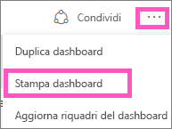
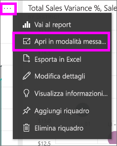
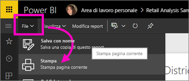

# Stampa dal servizio Power BI
È possibile stampare un intero dashboard, un riquadro del dashboard, una pagina del report o un oggetto visivo del report dal servizio Power BI. I report possono essere stampati solo una pagina alla volta, ovvero non è possibile stampare l'intero report in una sola volta.

> [!NOTE]
> La stampa è disponibile solo nel Servizio Power BI e non in Power BI Desktop.
> 
> 

Il video seguente illustra come stampare da dashboard e report. Seguire quindi tutte le istruzioni riportate sotto il video per provare a farlo da soli.

<iframe width="560" height="315" src="https://www.youtube.com/embed/jtlLGRKBvXY" frameborder="0" allowfullscreen></iframe>

## Stampare un dashboard
1. Aprire il dashboard che si vuole stampare.
2. Nell'angolo in alto a destra selezionare i puntini di sospensione (...) e scegliere **Stampa dashboard**.
   
    
3. Viene visualizzata la finestra di stampa del browser in uso. Scegliere le impostazioni e la destinazione di stampa e selezionare **Stampa**.
   
   > [!NOTE]
   > La finestra di dialogo di stampa che viene visualizzata dipende dal browser in uso.
   > 
   
    

## Stampare un riquadro del dashboard
1. [Aprire il riquadro in modalità messa a fuoco](service-focus-mode.md) selezionando i puntini di sospensione e scegliendo l'icona della modalità messa a fuoco .
   
    
2. Per aprire il riquadro nella [modalità schermo intero](service-fullscreen-mode.md), selezionare l'icona di tale modalità  nella barra di spostamento superiore.
3. Passare il puntatore sul riquadro per visualizzare il menu delle opzioni.
   
    
4. Selezionare l'icona di stampa .     
   
   > [!NOTE]
   > La finestra di dialogo di stampa che viene visualizzata dipende dal browser in uso.
   > 
   > 

## Stampare una pagina del report
I report possono essere stampati una pagina alla volta.

1. Aprire il report in Visualizzazione di lettura o Visualizzazione di modifica.
2. Selezionare **File** > **Stampa** per stampare la pagina corrente del report.
   
    
3. Viene visualizzata la finestra di stampa del browser in uso.
   
   > [!NOTE]
   > La finestra di dialogo di stampa che viene visualizzata dipende dal browser in uso.
   > 
   > 

## Stampare un oggetto visivo del report
1. Per [aprire l'oggetto visivo nella modalità messa a fuoco](service-focus-mode.md), passare con il puntatore del mouse sul riquadro e selezionare l'icona di tale modalità  nell'angolo in alto a destra.
2. Eseguire i passaggi 2-3 in *Stampare una pagina del report*.

## Considerazioni e risoluzione dei problemi
* D: Non è possibile trovare il pulsante **Stampa**.    
* R: Se si sta usando Power BI Desktop, la stampa non è supportata.  È possibile stampare solo nel servizio Power BI.
* D: Non è possibile stampare tutte le pagine del report contemporaneamente.    
* R: È normale. Le pagine dei report possono essere stampate solo una alla volta.
* D: Non è possibile a stampare in formato PDF.    
* R: Questa opzione viene visualizzata solo se il driver PDF è già stato configurato nel browser.    
* D: Quando si seleziona **Stampa**, la visualizzazione non corrisponde a quanto mostrato in questo articolo.    
* R: Le schermate di stampa variano a seconda del browser e della versione del software.
* D: L'immagine stampata non è ridimensionata correttamente.  Il dashboard non si rientra nella pagina. Altre domande su ridimensionamento e orientamento.    
* R: Non è possibile garantire che la copia stampata sarà esattamente identica a come appare nel servizio Power BI. Elementi come il ridimensionamento, i margini, le informazioni visive, l'orientamento e le dimensioni non sono controllati da Power BI. Per informazioni su problemi del genere, consultare la documentazione relativa al browser in uso.      

## Passaggi successivi
[Condividere dashboard e report con i colleghi e altri utenti](service-share-dashboards.md)

Altre domande? [Provare la community di Power BI](http://community.powerbi.com/)

