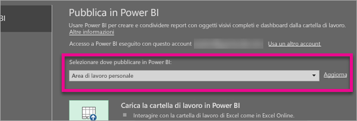
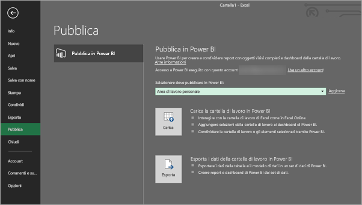
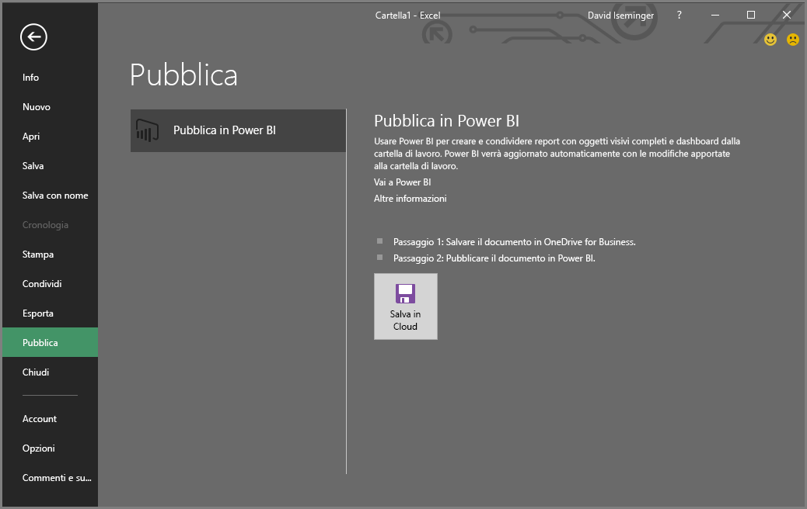
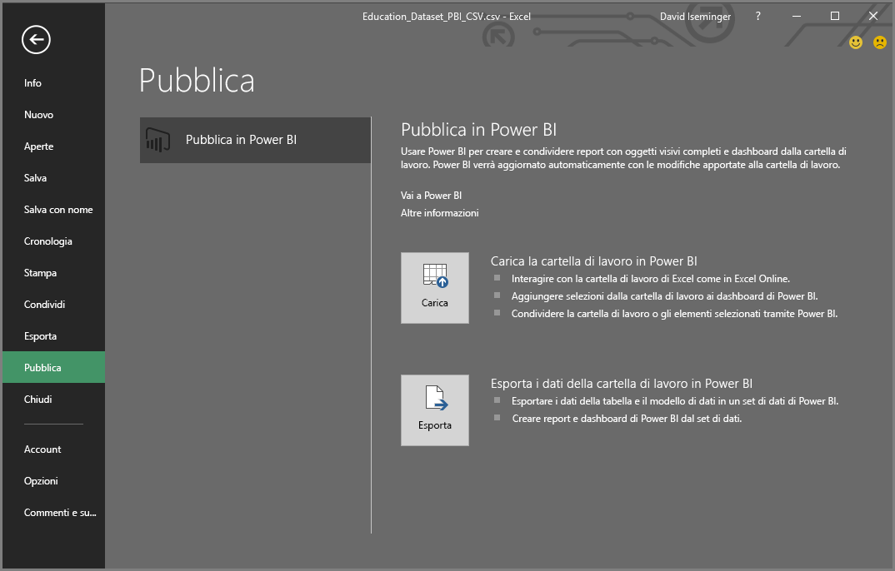
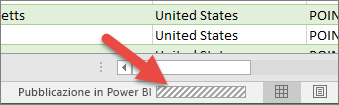

# Pubblicare in Power BI da Excel 2016
Excel 2016 consente di pubblicare una cartella di lavoro di Excel direttamente nel sito di [Power BI](https://powerbi.microsoft.com), in cui è possibile creare report e dashboard estremamente interattivi sulla base dei dati presenti nella cartella di lavoro. È quindi possibile condividere le informazioni con altri utenti dell'organizzazione.

Prima di procedere, è bene tenere in considerazione alcuni aspetti importanti:

* Prima di pubblicare in Power BI, è necessario che la cartella di lavoro sia salvata in OneDrive for Business.
* È necessario usare lo stesso account per accedere a Office, OneDrive for Business e Power BI.
* Non è possibile pubblicare una cartella di lavoro vuota o una cartella di lavoro che non ha alcun contenuto supportato di Power BI.
* Non è possibile pubblicare cartelle di lavoro crittografate, protette con password o gestite tramite IRM.
* Per la pubblicazione in Power BI è necessario che l'autenticazione moderna sia abilitata (impostazione predefinita). Se è disabilitata, l'opzione Pubblica non è disponibile nel menu File.

## Per pubblicare una cartella di lavoro di Excel
In Excel selezionare **File** > **Pubblica**.

### Pubblicazione di file locali
A partire dall'aggiornamento di febbraio 2017, Excel 2016 supporta la pubblicazione di file di Excel locali. Non è necessario che i file siano salvati in OneDrive for Business o SharePoint Online.

> [!IMPORTANT]
> L'esperienza di pubblicazione con i file locali sarà disponibile solo in Excel 2016 con un abbonamento a Office 365. In un'installazione autonoma di Excel 2016 sarà comunque presente il comportamento "Pubblica" che richiede il salvataggio della cartella di lavoro di Excel in OneDrive for Business o SharePoint Online.
> 
> 

Quando si seleziona **Pubblica** sarà possibile selezionare l'area di lavoro in cui pubblicare. Può trattarsi di un'area di lavoro personale o di gruppo a cui si ha accesso.

Sono disponibili due opzioni per la pubblicazione della cartella di lavoro in Power BI.

Dopo la pubblicazione, viene mantenuta come copia in Power BI, separata dal file locale. Se si vuole aggiornare il file in Power BI, è necessario pubblicare nuovamente la versione aggiornata. È possibile aggiornare i dati e impostare la l'aggiornamento pianificato nella cartella di lavoro o nel set di dati in Power BI.

### Pubblicazione da un'installazione autonoma di Excel
Se non è già stato fatto, è necessario salvare la cartella di lavoro in OneDrive. Selezionare Salva nel cloud e scegliere un percorso in OneDrive for Business.

Dopo avere salvato la cartella di lavoro in OneDrive, quando si seleziona **Pubblica** vengono presentate due opzioni per la pubblicazione della cartella di lavoro in Power BI.

#### Carica la cartella di lavoro in Power BI
Quando si sceglie questa opzione, la cartella di lavoro viene visualizzata in Power BI esattamente come in Excel Online. A differenza di Excel Online, però, sono disponibili alcune utilissime funzionalità per aggiungere elementi dai fogli di lavoro ai dashboard.

Non è possibile modificare la cartella di lavoro quando è aperta in Power BI. Se è necessario apportare modifiche, selezionare **Modifica** e quindi scegliere se modificare la cartella di lavoro in Excel Online oppure aprirla in Excel nel computer. Le modifiche apportate vengono salvate nella cartella di lavoro in OneDrive.

Con il caricamento non viene creato alcun set di dati in Power BI. La cartella di lavoro verrà visualizzata in Report, nel riquadro di spostamento dell'area di lavoro. Le cartelle di lavoro caricate in Power BI hanno una speciale icona di Excel che le identifica come cartelle di lavoro di Excel che sono state caricate.

Scegliere questa opzione se i fogli di lavoro contengono solo dati o se sono presenti tabelle pivot e grafici che si vuole visualizzare in Power BI.
L'opzione Carica disponibile in Pubblica in Power BI in Excel assicura un risultato analogo a quello ottenuto scegliendo Recupera dati > File > OneDrive for Business > Connetti, gestisci e visualizza i dati di Excel in Power BI da Power BI nel browser.

#### Esporta i dati della cartella di lavoro in Power BI
Quando si sceglie questa opzione, tutti i dati supportati nelle tabelle e/o in un modello di dati vengono esportati in un nuovo set di dati in Power BI. Gli eventuali fogli di Power View verranno creati nuovamente in Power BI come report.

È possibile continuare a modificare la cartella di lavoro. Quando le modifiche vengono salvate, verranno sincronizzate con il set di dati in Power BI, in genere entro circa un'ora. Se è richiesto un riscontro immediato, è sufficiente selezionare di nuovo Pubblica per esportare subito le modifiche apportate. Anche le visualizzazioni in report e dashboard verranno aggiornate.

Scegliere questa opzione se si usa Recupera e trasforma o Power Pivot per caricare i dati in un modello di dati oppure se la cartella di lavoro contiene fogli di Power View con visualizzazioni da visualizzare in Power BI.

L'opzione Esporta disponibile in Pubblica in Power BI in Excel assicura un risultato analogo a quello ottenuto scegliendo Recupera dati > File > OneDrive for Business > Importa i dati di Excel in Power BI da Power BI nel browser.

## Pubblicazione
Quando si seleziona una di queste opzioni, Excel accede a Power BI con l'account corrente e quindi pubblica la cartella di lavoro nel sito di Power BI. Sulla barra di stato in Excel viene mostrato lo stato di avanzamento.

Al termine è possibile passare a Power BI direttamente da Excel.

## Passaggi successivi
[Dati di Excel in Power BI](service-excel-workbook-files.md)  
Altre domande? [Provare la community di Power BI](http://community.powerbi.com/)

