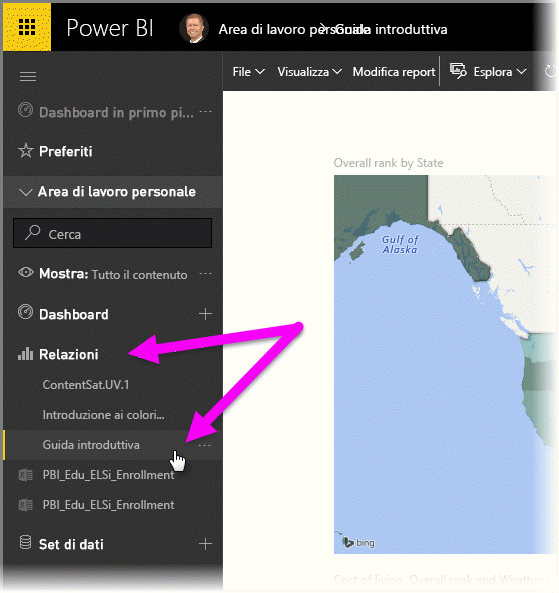
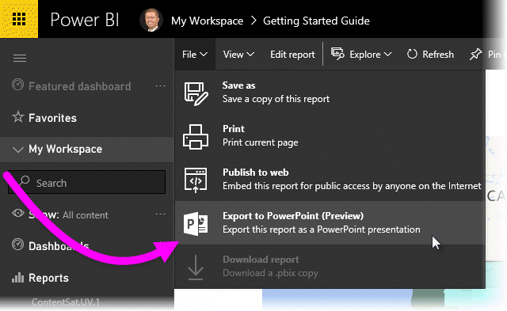
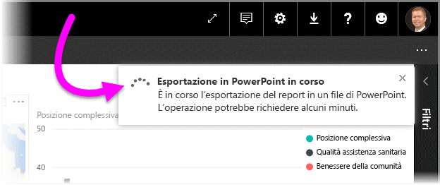
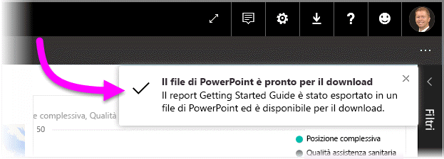
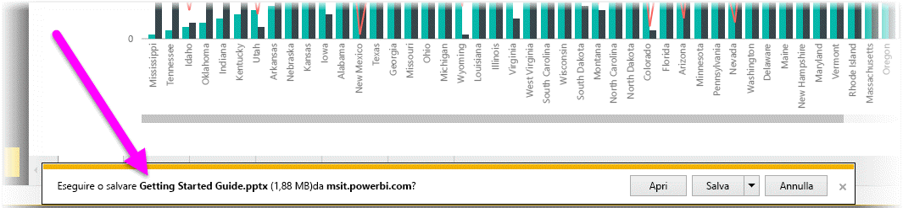
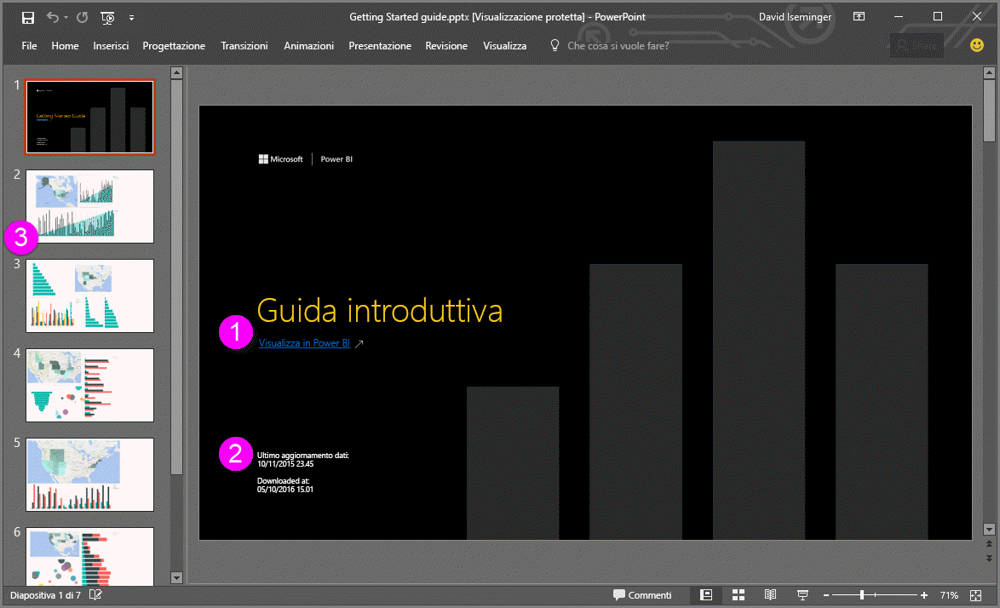
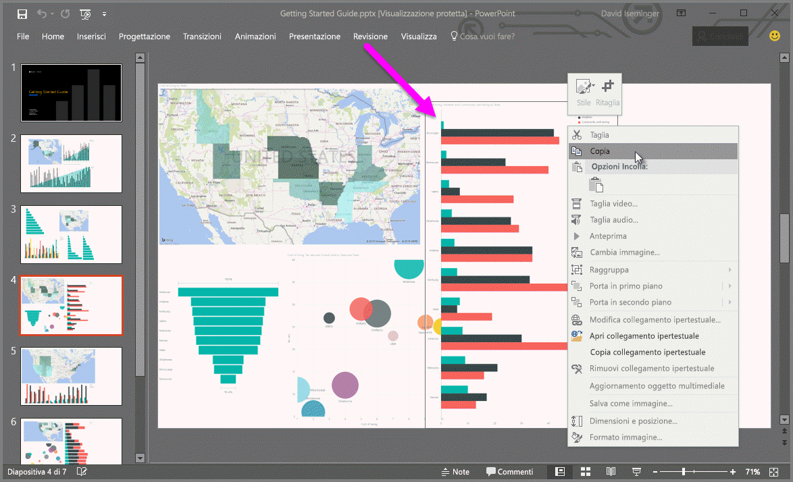

# Esportare report da Power BI in PowerPoint (anteprima)
Con Power BI, è ora possibile pubblicare il report in **Microsoft PowerPoint** e creare facilmente una presentazione basata su un report di Power BI. Quando si **esporta in PowerPoint**, si verifica quanto segue:

* Ogni pagina del report di Power BI diventa una singola diapositiva di PowerPoint
* Ogni pagina del report Power BI viene esportata come singola immagine ad alta risoluzione in PowerPoint
* Le caselle di testo nel report di Power BI diventano caselle di testo modificabili in PowerPoint
* In PowerPoint viene creato un collegamento che indirizza al report di Power BI

Esportare il **report di Power BI** in **PowerPoint** è facile: basta seguire i passaggi descritti nella sezione successiva.

## Come esportare i report di Power BI in PowerPoint
Nel servizio Power BI, selezionare la sezione **Report** nel riquadro di spostamento a sinistra per espanderla, quindi selezionare il report per visualizzarlo nell'area di disegno. È anche possibile selezionare un report dalla sezione **Area di lavoro** o dai **Preferiti**, se il report si trova in uno di questi percorsi.

Quando il report da esportare in PowerPoint viene visualizzato nell'area di disegno, selezionare **File > Esporta in PowerPoint (anteprima)** dalla barra dei menu nel servizio Power BI, come illustrato nella figura seguente.

Nell'angolo in alto a destra della finestra del browser del servizio Power BI verrà visualizzato un banner di notifica che informa che si sta esportando il report in PowerPoint. L'esportazione del report potrebbe richiedere alcuni minuti ed è possibile continuare a lavorare in Power BI.

Al termine della procedura, il banner di notifica cambia, informando che il servizio Power BI ha terminato il processo di esportazione.

Il file sarà quindi disponibile nel percorso in cui il browser visualizza i file scaricati. Nella figura seguente, è visualizzato come banner di download nella parte inferiore della finestra del browser.

E questo è tutto. È possibile scaricare il file, aprirlo con PowerPoint e quindi modificarlo o migliorarlo come si farebbe con qualsiasi altra presentazione di PowerPoint.

## Controllare il file di PowerPoint esportato
Quando si apre il file di PowerPoint esportato da Power BI, si noteranno alcuni elementi interessanti e utili. Osservare l'immagine seguente, quindi vedere di seguito gli elementi numerati che descrivono alcune delle funzionalità più interessanti.

1. La prima pagina della presentazione include il nome del report, nonché un collegamento per poter **visualizzare in Power BI** il report su cui è basata.
2. Si ottengono anche utili informazioni sul report, inclusi l'*ultimo aggiornamento dei dati* su cui è basato il report esportato e l'ora e la data in cui è stato *scaricato*, cioè l'ora e la data in cui il report di Power BI è stato esportato in un file di PowerPoint.
3. Ogni pagina del report è una diapositiva separata, come mostrato nel riquadro di spostamento a sinistra.
4. Il rendering del report pubblicato viene eseguito nella lingua delle impostazioni di Power BI oppure in base alle impostazioni locali del browser. Per visualizzare o impostare la preferenza per la lingua, selezionare l'icona a forma di ingranaggio  **> Impostazioni > Generali > Lingua**. Per altre informazioni, vedere [Lingue e paesi/aree geografiche supportate per Power BI](supported-languages-countries-regions.md).
5. La presentazione di PowerPoint include una diapositiva di copertina con l'ora dell'esportazione nel fuso orario corretto.

Quando si passa a una singola diapositiva, si noterà che ogni pagina del report è un'immagine indipendente.

>[!NOTE]
> La disponibilità di un oggetto visivo per ogni pagina di report è un comportamento nuovo. Il comportamento precedente, che forniva un'immagine indipendente per ogni oggetto visivo, non viene più implementato. 
 

Da questo momento in poi, le operazioni da eseguire con la presentazione di PowerPoint o con qualsiasi immagine ad alta risoluzione sono responsabilità dell'utente.

## Limitazioni
Quando si lavora con la funzionalità **Esporta in PowerPoint** è necessario tenere presenti alcune considerazioni e limitazioni.

* Gli **oggetti visivi R** non sono attualmente supportati. Tutti questi oggetti visivi vengono esportati come un'immagine vuota in PowerPoint con un messaggio di errore che informa che l'oggetto visivo non è supportato.
* Gli **oggetti visivi personalizzati** che sono stati **certificati** sono supportati. Per altre informazioni sugli oggetti visivi personalizzati certificati, tra cui come certificare un oggetto visivo personalizzato, vedere [Ottenere la certificazione di un oggetto visivo personalizzato](power-bi-custom-visuals-certified.md). Gli oggetti visivi personalizzati che sono stati certificati non sono supportati e vengono esportati come un'immagine vuota in PowerPoint, con un messaggio di errore che informa che l'oggetto visivo non è supportato.
* **Gli oggetti visivi personalizzati certificati** sono supportati. Un oggetto visivo personalizzato certificato è stato approvato per l'uso con Power BI, soddisfa determinati requisiti di codice e ha superato rigidi test di sicurezza. [Altre informazioni sugli **oggetti visivi personalizzati certificati**](power-bi-custom-visuals-certified.md).
* I report con più di 15 pagine attualmente non possono essere esportati.
* Il completamento del processo di esportazione del report in PowerPoint potrebbe richiedere alcuni minuti, quindi è consigliabile attendere. I fattori che possono influire sul tempo necessario includono la struttura del report e il carico corrente del servizio Power BI.
* Se la voce di menu **Esporta in PowerPoint (anteprima)** non è disponibile nel servizio Power BI, con molta probabilità l'amministratore tenant ha disabilitato questa funzionalità. Per informazioni dettagliate, contattare l'amministratore tenant.
* Le immagini di sfondo verranno ritagliate con l'area di delimitazione del grafico. Si consiglia vivamente di rimuovere le immagini di sfondo prima dell'esportazione in PowerPoint.
* L'**interattività durante la sessione**, come ad esempio l'evidenziazione e il filtro, il drill-down e così via, non è ancora supportata durante l'esportazione in PowerPoint. Il file PowerPoint esportato mostra gli oggetti visivi originali così com'erano stati salvati nel report.
* Le pagine in PowerPoint vengono create sempre nel formato standard 9:16, a prescindere dalle dimensioni originali della pagina nel report di Power BI.
* Non è possibile pubblicare in PowerPoint i report di proprietà di un utente esterno al dominio del tenant di Power BI, ad esempio un report di proprietà di un utente esterno all'organizzazione e condiviso con l'utente attivo.
* Se si condivide un dashboard con un utente esterno all'organizzazione, ovvero quindi con un utente non incluso nel tenant di Power BI, tale utente non potrà esportare i report associati del dashboard condiviso in PowerPoint. Se, ad esempio, si è aaron@contoso.com, è possibile condividere con david@cohowinery.com, ma david@cohowinery.com non può esportare i report associati in PowerPoint.
* Come indicato in precedenza, ogni pagina del report viene esportata come singola immagine nel file di PowerPoint.
* Il servizio Power BI usa l'impostazione di lingua di Power BI come lingua per l'esportazione in PowerPoint. Per visualizzare o impostare la preferenza per la lingua, selezionare l'icona a forma di ingranaggio  **> Impostazioni > Generali > Lingua**.
* L'orario **scaricato alle** indicato sulla diapositiva di copertina per il file di PowerPoint esportato è impostata sul fuso orario del computer al momento dell'esportazione.

## Passaggi successivi
[Analizza in Excel](service-analyze-in-excel.md)

[Dati di Excel in Power BI](service-excel-workbook-files.md)

[Certificare un oggetto visivo personalizzato](power-bi-custom-visuals-certified.md)

