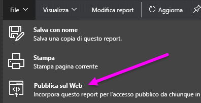
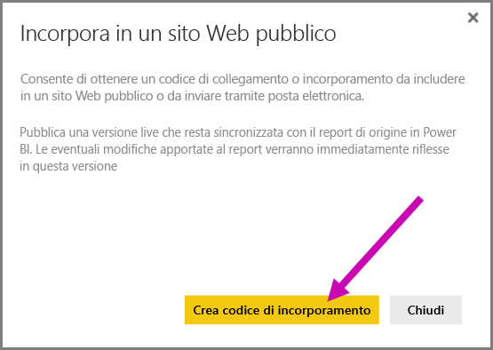
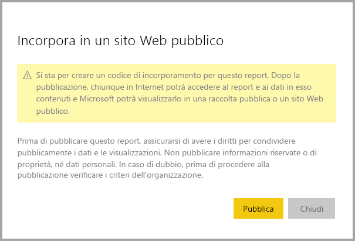
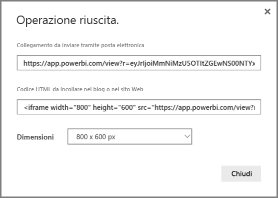
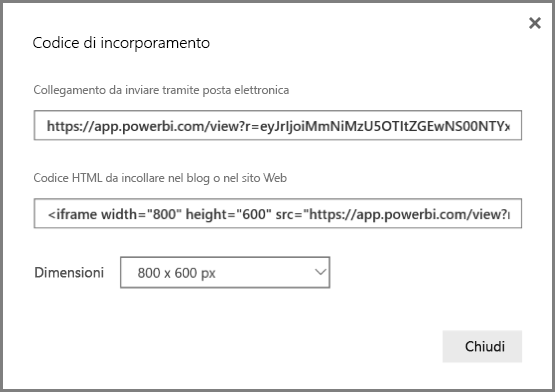
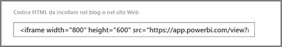
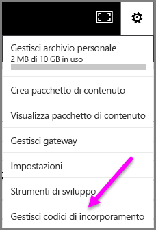
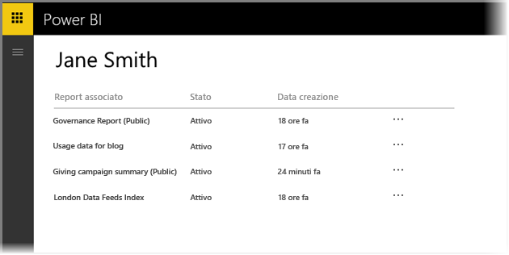
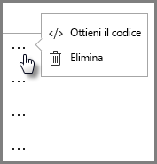
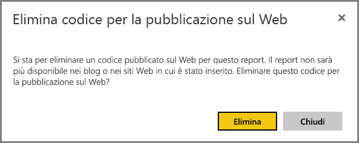

# Pubblicare sul Web da Power BI

L'opzione **Pubblica sul Web** di Power BI consente di incorporare con facilità visualizzazioni interattive di Power BI online, ad esempio in post di blog, siti Web, via posta elettronica o social media, da qualsiasi dispositivo. È anche possibile modificare, aggiornare o annullare facilmente la condivisione degli oggetti visivi pubblicati.

> [!WARNING]
> Quando si usa **Pubblica sul Web**, chiunque su Internet può visualizzare il report o l'oggetto visivo pubblicato. Ciò non richiede alcuna autenticazione e include la visualizzazione dettagliata dei dati aggregati dai report. Prima di pubblicare un report, verificare che sia opportuno condividere pubblicamente i dati e le visualizzazioni. Non pubblicare informazioni riservate o di proprietà. In caso di dubbio, prima di procedere alla pubblicazione verificare i criteri dell'organizzazione.

>[!Note]
>Per incorporare il contenuto in modo sicuro in un portale o un sito Web interno, usare le opzioni [Incorpora](service-embed-secure.md) oppure [Incorpora in SharePoint Online](service-embed-report-spo.md). Ciò assicura che vengano applicate tutte le autorizzazioni e la sicurezza dei dati quando gli utenti visualizzano i dati interni.

## Come usare la funzionalità Pubblica sul Web

La funzionalità **Pubblica sul Web** è disponibile per i report che si possono modificare nelle aree di lavoro personali e di gruppo.  Non è disponibile per i report condivisi con l'utente o quelli in cui la protezione dei dati è basata sulla sicurezza a livello di riga. Vedere la sezione [**Limitazioni**](#limitations) più avanti per un elenco completo di casi in cui la funzionalità **Pubblica sul Web** non è supportata. Prima di usare **Pubblica sul Web** esaminare l'**avviso** riportato in precedenza in questo articolo

e guardare il breve video che segue per vedere come funziona questa funzionalità. Dopo, provare da soli seguendo i passaggi successivi.

<iframe width="560" height="315" src="https://www.youtube.com/embed/UF9QtqE7s4Y" frameborder="0" allowfullscreen></iframe>

La procedura seguente illustra come usare la funzionalità **Pubblica sul Web**.

1. Aprire un report modificabile nell'area di lavoro e selezionare **File > Pubblica sul Web**.

   

2. Esaminare il contenuto della finestra di dialogo e selezionare **Crea codice di incorporamento**.

   

3. Esaminare l'avviso, come indicato qui, e verificare che i dati si possano incorporare in un sito Web pubblico. In caso affermativo, selezionare **Pubblica**.

   

4. Viene visualizzata una finestra di dialogo con un collegamento. È possibile inviare il collegamento via posta elettronica, incorporarlo nel codice, ad esempio un iFrame, o incollarlo direttamente in una pagina Web o un blog.

   

5. Se in precedenza si è creato un codice di incorporamento per un report e si seleziona **Pubblica sul web**, le finestre di dialogo dei passaggi da 2 a 4 non vengono visualizzate. Viene invece visualizzata la finestra **Codice di incorporamento**:

   

   È possibile creare solo un codice di incorporamento per ogni report.

## Suggerimenti e consigli per le modalità di visualizzazione

Quando si incorpora contenuto in un post di blog, è in genere necessario adattarlo alle dimensioni specifiche dello schermo.  È possibile modificare l'altezza e la larghezza nel tag iFrame in base alle esigenze. Tuttavia, è necessario assicurarsi che il report si adatti all'area dell'iFrame specificata, quindi è necessario anche impostare una modalità di visualizzazione appropriata quando si modifica il report.

La tabella seguente include indicazioni sulla modalità di visualizzazione e sul rispettivo aspetto in caso di incorporamento.

| Modalità di visualizzazione | Aspetto dopo l'incorporamento |
| --- | --- |
|  |**Adatta alla pagina** rispetta l'altezza e la larghezza della pagina del report. Se si imposta la pagina su proporzioni *dinamiche*, ad esempio 16:9 o 4:3, il contenuto verrà ridimensionato in modo da adattarsi all'interno dell'iFrame. Se si incorpora il report in un iFrame, usando la modalità **Adatta alla pagina** si può ottenere il *letterboxing*, in cui viene visualizzato uno sfondo grigio nelle aree dell'iFrame dopo che il contenuto viene ridimensionato in modo che si adatti all'interno dell'iFrame. Per ridurre il letterboxing, impostare l'altezza e la larghezza dell'iFrame in modo appropriato. |
|  |La modalità **Dimensioni effettive** garantisce che vengano mantenute le dimensioni definite nella pagina del report. È quindi possibile che nell'iFrame siano visualizzate barre di scorrimento. Impostare l'altezza e la larghezza dell'iFrame per evitare le barre di scorrimento. |
|  |La modalità **Adatta in larghezza** assicura che i contenuti si adattino all'area orizzontale dell'iFrame. Viene comunque visualizzato un bordo, ma il contenuto viene ridimensionato in modo da usare tutto lo spazio orizzontale disponibile. |

## Suggerimenti e consigli per l'altezza e la larghezza dell'iFrame

Un codice di incorporamento di **Pubblica sul Web** è simile al seguente:

 
È possibile modificare manualmente la larghezza e l'altezza per assicurarsi di ottenere esattamente il risultato desiderato nella pagina in cui si incorpora il report.

Per perfezionare ulteriormente il risultato, provare ad aggiungere 56 pixel all'altezza dell'iFrame per adattarla alla dimensione corrente della barra inferiore. Se la pagina del report usa dimensioni dinamiche, la tabella seguente specifica alcune dimensioni che è possibile usare per adattare gli oggetti senza letterboxing.

| Proporzioni | Dimensioni | Dimensione (larghezza x altezza) |
| --- | --- | --- |
| 16:9 |Piccole |640 x 416 px |
| 16:9 |Medie |800 x 506 px |
| 16:9 |Grandi |960 x 596 px |
| 4:3 |Piccole |640 x 536 px |
| 4:3 |Medie |800 x 656 px |
| 4:3 |Grandi |960 x 776 px |

## Gestisci codici di incorporamento

Dopo avere creato un codice di incorporamento di **Pubblica sul Web**, è possibile gestire i codici dal menu **Impostazioni** di Power BI. La gestione dei codici di incorporamento include la possibilità di rimuovere l'oggetto visivo o il report di destinazione per un codice, rendendo inutilizzabile il codice di incorporamento, o di ottenere il codice di incorporamento.

1. Per gestire i codici di incorporamento **Pubblica sul Web** , aprire l'opzione **Impostazioni** , con icona a forma di ingranaggio, e selezionare **Gestisci codici di incorporamento**.

   

2. Vengono visualizzati i codici di incorporamento.

   

3. È possibile recuperare o eliminare un codice di incorporamento. L'eliminazione disabilita tutti i collegamenti a quel report o oggetto visivo.

   

4. Se si seleziona **Elimina**, viene richiesta una conferma.

   

## Aggiornamenti ai report e aggiornamenti dei dati

Dopo la creazione e la condivisione del codice di incorporamento di **Pubblica sul Web**, il report viene aggiornato con eventuali modifiche apportate e il collegamento al codice di incorporamento è immediatamente attivo. Gli utenti che aprono il collegamento possono visualizzarlo. Dopo questa azione iniziale, tuttavia, gli aggiornamenti dei report o oggetti visivi possono richiedere circa un'ora prima di diventare visibili agli utenti. Per altre informazioni, vedere la sezione [**Come funziona**](#howitworks) più avanti in questo articolo. 

## Aggiornamento dei dati

Gli aggiornamenti dei dati vengono applicati automaticamente nel report o nell'oggetto visivo incorporato. La visualizzazione dei dati aggiornati dai codici di incorporamento può richiedere circa un'ora. Per disabilitare l'aggiornamento automatico, selezionare **Non aggiornare** nella pianificazione per il set di dati usato dal report.  

## Oggetti visivi personalizzati

Gli oggetti visivi personalizzati sono supportati in **Pubblica sul Web**. Quando si usa **Pubblica sul Web** gli utenti con cui si condividono gli oggetti visivi pubblicati non devono abilitare gli oggetti visivi personalizzati per visualizzare i report.

## Limitazioni

La funzionalità **Pubblica sul Web** è supportata per la maggior parte delle origini dati e dei report nel servizio Power BI, ma gli elementi seguenti non sono attualmente supportati o disponibili con **Pubblica sul Web**:

- Report che usano la sicurezza a livello di riga
- Report che usano le origini dati della connessione dinamica, inclusi Analysis Services in modalità tabulare ospitato in locale, Analysis Service in modalità multidimensionale e Azure Analysis Services.
- Report condivisi con l'utente direttamente o con un pacchetto di contenuto aziendale
- Report in un gruppo in cui non si è un membro a cui sono consentite modifiche
- Gli oggetti visivi "R" non sono attualmente supportati nei report di **Pubblica sul Web**.
- Esportazione di dati da oggetti visivi in un report pubblicato sul Web.
- Oggetti visivi ArcGIS Maps for Power BI.
- Report che contengono misure DAX a livello di report.
- Modelli di query di dati Single Sign-On.
- [Proteggere le informazioni riservate o di proprietà](#publish-to-web-from-power-bi).
- La funzionalità di autenticazione automatica fornita con l'opzione **Incorpora** non funziona con l'API JavaScript di Power BI. Per l'API JavaScript di Power BI, usare l'approccio all'incorporamento [dati di proprietà dell'utente](developer/embed-sample-for-your-organization.md).

## Impostazione del tenant

Gli amministratori di Power BI possono abilitare o disabilitare la funzionalità **Pubblica sul Web**. Possono anche limitare l'accesso a gruppi specifici, il che può influire sulla possibilità di creare un codice di incorporamento.

|Feature |Abilitata per l'intera organizzazione |Disabilitata per l'intera organizzazione |Gruppi di sicurezza specifici   |
|---------|---------|---------|---------|
|**Pubblica sul Web** nel menu **File** del report|Abilitata per tutti|Non visibile per tutti|Visibile solo per utenti o gruppi autorizzati.|
|**Gestisci codici di incorporamento** in **Impostazioni**|Abilitata per tutti|Abilitata per tutti|Abilitata per tutti.  Opzione * **Elimina** solo per utenti o gruppi autorizzati. Opzione * **Ottieni i codici** abilitata per tutti.|
|**Incorpora codici** nel portale di amministrazione|Lo stato sarà uno dei seguenti: * Attivo * Non supportato * Bloccato|Lo stato sarà **Disabilitato**|Lo stato sarà uno dei seguenti: * Attivo * Non supportato * Bloccato  Se un utente non è autorizzato in base alla configurazione del tenant, lo stato sarà **Violazione**.|
|Report pubblicati esistenti|Tutti abilitati|Tutti disabilitati|Il rendering di tutti i report viene continuato per tutti.|

## Informazioni sulla colonna dello stato del codice di incorporamento

La pagina **Gestisci codici di incorporamento** include una colonna di stato. Per impostazione predefinita, lo stato dei codici di incorporamento è **Attivo**, ma può essere anche uno degli stati elencati di seguito.

| Stato | Descrizione |
| --- | --- |
| **Attivo** |Il report è disponibile per la visualizzazione e l'interazione da parte degli utenti Internet. |
| **Bloccato** |Il contenuto del report viola le [Condizioni d'uso di Power BI](https://powerbi.microsoft.com/terms-of-service). Microsoft lo ha bloccato. Se si ritiene che il contenuto sia stato bloccato per errore, contattare il supporto tecnico. |
| **Non supportato** |Il set di dati del report usa la sicurezza a livello di riga o un'altra configurazione non supportata. Vedere la sezione [**Limitazioni**](#limitations) per un elenco completo. |
| **Violazione** |Il codice di incorporamento non rientra nei criteri definiti per il tenant. Questo problema si verifica in genere quando viene creato un codice di incorporamento e successivamente l'impostazione **Pubblica sul Web** del tenant viene modificata in modo da escludere l'utente proprietario del codice di incorporamento. Se l'impostazione del tenant è disabilitata o se l'utente non è più autorizzato a creare codici di incorporamento, lo stato dei codici di incorporamento esistenti sarà **Violazione**. |

## Come segnalare un problema relativo al contenuto di Pubblica sul Web

Per segnalare un problema relativo al contenuto di **Pubblica sul Web** incorporato in un sito Web o blog, usare l'icona **Flag** nella barra inferiore, come illustra l'immagine seguente. Verrà richiesto di inviare un messaggio di posta elettronica a Microsoft per illustrare il problema. Microsoft valuterà il contenuto in base alle Condizioni per l'utilizzo del servizio Power BI e prenderà le misure appropriate.

Per segnalare un problema, selezionare l'icona **Flag** nella barra inferiore del report di **Pubblica sul Web** visualizzato.

## Gestione delle licenze e prezzi

Per usare la funzionalità **Pubblica sul Web**, è necessario essere utenti di Microsoft Power BI. I visualizzatori del report non devono necessariamente essere utenti di Power BI.

## Come funziona (dettagli tecnici)

Quando si crea un codice di incorporamento usando **Pubblica sul Web**, il report viene reso disponibile agli utenti di Internet. Essendo disponibile pubblicamente, è probabile che in futuro gli utenti condividano il report attraverso i social media. Quando gli utenti visualizzano il report, selezionando l'URL pubblico diretto o visualizzandolo incorporato in una pagina Web o un blog, Power BI memorizza nella cache la definizione del report e i risultati delle query necessarie per visualizzare il report. Ciò garantisce che migliaia di utenti simultanei possano visualizzare il report senza influire sulle prestazioni.

La cache è di lunga durata, quindi se si aggiorna la definizione del report, ad esempio se si cambia la modalità di visualizzazione, o si aggiornano i dati del report, la visualizzazione dei cambiamenti nella versione del report visualizzata dagli utenti può richiedere circa un'ora. È quindi consigliabile eseguire anticipatamente lo staging del lavoro e creare il codice di incorporamento di **Pubblica sul Web** solo quando si è soddisfatti delle impostazioni.

## Passaggi successivi

- [Web part report di SharePoint Online](service-embed-report-spo.md) 

- [Incorporare report in un portale o un sito Web sicuro](service-embed-secure.md)

Altre domande? [Provare la community di Power BI](https://community.powerbi.com/)
