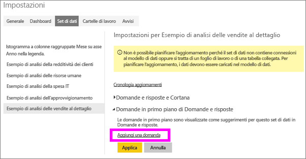
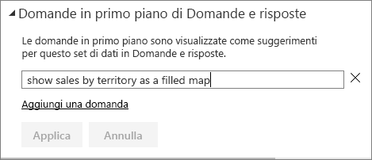
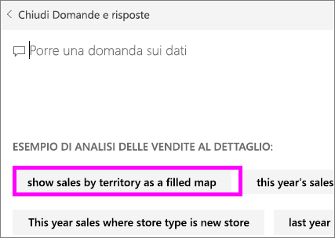
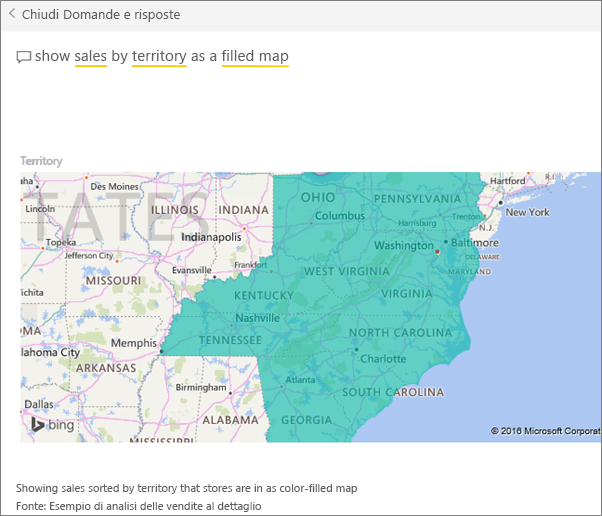

# Creare domande in primo piano per Domande e risposte di Power BI
Se si ha un set di dati, è possibile aggiungere nuove domande in primo piano a questo set di dati.  Domande e risposte su Power BI visualizzerà queste domande ai colleghi che usano (*utilizzano*) il set di dati.  Le domande in primo piano danno un'idea ai colleghi sul tipo di domande che possono porre sul set di dati. Le domande in primo piano aggiunte dipendono dall'utente; aggiungere domande frequenti, domande che consentono di visualizzare risultati interessanti o domande che potrebbero essere difficili da formulare.

Nel video seguente viene mostrato come aggiungere alcune domande in primo piano a Domande e risposte di Power BI e usarle per esplorare il set di dati. Seguire quindi tutte le istruzioni riportate sotto il video per provare a farlo da soli.

<iframe width="560" height="315" src="https://www.youtube.com/embed/E1mIAyEXuF4" frameborder="0" allowfullscreen></iframe>

> [!NOTE]
> Le domande in primo piano di Domande e risposte sono disponibili per l'uso nell'[app Microsoft Power BI per iOS su dispositivi iPad, iPhone e iPod Touch](mobile-apps-ios-qna.md) e nell'anteprima di Domande e risposte di Power BI Desktop. La creazione delle domande è tuttavia disponibile solo nel servizio Power BI (app.powerbi.com).
> 

Questo articolo usa l'[esempio di analisi delle vendite al dettaglio](sample-datasets.md).

1. Nel dashboard selezionare la casella della domanda di Domande e risposte.   Si noti che le domande e risposte si sono già state utili con la visualizzazione di un elenco di termini presenti nel set di dati.
2. Per aggiungerle a questo elenco, selezionare l'icona a forma di ingranaggio nell'angolo in alto a destra di Power BI.  
   
3. Selezionare **Impostazioni** &gt; **Set di dati** &gt; **Esempio di analisi delle vendite al dettaglio** &gt; **Domande in primo piano di Domande e risposte**.  
4. Selezionare **Aggiungi una domanda**.
   
   
5. Digitare la domanda nella casella di testo e selezionare **Applica**.   Facoltativamente, aggiungere un'altra domanda selezionando **Aggiungi una domanda**.  
   
6. Tornare al dashboard di Power BI per l'Esempio di analisi delle vendite e posizionare il cursore nella casella Domande e risposte.   
   
7. La nuova domanda in primo piano, **Vendite in base al territorio come mappa**, è la prima dell'elenco. Selezionarla.  
8. La risposta viene visualizzata come una visualizzazione mappa colorata.  
   

### Passaggi successivi
[Domande e risposte in Power BI](power-bi-q-and-a.md)  
[Esercitazione: Introduzione a Domande e risposte di Power BI](power-bi-visualization-introduction-to-q-and-a.md)  
[Power BI - Concetti di base](service-basic-concepts.md)  
Altre domande? [Provare la community di Power BI](http://community.powerbi.com/)

