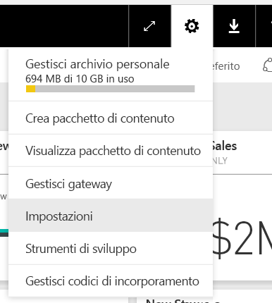
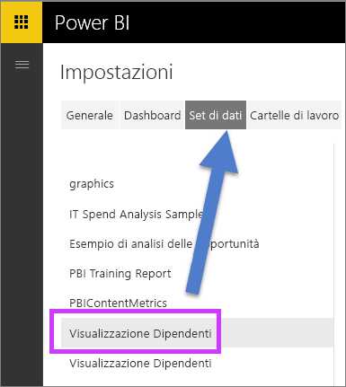
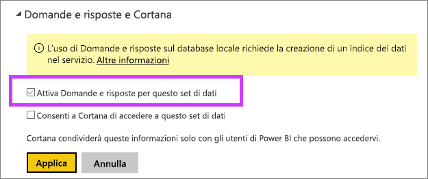

# Attivazione di domande e risposte per le connessioni dinamiche
## Che cos'è il gateway dati locale?  Che cos'è una connessione dinamica?
I set di dati in Power BI possono essere importati in Power BI oppure è possibile creare una connessione dinamica ad essi. I set di dati con connessione dinamica sono spesso definiti "locali". Le connessioni dinamiche vengono gestite con un [gateway](service-gateway-onprem.md) e lo scambio dei dati e delle richieste di informazioni avviene usando query dinamiche.

## Domande e risposte sui set di dati del gateway dati locale
Se si intende usare Domande e risposte con i set di dati a cui si accede tramite un gateway, è prima necessario abilitarli.

Dopo l’abilitazione, Power BI crea un indice dell’origine dati e carica un subset di tali dati in Power BI per consentire la formulazione delle domande. La creazione dell’indice iniziale potrebbe richiedere alcuni minuti e Power BI gestisce e aggiorna automaticamente l'indice nel momento in cui i dati cambiano. L’uso di Domande e risposte con questi set di dati segue lo stesso comportamento di quello con i dati pubblicati in Power BI. L’intero set di funzionalità disponibili nell’esperienza di Domande e risposte è supportato in entrambi i casi, incluso l'uso dell'origine dati con Cortana.

Quando si formula una domanda in Power BI, Domande e risposte determina l’oggetto visivo migliore per il foglio di report o il costrutto da usare per rispondere alla domanda tramite un indice del set di dati. Dopo aver determinato la migliore risposta potenziale, Domande e risposte usa DirectQuery per recuperare i dati dall'origine dati tramite il gateway e popolare diagrammi e grafici. In questo modo, i risultati di Domande e risposte di Power BI mostrano sempre i dati più aggiornati direttamente dall'origine dati sottostante.

Poiché Domande e risposte di Power BI usa i valori di testo e schema dell'origine dati per determinare come eseguire le query sul modello sottostante per ottenere le risposte, le ricerche di valori di testo specifici nuovi o eliminati (ad esempio quando si domanda il nome di un cliente correlato a un nuovo record di testo aggiunto) si basano sull’indice aggiornato con i valori più recenti. Power BI mantiene automaticamente aggiornato l'indice dei valori di testo e schema entro una finestra di 60 minuti dalle modifiche

Per altre informazioni, vedere:

* Che cos'è il [gateway dati locale](service-gateway-onprem.md)?
* [Introduzione alla funzionalità Domande e risposte di Power BI](power-bi-q-and-a.md)

## Abilitare Domande e risposte
Dopo aver configurato il gateway dati, connettersi ai dati da Power BI.  Creare un dashboard usando i dati locali oppure caricare un file con estensione pbix che usa i dati locali.  È possibile che già si disponga di dati locali in dashboard, report e set di dati precedentemente condivisi con l’utente.

1. In alto a destra in Power BI selezionare l'icona della ruota dentata  e scegliere **Impostazioni**.
   
   
2. Selezionare **Set di dati** e scegliere il set di dati da abilitare per Domande e risposte.
   
   
3. Espandere **Domande e risposte e Cortana**, selezionare la casella di controllo **Attiva Domande e risposte per questo set di dati** e scegliere **Applica**.
   
    

## Quali dati vengono memorizzati nella cache e come viene protetta la privacy?
Quando si abilita Domande e risposte per i dati locali, nella cache del servizio viene memorizzato un subset dei dati per garantire il funzionamento di Domande e risposte con prestazioni ragionevoli, Power BI esclude dal caching i valori con più di 24 caratteri. La cache viene eliminata entro alcune ore quando si disabilita Domande e risposte deselezionando **Attiva Domande e risposte per questo set di dati** o quando si elimina il set di dati.

## Considerazioni e risoluzione dei problemi
Durante la fase di anteprima di questa funzionalità, sono previste alcune limitazioni:

* La funzionalità è inizialmente disponibile solo per le origini dati tabulari di SQL Server 2016 Analysis Services. La funzionalità è ottimizzata per funzionare con i dati tabulari. Alcune funzionalità sono disponibili per le origini dati multidimensionali, ma l'esperienza completa di Domande e risposte non è ancora supportata per questo tipo di origine dati. Altre origini dati supportate dal gateway dati locale verranno implementate durante in futuro.
* Il supporto completo per la sicurezza a livello di riga definito in SQL Server Analysis Services non è inizialmente disponibile nell'anteprima pubblica. Quando si formulano domande in Domande e risposte, il "completamento automatico" delle domande durante la digitazione può mostrare valori di stringa a cui un utente non ha accesso. Tuttavia, poiché la sicurezza a livello di riga definita nel modello viene rispettata per gli oggetti visivi dei report e dei grafici, non c’è la possibilità che vengano esposti i dati numerici sottostanti. Le opzioni per controllare questo comportamento verranno rilasciate nei prossimi aggiornamenti.
* Le connessioni dinamiche sono supportate solo con il gateway dati locale. Di conseguenza, questo non è utilizzabile con il gateway personale.

## Passaggi successivi
[Gateway dati locale](service-gateway-onprem.md)  
[Gestire l'origine dati - Analysis Services](service-gateway-enterprise-manage-ssas.md)  
[Power BI - Concetti di base](service-basic-concepts.md)  
[Panoramica di Domande e risposte di Power BI](power-bi-q-and-a.md)  

Altre domande? [Provare a rivolgersi alla community di Power BI](http://community.powerbi.com/)

