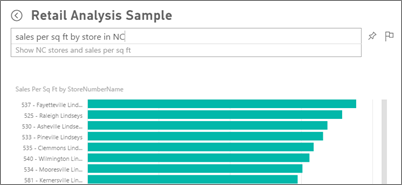

# Domande e risposte in Power BI
A volte il modo più rapido per ottenere una risposta dai dati consiste nel porre una domanda usando il linguaggio naturale. ad esempio "a quanto ammontano le vendite totali dello scorso anno".  Domande e risposte consente di esplorare i dati tramite funzionalità intuitive basate sul linguaggio naturale e di ricevere le risposte sotto forma di grafici. Domande e risposte è diverso da un motore di ricerca in quanto consente di ottenere risultati relativi solo ai dati in Power BI.

> [!NOTE]
> Domande e risposte è disponibile anche nell'[app Microsoft Power BI per iOS sui dispositivi iPad, iPhone e iPod Touch](mobile-apps-ios-qna.md).
> 
> 

Porre la domanda è solo l'inizio.  È possibile spostarsi tra i dati perfezionando o espandendo la domanda, scoprendo nuove informazioni preziose e usando le caratteristiche di zoom avanti o indietro per visualizzare rispettivamente i dettagli o una vista più ampia. Le informazioni approfondite che si possono individuare sono di qualità eccezionale.

L'esperienza è completamente interattiva... e veloce. Basata su un sistema di archiviazione in memoria, la risposta è quasi istantanea.

## Per altri dettagli su Domande e risposte di Power BI
[Come usare Domande e risposte](service-how-to-q-and-a.md): istruzioni dettagliate sull'uso di Domande e risposte e panoramica sul funzionamento generale.

[App Microsoft Power BI per dispositivi mobili](mobile-apps-ios-qna.md) Per iOS sui dispositivi iPad, iPhone e iPod Touch

[Suggerimenti per porre domande in Domande e risposte](service-q-and-a-tips.md): informazioni su come parlare a Domande e risposte per ottenere risultati ottimali.

[L'aggiunta di domande in primo piano ai set di dati](service-q-and-a-create-featured-questions.md) e le domande e risposte suggeriranno queste domande ai colleghi.

[Abilitare Domande e risposte per i set di dati locali](service-q-and-a-direct-query.md)

[Esercitazione: Usare Domande e risposte di Power BI con l'Esempio sulle vendite al dettaglio](power-bi-visualization-introduction-to-q-and-a.md): usare Domande e risposte in un'esercitazione realistica.

[Usare correttamente i dati con Domande e risposte](service-prepare-data-for-q-and-a.md): questo argomento è rivolto in particolare alle persone che creano set di dati e modelli di dati  set di dati e modelli di dati.

## Passaggi successivi
[Power BI - Concetti di base](service-basic-concepts.md)

[Introduzione a Power BI](service-get-started.md)

Altre domande? [Provare la community di Power BI](http://community.powerbi.com/)

