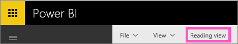

# Passare dalla Visualizzazione di lettura alla Visualizzazione di modifica in Power BI
Rispetto alla [Visualizzazione di lettura](service-interact-with-a-report-in-reading-view.md), la Visualizzazione di modifica di Power BI consente di esaminare più in dettaglio i dati aggiungendo e rimuovendo campi, cambiando il tipo di visualizzazione, creando nuove visualizzazioni e aggiungendo ed eliminando visualizzazioni e pagine dal report.  Per modificare un report, è necessario essere uno dei proprietari del report.

1. Nella Visualizzazione di lettura selezionare **Modifica report**. 
   
   
   
   Il report ora è nella Visualizzazione di modifica e usa le ultime [impostazioni di visualizzazione](power-bi-report-display-settings.md) usate nella Visualizzazione di lettura.
2. Per tornare alla **Visualizzazione di lettura**, selezionare Visualizzazione di lettura nella barra di spostamento superiore.
   
    

Esistono moltissimi modi per [modificare un report](service-interact-with-a-report-in-editing-view.md), filtrando e trasformando i dati per ricavare informazioni e ottenere risposte alle domande.  L'argomento successivo, [Interagire con un report in Visualizzazione di modifica](service-interact-with-a-report-in-editing-view.md), li elenca e li descrive in dettaglio.

### Passaggi successivi
Altre informazioni sui [report in Power BI](service-reports.md)

[Introduzione a Power BI](service-get-started.md)

[Power BI - Concetti di base](service-basic-concepts.md) 

Altre domande? [Provare la community di Power BI](http://community.powerbi.com/) 

