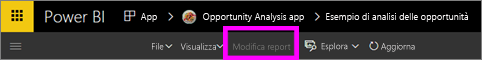
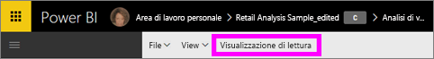

# Visualizzazione di lettura e Visualizzazione di modifica nel servizio Power BI
Nel servizio Power BI (ma non in Power BI Desktop) sono disponibili due modalità per visualizzare e interagire con i report: la Visualizzazione di lettura e la Visualizzazione di modifica.  

La visualizzazione di lettura è disponibile per tutti gli utenti, mentre la Visualizzazione di modifica è disponibile solo per gli autori e i proprietari dei report. La visualizzazione di lettura è progettata per i *consumer* dei report, ovvero i colleghi che aprono i report dalle app o con i quali sono stati condivisi i report. La Visualizzazione di lettura garantisce che ogni singolo consumer di un report specifico visualizzi lo stesso report e le stesse visualizzazioni, con i medesimi filtri applicati.  I consumer possono interagire con report, ma non salvare le modifiche.

>**NOTA**: in alcuni casi, i consumer dei report possono visualizzare dati diversi a seconda delle autorizzazioni per i dati e della sicurezza a livello di riga. 

La Visualizzazione di modifica è disponibile solo agli autori del report o ai colleghi che sono comproprietari di un report in quanto membri o amministratori dell'area di lavoro delle app.

## Visualizzazione di lettura

La Visualizzazione di lettura è un modo sicuro e divertente per analizzare i dati. Visualizzazione lettura non è una modalità interattiva come [Visualizzazione di modifica](service-interact-with-a-report-in-editing-view.md), ma offre comunque numerose opzioni per l'esplorazione dei dati. Questo si rivela molto utile, ad esempio, quando si visualizzano i report [condivisi](service-share-dashboards.md), che possono essere aperti solo in Visualizzazione lettura.

Per altre informazioni, vedere [Visualizzazione di lettura per i report di Power BI](service-interact-with-a-report-in-reading-view.md).

## Visualizzazione di modifica
Rispetto alla [Visualizzazione di lettura](service-interact-with-a-report-in-reading-view.md), la Visualizzazione di modifica di Power BI consente di esaminare più in dettaglio i dati aggiungendo e rimuovendo campi, cambiando il tipo di visualizzazione, creando nuove visualizzazioni e aggiungendo ed eliminando visualizzazioni e pagine dal report.

Per altre informazioni, vedere [Visualizzazione di modifica per i report di Power BI](service-interact-with-a-report-in-editing-view.md)

## Passare dalla Visualizzazione di modifica alla Visualizzazione di lettura
Tenere presente che solo gli autori e i proprietari dei report possono aprire un report in Visualizzazione di modifica.

1. Per impostazione predefinita, il report viene aperto in Visualizzazione di lettura. Se è disponibile l'opzione **Modifica report**, significa che è attiva la Visualizzazione di lettura. Se l'opzione **Modifica report** è disabilitata, significa che l'utente non è autorizzato ad aprire il report in Visualizzazione di modifica.

   

2. Se l'opzione **Modifica report** non è disabilitata, selezionarla per aprire il report in Visualizzazione di modifica. 
   
   
   
   Il report è ora nella Visualizzazione di modifica e presenta le ultime [impostazioni di visualizzazione](power-bi-report-display-settings.md) usate nella Visualizzazione di lettura.

2. Per tornare alla Visualizzazione di lettura, selezionare **Visualizzazione di lettura** nella barra di spostamento superiore.
   
    

Esistono moltissimi modi per interagire con un report nella Visualizzazione di lettura, ad esempio filtrando e trasformando i dati per ottenere informazioni dettagliate e risposte alle domande.  L'argomento successivo, [Interagire con un report nella Visualizzazione di lettura](service-interact-with-a-report-in-editing-view.md), li elenca e li descrive in dettaglio.

### Passaggi successivi
[Interagire con un report nella Visualizzazione di lettura](service-interact-with-a-report-in-editing-view.md)    
Tornare ai [report in Power BI](service-reports.md)    
Altre domande? [Provare la community di Power BI](http://community.powerbi.com/) 

