# Streaming in tempo reale in Power BI
Con lo streaming in tempo reale di Power BI, è possibile trasmettere i dati e aggiornare i dashboard in tempo reale. Gli oggetti visivi o i dashboard che possono essere creati in Power BI possono essere creati anche per visualizzare e aggiornare gli oggetti visivi e i dati in tempo reale. I dispositivi e le origini dei dati in streaming possono essere sensori factory, origini di social media, metriche di utilizzo del servizio e qualsiasi altra origine da cui si possano raccogliere o trasmettere dati per i quali i tempi sono importanti.

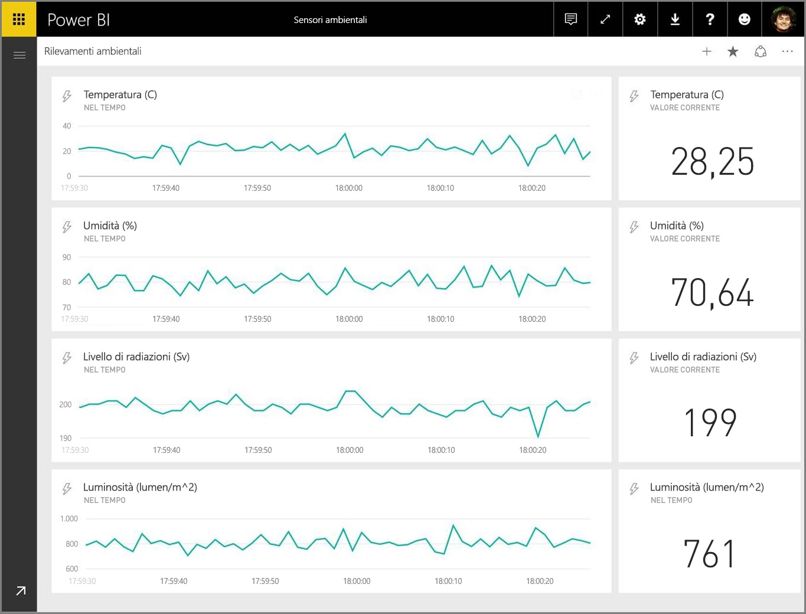

Questo articolo mostra come configurare il set di dati in streaming in tempo reale in Power BI. Ma prima di arrivarci, è importante conoscere i tipi di set di dati in tempo reale che sono progettati per la visualizzazione in riquadri (e dashboard) e le differenze tra questi set di dati.

## Tipi di set di dati in tempo reale
Esistono tre tipi di set di dati in tempo reale, progettati per la visualizzazione nei dashboard in tempo reale:

* Set di dati di push
* Set di dati di streaming
* Set di dati di streaming PubNub

In primo luogo si analizzerà in che modo questi set di dati differiscono l'uno dall'altro (questa sezione), quindi si discuterà come eseguire il push dei dati in ciascuno di tali set di dati.

### Set di dati di push
Con un **set di dati di push**, viene eseguito il push dei dati nel servizio Power BI. Quando viene creato il set di dati, il servizio Power BI crea automaticamente un nuovo database nel servizio per memorizzare i dati. Poiché è presente un database sottostante che continua a memorizzare i dati in arrivo, è possibile creare report con i dati. Questi report e i rispettivi oggetti visivi sono esattamente come qualsiasi altro oggetto visivo di report, vale a dire che è possibile usare tutte le funzionalità di creazione di report di Power BI per creare oggetti visivi, inclusi oggetti visivi personalizzati, avvisi dati, riquadri del dashboard aggiunti e molto altro.

Dopo aver creato un report usando il set di dati di push, sarà possibile aggiungere uno qualsiasi dei suoi oggetti visivi a un dashboard. Nel dashboard, gli oggetti visivi si aggiornano in tempo reale ogni volta che i dati vengono aggiornati. All'interno del servizio, il dashboard attiva un aggiornamento del riquadro ogni volta che si ricevono nuovi dati.

Esistono due aspetti da considerare relativamente ai riquadri aggiunti da un set di dati di push:

* L'aggiunta di un intero report con l'opzione *Aggiungi pagina dinamica* **non** comporta l'aggiornamento automatico dei dati.
* Dopo aver aggiunto un oggetto visivo a un dashboard, è possibile usare **Domande e risposte** per fare domande al set di dati di push in linguaggio naturale. Dopo aver eseguito una query **Domande e risposte** è possibile aggiungere nuovamente l'oggetto visivo risultante al dashboard, *anch'esso* aggiornato in tempo reale.

### Set di dati di streaming
Con un **set di dati di streaming**, anche i dati vengono spostati nel servizio Power BI, con una differenza importante: Power BI si limita ad archiviare i dati in una cache temporanea, che scadrà rapidamente. La cache temporanea viene usata solo per visualizzare gli oggetti visivi che hanno un certo senso cronologico temporaneo, ad esempio un grafico a linee con un intervallo di tempo di un'ora.

Con un **set di dati di streaming**, *non* c'è un database sottostante, quindi *non si possono* generare oggetti visivi del report usando i dati trasmessi dal flusso. Di conseguenza, non è possibile usare le funzionalità del report, ad esempio i filtri, gli oggetti visivi personalizzati e altre funzioni di report.

L'unico modo per visualizzare un set di dati di streaming consiste nell'aggiungere un riquadro e usare il set di dati di streaming come un'origine dati per i **dati di streaming personalizzati**. I riquadri di streaming personalizzati che si basano su un **set di dati di streaming** sono ottimizzati per visualizzare rapidamente i dati in tempo reale. C'è una latenza minima tra il momento in cui i dati vengono spostati nel servizio Power BI e quello in cui l'oggetto visivo viene aggiornato, perché non è necessario che i dati vengano immessi o letti in un database.

In pratica, i set di dati di streaming e i relativi oggetti visivi di streaming risultano particolarmente adatti in situazioni in cui è fondamentale ridurre al minimo la latenza tra il momento in cui i dati vengono spostati e quello in cui vengono visualizzati. È anche consigliabile eseguire il push di dati in un formato che può essere visualizzato così com'è, senza alcuna aggregazione aggiuntiva. Tra gli esempi di dati che sono pronti "così come sono" sono incluse le temperature e le medie pre-calcolate.

### Set di dati di streaming PubNub
Con un set di dati di streaming **PubNub** il client Web di Power BI usa l'SDK PubNub per leggere un flusso di dati PubNub e nessun dato viene memorizzato dal servizio Power BI.

Come con il **set di dati di streaming**, con il **set di dati di streaming PubNub** non c'è nessun database sottostante in Power BI, quindi non è possibile creare oggetti visivi del report in base ai dati trasmessi né sfruttare le funzionalità dei report come i filtri, gli oggetti visivi personalizzati e così via. Di conseguenza, anche il **set di dati di streaming PubNub** può essere visualizzato solo aggiungendo un riquadro al dashboard e configurando un flusso di dati PubNub come origine.

I riquadri basati su un **set di dati di streaming PubNub** sono ottimizzati per visualizzare rapidamente i dati in tempo reale. Dal momento che Power BI è direttamente connesso al flusso di dati PubNub, c'è una latenza minima tra il momento in cui i dati vengono spostati nel servizio Power BI e quello in cui l'oggetto visivo viene aggiornato.

### Matrice del set di dati di streaming
La tabella seguente (o matrice, se si preferisce) descrive i tre tipi di set di dati per lo streaming in tempo reale ed elenca le funzionalità e le limitazioni di ciascuna.

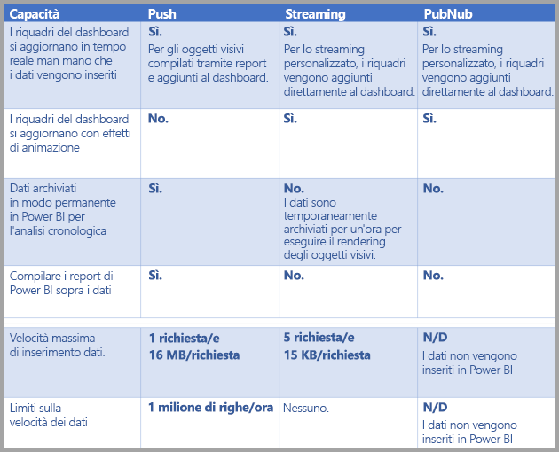

> [!NOTE]
> Vedere [questo articolo di MSDN](https://msdn.microsoft.com/library/dn950053.aspx) per informazioni sui limiti del **push** sulla quantità di dati di cui è possibile eseguire il push.
> 
> 

## Push dei dati nei set di dati
La sezione precedente descriveva tre tipi principali di set di dati in tempo reale che è possibile usare nello streaming in tempo reale e le relative differenze. Questa sezione descrive come creare ed eseguire il push dei dati in tali set di dati.

Esistono tre modi principali in cui è possibile eseguire il push dei dati in un set di dati:

* Uso delle API REST di Power BI
* Uso dell'interfaccia utente del set di dati di streaming
* Uso dell'Analisi di flusso di Azure

Verranno ora esaminati tutti gli approcci singolarmente.

### Uso delle API REST di Power BI per eseguire il push dei dati
È possibile usare le **API REST di Power BI** per creare e inviare dati ai set di dati di **push** e ai set di dati di **streaming**. Quando si crea un set di dati con le API REST di Power BI, il flag *defaultMode* specifica se il set di dati è di tipo push o streaming. Se non viene impostato alcun flag *defaultMode*, il valore predefinito del set di dati è di tipo **push**.

Se il valore *defaultMode* è impostato su *pushStreaming*, il set di dati è di tipo sia **push** *che* **streaming**, offrendo i vantaggi di entrambi i tipi di set di dati. L'[articolo per **Create dataset**](https://msdn.microsoft.com/library/mt203562.aspx) dell'API REST dimostra la creazione di un set di dati di streaming e mostra il flag *defaultMode* in azione.

> [!NOTE]
> Quando si usano set di dati con il flag *defaultMode* impostato su *pushStreaming*, se una richiesta supera la limitazione delle dimensioni di 15 Kb per un set di dati di **streaming**, ma è inferiore rispetto alla limitazione delle dimensioni di 16 MB di un set di dati di **push**, la richiesta avrà esito positivo e i dati verranno aggiornati nel set di dati push. Tuttavia, tutti i riquadri di streaming avranno temporaneamente esito negativo.
> 
> 

Dopo aver creato un set di dati, usare le API REST per eseguire il push dei dati usando l'API [ **Aggiungi righe** ](https://msdn.microsoft.com/library/mt203561.aspx), come [illustrato in questo articolo](https://msdn.microsoft.com/library/mt203561.aspx).

Tutte le richieste alle API REST sono protette con **Azure AD OAuth**.

### Uso dell'interfaccia utente del set di dati di streaming per il push dei dati
Nel servizio Power BI, è possibile creare un set di dati selezionando l'approccio dell'**API** come illustrato nella figura seguente.

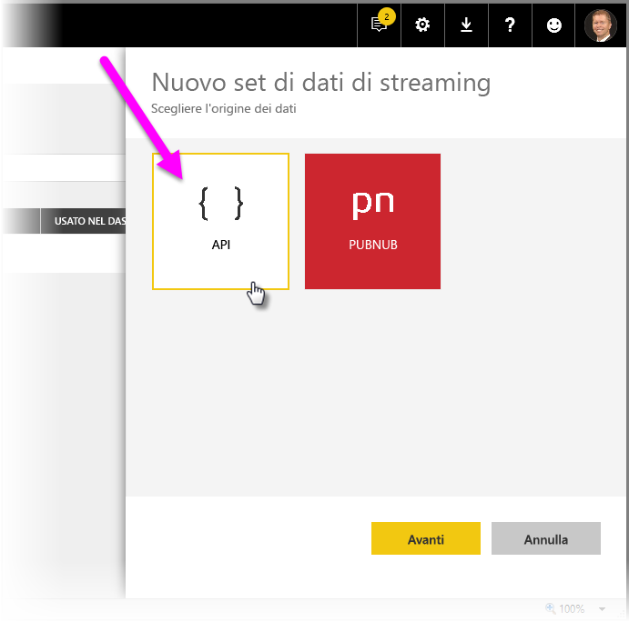

Quando si crea il nuovo set di dati di streaming, è possibile scegliere di abilitare **Analisi dati cronologici** come illustrato di seguito, con un impatto significativo.

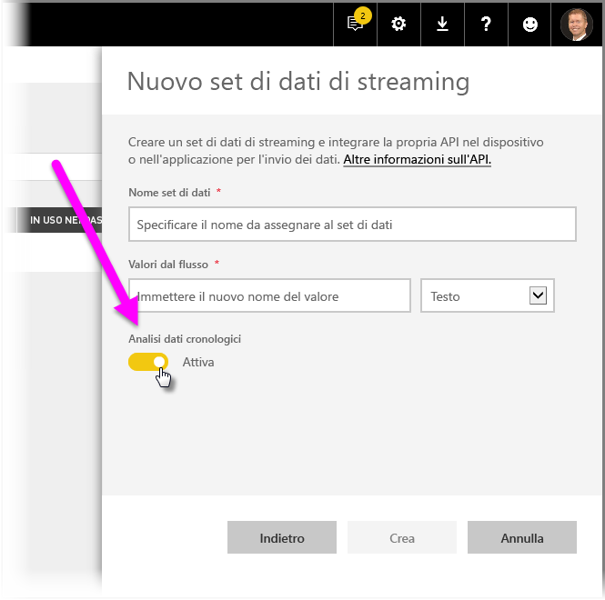

Quando l'opzione **Analisi dati cronologici** è disabilitata (lo è per impostazione predefinita), è possibile creare un **set di dati di streaming** come descritto in precedenza in questo articolo. Quando l'opzione **Analisi dati cronologici** è *abilitata*, il set di dati creato diventa sia un **set di dati di streaming** sia un **set di dati di push**. Ciò equivale all'uso delle API REST di Power BI per creare un set di dati con il flag *defaultMode* impostato su *pushStreaming*, come descritto in precedenza in questo articolo.

> [!NOTE]
> Per i set di dati di streaming creati con l'interfaccia utente del servizio Power BI, come descritto nel paragrafo precedente, l'autenticazione di Azure AD non è obbligatoria. In tali set di dati, il proprietario del set di dati riceve un URL con un valore rowkey, che autorizza il richiedente a eseguire il push dei dati nel set di dati senza usare un token di connessione OAuth di Azure AD. Si consideri, tuttavia, che l'approccio di Azure AD (AAD) funziona ancora per eseguire il push dei dati nel set di dati.
> 
> 

### Uso dell'analisi di flusso di Azure per il push dei dati
È possibile aggiungere Power BI come output all'interno dell'**Analisi di flusso di Azure** (ASA) e quindi visualizzare i flussi di dati nel servizio Power BI in tempo reale. Questa sezione descrive i dettagli tecnici sulle modalità di tale processo.

Analisi di flusso di Azure usa le API REST di Power BI per creare il relativo flusso di dati in Power BI, con il flag *defaultMode* impostato su *pushStreaming* (vedere le precedenti sezioni in questo articolo per informazioni su *defaultMode*), che risulta in un set di dati che può sfruttare sia **push** che **streaming**. Durante la creazione del set di dati, Analisi di flusso di Azure imposta anche il flag **retentionPolicy* su *basicFIFO*; con tale impostazione, il database che supporta il set di dati di push archivia 200.000 righe e una volta raggiunto tale limite, le righe vengono eliminate secondo il metodo First In, First Out (FIFO).

> [!CAUTION]
> Se la query Analisi di flusso di Azure produce un output estremamente rapido in Power BI (ad esempio, una o due volte al secondo), Analisi di flusso di Azure inizierà a inviare in batch tali output in un'unica richiesta. Ciò potrebbe far sì che la dimensione della richiesta superi il limite del riquadro di streaming. In tal caso, come indicato nelle sezioni precedenti, i riquadri di streaming non riusciranno a eseguire il rendering. In questi casi, la procedura consigliata consiste nel diminuire la velocità dell'output dei dati in Power BI; ad esempio, anziché un valore massimo ogni secondo, impostarlo su un valore massimo per 10 secondi.
> 
> 

## Configurare il set di dati in streaming in tempo reale in Power BI
Dopo aver affrontato i tre tipi principali di set di dati per lo streaming in tempo reale e i tre metodi principali per eseguire il push dei dati in un set di dati, è possibile iniziare a usare il set di dati di streaming in tempo reale in Power BI.

Per avviare lo streaming in tempo reale, è necessario scegliere una delle due modalità di utilizzo dei dati in streaming in Power BI:

* **riquadri** con oggetti visivi dai dati in streaming
* **set di dati** creati dai dati in streaming che vengono mantenuti in Power BI

In entrambi i casi, è necessario impostare **Dati in streaming** in Power BI. A tale scopo, nel dashboard esistente o in un nuovo dashboard selezionare **Aggiungi riquadro**, quindi scegliere **Dati in streaming personalizzati**.

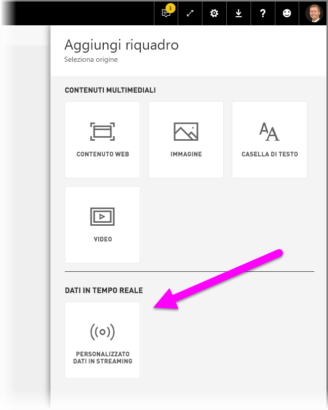

Se non sono stati ancora configurati i dati in streaming, è possibile selezionare **gestire i dati** per iniziare.

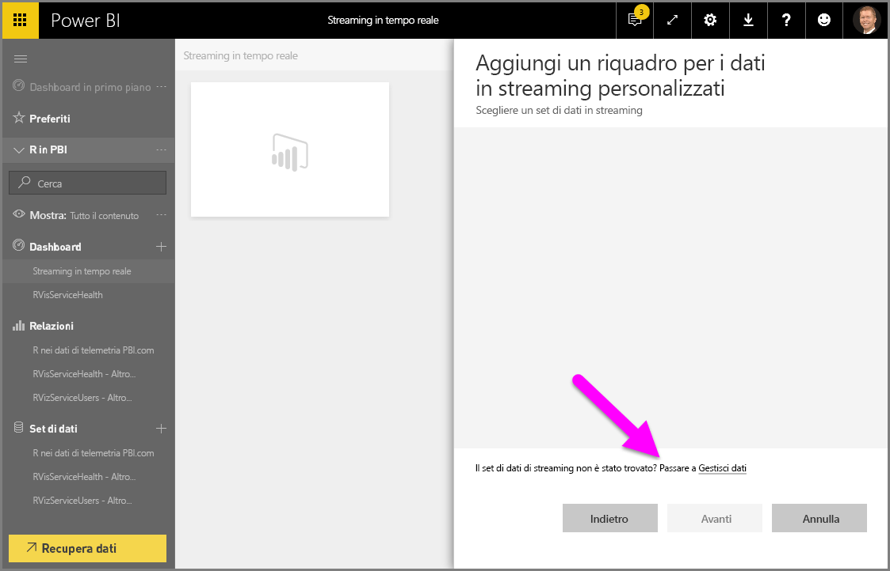

In questa pagina è possibile immettere l'endpoint del set di dati in streaming se ne è già stato creato uno nella casella di testo. Se non è ancora stato creato un set di dati in streaming, selezionare l'icona + (**+**) nell'angolo superiore destro per visualizzare le opzioni disponibili per creare un set di dati in streaming.

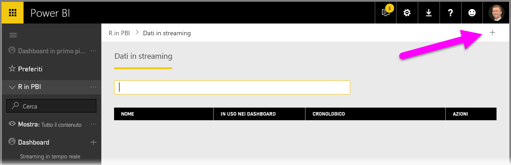

Quando si fa clic sull'icona **+**, vengono visualizzate due opzioni:

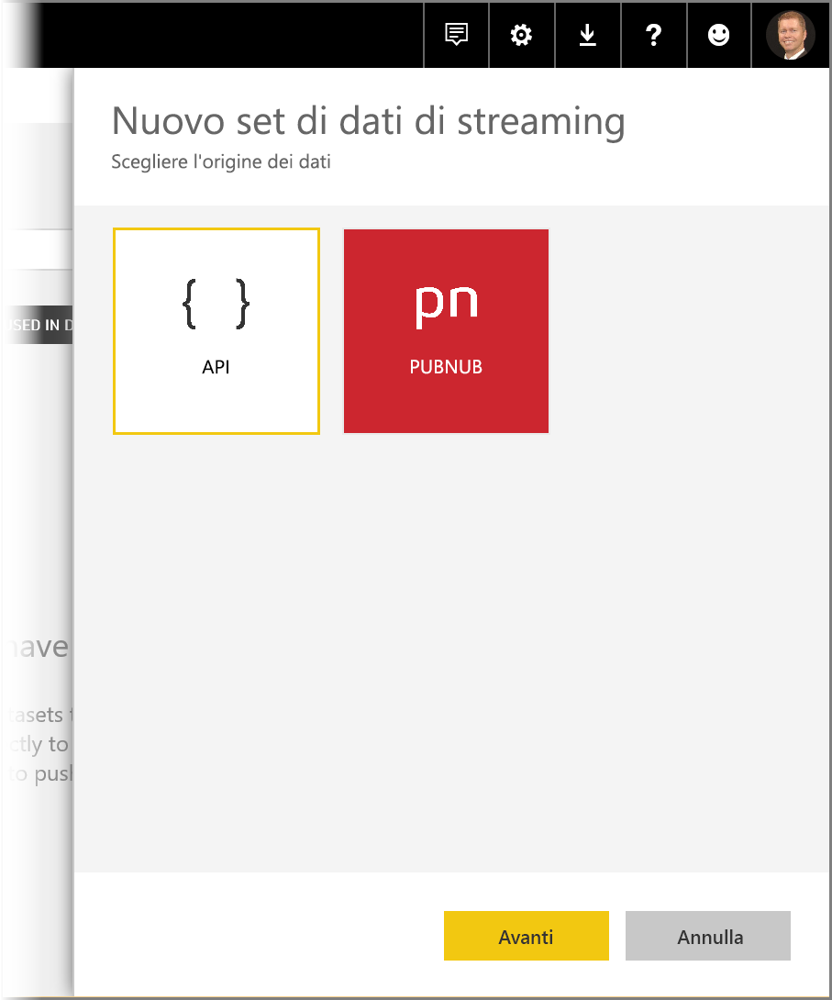

La sezione successiva descrive queste opzioni e fornisce informazioni più dettagliate su come creare un **riquadro** di streaming o un **set di dati** dall'origine dati in streaming, che può essere successivamente usato per creare report.

## Creare il set di dati in streaming con l'opzione preferita
Esistono due modi per creare un feed di dati per lo streaming in tempo reale che può essere utilizzato e visualizzato da Power BI:

* **API REST di Power BI** con un endpoint di streaming in tempo reale
* **PubNub**

Le sezioni successive esaminano le opzioni singolarmente.

### Utilizzo dell'API REST di POWER BI
**REST API di Power BI**: i recenti miglioramenti all'API REST di Power BI sono pensati per semplificare lo streaming in tempo reale per gli sviluppatori. Quando si seleziona **API** dalla finestra **Nuovo set di dati di streaming**, vengono visualizzate le voci che consentono a Power BI di connettersi e usare l'endpoint:

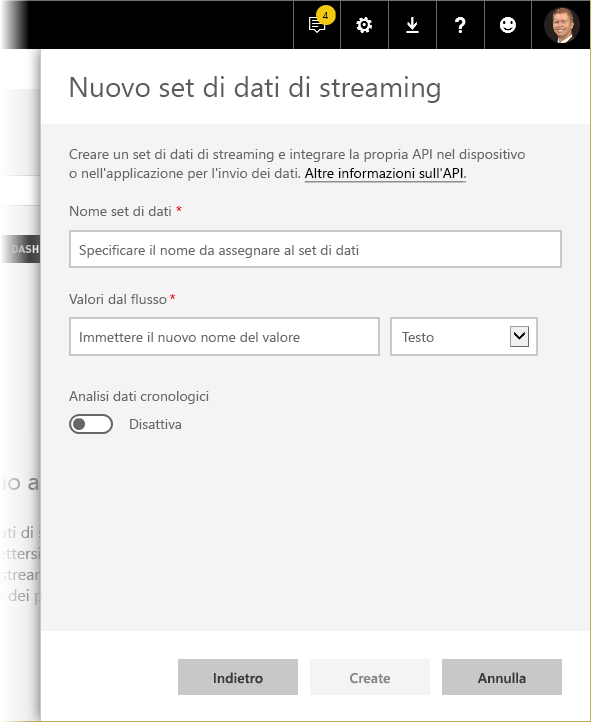

Per archiviare i dati inviati con questo flusso dei dati in Power BI, abilitare *Analisi dati cronologici* per eseguire report e analisi sul flusso di dati raccolti. È anche possibile ottenere [altre informazioni sull'API](https://msdn.microsoft.com/library/dn877544.aspx).

Dopo aver creato il flusso dei dati, viene fornito un endpoint dell'URL dell'API REST che l'applicazione può chiamare usando le richieste *POST* per eseguire il push dei dati nel set di dati con i **dati in streaming** di Power BI creato.

Quando si eseguono richieste *POST*, è importante assicurarsi che il corpo della richiesta corrisponda al formato JSON di esempio fornito dall'interfaccia utente di Power BI. Ad esempio, eseguire il wrapping degli oggetti JSON in una matrice.

### Utilizzo di PubNub
L'integrazione dello streaming **PubNub** con Power BI consente di usare flussi dei dati **PubNub** a bassa latenza, o crearne di nuovi, da usare in Power BI. Quando si seleziona **PubNub**, **Avanti**, viene visualizzata la finestra seguente:

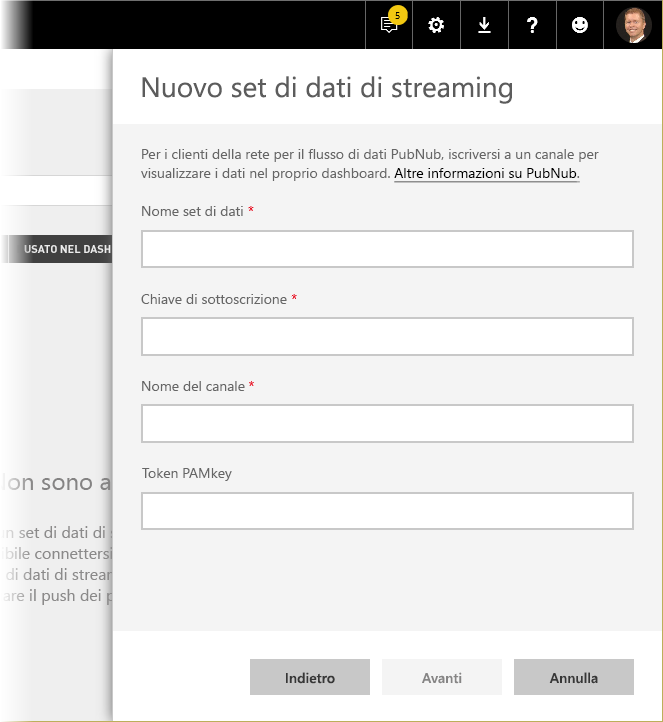

> [!WARNING]
> I canali di PubNub possono essere protetti usando una chiave di autenticazione PubNub Access Manager (PAM). Questa chiave verrà condivisa con tutti gli utenti che hanno accesso al dashboard. Sono disponibili [altre informazioni sul controllo di accesso PubNub](https://www.pubnub.com/docs/web-javascript/pam-security).
> 
> 

I flussi dei dati **PubNub** sono spesso di grandi dimensioni e non sono sempre adatti all'archiviazione e all'analisi cronologica nella loro forma originale. Per usare Power BI per l'analisi cronologica dei dati PubNub, è necessario aggregare il flusso PubNub non elaborato e inviarlo a Power BI. A tale scopo, si può usare [Analisi di flusso di Azure](https://azure.microsoft.com/services/stream-analytics/).

## Esempio dell'utilizzo dello streaming in tempo reale in Power BI
Di seguito è riportato un esempio di come funziona lo streaming in tempo reale in Power BI. È possibile usare questo esempio per comprendere il valore dello streaming in tempo reale.

In questo esempio verrà usato un flusso disponibile pubblicamente di **PubNub**. Ecco i passaggi necessari:

1. Nel **servizio Power BI** selezionare un dashboard o crearne uno nuovo, quindi selezionare **Aggiungi riquadro** > **Dati in streaming personalizzati** e fare clic sul pulsante **Avanti**.
   
   
2. Se non sono ancora disponibili origini dati in streaming, selezionare il collegamento **gestire i dati**, subito sopra il pulsante **Avanti**, quindi scegliere **+ Aggiungi set di dati di streaming** dal collegamento nell'angolo superiore destro della finestra. Selezionare **PubNub**, quindi scegliere **Avanti**.
3. Creare un nome per il set di dati, incollare i valori seguenti nella finestra visualizzata, quindi selezionare **Avanti**:
   
   *Chiave di sottoscrizione:*
   
       sub-c-5f1b7c8e-fbee-11e3-aa40-02ee2ddab7fe
   *Canale:*
   
       pubnub-sensor-network
   
   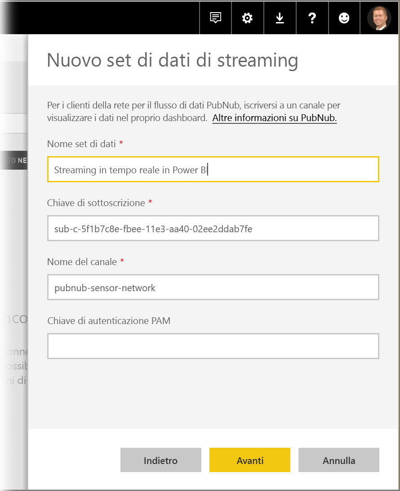
4. Nella finestra seguente è sufficiente selezionare le impostazioni predefinite, popolate automaticamente, quindi scegliere **Crea**.
   
   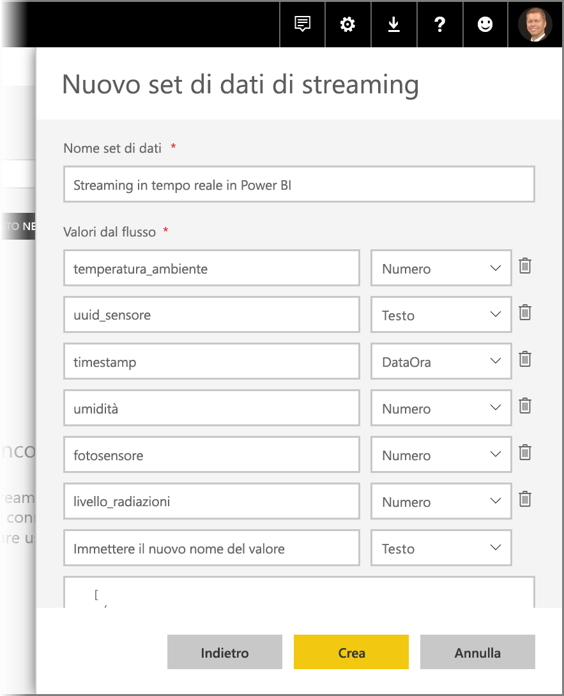
5. Tornare all'area di lavoro di Power BI, creare un nuovo dashboard, quindi aggiungere un riquadro. Se necessario, vedere i passaggi descritti in precedenza. Questa volta, quando si crea un riquadro e si seleziona **Dati in streaming personalizzati**, verrà visualizzato un set di dati in streaming su cui lavorare. Proseguire ed esplorare le funzionalità. Se si aggiunge il campo *numero* ai grafici a linee e si aggiungono altri riquadri, è possibile ottenere un dashboard in tempo reale simile al seguente:
   
   

Provare a eseguire qualche attività con il set di dati di esempio. Passare quindi alla creazione dei set di dati e alla trasmissione di dati in tempo reale in Power BI.

## Domande e risposte
Ecco alcune domande comuni e le relative risposte sullo streaming in tempo reale in Power BI.

#### È possibile usare i filtri nel set di dati di push? E nel set di dati di streaming?
Purtroppo, i set di dati di streaming non supportano i filtri. Per i set di dati di push è possibile creare un report, filtrarlo e quindi aggiungere gli oggetti visivi filtrati a un dashboard. Tuttavia, non è possibile modificare il filtro sull'oggetto visivo una volta nel dashboard.

Separatamente, è possibile aggiungere il riquadro del report dinamico al dashboard, nel qual caso è possibile modificare i filtri. Tuttavia, i riquadri del report dinamici non verranno aggiornati in tempo reale durante il push dei dati: è necessario aggiornare manualmente l'oggetto visivo usando l'opzione *Aggiornare riquadri del dashboard* nel menu **Altro**.

Quando si applicano filtri per eseguire il push dei set di dati con i campi *DateTime* con una precisione nell'ordine dei millisecondi, gli operatori di *equivalenza*  non sono supportati. Gli operatori come maggiore di (>) o minore di (<) funzionano invece normalmente.

#### Come è possibile visualizzare il valore più recente in un set di dati di push? E nel set di dati di streaming?
I set di dati di streaming sono progettati per la visualizzazione dei dati più recenti. È possibile usare l'oggetto visivo di streaming **Scheda** per visualizzare facilmente i valori numerici più recenti. Purtroppo, la scheda non supporta i dati di tipo *DateTime* o *Text*.
Per i set di dati di push, presumendo che sia presente un timestamp nello schema, è possibile provare a creare un oggetto visivo del report con l'ultimo filtro N.

#### È possibile connettersi ai set di dati di push o streaming in Power BI Desktop?
Purtroppo questa funzionalità non è al momento disponibile.

#### Data la domanda precedente, come è possibile eseguire qualsiasi modellazione nei set di dati in tempo reale?
La modellazione non è possibile in un set di dati di streaming, perché i dati non vengono archiviati in modo permanente. Per un set di dati di push, è possibile usare le API REST del set di dati/della tabella di aggiornamento per aggiungere misure e relazioni. È possibile ottenere altre informazioni dall'[articolo Aggiorna Schema tabella](https://msdn.microsoft.com/library/mt203560.aspx) e dall'[articolo Proprietà del set di dati](https://msdn.microsoft.com/library/mt742155.aspx).

#### Come è possibile cancellare tutti i valori in un set di dati di push? E nel set di dati di streaming?
In un set di dati di push, è possibile usare la chiamata all'API REST Elimina righe. Separatamente, è anche possibile usare questo pratico strumento, cioè un wrapper per le API REST. Non è attualmente possibile cancellare i dati da un set di dati di streaming, anche se i dati verranno cancellati automaticamente dopo un'ora.

#### Ho configurato un output di Analisi di flusso di Azure in Power BI, ma non viene visualizzato in Power BI. Qual è il problema?
Di seguito è riportato un elenco di controllo che è possibile usare per risolvere il problema:

1. Riavviare il processo di Analisi di flusso di Azure (processi creati prima che rilascio di disponibilità generale di streaming richieda il riavvio)
2. Provare ad autorizzare nuovamente la connessione di Power BI nell'Analisi di flusso di Azure
3. Quale area di lavoro è stata specificata nell'output dell'Analisi di flusso di Azure? Nel servizio Power BI, l'estrazione avviene nella stessa area di lavoro?
4. La query di Analisi di flusso di Azure invia esplicitamente l'output a Power BI? (usando la parola chiave INTO)
5. Esiste un flusso di dati all'interno del processo di Analisi di flusso di Azure? Il set di dati verrà creato solo quando vengono trasmessi dei dati.
6. È possibile analizzare i log di Analisi di flusso di Azure per verificare se esistono eventuali avvisi o errori?

## Passaggi successivi
Ecco alcuni collegamenti che possono risultare utili quando si lavora con lo streaming in tempo reale in Power BI:

* [Panoramica dell'API REST di Power BI con dati in tempo reale](https://msdn.microsoft.com/library/dn877544.aspx)
* [Limitazioni dell'API REST di Power BI](https://msdn.microsoft.com/library/dn950053.aspx)
* [Articolo sull'API REST per **Create dataset**](https://msdn.microsoft.com/library/mt203562.aspx)
* [API REST di Power BI **Aggiungi righe**](https://msdn.microsoft.com/library/mt203561.aspx)
* [Analisi di flusso di Azure](https://azure.microsoft.com/services/stream-analytics/)

