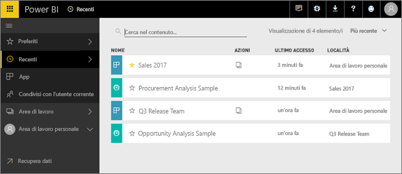
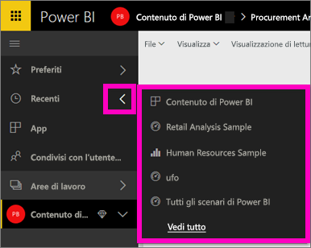
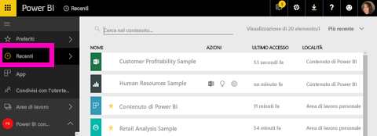

# Contenuto **recente** nel servizio Power BI

## Che cos'è il contenuto recente
Il contenuto recente è costituito dagli ultimi elementi visitati, per un massimo di 20 elementi.  Sono inclusi dashboard, report, app e cartelle di lavoro in tutte le aree di lavoro.

Il video seguente illustra come vengono popolati gli elenchi di contenuti **Recenti**. Seguire quindi tutte le istruzioni riportate sotto il video per provare a farlo da soli.

<iframe width="560" height="315" src="https://www.youtube.com/embed/G26dr2PsEpk" frameborder="0" allowfullscreen></iframe>

## Visualizzare il contenuto recente
Per visualizzare gli ultimi elementi visitati di recente, dal riquadro di spostamento a sinistra selezionare la freccia a destra di **Recenti**.  Da qui è possibile selezionare il contenuto recente per aprirlo. Sono elencati solo i cinque elementi più recenti.

Se sono presenti più di cinque elementi visitati di recente, selezionare **Visualizza tutto** per aprire la schermata Recenti (vedere di seguito). È anche possibile selezionare **Recenti** o l'icona Recenti  dal riquadro di spostamento a sinistra.

Da qui è possibile interagire con il contenuto come si farebbe con le singole schede [**Dashboard**](service-dashboards.md), [**Report**](service-reports.md) e **Cartelle di lavoro** e la schermata [**App**](service-install-use-apps.md).

## Passaggi successivi
[App del servizio Power BI](service-install-use-apps.md)

Altre domande? [Provare la community di Power BI](http://community.powerbi.com/)

