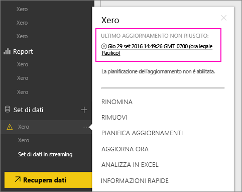
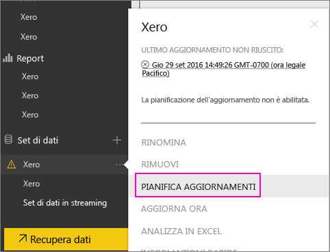
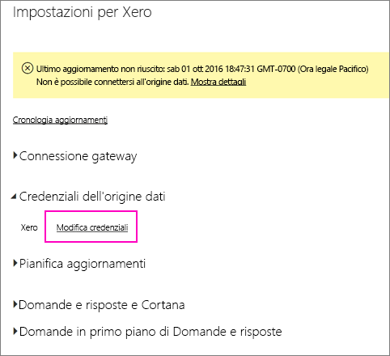
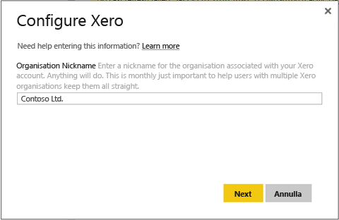
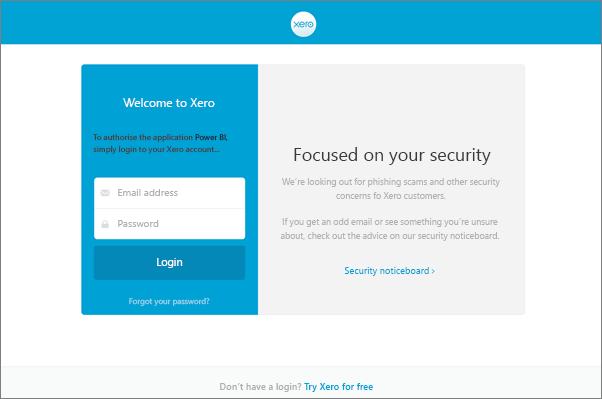
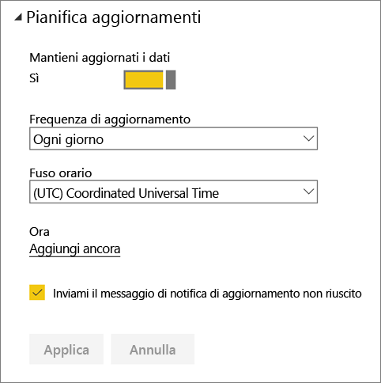
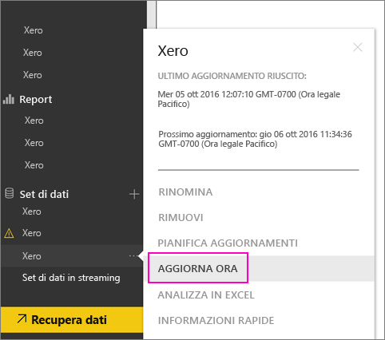

# Come aggiornare le credenziali del pacchetto di contenuto Xero se l'aggiornamento non è riuscito
Se si usa il pacchetto di contenuto Xero di Power BI, potrebbero essersi verificati alcuni problemi con l'aggiornamento giornaliero del pacchetto di contenuto a causa di un recente evento imprevisto del servizio Power BI.

Per verificare che il pacchetto di contenuto sia stato aggiornato correttamente, controllare lo stato dell'ultimo aggiornamento del set di dati Xero, come illustrato nella schermata seguente.

Se indica che tale aggiornamento non è riuscito, come illustrato sopra, seguire questa procedura per rinnovare le credenziali per il pacchetto di contenuto.

1. Fare clic sui puntini di sospensione (...) accanto al set di dati Xero, quindi fare clic su **Pianifica aggiornamento**. Verrà visualizzata la pagina delle impostazioni per il pacchetto di contenuto Xero.
   
    
2. Nella pagina **Impostazioni per Xero** selezionare **Credenziali origine dati** > **Modifica credenziali**.
   
    
3. Immettere il nome dell'organizzazione > **Avanti**.
   
    
4. Accedere con l'account Xero.
   
    
5. Dopo aver aggiornato le credenziali, assicurarsi di aver pianificato l'esecuzione giornaliera dell'aggiornamento. Per verificarlo, fare clic sui puntini di sospensione (...) accanto al set di dati Xero, quindi fare di nuovo clic su **Pianifica aggiornamento**.
   
    
6. È anche possibile scegliere di aggiornare immediatamente il set di dati. Fare clic sui puntini di sospensione (...) accanto al set di dati Xero, quindi fare clic su **Aggiorna adesso**.
   
    

Se si verificano ancora problemi di aggiornamento, non esitare a contattare Microsoft all'indirizzo [http://support.powerbi.com](http://support.powerbi.com) 

Per altre informazioni sul pacchetto di contenuto Xero per Power BI, visitare la [pagina della Guida del pacchetto di contenuto Xero](service-connect-to-xero.md).

### Passaggi successivi
* Altre domande? [Provare la community di Power BI](http://community.powerbi.com/)

