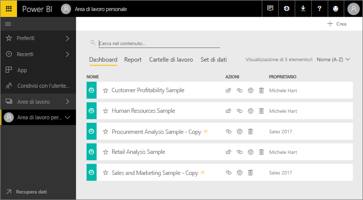
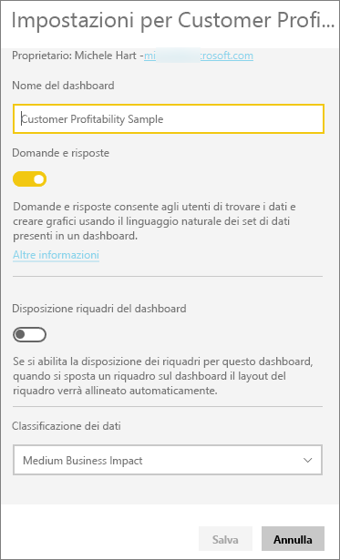
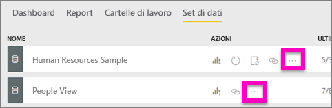
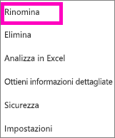
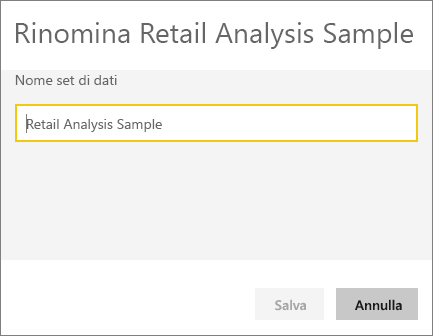
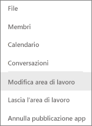
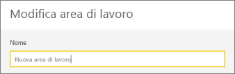
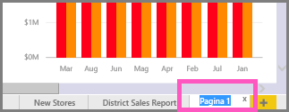
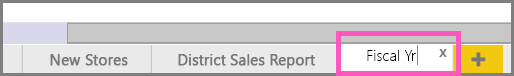

# Rinominare qualsiasi elemento nel servizio Power BI
Questo articolo illustra come rinominare un dashboard, un report, una pagina del report, una cartella di lavoro, un set di dati, un'app e un'area di lavoro nel servizio Power BI.

**È possibile modificare il nome?**

| Tipo contenuto | Sono l'autore | Condivisi con l'utente corrente |
| --- | --- | --- |
| Dashboard in un'area di lavoro |Sì |No |
| Report in un'area di lavoro |Sì |No |
| Cartella di lavoro in un'area di lavoro |Sì |No |
| Set di dati in un'area di lavoro |Sì |No |
| Area di lavoro per le app |Sì, se si è il proprietario o si hanno autorizzazioni di amministratore |No |
| App pubblicate |Non dalla schermata App, ma il nome dell'app può essere modificato nell'area di lavoro per le app e ripubblicato con un nuovo nome se si hanno le autorizzazioni di amministratore |No |
| Contenuto dell'app (dashboard, report, cartella di lavoro, set di dati) |Non dalla schermata App, ma il contenuto dell'app può essere rinominato nell'area di lavoro per le app e ripubblicato con un nuovo nome se si hanno le autorizzazioni di amministratore |No |
| Contenuto in **Condivisi con l'utente corrente** |No |No |

## Rinominare un dashboard, un report o una cartella di lavoro
1. Iniziare in un'area di lavoro e selezionare la scheda **Dashboard**, **Report** o **Cartelle di lavoro**. Passare il puntatore sull'elemento da rinominare e selezionare l'icona dell'ingranaggio . Se non è presente alcuna icona a forma di ingranaggio, non si hanno le autorizzazioni per la ridenominazione.
   
   
2. Nella pagina Impostazioni, digitare il nuovo nome e selezionare **Salva**.
   
   

## Rinominare un set di dati
1. Iniziare in un'area di lavoro e selezionare la scheda **Set di dati**.
   
   
2. Passare il puntatore sull'elemento da rinominare, selezionare i puntini di sospensione (...) e scegliere **Rinomina**.  
   
      
   
   > [!NOTE]
   > Le opzioni nel menu a discesa variano.
   > 
   > 
3. Nella pagina Impostazioni, digitare un nuovo nome e selezionare **Salva**.
   
     

## Rinominare un'area di lavoro per le app
Chiunque abbia le autorizzazioni di amministratore può rinominare un'area di lavoro per le app.

1. Iniziare nell'area di lavoro che si vuole rinominare.
2. Nell'angolo in alto a destra selezionare i puntini di sospensione (...) e scegliere **Modifica area di lavoro**. Se questa opzione non è visualizzata, non si hanno le autorizzazioni per rinominare questa area di lavoro. 
   
    
3. Digitare un nuovo nome per l'area di lavoro e selezionare **Salva**.
   
   

## Rinominare una pagina in un report
Modificare il nome di una pagina in un report di Power BI  è estremamente semplice. È possibile rinominare le pagine nella [Visualizzazione di modifica del report](service-interact-with-a-report-in-editing-view.md).

1. Aprire il report in [Visualizzazione di modifica](consumer/end-user-reading-view.md).
2. Individuare le linguette delle pagine di report nella parte inferiore della finestra di Power BI.
   
    
3. Selezionare la linguetta della pagina di report che si vuole rinominare.
4. Fare doppio clic sul nome sulla linguetta per evidenziarlo.  
   
    
5. Digitare il nuovo nome da assegnare alla pagina del report e premere INVIO.
   
    

## Considerazioni e risoluzione dei problemi
* Se l'elemento da rinominare è stato condiviso con l'utente o fa parte di un pacchetto di contenuto, non verrà visualizzata l'icona dell'ingranaggio e non si avrà accesso a Impostazioni.
* Nella scheda **Set di dati**, se non vengono visualizzati i puntini di sospensione (...), espandere la finestra del browser.

Altre domande? [Provare la community di Power BI](http://community.powerbi.com/)

