# Creare un nuovo report del servizio Power BI importando un set di dati
Dopo aver letto [Report in Power BI](consumer/end-user-reports.md) si supponga di voler creare un report personalizzato. È possibile creare un report in molti modi, ma in questo articolo verrà spiegato come crearne uno molto semplice da un set di dati di Excel tramite il servizio Power BI. Una volta apprese le nozioni di base relative alla creazione di un report, è possibile consultare gli argomenti più avanzati elencati nella sezione **Passaggi successivi** alla fine di questo articolo.  

## Prerequisiti
> - Servizio Power BI (per la creazione di report con Power BI Desktop, vedere [Visualizzazione Report in Power BI Desktop](desktop-report-view.md))  
> - Set di dati dell'esempio di analisi delle vendite al dettaglio

## Importare il set di dati
In questo metodo di creazione del report si inizia con un set di dati e un'area di disegno report vuota. Per seguire la procedura, [scaricare il set di dati di Excel dell'esempio di analisi delle vendite al dettaglio](http://go.microsoft.com/fwlink/?LinkId=529778) e salvarlo in OneDrive for Business (scelta consigliata) o in locale.

1. Dal momento che il report verrà creato in un'area di lavoro del servizio Power BI, selezionare un'area di lavoro esistente o crearne una nuova.
   
   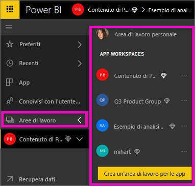
2. Nella parte inferiore del riquadro di spostamento sinistro selezionare **Recupera dati**.
   
   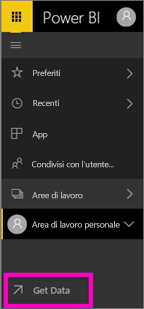
3. Selezionare **File** e passare al percorso in cui è stato salvato l'esempio di analisi delle vendite al dettaglio.
   
    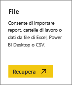
4. Per questo esercizio, selezionare **Importa**.
   
   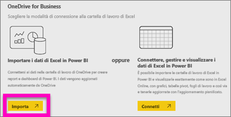
5. Dopo l'importazione del set di dati, selezionare **Visualizza set di dati**.
   
   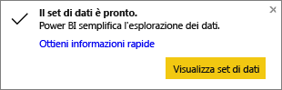
6. Quando si visualizza un set di dati, verrà aperto l'editor di report.  Verranno visualizzati un'area di disegno vuota e gli strumenti di modifica del report.
   
   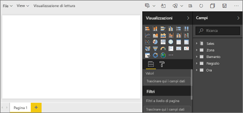

> **SUGGERIMENTO**: se non si ha familiarità con l'area di disegno per la modifica dei report o non se ne ricorda l'uso, prima di continuare è possibile eseguire la [presentazione dell'editor di report](service-the-report-editor-take-a-tour.md).
> 
> 

## Aggiungere un misuratore radiale al report
Dopo aver importato il set di dati, è possibile iniziare a rispondere ad alcune domande.  Il responsabile marketing vuole sapere se gli obiettivi di vendita annuali verranno soddisfatti. Un misuratore costituisce una [valida opzione di visualizzazione](visuals/power-bi-report-visualizations.md) per visualizzare questo tipo di informazioni.

1. Nel riquadro Campi selezionare **Sales** > **This Year Sales** > **Value**.
   
    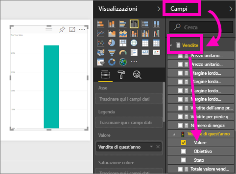
2. Convertire l'oggetto visivo in un misuratore selezionando il modello Misuratore  nel riquadro **Visualizzazioni**.
   
    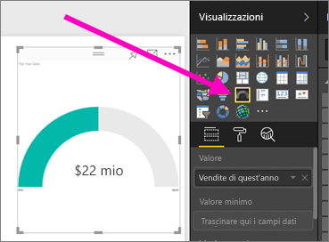
3. Trascinare anche **Sales** > **This Year Sales** > **Obiettivo** in **Valore di destinazione**. La procedura è quasi finita.
   
    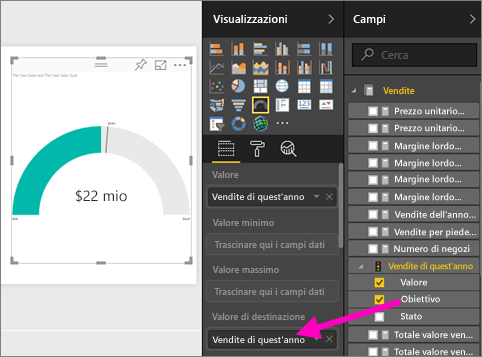
4. A questo punto è opportuno [salvare il report](service-report-save.md).
   
   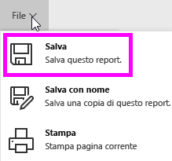

## Aggiungere un grafico ad area e un filtro dei dati al report
Il responsabile marketing ha altre domande a cui è necessario dare una risposta. Vuole conoscere l'andamento delle vendite di quest'anno rispetto all'anno precedente e vuole che i risultati siano visualizzati in base alla zona.

1. È innanzitutto necessario fare spazio nell'area di disegno. Selezionare il misuratore e spostarlo nell'angolo in alto a destra. A questo punto trascinarne e rilasciarne uno degli angoli per ridurlo.
2. Deselezionare il misuratore. Nel riquadro Campi selezionare **Sales** > **This Year Sales** > **Value** e quindi selezionare **Sales** > **Last Year Sales**.
   
    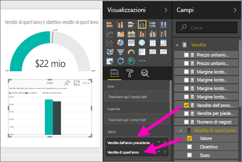
3. Convertire l'oggetto visivo in un grafico ad aree selezionando il modello Grafico ad aree  nel riquadro **Visualizzazioni**.
4. Selezionare **Tempo** > **Periodo** per aggiungerlo all'area **Asse**.
   
    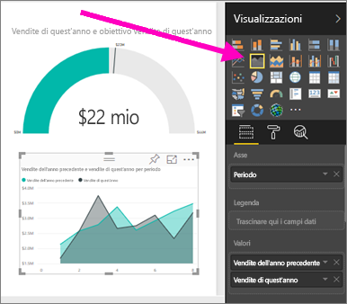
5. Per ordinare la visualizzazione in base a un periodo di tempo, selezionare i puntini di sospensione e scegliere **Ordina per periodo**.
6. A questo punto verrà aggiunto il filtro dei dati. Selezionare un'area vuota nell'area di disegno e scegliere il modello Filtro dei dati     . All'area di disegno verrà aggiunto un filtro dei dati vuoto.
   
        
7. Selezionare **District** > **District** nel riquadro Campi. Spostare e ridimensionare il filtro dei dati.
   
    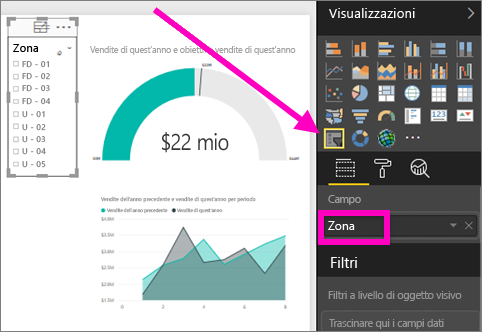  
8. Usare il filtro dei dati per individuare modelli e informazioni dettagliate per zona.
   
     

Continuare con l'esplorazione dei dati e con l'aggiunta di visualizzazioni. Quando si trovano informazioni approfondite particolarmente interessanti, [aggiungerle a un dashboard](service-dashboard-pin-tile-from-report.md).

## Passaggi successivi

* Informazioni su come [aggiungere visualizzazioni a un dashboard](service-dashboard-pin-tile-from-report.md)   
* Altre domande? [Provare la community di Power BI](http://community.powerbi.com/)

