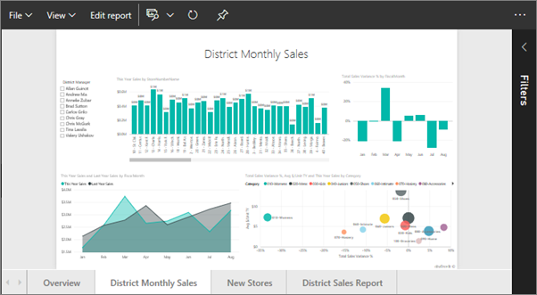

# Aprire un report di Power BI nella Visualizzazione di lettura
## Visualizzazione di lettura
La Visualizzazione di lettura è un ottimo modo per esplorare i dati in un report di Power BI, senza timore di causare danni.  È possibile esplorare il report, interagire con le visualizzazioni e aggiungere qualsiasi visualizzazione al dashboard. 

> [!NOTE]
> Per modificare il report e salvare le modifiche, [aprirlo in Visualizzazione di modifica](service-reading-view-and-editing-view.md).
> 
> 

1. Iniziare in un'area di lavoro e selezionare la scheda **Report** per visualizzare tutti i report presenti in tale area di lavoro.  
   
   
2. Selezionare il nome del report per aprirlo nella Visualizzazione di lettura.  È possibile aprire un report in molti altri modi. È ad esempio possibile iniziare in un dashboard e selezionare un riquadro creato da un report.  Quando si seleziona il riquadro, il report viene aperto nella Visualizzazione di lettura.
   
    
3. Nella [Visualizzazione di lettura](service-interact-with-a-report-in-reading-view.md) è possibile eseguire moltissime operazioni.  Questo report di esempio include più pagine, quindi iniziare a esplorarlo selezionando ogni scheda nella parte inferiore dell'area di disegno report. 

## Passaggi successivi
[Interagire con un report nella Visualizzazione di lettura](service-interact-with-a-report-in-reading-view.md)

Altre informazioni sui [report in Power BI](service-reports.md)

Altre domande? [Provare la community di Power BI](http://community.powerbi.com/)  

