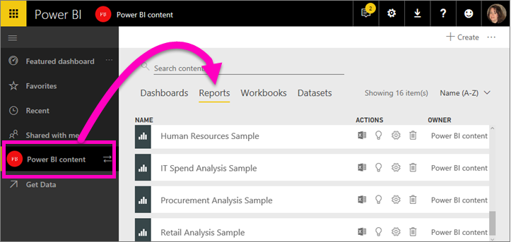

# Aprire un report nel servizio Power BI (app.powerbi.com)
I report sono disponibili nel servizio Power BI, Power BI Desktop, Power BI per dispositivi mobili e anche in Power BI Embedded. Questo articolo è applicabile all'apertura di report nel ***servizio Power BI***.

Nel servizio Power BI sono disponibili due modalità per visualizzare e interagire con i report: [visualizzazione di lettura e visualizzazione di modifica](service-reading-view-and-editing-view.md). La visualizzazione di lettura è disponibile per tutti gli utenti ed è stata progettata in modo specifico per i *consumer* di report, mentre la visualizzazione di modifica è disponibile solo per gli *autori* e i proprietari dei report. 

## Aprire un report da un'area di lavoro tramite l'elenco di visualizzazioni di contenuto **Report**

1. Iniziare in un'area di lavoro e selezionare la scheda **Report** per visualizzare tutti i report presenti in tale area di lavoro.  
   
   
2. Selezionare il nome del report per aprirlo nella visualizzazione di lettura.  
   
    
3. Nella [Visualizzazione di lettura](service-reading-view-and-editing-view.md) è possibile eseguire moltissime operazioni.  Questo report di esempio include più pagine, quindi iniziare a esplorarlo selezionando ogni scheda nella parte inferiore dell'area di disegno report. 

## Aprire un report da un dashboard
È possibile aprire un report in molti altri modi. È ad esempio possibile iniziare in un dashboard e selezionare un riquadro creato da un report.  Quando si seleziona il riquadro, il report viene aperto nella Visualizzazione di lettura. Per seguire la procedura, [aprire il dashboard dell'Esempio di analisi di vendite e marketing](sample-datasets.md).

1. Aprire un dashboard e selezionare un riquadro.

   Se si seleziona un riquadro [creato con Domande e risposte](service-dashboard-pin-tile-from-q-and-a.md), verrà visualizzata la schermata Domande e risposte. Se si seleziona un riquadro [creato tramite il widget **Aggiungi riquadro** del dashboard](service-dashboard-add-widget.md), verrà aperta la procedura guidata per la modifica del widget.  

2.  In questo esempio è stato selezionato il riquadro dell'istogramma "Total Units YTD".

    

3.  Il report associato viene aperto in Visualizzazione di lettura. Si noti che viene ora visualizzata la pagina "YTD Category". Si tratta della pagina del report che contiene l'istogramma selezionato dal dashboard.

    

4. Rimanere nella visualizzazione di lettura o selezionare **Modifica report** per aprire il report in Visualizzazione di modifica. Occorre ricordare che solo gli utenti con autorizzazioni di modifica per tale report possono aprirlo in visualizzazione di modifica.

    

## Creare un report completamente nuovo da un set di dati
È possibile aprire un report anche da un set di dati. Quando si apre un report da un set di dati, l'area di disegno report sarà vuota, quindi questo metodo è consigliato per gli *autori* di report che sono interessati alla creazione di un nuovo report in base a un set di dati di cui sono proprietari. Analogamente all'esempio precedente, scaricare l'[app dell'Esempio di analisi di vendite e marketing](sample-datasets.md).

1. Iniziare nell'area di lavoro che contiene il set di dati da usare come base per un report.

   

2. Selezionare la scheda **Set di dati** per visualizzare l'elenco di tutti i set di dati in tale area di lavoro. Si tratta dell'elenco di visualizzazioni di contenuto **Set di dati**.
   
   

1. Individuare il set di dati e selezionare l'icona **Crea report** per aprire il set di dati in visualizzazione di modifica. Se non si hanno le autorizzazioni di modifica per un set di dati, non sarà possibile aprirlo. 
   
    

3. Il set di dati viene aperto nell'editor di report. I campi dati verranno visualizzati a destra, in attesa dell'inizio dell'esplorazione e della creazione di visualizzazioni da parte dell'utente. 

   

##  Altri modi per aprire un report
Quando si acquisisce maggiore esperienza nello spostamento in un servizio Power BI, sarà possibile individuare i flussi di lavoro ottimali per le proprie esigenze. Altri modi per accedere ai report:
- Dal riquadro di spostamento a sinistra tramite **Preferiti**, **Recenti**, **App* e **Condivisi con l'utente corrente**. 
- Tramite [Visualizza elementi correlati](service-related-content.md).
- In un messaggio di posta elettronica in caso di [condivisione con l'utente](service-share-reports.md) o quando si [configura un avviso](service-set-data-alerts.md).    
- Dal [centro notifiche](service-notification-center.md).    
- E altro ancora.

## Passaggi successivi
Altre informazioni sui [report in Power BI](service-reports.md)

Altre domande? [Provare la community di Power BI](http://community.powerbi.com/)  

